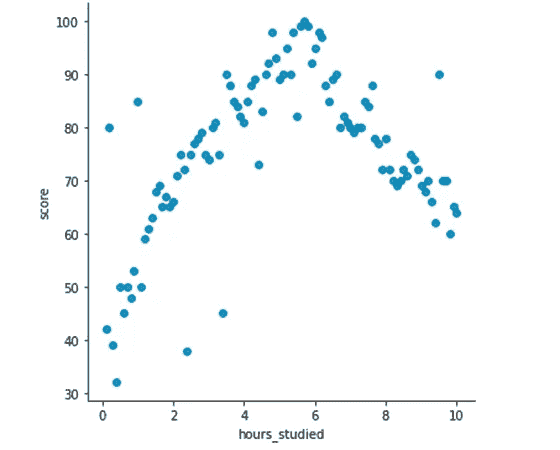
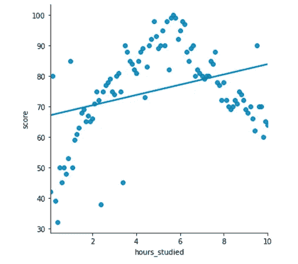
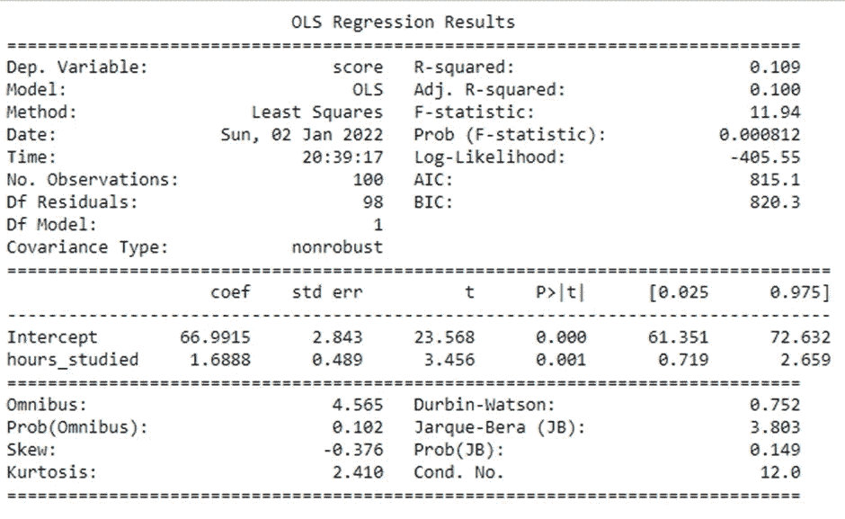
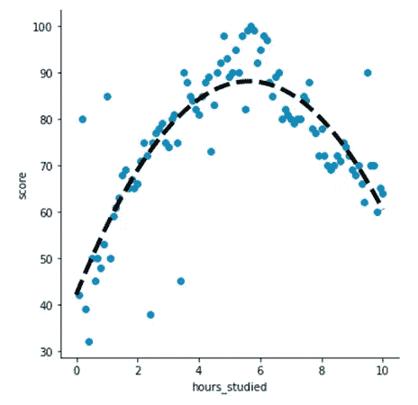
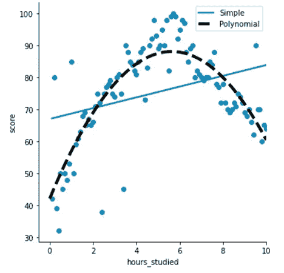

# 回归模型中的多项式项

> 原文：<https://medium.com/analytics-vidhya/polynomial-terms-in-a-regression-model-25321018cdae?source=collection_archive---------2----------------------->

照片由[凯尔·弗里茨](https://unsplash.com/@kylefritz_?utm_source=unsplash&utm_medium=referral&utm_content=creditCopyText)在 [Unsplash](https://unsplash.com/collections/10774435/linear-%2F-non-linear?utm_source=unsplash&utm_medium=referral&utm_content=creditCopyText) 拍摄

假设您有一个数据集，其中包含学生的考试成绩以及他们在考试前一天学习的小时数。

这是它们之间的关系。

学习时间和相应的分数

考试分数会一直提高到一定的小时数，之后更多的小时会对学生在考试中的表现产生不利影响。

如果您使用线性回归算法对这种关系进行建模，它通常会是这样的。

线性回归—分数和学习时间

这是模型总结。

或者，**得分= 66.9915+1.6888 *小时 _ 已学**

该模型的调整后 R 平方为 **0.1** ，这意味着该模型很难捕捉到这种关系。鉴于这种关系的非线性性质，这并不奇怪。

这是否意味着您不能在线性回归算法的轮廓内改进这个模型？不完全是。

您可以创造性地使用您的功能，转换它们并将其添加到您的模型中。这里，因为我们知道这种关系是非线性的，分数在超过一定小时数后开始下降，所以我们尝试在模型中添加一个平方项(即学习时间的平方)。

模型摘要如下所示。

或者，**得分= 42.0983+16.3319 *学时 _ 已学—1.4498 *学时 _ 已学**

这个模型现在有两个特点-

1.  原始形式的学习时数
2.  学习时间的平方

请注意调整后的 R 平方从 **0.1** 到 **0.635 的显著改善。**

从系数中可以直观地看出，分数随着最初学习时间的增加而增加，因为学习时间的系数**为正**。然而，在**时，由于平方项的**负系数**开始拉低总得分，所以学习时间的**值更高。

这个模型比以前的模型更准确地描述了这种关系。

从视觉上看，这就是现在的情况。

带多项式项的新模型

注意:我们没有使用新的算法来拟合这个模型，它仍然是基于普通最小二乘法的**线性回归模型** **。我们所做的只是添加了一个变换的特征(一个平方项)并符合模型。**

这是两种型号的对比。

你更喜欢哪一个来预测考试成绩？我很确定是后者。

学分:代码学院