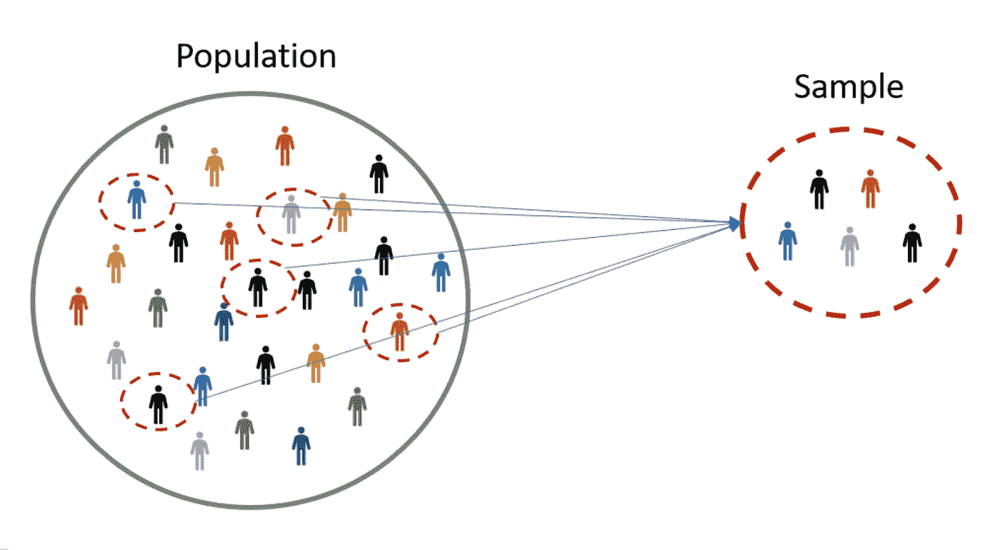
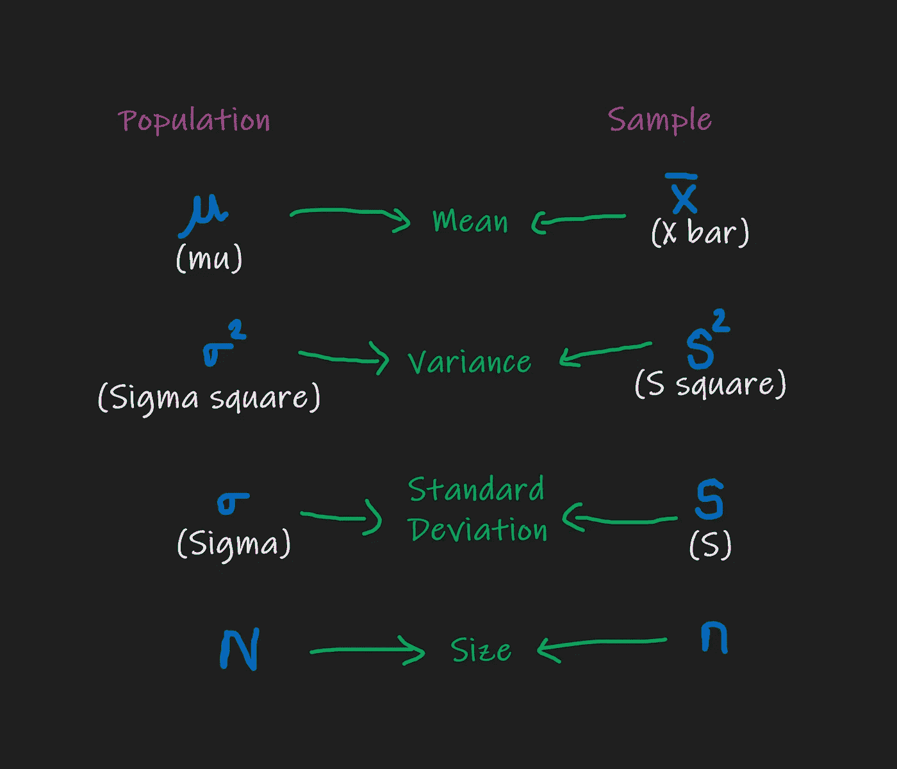
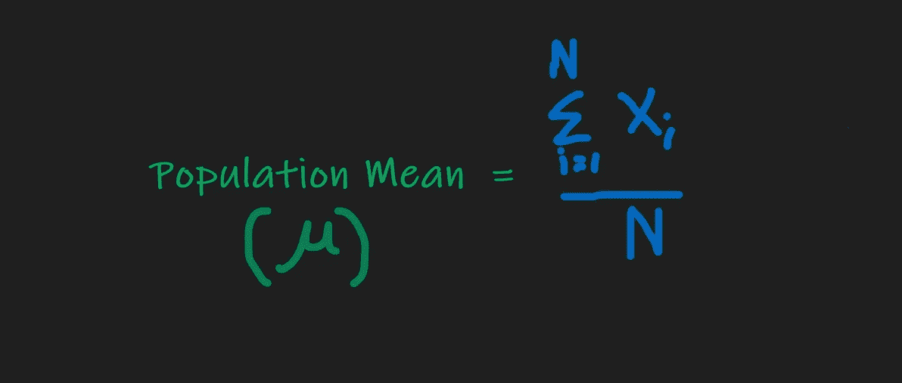
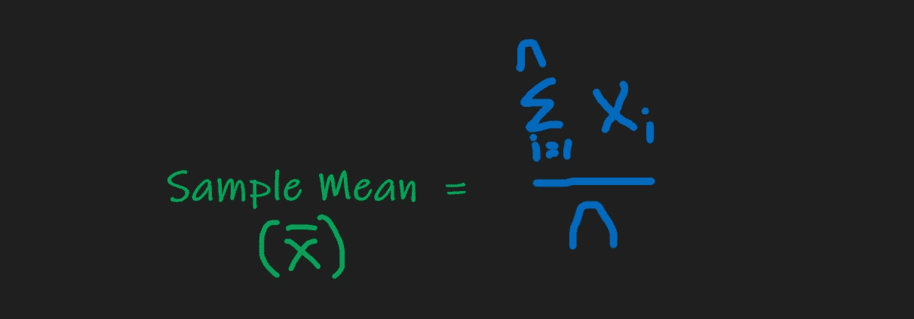
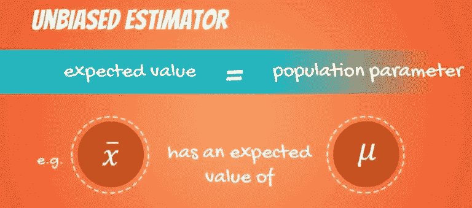

# 总体与样本&参数与统计&统计中有偏与无偏

> 原文：<https://medium.com/analytics-vidhya/population-sample-parameter-statistic-biased-unbiased-ead2021d93d7?source=collection_archive---------13----------------------->

## 我们将涵盖总体和样本、参数和统计、总体均值和样本均值、有偏和无偏

# 介绍

在这个博客中，你会看到统计学中的这些话题

*   ***人口&样本***
*   ***参数&统计***
*   ***总体均值&样本均值***
*   ***有偏&无偏估计量***

想了解**集中趋势的测量**和**可变性的测量**。这是给你的博客。。。

 [## 统计学:平均值、中位数和众数

### 集中趋势的测量—统计学中的均值、中值和众数—使用样本数据和应用的公式和用例…

medium.com](/analytics-vidhya/statistics-mean-median-and-mode-16a90c75cbb)  [## 统计:范围、方差和标准差

### 可变性/分散性的测量:范围、方差和标准偏差，为什么分子是平方的。。。

medium.com](/analytics-vidhya/statistics-range-variance-and-standard-deviation-f26bbfa0bbaa) 

> 让我们开始行动吧。。。。。。。。

# 人口和样本

[https://www.omniconvert.com/what-is/sample-size/](https://www.omniconvert.com/what-is/sample-size/)

***总体*** :总体是您正在进行分析或预测的整个群体。

***样本*** :样本是总体的子集(即从总体中随机抽取样本)。样本的大小总是小于总体的总大小。

让我们用一个场景来描述人口和样本，以便更加清晰。

> 你正在做一个投票预测来分析/预测哪个政党将获得多数选票并赢得选举。

所以，你的下一步是从投票给哪个政党的人那里收集数据。让我们考虑一下印度，那里有超过 13 亿人口，你不可能得到他们投票的所有人的意见。

由于资源、时间和可及性的限制，从人群中计算数据几乎是不可能的，因此使用样本。作为类比，您可以将您的样本想象成一个水族馆，将您的人口想象成海洋。你的样本是你试图理解的浩瀚海洋的一小部分。

回到场景，你**随机**选择一些人并听取他们的意见，然后你将进行分析/预测。

***注*** *:你要随机取民众意见。因为，如果你从一个邦/地区为全体印度人的投票收集信息，你的预测/分析就会出错，因为数据会得到***的偏颇。我们将在下面的*部分看到“偏差&无偏”*

*从总体中抽取样本时，有不同的类型。。。*

****有替换和无替换的抽样:*** *我们先来举个例子，你有一个篮子，里面有 5 个红球和 4 个蓝球。在第一个事件中，你抽取 3 个红球和 2 个蓝球的样本，并计算它们的概率。**

*   **如果将 3 个红色球和 2 个蓝色球的样品放回篮子中，称为* ***带替换的采样。****
*   **如果你没有把样本放回篮子并计算下一个事件的概率，这被称为* ***无替换抽样。****

# *参数和统计*

## *因素*

*对已知为**总体参数**的**总体数据**计算**均值**、**方差**和**标准差**。总体均值和总体标准差分别用希腊字母和σ表示。参数是总体的特征。*

## *统计的*

*对已知为**样本统计量**的**样本数据**计算 **Mean(x̅】、**方差**和**标准差**。一个统计量是一个样本的特征。***

*如果有人要求计算统计平均值，你就得计算 **x̅、s2 ( S 平方)和 S.***

**

*人口和样本的符号—作者创建的图像*

# *总体均值和样本均值*

## *总平均*

*平均值给出数据的平均值。如果你计算出人口数据的平均值就称为**人口平均值。**人口平均数是固定的。。。没有变化。*

**

*作者创建的图像*

## *采样平均*

*使用样本数据计算平均值称为**样本平均值。**样本均值随着数据量/样本量的增加而变化。。。*

**

*作者创建的图像*

# *有偏和无偏估计量*

## *有偏见的*

*如果你的总体参数和样本统计量**不等于**，那就叫有偏。通常偏向数据的一边而不是随机的。*

## *公正的*

*如果总体参数和样本统计量相等，则称之为无偏的*

**

# *结论*

*我希望这篇文章能帮助你了解总体、样本、参数和统计、总体均值、样本均值、有偏和无偏估计量。*

*比如。。如果你喜欢的话。。。*

**

*谢谢你，*

***巴拉穆鲁甘 N G***

* [## 数据科学家| LinkedIn

### 查看 Bala Murugan N G 在全球最大的职业社区 LinkedIn 上的个人资料。Bala Murugan 列出了 1 项工作…

www.linkedin.com](https://www.linkedin.com/in/ngbala6/)  [## ngbala6 -概述

### 机器学习工程师

github.com](https://github.com/ngbala6)*