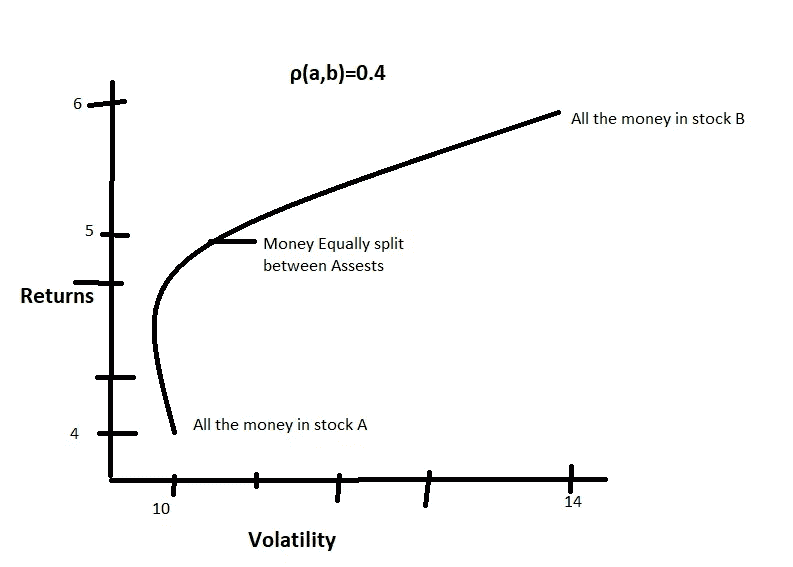
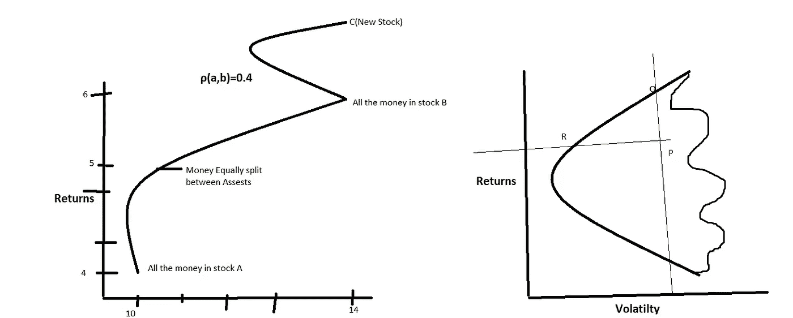
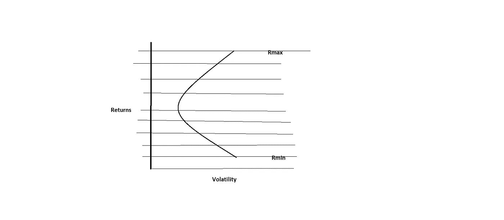

# 使用有效前沿优化的投资组合构建

> 原文：<https://medium.com/analytics-vidhya/portfolio-construction-using-efficient-frontier-optimization-b00f294e6c81?source=collection_archive---------11----------------------->

不是博客只是给自己的笔记:)

让我们以风险回报空间中的两项资产为例，该空间也称为均值-方差框架，其中 X 轴上是方差或标准差(风险),而 Y 轴上是该资产的回报

```
We Got 2 Assests A and B
A has a std deviation of 10%(Volatility) and return 4%
B has 14% volatility, and a 6% returnLet's combine A and B to Build our portfolio and calculate our risk and return?Let's Split the money equally in the both the asset
So our return of our portfolio will be the weighted average of A and B which will be 2% + 3% = 5%But the Volatility doesn't get calcuted in such a way Because it depends on the correlation between A and B.So our Return will be r(wa,wb) = ra*wa + rb*wb
while our Volatility can be expressed in variance which is 
σ²(wa,wb) = σ²a*w²a + σ²b*w²b + 2wa*wb*σa*σb*ρ(a,b)From the above equation we can deduce that As long as the two weights are non-zero and the correlation between the two assets are less than 1, the volatility of the portfolio will always be less than the weighted average volatilities of the two assets.
```



A 和 B 之间的相关性是 0.4

如果我们看这条曲线，我们在曲线的左端得到的是由 A 中的 100%组成的投资组合，在曲线的右端得到的是由 b 中的 100%组成的投资组合。

此外，你可以在我们借助多样化得到的图表中看到一个鼻子，简单地说，我们可以将两种资产以一定的比例混合，最终得到一个波动性比其中任何一种都低的投资组合。

> 如果你把两种不相关的资产放在一起，你可以构建一个波动性较低的投资组合。

```
Lets introduce One more Asset C  which completely changes the picture so it's expanded our region into our risk-return Space and gave us an entire region of portfolios
```



添加新股票 C

通过增加一项额外的资产，我们有一个完整的投资组合区域可供选择，但目标仍然是一样的，即利用资产 A、B 和 C 获得最有效的投资组合

边缘的投资组合代表了你在预期收益或预期波动性方面的最佳表现，而你永远不会从均值/方差空间的内部区域进行选择

我们关心的投资组合，是那些位于边缘的，位于边界的，这个空间就是我们所说的边缘，(最左边的曲线是我们所说的有效边界。)

## OBJ:我们必须找出有效边界通过的均值-方差(收益率-波动率)空间中的点。

我们将使用一个优化器来找到我们空间中的那个点

所以我们的回报将表示为

RP =σwiRi

虽然波动性可以表示为

σp =σσwi wj cov(i，j)其中协方差 cov(I，j) = σa*σb*ρ(a，b)

> 矩阵符号

Rp =资产回报的 w^T R(矩阵符号，其中 w =(k×1)矩阵，r 是(k×1)矩阵)

σp = wtσw

cov(i，j)矩阵是 k×k 个元素的对称方阵

因此，首先选择两个回报率最高和最低的投资组合，因为我们知道这两个点的投资组合位于有效边界上，通过它我们能够确定我们空间中的两个点 Rmin 和 Rmax



我们从 R min 开始，然后向上到 R max，我们要做的是，把最小收益和最大收益之间的空间分割成一个网格。然后，在网格上的每一点，我们要做的是运行优化器，尝试找到一组权重，让您的投资组合在该回报水平下的波动性最小化。

所以最小化σp = 1/2 wtσw

因此，我们的二次优化器的目标是最小化波动性/方差，并限制回报必须在某一水平，我们将在回报值的网格上反复运行，以便我们可以沿着曲线绘制每个点。

其他约束通常是，您希望所有权重都大于零。换句话说，不做空

通常你想要的最后一个约束是所有的权重加起来都是 1

我们可以用 Python 写这个: