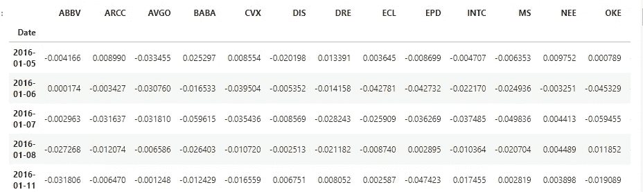
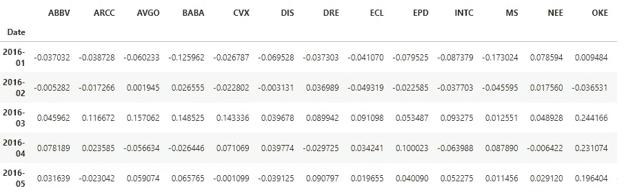
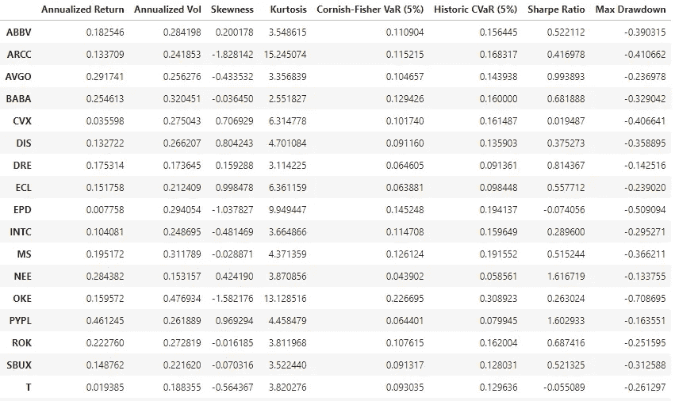
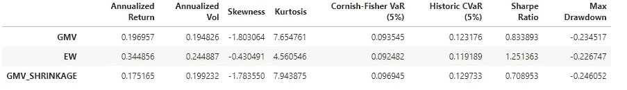
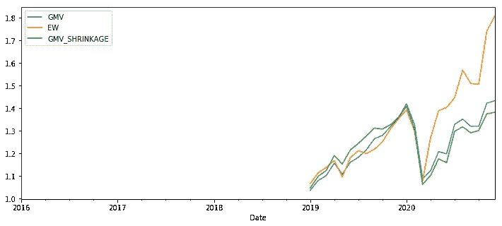
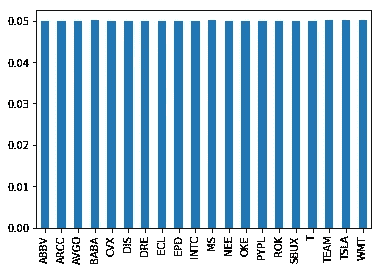
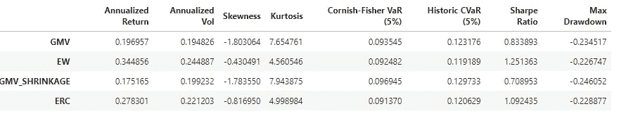
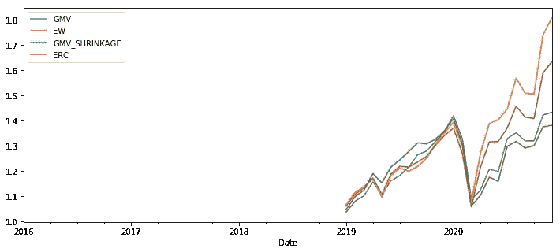
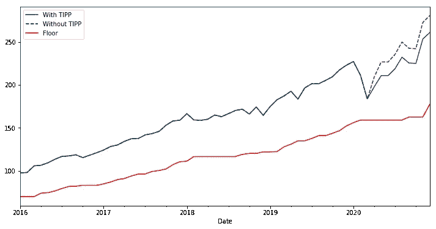
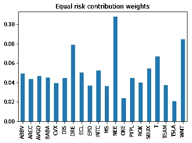

# Python 中的投资组合优化

> 原文：<https://medium.com/analytics-vidhya/portfolio-optimization-in-python-5eaac129c98d?source=collection_archive---------6----------------------->

图片来源:[点击这里](https://content.fortune.com/wp-content/uploads/2019/10/GettyImages-1158402857.jpg?resize=750,500)

投资者更喜欢投资不同的股票，而不是单一的股票。这跟谚语“不要把所有的鸡蛋放在一个篮子里”是一致的。开发投资组合的主要目的是减少非系统风险。非系统风险是特定公司或行业特有的。也称为“非系统风险”、“T2”特定风险、“分散风险”或“剩余风险”，在投资组合的背景下，非系统风险可以通过[分散化](https://www.investopedia.com/terms/d/diversification.asp)来降低。研究证明，投资一个结构良好的投资组合有助于降低投资者的非系统风险。这篇文章试图从美国经济所有部门中随机选择的公司构建一个多元化的投资组合。

**目标**

寻找风险贡献相等的投资组合权重。

实施时间不变的投资组合策略，以防止下跌。

用于该分析的数据是使用 *yfinance* 包从纽约证券交易所下载的。从 2016 年到 2020 年，不同经济领域的 20 家公司的每日调整收盘价被下载。为了有助于分析，我使用了 **edhec 风险工具包**模块，其中包含投资组合构建和优化所需的功能。

## 导入相关的包和模块

## 每日回报

我们的第一步是计算每家公司的日收益。回报是资产价格的变化，在这个例子中是股票。 *pct_change* 函数将帮助我们做到这一点。下表显示了公司每日收益的前五行。

## 将每日回报转换为每月回报

为了能够处理数据，我决定使用 *edhec 风险工具包模块*中的 *cum* 函数将日收益转换为月收益。下面的代码显示了用于将每日回报转换为每月回报的函数以及每月回报的前五行。

每日回报

## 相关统计摘要

下表显示了与投资组合中每只股票的回报率和波动性相关的所有相关统计数据。这将有助于我们了解每家公司过去的表现及其相关的风险度量。

## 全球最小方差(GMV)投资组合

由于我们对投资组合优化感兴趣，我将进一步使用协方差矩阵的稳健估计量来构建 GMV 投资组合。这将有助于为所有公司的波动性提供合理的估计。回报很难估计。构建 GMV 投资组合的原因是，这种类型的投资组合不需要估计预期收益，而且这是在有效边界上可以找到的唯一风险最小的投资组合。我们将构建一个 GMV 投资组合，并对其进行回溯测试，看看它的表现如何。下表显示了回溯测试的相关统计数据，以及比较不同类型投资组合的图表。

从上面的图表中我们可以看出，等权重投资组合的表现优于 GMV 投资组合。等权重不是首选，因为资本分配不是基于投资组合中每个组成部分的风险程度。因为高风险的股票应该分配较少的资本，而低风险的股票应该分配较高的资本。这就是为什么风险平价投资组合是本文的首选。

## 风险平价投资组合

这些投资组合中的每一个组成部分都有相同的风险贡献。这些投资组合有时更受青睐，因为权重是根据每项资产对投资组合风险的贡献来分配的，而不是仅仅根据回报来分配权重。因此，我们将继续构建一个风险贡献相等的投资组合，并对其进行回溯测试，看看它的表现如何。

等风险投资组合

上图显示了风险是如何在各公司间平均分配的。

## 实施时间不变的投资组合策略

这种策略有助于确保我们的投资组合免受极端市场条件的影响，如经济衰退和其他金融危机。这种策略包括引入一种无风险资产，并在风险资产和无风险资产之间动态分配资本。此外，还设置了一个我们不想跨越的楼层，在这种情况下，我们使用 80%。此外，乘数 M 的设定取决于市场的波动性。该乘数表示分配给风险资产的资本量，因此该参数不是一个常数值。实施这种策略的一个好处是，当你的投资组合价值改变时，底价是动态的，底价的价值也随之改变。下图显示了 TIPP 战略的实施情况。

小费策略

在回答这个问题时，我应该分配多少资金来实现风险相等的投资组合，可以在下面的柱状图中看到。

**限制**

在选择这些公司之前，没有进行深入的分析。

无法衡量我们的投资组合多元化程度。

用于分析的 jupyter 笔记本以及数据可在此处找到[。](https://github.com/yineme/portfolio-optimzation)

*请注意:本分析仅用于教育目的，作者不对你的任何投资决策负责。*

来源

 [## 如果你不能战胜市场，至少你可以用 Python 来保护自己

### 由于交易成本较低，CPPI 和 TIPP 策略是实施下跌保护最简单的策略之一…

medium.com](/swlh/protect-your-portfolio-using-cppi-strategy-in-python-c3184c2b6767)  [## 2021 年最值得购买的 21 只股票

### 正如 2020 年的任何投资者都会证明的那样，股市总会有一些惊喜。但是总的来说…

www.kiplinger.com](https://www.kiplinger.com/investing/stocks/601879/21-best-stocks-to-buy-for-2021)