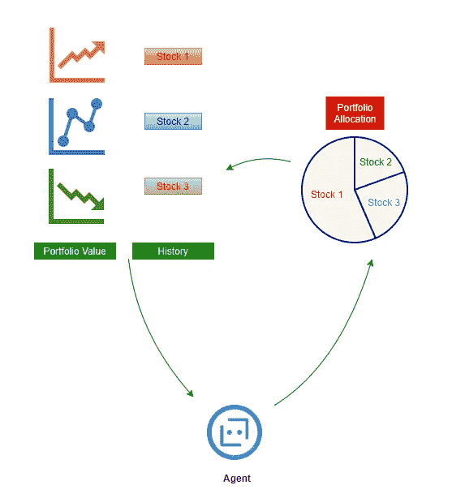
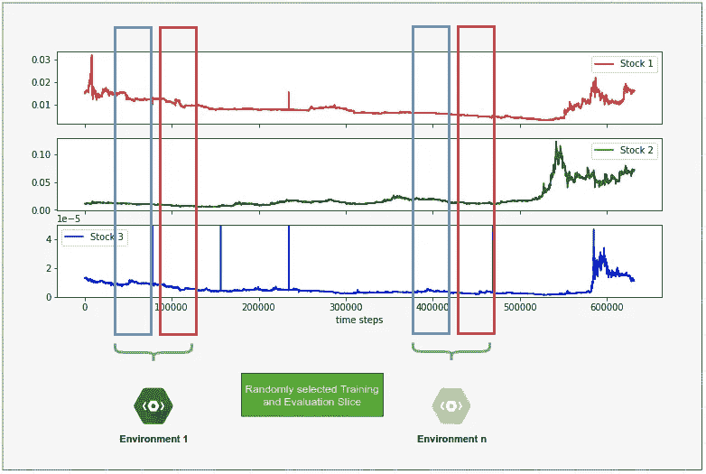
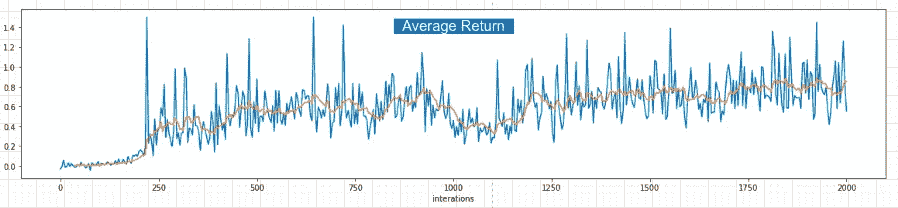
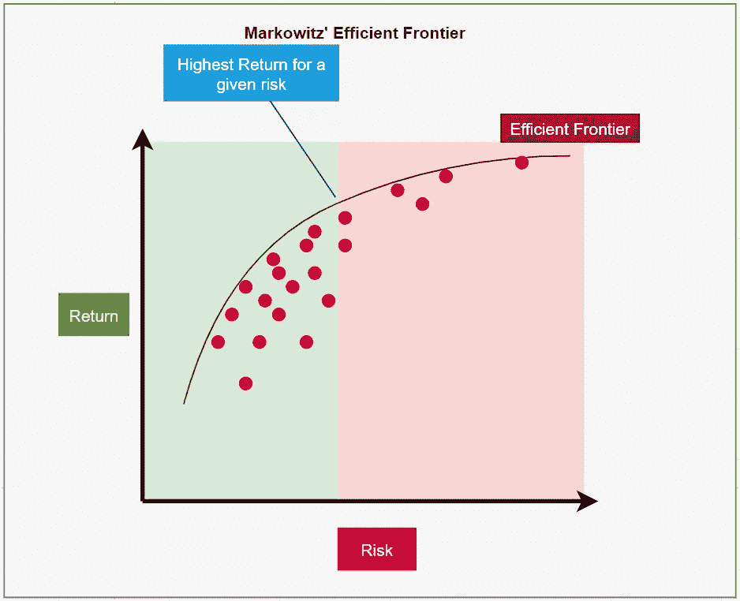
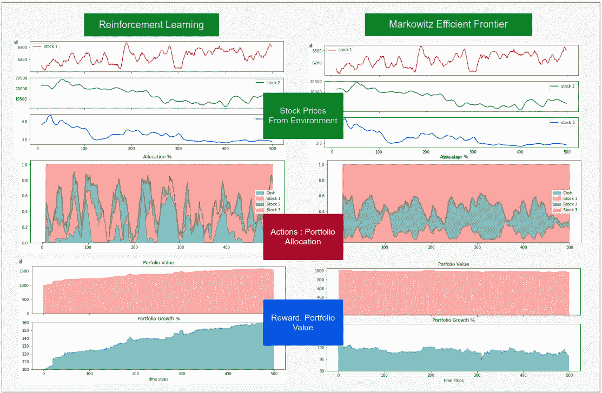

# 使用强化学习的投资组合优化

> 原文：<https://medium.com/analytics-vidhya/portfolio-optimization-using-reinforcement-learning-1b5eba5db072?source=collection_archive---------2----------------------->

用 RL 建立 3 只股票的最优投资组合，并与基于投资组合理论的方法进行比较

强化学习可以说是人工智能中最酷的分支。它已经证明了自己的实力:震惊世界，击败了国际象棋、围棋甚至 DotA 2 的世界冠军。

使用 RL 进行股票交易一直是数据科学家的圣杯。股票交易吸引了我们的想象力，因为它容易获得，并且错误地引用卡迪 B 的话，我们喜欢钻石，我们喜欢美元😛。

使用机器学习进行股票交易有几种方式。一种方法是使用预测技术来预测股票的走势，并构建一些基于启发式的机器人，使用预测来做出决策。另一种方法是构建一个机器人，它可以观察股票走势，并直接建议采取行动——买入/卖出/持有。这是强化学习的完美用例，因为我们通常只有在交易结束时才知道我们行动的累积结果。

## 问题陈述

我将把它表述为一个投资组合优化问题:

> 给定 3 只不同股票的历史记录，我们如何每天在这些股票之间分配固定金额的资金，以使回报的可能性最大化。

目标是为建立投资组合制定政策(战略)。投资组合本质上是在各种股票之间分配可用资源。然后，随着时间的推移，随着新信息的出现，策略需要重组投资组合。

在这里，政策应该能够选择最优的投资组合(分配)。

我们的解决方案是开发一个强化学习模型——一个通过观察每只股票的指标在每个时间步分配股票的代理。然后，我们将这种 RL 策略与 Markowitz 的有效边界方法进行比较——这种方法与“直觉”一起可能是大多数资产经理采用的方法。

***强化学习快速笔记:***

强化学习处理设计与*“环境”*交互的*“代理”*，并通过系统的试错法自学如何*“解决”*环境。一个环境可以是一个游戏，比如国际象棋或赛车，或者甚至可以是一个任务，比如解决一个迷宫或实现一个目标。代理是执行活动的机器人。

代理人通过与环境互动获得“回报”。代理人学习执行所需的“行动”,以最大化它从环境中获得的回报。如果代理累积了某个预定义的奖励阈值，则认为环境已解决。这种书呆子式的谈话是我们如何教机器人玩超人象棋或双足机器人走路的。

我们将设计一个代理，使用某种策略与交易环境互动，以最大化投资组合的价值。在这里，行动将是代理决定维持什么投资组合(例如，30%股票 A，30%股票 B，30%股票 C，10%现金分割)。然后，代理人会收到该行为的正或负奖励(投资组合分配)。代理反复修改它的策略，直到它为给定的环境状态找出最佳的行动。

## **实验设置:**

我设计了一个自定义环境来模拟实际的交易过程。代理可以通过以下方式与环境交互:

1.  环境提供了对其当前状态的观察结果——3 个种群的指标
2.  代理将动作传递给环境。行动是建议的投资组合分配，例如，总价值的 10%为现金，30%为股票 1，30%为股票 2，30%为股票 3
3.  环境以一个时间步长改变状态，并返回新的状态，以及与先前投资组合相关联的回报(值的改变)

重复步骤 1 到 3，直到剧集完成。每一步结束时获得的奖励之和就是总奖励。目标是在一集结束时最大化总奖励。

一集的大小设置为 500 个时间步长。这是从 650，000+时间步长的数据集中随机切片的。每次初始化环境时，都会选择整个数据集的不同部分。这将防止代理记住环境。环境的每次运行都会有所不同。此外，代理的培训和评估是在不同的环境下进行的。所以代理从一部分数据中学习一个策略。然后在数据集的不同部分评估策略。

环境的每次初始化都会选取数据集的不同随机切片

我们现在使用该设置评估 RL 算法和 Markowitz 模型。

## 结果:

## 强化学习

在这里，我们将使用现成的 Actor Critic 模型的未调优的懒惰实现。为此，我们将使用 tensorflow 发布的 tf-agents 框架。请检查[我的 github](https://github.com/kvsnoufal/portfolio-optimization) 的完整代码和培训细节。

训练演员-评论家模型超过 2000 次迭代

**车型评价:**

评估超过 100 次的环境运行，

平均回报率:+20%

## 马科维茨的有效边界

这种方法提出了一个评估投资组合风险和回报的框架。

投资组合的回报是我们可以从该投资组合中预期的每个时间步的平均回报。

风险是每日回报的标准差。这给出了股票波动性的一个度量。

通过绘制每个投资组合的风险和回报，资产经理可以做出明智的投资决策。

有效边界线显示了给定风险组合的最高回报。

对于我们的评估，我们设计了一个代理人，从基于前 30 个时间步的表现在每个时间步计算的有效边界图中选择一个中等风险高回报的投资组合。

平均回报率:-1%

我们在这里可以看到，有效边界似乎对我们挑选的股票无效。大概是因为我们挑的股票波动性大。

**比较**

下面是同一环境中两种策略的对比:

1.  RL 的投资组合增长到 160%，Markowitz 的收缩到 96%
2.  我们看到两种算法都在股票 3 上分配了大量资金，这是因为股票 3 的价值非常低且稳定。因此，价值的小幅增长可以带来巨大的回报(%)，而不会带来波动风险。
3.  我们看到，在波动性增加或所有股票都在下跌时，RL 决定通过出售股票和增加手头的现金来对冲损失——当我们没有启用卖空选项时，这是非常明智的策略。
4.  总的来说，RL 策略似乎是识别价格的小幅飙升，并立即利用这一点。

在我们的实验中，我们看到 RL 始终优于 Markowitz 的方法。

> 不用说，这些结果被认为是轶事。这些实验是在不切实际的假设下进行的，并且是在一个精心挑选的小样本空间中进行的——这并不完全接近真实世界的交易。我们忽略了几个因素，比如交易中的时滞、交易成本、卖空、对冲损失等等。

[**Github 回购**](https://github.com/kvsnoufal/):[https://github.com/kvsnoufal/portfolio-optimization](https://github.com/kvsnoufal/portfolio-optimization)

**巨人的肩膀**

1.  [https://www . science direct . com/science/article/pii/s 0957417420302803](https://www.sciencedirect.com/science/article/pii/S0957417420302803)
2.  [https://arxiv.org/abs/1706.10059](https://arxiv.org/abs/1706.10059)
3.  [https://en.wikipedia.org/wiki/Modern_portfolio_theory](https://en.wikipedia.org/wiki/Modern_portfolio_theory)
4.  https://www.youtube.com/watch?v=1jQPP3RfwMI&ab _ channel = JeffHeaton
5.  [https://www.tensorflow.org/agents/overview](https://www.tensorflow.org/agents/overview)
6.  [https://github . com/jeffheaton/t81 _ 558 _ deep _ learning/blob/master/t81 _ 558 _ class _ 12 _ 05 _ apply _ rl . ipynb](https://github.com/jeffheaton/t81_558_deep_learning/blob/master/t81_558_class_12_05_apply_rl.ipynb)
7.  阿米尔-寻求指导和建议

*免责声明:我不是投资顾问。这不被认为是购买或出售股票、债券或进行任何其他证券交易的财务建议。在做出任何和所有投资决定之前，进行自己的尽职调查，或咨询有执照的财务顾问或经纪人。*

> ***关于作者***
> 
> *我在阿联酋迪拜控股公司工作，是一名数据科学家。你可以在 kvsnoufal@gmail.com 联系我或者在 https://www.linkedin.com/in/kvsnoufal/联系我*