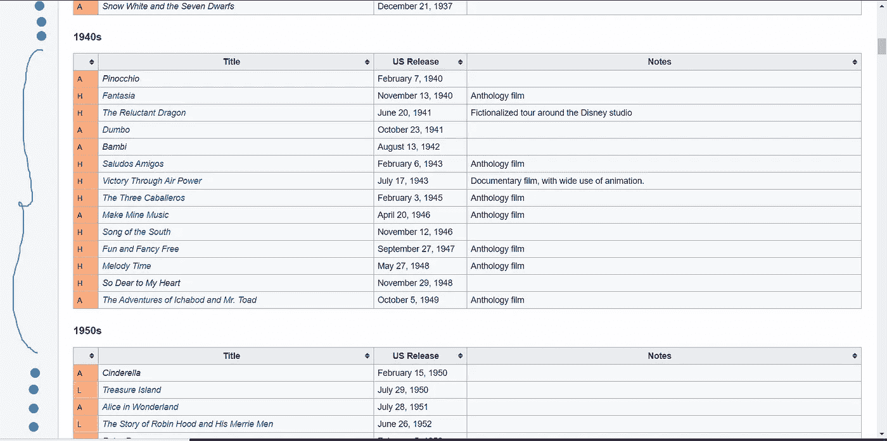
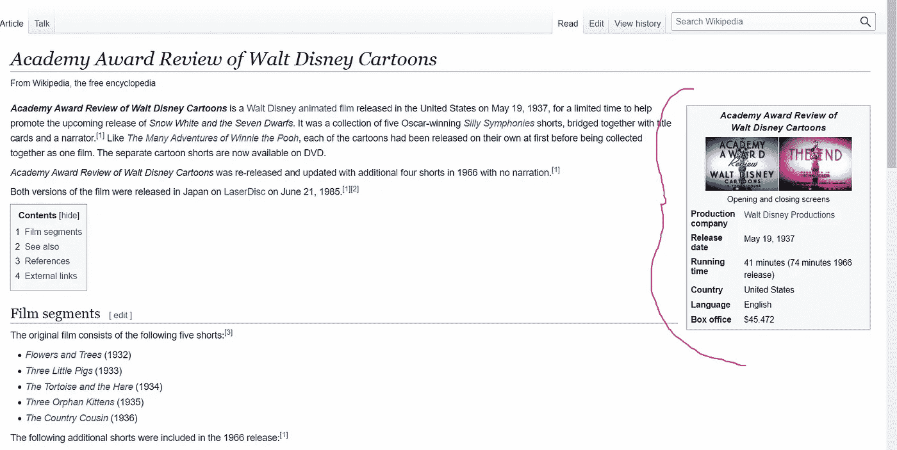
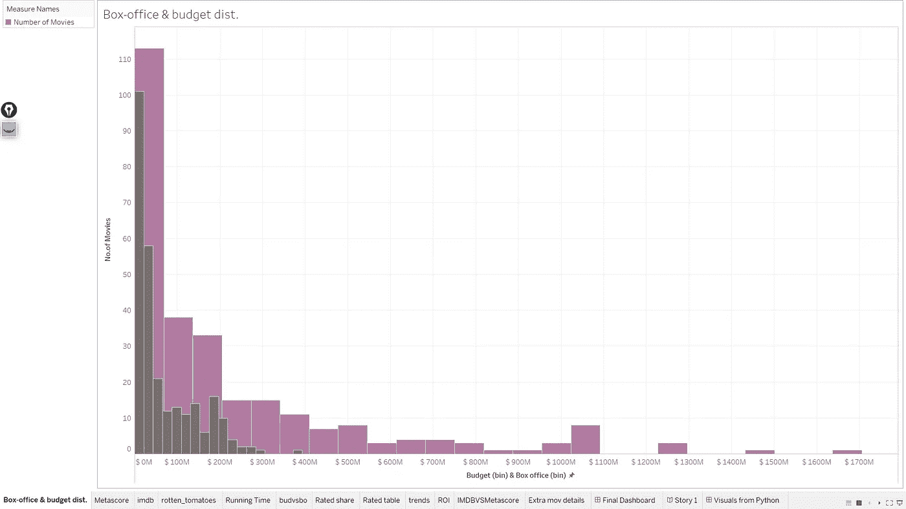
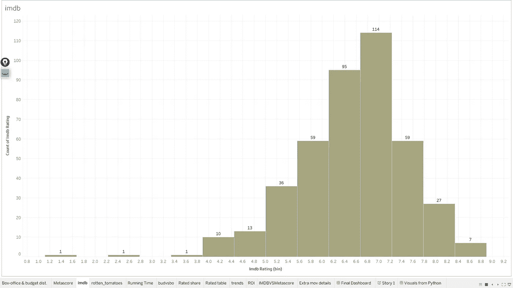
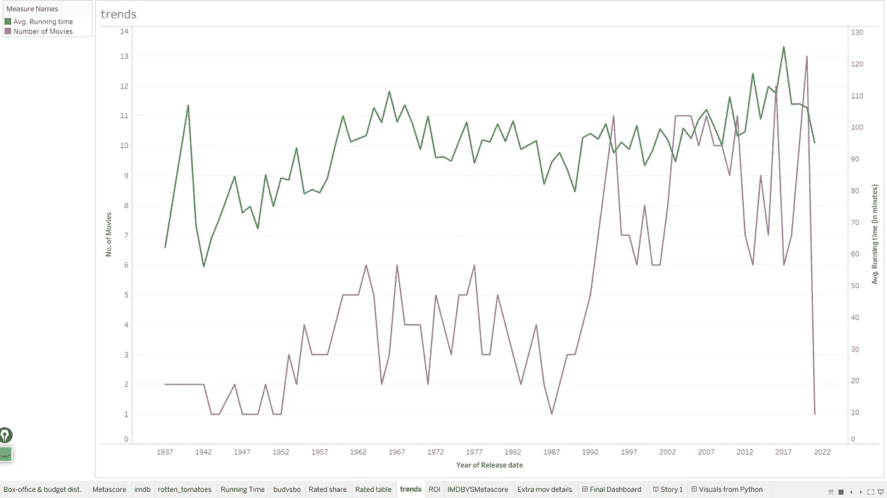
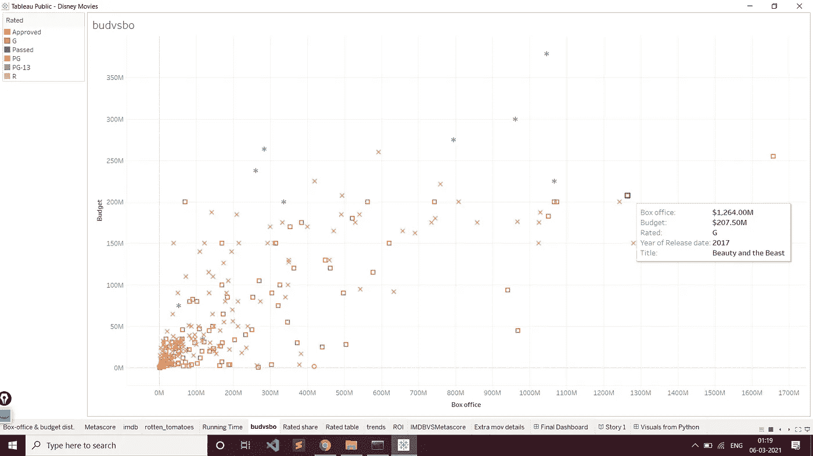
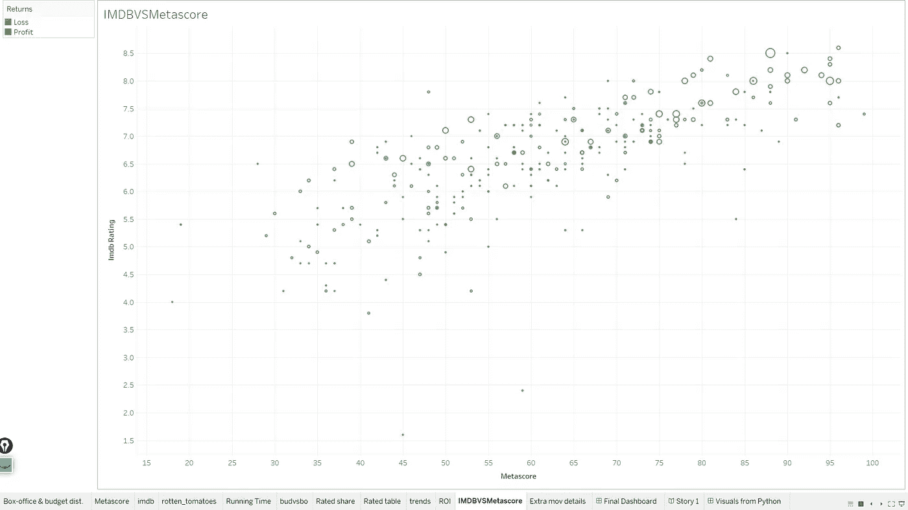
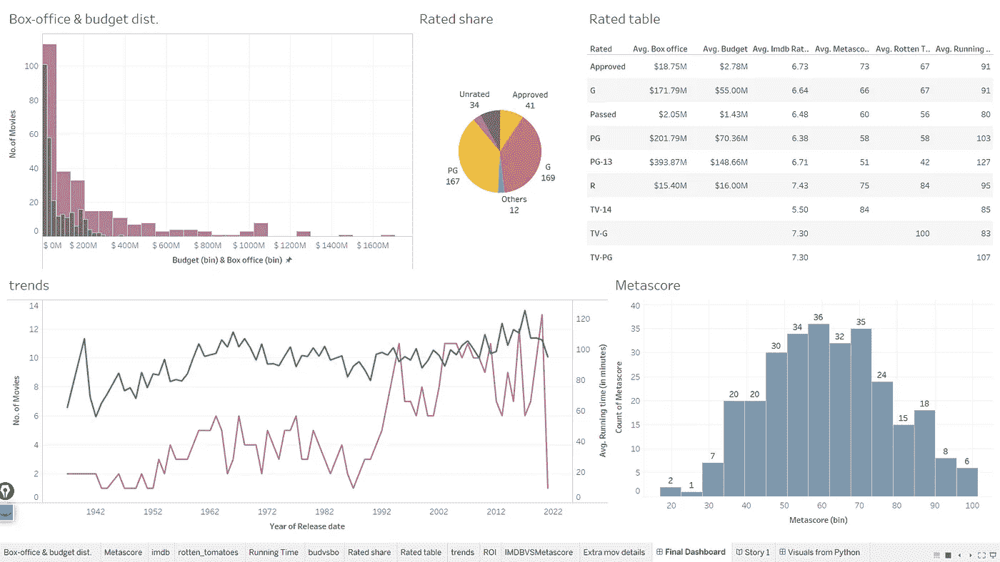

# 迪士尼电影分析

> 原文：<https://medium.com/analytics-vidhya/portfolio-project-1-disney-movie-anaysis-12190297d1fe?source=collection_archive---------7----------------------->

# 介绍

在这篇博客中，我将概述我最近在分析华特迪士尼电影公司列表时所做的端到端数据分析项目。下面是代码的 [*Github 链接*](https://github.com/Dvboi/Disney-Movie-Analysis) 和 [*Tableau 仪表盘*](https://public.tableau.com/views/DisneyMovies_16148452251710/Story1?:language=en&:display_count=y&publish=yes&:origin=viz_share_link) 供你玩/与视觉效果&互动的发现。

我们将首先从数据收集过程开始，我们从多个来源(合法地)获取数据，并建立我们的数据集。然后，我们将数据存储为 json 格式。然后，我们将非结构化数据加载为 CSV 格式，并开始清理和预处理它。

一旦我们完成了这些，我们将开始执行 EDA 和一些 Python 中的数据统计分析。最后，我们将在 Tableau Public 中构建所有的视觉效果，并将它们汇总到一个故事中，以便在商业环境中展示。
我**不会**在这里向您展示/解释代码(除了最耗时的数据收集之外),而是向您提供我从数据中获得的见解。话虽如此，我还是尽我最大的努力记录了尽可能多的代码，这样你理解起来就不会有问题了。此外，我很乐意在评论区解决你的所有疑问，或者你可以在 LinkedIn 上连接并 ping 我。

# 先决条件

关于——的知识

*   蟒蛇(熊猫、熊猫等)
*   美丽的汤 4
*   Tableau 公共

所以让我们开始吧…

# 数据收集

首先，我们导入库..

```
import numpy as np
import pandas as pd
from bs4 import BeautifulSoup as bs
import requests
```

我们想把这个列表中的每部电影，以及它上面和下面的列表中的每部电影都划掉..



我们还想为列表中的每部电影抓取信息表，例如(如果你点击任何一部电影，你都会进入这样的页面..) —



首先是获取每部电影信息表的代码..

现在，获取所有电影的代码..

在获得每部电影的信息表后，我们将使用第三方 API 通过从 API 请求每部电影标题的信息来附加每部电影的评级(和其他信息)。
代码看起来像这样..

**注意** —请使用您自己的***【API-key】***。免费的！只要去 [OMDB](http://www.omdbapi.com/) 创建一个个人资料，你一天就会收到 1000 个请求。对于更多，他们有一些付费计划。

现在我们只需将数据保存在 CSV 中。这段代码很容易做到这一点..

```
# Saving to CSVdf = pd.DataFrame(mov_info)
df.to_csv(‘Final_Data.csv’,index=False)
```

现在请记住，这些脚本可能在未来不起作用，因为网站是动态的，会随着时间不断变化，所以如果不起作用，您可能需要相应地编辑代码。
我们已经完成了数据收集和数据集创建，现在我们可以进入清理部分了。

# **数据清理**

解释整个数据清理( [*笔记本*](https://github.com/Dvboi/Disney-Movie-Analysis/blob/master/Data%20Cleaning.ipynb) )代码将是多余的，这里主要的事情不是代码，而是我如何处理数据，丢失值等。
数据清理的关键点是—

*   删除了大约 20 列，因为它们几乎 99%都是空值。
*   发现只要生产公司(列名)为空，我们就会在生产公司(列名)中有值，所以我们可以将其合并到一列中。国家和国家列、语言和语言列也是如此。
    从名字本身来看，原因很直观，当只有一家制作公司参与时，维基百科将其存储在“制作公司”标题下，如果有几家公司参与电影制作，那么维基百科将其存储在“制作公司”标题下。
*   使用 Regex 删除链接标记，如“[1]/[2]”，清理日期时间列。
*   使用 helper 函数和 regex 将值 United StatesUnited Kingdom 转换为→['United States '，' United Kingdom']。
*   一起使用几个正则表达式从预算和票房列中解析出不同格式的主要货币值。

```
pattern2 = r’\$\d+,?\d+,?\d+,?\d+\.?’ # for $40,070,995, $950000pattern3 = r’\$\d+\.?\d*\s?(?:million|billion|thousand)?’ # for $178 million[3]pattern1 = r’\$\d+\.?\d*–\$?\d+\.?\d* million’ # for ranges of money $76.4–$83.3 million[4][5] , later took the average after parsing out the valuespattern4 = r’₹?\s?\d+ crore|lakh|lakhs’ # to grab indian rupee formatpattern5 = r’₹\d+\.?\d*? (?:billion|million)’ # to grab ₹1.09 billion final_regex = ‘(%s|%s|%s|%s|%s)’ %(pattern1,pattern2,pattern3,pattern4,pattern5)
```

*   使用几个嵌套的 if-else 将所有这些值转换成美元。
*   清理其他列，如运行时间和 Imdb-rating，然后将它们的数据类型转换为数字。
*   最后将清理后的数据保存为 CSV 格式以供 EDA 使用。

# **探索性数据分析**

对于 EDA( [*笔记本*](https://github.com/Dvboi/Disney-Movie-Analysis/blob/master/EDA.ipynb) )，我首先在 python 中对列进行分析以寻找趋势，然后在 Tableau 中实现它，以便每个人都更容易理解。然而，一些基本的统计数据只在 python 中完成。

我强烈建议你看看 Tableau 仪表盘，自己写故事，玩一玩，然后在下面留下你的反馈。这里的链接是[这里的](https://public.tableau.com/views/DisneyMovies_16148452251710/Story1?:language=en&:display_count=y&:origin=viz_share_link)。

关键发现—



预算和票房箱

*   两者都严重右倾，但电影票房收入有很大差异。
    取两种分布的对数，得到正态分布(使用 Q-Q 图[确定，此处为](https://github.com/Dvboi/Disney-Movie-Analysis/blob/master/EDA.ipynb))。平均票房收入**∈(**3540 万美元，**5250 万美元)**和预算**∈(**2330 万美元，**3310 万美元)的 95%置信区间。**



IMD b-评级

*   在 95%的置信度下，电影的平均 IMDB 评级位于区间(6.45，6.63)。
    同样适用于 Metascore x **∈ (59.71，63.59)** 。



平均值。历年运行时间和发布次数

*   这两者在过去几年里都有所增加(特别是在 90 年代初以后)。



预算与票房收入

*   预算和票房略有正相关
*   *Bambi* 的投资回报率最高，而*Meet the deedles*的投资回报率最低



IMDB 与 Metascore

*   看起来 Imdb 的评级和元符号在不同的电影上是一致的。随着收视率的增加，我们也可以看到票房收入的增加。(更大的尺寸意味着更多的收藏)。
*   最终仪表板—



*   概述摘要

在仪表盘[这里](https://public.tableau.com/views/DisneyMovies_16148452251710/Story1?:language=en&:display_count=y&:origin=viz_share_link)有更多具有很强交互性的视觉效果和分析，我强烈建议您去看一看。

# 结论

所以这只是一个有趣的可视化项目。在接下来的几天里，我会写更多的案例研究，让我们一起解决一个问题。希望你喜欢这篇文章。请在下面留下您的宝贵反馈或任何问题！。

## 参考

[凯斯加利 YT 频道](https://www.youtube.com/channel/UCq6XkhO5SZ66N04IcPbqNcw)

让我们连接吧！
[领英](https://www.linkedin.com/in/devansh-verma-609218148/)
[Github](https://github.com/Dvboi)