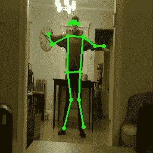
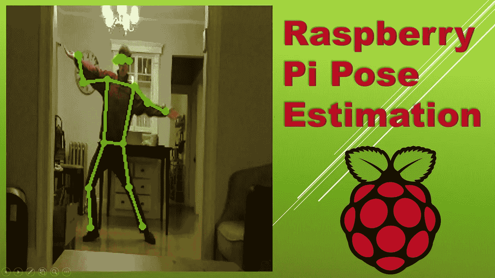
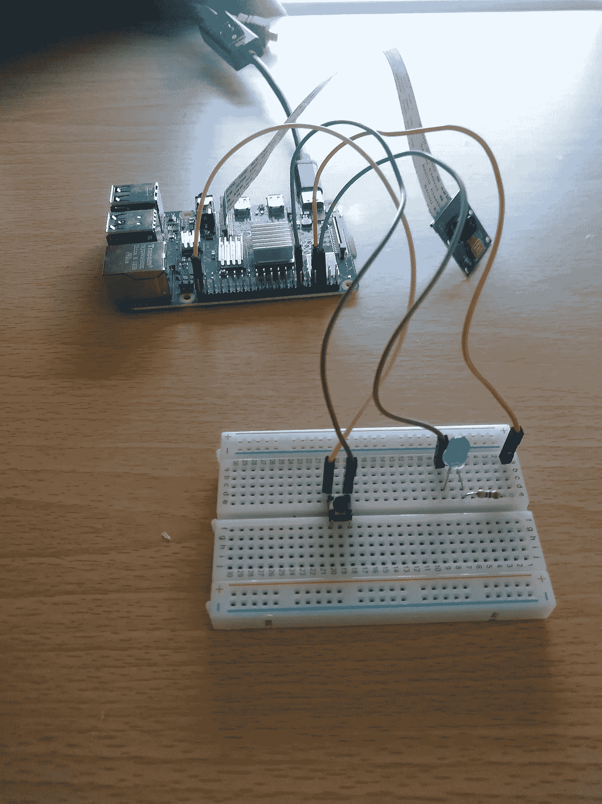

# 树莓 Pi 4 上的姿态估计

> 原文：<https://medium.com/analytics-vidhya/pose-estimation-on-the-raspberry-pi-4-83a02164eb8e?source=collection_archive---------3----------------------->

P **ose 估计**是一种使用**计算机视觉**和**机器学习**模型来确定一个人的姿态的技术。它通过处理神经网络输入的图像来预测身体的关键点。本例中使用的模型 **PoseNet** ，估计 **17** 不同的身体部位点！

姿态估计经常应用于诸如**动画**、**增强现实(AR)** 和**机器人**等领域。对于这些应用，在 **2D** 或 **3D** 空间中估计人的姿态。

**神经网络信息**

**PoseNet** 模型使用 **MobileNet** 主干，它利用深度方向可分离卷积运算来减少网络中的参数数量，从而减少模型大小。

该模型还被量化，其采用 **32 位** **浮点权重**并将其减少为 **8 位整数权重**。这使得**能够更快地处理**，而模型精度略有下降。这也允许该模型在轻量级硬件上运行，如**树莓派**！

**软件实现**

这个实现使用了集成在 **TensorFlow Lite** 中的 PoseNet 模型，一切都是用 **Python** 编写的，要在 **Raspberry Pi 4** 上运行。

为这个项目编写的代码开发了一个**管道**到**将图像**馈送给模型，**使用 TensorFlow **预训练模型**处理**它们，**解码**模型输出，**在处理后的图像上绘制关键点和肢体**。后期处理可以用来把这些图像转换成视频！

**硬件实现**

该项目使用 Raspberry Pi 4GB、Raspberry Pi 摄像头模块和一个带 LED、电阻和按钮的小试验板。这是运行管道的硬件配置:

硬件配置

这个项目的代码和设置信息可以在这里找到:[https://github.com/ecd1012/rpi_pose_estimation](https://github.com/ecd1012/rpi_pose_estimation)

**浏览器演示**

谷歌提供了在 Android 和 iOS 设备上运行姿态估计的代码。

如果你想亲自尝试，这里有一个模型的演示。:)

[https://storage . Google APIs . com/tfjs-models/demos/pose net/camera . html](https://storage.googleapis.com/tfjs-models/demos/posenet/camera.html)

**附加资源:**

*   项目的 YouTube 教程[https://www.youtube.com/watch?v=RUp-K4NEllg&ab _ channel = Ethan % 27 spitips](https://www.youtube.com/watch?v=RUp-K4NEllg&ab_channel=Ethan%27sPiTips)
*   更多树莓派内容的网站:[https://ethandell.tech/blog](https://ethandell.tech/blog)

**来源:**

*   详细描述姿态估计的附加媒体帖子:[https://Medium . com/tensor flow/real-time-human-Pose-Estimation-in-tensor flow-js-7 DD 0 BC 881 cd5](/tensorflow/real-time-human-pose-estimation-in-the-browser-with-tensorflow-js-7dd0bc881cd5)
*   PoseNet 模型的信息及下载:[https://www . tensor flow . org/lite/models/pose _ estimation/overview](https://www.tensorflow.org/lite/models/pose_estimation/overview)