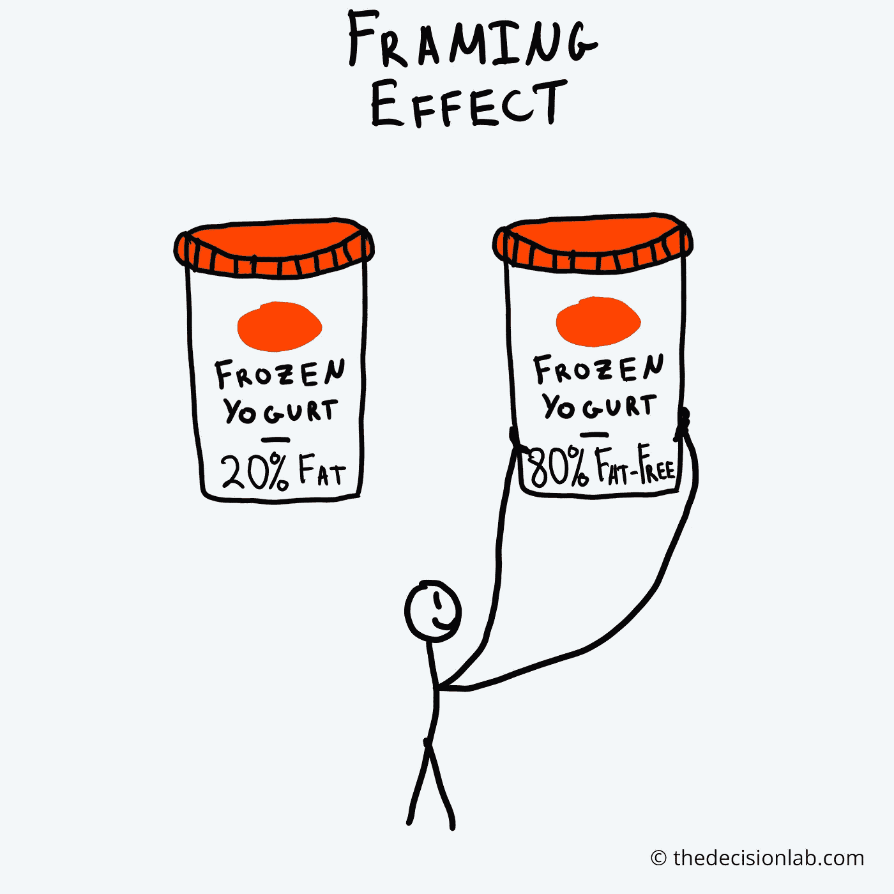
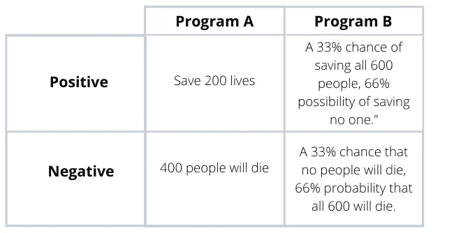
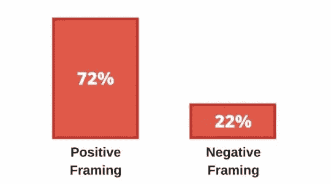
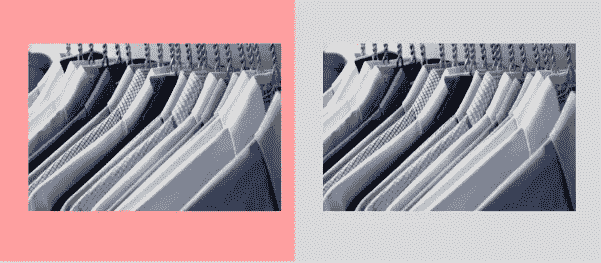
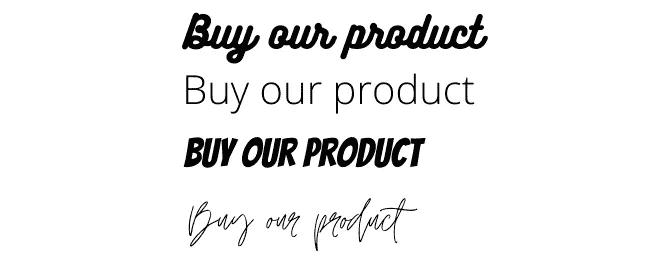
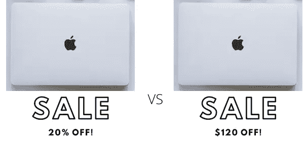

# 数据的积极或消极框架及其总体效果

> 原文：<https://medium.com/analytics-vidhya/positive-or-negative-framing-of-data-and-its-overall-effect-7653df65b523?source=collection_archive---------18----------------------->

## 我们的决定如何取决于呈现在我们面前的东西

我见过很多次，相似的数据是如何以不同的方式显示出来，以**偏向**其整体效果。

可以使用一些技巧来框定一组特定的结果，将其结果从正面转化为负面，反之亦然。

**框架效应** 是指我们的决定受到信息呈现方式的影响。同等信息的吸引力或多或少取决于突出显示的特征。基于这种框架效应的决定可以把价值或重要性较低的事情放在积极的一面，而把非常重要的信息放在消极的一面。

> 5%的死亡率听起来比 95%的存活率更糟糕，尽管两者意义相同。

想一想，有人不明智地选择了高风险投资组合，因为他们的经纪人以积极的态度介绍了这一投资组合，只说了好的一面，而没有说坏的一面或涉及的风险。

现在问题来了:**为什么会这样？**

一个经典的[卡尼曼和特沃斯基实验](http://www.uta.edu/faculty/richarme/MARK%205342/Articles/Tversky%2081.pdf)说明了**正框架**偏差。科学家们以两种方式提出了一种假设疾病的治疗方案，一种强调积极的结果，一种强调消极的结果。

[维基百科](https://en.wikipedia.org/wiki/Framing_effect_(psychology))用简单的术语总结了选项:

正框架偏向实验结果

即使实际结果是一样的，偏好的差异也是惊人的。在正框架条件下，72%的被试选择了处理 a。但是，当 ***框架为负(400 将死)*** 时，只有 22%的被试选择了处理 a。

上述实验的偏好结果

看下面这张图片，我们有两张相同图片的图片，但是使用了不同的背景。首先，粉色看起来更吸引眼球，但会被大多数男性拒绝，因为使用了粉色。于是就有了*。*

**

*不同背景下两幅相同图像的视觉框架*

*如果我们看下面的例子，每一个都是不同的字体，但措辞相同。第一个和最后一个很难读，所以使用这样的字体不会很有效。*

**

*视觉框架与字体大小和风格*

*我们还有 ***【小字】*** 。很多时候，我们是不会费心去读的。为什么？因为它太小了，很难阅读，我们只是错过了它。如果它更大更易读，也许我们中的更多人会去读它。然而，因为它被设计的方式，我们不知道。*

*原因很简单。如果我们不读小字，我们就不会意识到什么是保修范围内的，什么不是。*

*苹果电脑目前售价 600 美元。您需要在两个可用选项中进行选择:*

***选项 1** 显示 ***八折*** MacBooks。*

***选项 2** 显示*MacBooks 优惠 120 美元。**

****

**销售商店中的积极框架**

**大多数零售商会 ***选择第二个选项*** 。事实上，这是一个常用的策略，被称为**‘100 法则’**。很简单，任何低于 100 美元的东西作为百分比都更有吸引力。**

**所以价值 10 美元的商品打九折比价值 1 美元的更有吸引力。**

**相比之下，超过 100 美元的商品则相反。例如，50 美元的折扣通常比 500 美元的商品打 9 折更有吸引力。**

**然而，这在某种程度上是可以避免的，因为 2010 年的一项研究发现，“与问题无关的人相比，与问题有关的人更有动力系统地处理有说服力的信息，并对获取有关产品的信息更感兴趣。”我们可以从这些发现中得到的是，我们应该仔细考虑我们对一个问题的选择，并努力在这个问题上变得更加知情。**