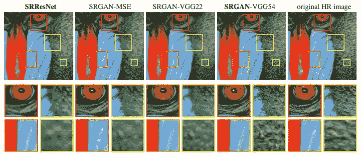

# 基于深度学习的超分辨率可能存在的损失问题

> 原文：<https://medium.com/analytics-vidhya/possible-issues-of-the-loss-for-deep-learning-based-super-resolution-649c5bd79635?source=collection_archive---------4----------------------->

# 超分辨率

超分辨率(SR)是从低分辨率(LR)图像中恢复高分辨率(HR)图像的任务。最近的方法显示了惊人的重建性能方面的定性感知和定量基准(PSNR，SSIM)。尽管以前方法中的许多问题通过进一步的研究得到了解决，但我们仍然认为当前基于 DL 的随机共振方法继承了一些基本问题，特别是损失函数。我们将特别关注单幅图像超分辨率(SISR)的当前方法的问题，其中我们接收一幅单幅 LR 图像并旨在输出一幅 HR 图像。

[https://arxiv.org/abs/1904.07523](https://arxiv.org/abs/1904.07523)

我们将首先非常快速地概述当前基于深度学习的 SR 方法。要深入了解基于 DL 的软件无线电方法，请参考[的这篇文章](https://arxiv.org/abs/1904.07523)和[的这篇博文](https://blog.paperspace.com/image-super-resolution/)。

## 模型架构

在损失函数和模型架构方面，有多种方法来完成 SISR 的任务。上面描述了一些方法。在 SRCNN 首次将卷积神经网络引入 SR 任务之后，数百种改变模型架构的变体被提出。

[https://papers with code . com/sota/image-super-resolution-on-set 14-4x-upscaling](https://paperswithcode.com/sota/image-super-resolution-on-set14-4x-upscaling)

这些方法包括 FSRCNN、VDSR、ESRCNN，以及基于残差块的模型，如 EDSR、MDSR、CARN。还介绍了基于递归网络的方法和基于 DenseNet 块的方法。最后，提出了基于注意力的体系结构，该体系结构主要利用基于通道和基于渐进的模型。

还提出了各种上采样技术，如 ESRCNN 像素平铺、预上采样和去卷积，并应用于各种模型架构。

## 基于内容的损失

诸如 SRCNN 的第一种方法提出了基于重建图像 f(LR)和 HR 图像之间的内容损失或者主要是 MSE 损失的训练算法。这也直接有利于 PSNR 度量。这个损失建议似乎非常合理和直接，但它继承了 SRGAN 论文提出的一个非常基本的问题。

这些面向 PSNR 的方法倾向于输出平滑的结果，而没有足够的高频细节，因为 MSE 损失和 PSNR 度量从根本上与人类观察者的主观评价不一致。这是因为对于一个给定的 LR 面片有多个可能的输出，并且基于 MSE 的解决方案通常找到解决方案的逐像素平均值，这可能不存在于真实的 HR 流形上并且被平滑。下图对此进行了描述。

例如，可能存在输出非常相似的 LR 图像的两个 HR 图像 HR1 和 HR2。因此，当仅给出 LR 时，重建 f(LR)可能是 HR1 或 HR2，但是 MSE 损失倾向于输出两个可能的 HR 片的平均值。

尽管一些情况可以通过非常复杂的神经网络来学习，但是对于一个给定的 LR 图像，SR 的正确 HR 片不是奇异的这种行为对基于 MSE 的解决方案造成了基本限制，并且具有输出过度平滑的输出的行为。

## 对此行为的解决方案

作为对 SR 模型输出过度平滑图像这一现象的解决方案，一个工作分支提出了生成对抗网络(GAN)。这些作品包括 SRGAN、EnchanceNet、e SRGAN 和最近的 RSRGAN。甘作品通常采用内容损失和对抗损失之和。他们还经常利用感知损失，通常是预先训练的 VGG19 网络的中间激活。下面的等式是 ESRGAN 的损耗公式。

根据 SRGAN 论文的经验结果，单独使用 GAN 损失不足以生成高分辨率纹理细节，必须与感知损失相结合。

基于 GAN 的解决方案在基于像素的量化指标(如 PSNR 和 SSIM)方面的表现不如基于 MSE 的模型，但表现出更好的感知质量和非常高的平均意见得分(MOS ),这是许多情况下的关键兴趣。

虽然基于 GAN 的解决方案是偏好感知质量的最佳解决方案，并且它们在生成照片般逼真的 HR 图像方面最为成功，但是它们继承了 GAN 训练的问题。对 GAN 基 SR 解决方案的观察和我个人的看法发现学习 GAN 基 SR 有四个实际和概念上的问题。

1.  不想要的伪像:发生器通常生成远离 LR 图像的图像，图像中存在不想要的伪像。GAN 训练的不稳定性和下面的所有问题结合起来解释了这些伪像。
2.  D 的过拟合:BigGAN 提出的 GAN 训练中的一个基本问题，对抗性训练永远不会完成，鉴别器容易过拟合。我相信 D 的过拟合在 SR 中可能更多地存在，因为图像的数量很少，并且 G 没有接收到任何种类的噪声，因此限制了 G 输出图像分布的能力。
3.  **没有输出分布**的能力:常规 GAN 和用于 SR 的 GAN 之间的发电机网络的一个基本区别是没有噪声或潜在矢量的**。因此，对于一个给定的 LR 补片，该模型只能输出一个图像。根据 [STF-SR 论文](https://arxiv.org/abs/1804.02815)，模型必须能够针对不同的环境和纹理信息输出不同的 SR 结果。我相信这是在对抗损失率较高的情况下训练时容易出现模式崩溃的关键原因。**
4.  混合损失:混合多种损失在引入两种极端状态之间的权衡方面是有益的。但这也意味着这两种损耗都不是衡量 SR 整体性能的最佳指标。我认为 GAN 基 SR 中有一个关键元素丢失了，必须通过修改损耗函数来解决。

总之，生成器只能输出一个对应的随机共振，而根据特定零件的完整图像和纹理，可能会有多个解决方案。这也可能导致 D 的过度拟合，因为生成的图像具有较小的变化。混合损失也不是解决这两种损失的根本办法。我非常有信心有空间从概念上改进 SR 的损失函数。

# 下采样操作

如果 LR 对应物是通过双三次下采样或另一种特定方法 LR=bic(HR)生成的，则超分辨率旨在 le**arn BIC:f(LR)= HR 的反函数**，但是在现实问题中，不能保证下采样操作是用于训练的特定操作。我们将在下一篇文章中讨论这个问题。