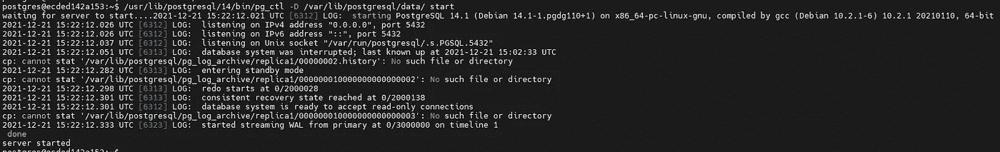

# PostgreSQL 流复制

> 原文：<https://medium.com/analytics-vidhya/postgresql-streaming-replication-4b4679b352f3?source=collection_archive---------0----------------------->

在本主题中，我将简要介绍 PostgreSQL 流复制。

我将 PotgreSQL 版本 14 用于主系统和备用系统。

对于源系统，我使用 PostgreSQL 最新的 docker 映像。对于目标系统，我使用了 Debian 最新的 docker 映像。

以便准备源系统；

> postgres=# **显示数据 _ 目录；**
> 
> 数据目录
> 
> — — — — — — — — — — — — —
> 
> /var/lib/postgresql/data
> 
> (1 行)

我们需要在“postgresql.conf”文件的末尾添加以下行:

> **沃尔 _level =副本**
> 
> **wal_log_hints = on**
> 
> **archive_mode = on #(更改需要重启)**
> 
> **archive_command = 'test！-f/var/lib/PostgreSQL/pg _ log _ archive/main/% f&&CP % p/var/lib/PostgreSQL/pg _ log _ archive/main/% f '**
> 
> **max_wal_senders = 10**
> 
> **热备用=开启**

然后，

> **mkdir-p/var/lib/PostgreSQL/pg _ log _ archive/main/**
> 
> **create user-e-replication repl-W**# as postgres

此外，我们需要添加以下行来允许复制用户“repl”连接源数据库:

> **主机复制 repl 172.17.0.5/32 md5**

然后重新启动 PostgreSQL 集群:

> **选择 pg _ create _ physical _ replication _ slot(' air ')；**
> 
> pg _ 创建 _ 物理 _ 复制 _ 插槽
> 
> — — — — — — — — — — — — — — — — — — -
> 
> (空气)
> 
> (1 行)
> 
> **select * from pg _ replication _ slots；**

由于 wal 文件的管理，我们使用“pg_replication_slots”。在 PostgreSQL 版本之前，我们通过“wal_keep_segments”参数来管理 wal 文件。当主节点和备用节点之间的通信出现问题时，如果我们的系统超出限制“wal _ keep _ segments ”, PostgreSQL 将删除文件，除非我们创建一个复制槽。这就是我们在配置中使用复制插槽的原因。当然，也有一些缺点，比如我们需要足够的(很多/取决于系统)数据存储，以便在任何通信故障的情况下不停止生产系统。

[https://www . PostgreSQL . org/docs/9.4/catalog-pg-replication-slots . html](https://www.postgresql.org/docs/9.4/catalog-pg-replication-slots.html)

[https://hevodata.com/learn/postgresql-replication-slots/](https://hevodata.com/learn/postgresql-replication-slots/)

在目标端配置；

首先，我们需要安装 PostgreSQL 二进制文件:

 [## Linux 下载(Ubuntu)

### 默认情况下，PostgreSQL 在所有 Ubuntu 版本中都可用。然而，Ubuntu“快照”了 PostgreSQL 的一个特定版本…

www.postgresql.org](https://www.postgresql.org/download/linux/ubuntu/) 

> #创建文件存储库配置:
> 
> sudo sh-c ' echo " deb[http://apt.postgresql.org/pub/repos/apt](http://apt.postgresql.org/pub/repos/apt)$(LSB _ release-cs)-pgdg main ">/etc/apt/sources . list . d/pgdg . list '
> 
> #导入存储库签名密钥:
> 
> https://www.postgresql.org/media/keys/ACCC4CF8.asc|须藤 apt-key add -
> 
> #更新包列表:
> 
> sudo apt-get 更新
> 
> #安装最新版本的 PostgreSQL。
> 
> #如果您需要特定的版本，请使用“postgresql-12”或类似的语言，而不是“postgresql”:
> 
> sudo apt-get -y 安装 postgresql

然后，我检查复制用户是否可以连接到源数据库:

> **psql-h 172 . 17 . 0 . 4-U repl postgres**
> 
> **用户回复的密码:**
> 
> **psql(14.1(Debian 14.1–1 . pgdg 110+1)，server 14.0(Debian 14.0–1 . pgdg 110+1))**
> 
> **键入“help”寻求帮助。**
> 
> **postgres= >**
> 
> **\q**

我们创建数据目录:

> **mkdir-p/var/lib/PostgreSQL/data/**
> 
> **chmod 700/var/lib/PostgreSQL/data**

我们开始对初始负载进行基本备份:

> **pg _ base backup-h 172 . 17 . 0 . 4-D ./-U repl-W-P-R-S 航空-X stream -W**

现在，我们可以配置恢复参数，但 PostgreSQL 版本 12 之后没有“recovery.conf”文件。它是合并的“postgresql.conf”文件。为了将集群置于待机模式，我们需要创建一个名为“standby.signal”的空文件。

仅更改了“触发器文件”参数的名称，现在称为“升级触发器文件”，并删除了“待机模式”。其余的保持原样。

PostgreSQL 版本 12 之前(recovery.conf):

> **restore _ command = ' CP/var/lib/PostgreSQL/pg _ log _ archive/replica 1/% f % p '**
> 
> **恢复目标时间线= '最新'**
> 
> **primary _ conn info = ' user = repl host = 172 . 17 . 0 . 2 port = 5432 SSL mode = prefer SSL compression = 1 krbsrvname = postgres target _ session _ attrs = any '**
> 
> **archive _ clean up _ command = ' pg _ archive clean up/var/lib/PostgreSQL/pg _ log _ archive/replica 1% r '**
> 
> **trigger _ file =/tmp/trigger**

在 PostgreSQL 版本 12(postgresql.conf)之后:

> **restore _ command = ' CP/var/lib/PostgreSQL/pg _ log _ archive/replica 1/% f % p '**
> 
> **恢复目标时间线= '最新'**
> 
> **primary _ conn info = ' user = repl host = 172 . 17 . 0 . 4 port = 5432 password = 123123 SSL mode = prefere SSL compression = 1 krbsrvname = postgres target _ session _ attrs = any '**
> 
> **archive _ clean up _ command = ' pg _ archive clean up/var/lib/PostgreSQL/pg _ log _ archive/replica 1% r '**
> 
> **promote _ trigger _ file = '/tmp/promote '**
> 
> **主插槽名称= '空气'**

为备用节点和将数据库置于备用模式的文件创建归档目录。

> **mkdir-p/var/lib/PostgreSQL/pg _ log _ archive/replica 1**
> 
> **touch/var/lib/PostgreSQL/data/stand by . signal**

最后，我们可以启动 stanby 集群:

> **/usr/lib/PostgreSQL/14/bin/pg _ CTL-D/var/lib/PostgreSQL/data/start**

在源系统上:

在目标系统系统上:

我们可以随时在目标系统上创建“/tmp/promote”文件，将其提升为主系统:

> **触摸/tmp/提升**

现在，我能够在“旧的”备用系统上创建新的数据库:

同时，我在主系统上创建了另一个数据库:

哦不！我们破坏了我们的复制😊。是否可以从上一个成功的检查点继续复制，并与主系统保持同步？是的，我们有像向导一样的“pg_rewind”😊。

首先，在目标系统上，我们需要停止 PostgreSQL 集群:

> **/usr/lib/PostgreSQL/14/bin/pg _ CTL-D/var/lib/PostgreSQL/data/stop**

然后，我们可以通过执行以下命令来继续均衡源和目标数据目录:

> **/usr/lib/PostgreSQL/14/bin/pg _ rewind—target-pg data =/var/lib/PostgreSQL/data/—source-server = " host = 172 . 17 . 0 . 4 port = 5432 user = postgres password = my secret password dbname = postgres "**

然而，目标系统上的配置与主系统相同。因此，我们需要配置我们的“postgresql.conf”文件，并创建和清空“standby.signal”。我们需要在“postgresql.conf”文件的末尾添加以下行:

> **restore _ command = ' CP/var/lib/PostgreSQL/pg _ log _ archive/replica 1/% f % p '**
> 
> **恢复目标时间线= '最新'**
> 
> **primary _ conn info = ' user = repl host = 172 . 17 . 0 . 4 port = 5432 password = 123123 SSL mode = prefere SSL compression = 1 krbsrvname = postgres target _ session _ attrs = any '**
> 
> **archive _ clean up _ command = ' pg _ archive clean up/var/lib/PostgreSQL/pg _ log _ archive/replica 1% r '**
> 
> **promote _ trigger _ file = '/tmp/promote '**
> 
> **主插槽名称= '空气'**

和

> **CD/var/lib/PostgreSQL/data/**
> 
> **触摸待机信号**

让我们再次启动 standy system，并尝试在其上创建数据库:

> **/usr/lib/PostgreSQL/14/bin/pg _ CTL-D/var/lib/PostgreSQL/data/start**
> 
> **创建数据库 e；**

最后，我们可以检查复制的状态。

在主系统上:

在备用系统上:

如果有什么问题，请让我知道！

谢谢！