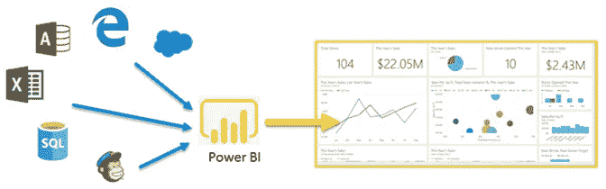
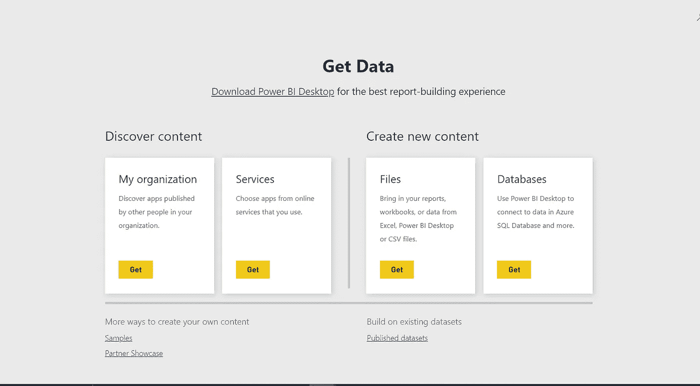

# Power BI 数据源

> 原文：<https://medium.com/analytics-vidhya/power-bi-data-sources-cc1227443d7?source=collection_archive---------7----------------------->

## 第二部分

## Microsoft Power BI 学习系列

在之前的博客中，我们已经了解了 BI 的确切功能，以及我们如何在组织层面使用它来做出更好的与数据相关的业务和管理决策。如果你还没有读过这个博客系列的第一部分，你可以读一读。

# Power BI 数据源

单词**‘数据源’**由两个单词组成:“数据”和“源”，这意味着数据集中的**数据**来自哪里。对于**示例**，**数据**可能来自云上的数据库，比如 Azure SQL 数据库。

让我们在这篇博客中探索一下，我们怎样才能做到同样的事情。

为此，首先，您需要点击左下角的**‘获取数据’**按钮。这将把您重定向到 Power BI 服务中的**“获取数据”**页面。

在 Power BI 中获取数据

这里有两个部分:**“发现内容”**和**“创建新内容”。**

在**“发现内容”**下，有两种类型的数据源:

*   **我的组织:**它包括由你的组织中的某人创建和发布的应用程序。当您团队中的某个人或您创建一个利用不同类型 Power BI 工件的应用程序时，这些应用程序将保存在这里。
*   **服务:**在这里，你可以从一个在线服务中选择一个应用程序，你通常需要一个帐户和凭证才能登录。例如，一个人可以通过登录他们的 Mailchimp 帐户来使用连接到 Mailchimp 的应用程序。

右手边是留给创造全新的内容。这里还有两个部分:'**文件**和'**数据库**'

*   **文件:**从这里，用户可以导入 CSV 文件或 Microsoft Excel 中存储的数据，也可以在 Power BI 桌面中创建数据模型，并将其导入 Power BI 服务。如果您想从一个不是 CSV、Microsoft Excel 或 Power BI desktop 的文件中获取数据，那么首要任务是以这些支持的格式之一获取数据。但是值得庆幸的是，你可以在 Excel 或者 CSV 文件中找到这些数据。
*   **数据库:**Power BI desktop 可用于连接 Azure SQL 数据库等在线数据库。也可以连接多个内部数据库，但网关应由贵组织的 IT 部门或数据库管理员提供。

在这两个部分下面，你还会找到更多的方法来创建你的内容。

**示例**由微软提供。另一方面，**合作伙伴展示区**由其合作伙伴提供。最后，您可以通过选择“**已发布数据集**”部分来处理现有数据集。

以这种方式，人们可以使用任何上述选择，并根据他们的要求选择合适的数据源。在获取数据和选择数据源之后，Power BI 创建一个数据集。

希望这篇博客对你有所帮助。这并不是结束，我们将在下一篇文章中再次见面，直到您熟悉使用本文的数据源。敬请期待即将到来的 [Part-3](https://hemshree.medium.com/a-quick-dive-into-data-refresh-ceefbabfae1f) 。

如果有什么建议，欢迎[和我分享！](https://twitter.com/hemshree_madaan)

快乐学习到那时！