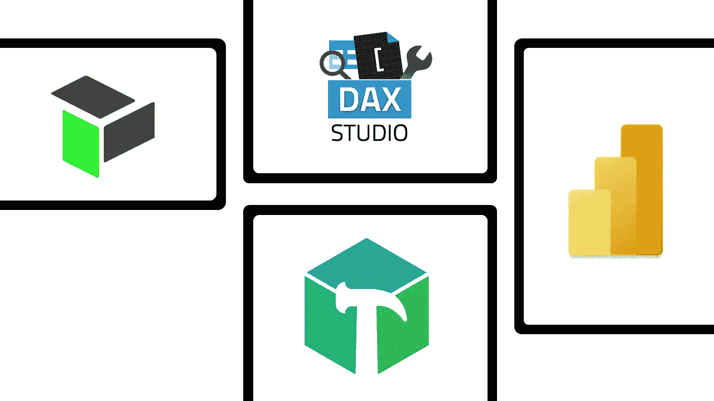

# Power BI 开发挑战—用于协作、优化等的外部工具(5 分钟)

> 原文：<https://medium.com/analytics-vidhya/power-bi-development-challenges-external-tools-for-collaboration-optimisation-and-much-more-fe35f3324d77?source=collection_archive---------1----------------------->

Power BI 是目前最受欢迎的自助式 BI 解决方案。自诞生以来，它的受欢迎程度稳步增长。它在 2019 年初超过了 Tableau，并且没有放缓的迹象。

作为一个相信循证决策的人，我个人对此感到非常兴奋。动力 BI 的…