# Power BI 分页报告说明

> 原文：<https://medium.com/analytics-vidhya/power-bi-paginated-reports-explained-33a0416a47ae?source=collection_archive---------1----------------------->

分页报表已经存在很多年了，如果您使用过 SQL Server Reporting Services(SSRS)，您一定对分页报表很熟悉。

**Power BI 分页报告**与 SSRS 没有什么不同，它们都是为了创建像素完美的报告，为打印或 PDF 生成而优化，而且它们都使用相同的“rdl”格式的报告。

# **什么样的场景推动了你对分页报告的需求？**

**场景 1:** 报表包含大量跨越多个页面的表格数据。
**场景-2** :将现有的固定报告迁移到 Power BI
**场景-3** :创建高度格式化、像素完美的报告，包括大量数据字段、图像、矩阵表等。
**场景-4** :需要将报表中的大量数据导出为以下格式(pdf、excel、CSV、ppt、doc、XML..等等)，在常规的功率 BI 报告中，如果报告数据超过设定的限制，那么我们会得到以下错误。但是在分页报告中，对导出数据没有限制。

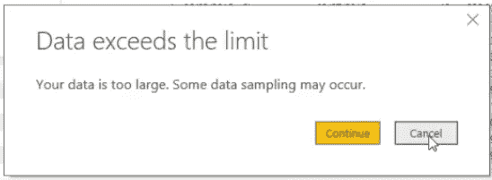

**场景-5** :转换 Power BI 仪表板中包含大量列和行数据的详细钻取页面和网格。

# 如何在 Power BI 中创建分页报表？

我们不能使用 Power BI Desktop 来创建分页报告，所以让我们看看创建分页报告的选项

## 下载并安装 Power BI 报告生成器

为了设计分页报告，我们需要一个名为“报告生成器”的新工具。点击下面的微软链接下载并安装该工具

 [## 从微软官方下载中心下载微软 Power BI 报告生成器

### Power BI Report Builder 为 IT 专业人员和高级用户提供了一个高效的报告创作环境

www.microsoft.com](https://www.microsoft.com/en-us/download/confirmation.aspx?id=58158) 

安装后，您可以从“开始”菜单打开 Power BI Report Builder(不要与 Power BI Desktop 和 Report Builder 混淆)

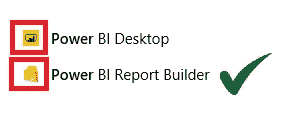

## 使用 Power BI Report Builder 创建分页报表

我们有几个不同的选项来创建分页报告，对于本例，让我们使用空白报告并单击它

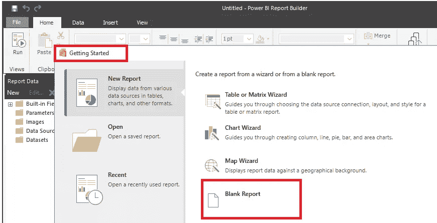

单击数据源并创建一个您想要连接的数据源

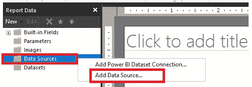

目前，支持以下数据源，该列表将来可能会增长

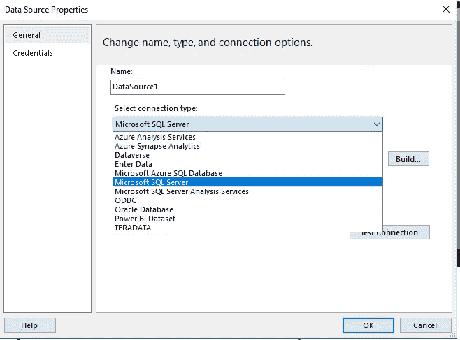

> 分页报表可以连接到多个数据源，并且可以直接将数据从数据源带到报表上。没有像 Power BI 报告中那样的基础模型

对于这个例子，我连接到 Azure 分析服务

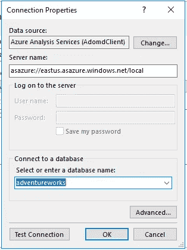

下一步是创建数据集，单击数据集→添加数据集

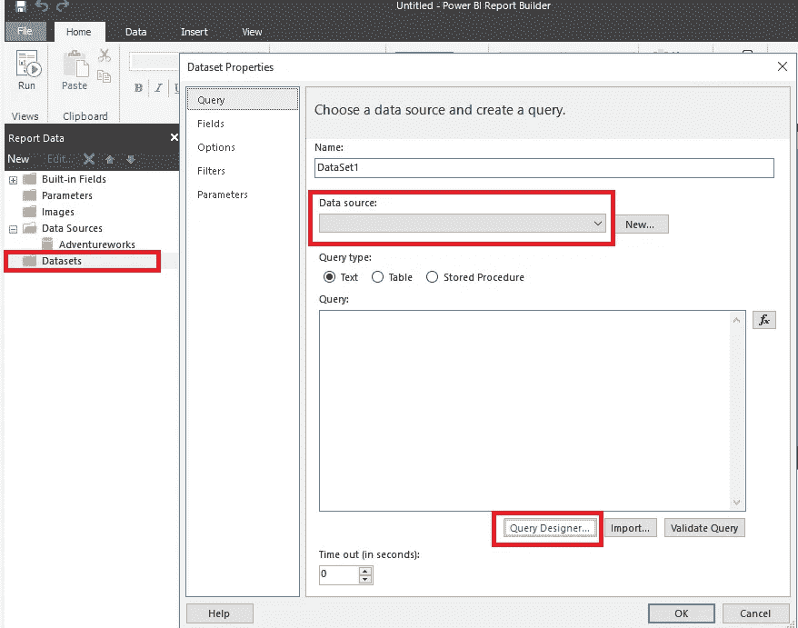

从下拉列表中选择已经创建的数据源，然后单击查询设计器。设计器显示了分析服务模型中所有可用的数据元素。(如果是关系数据库，那么它会显示所有的表、视图等)

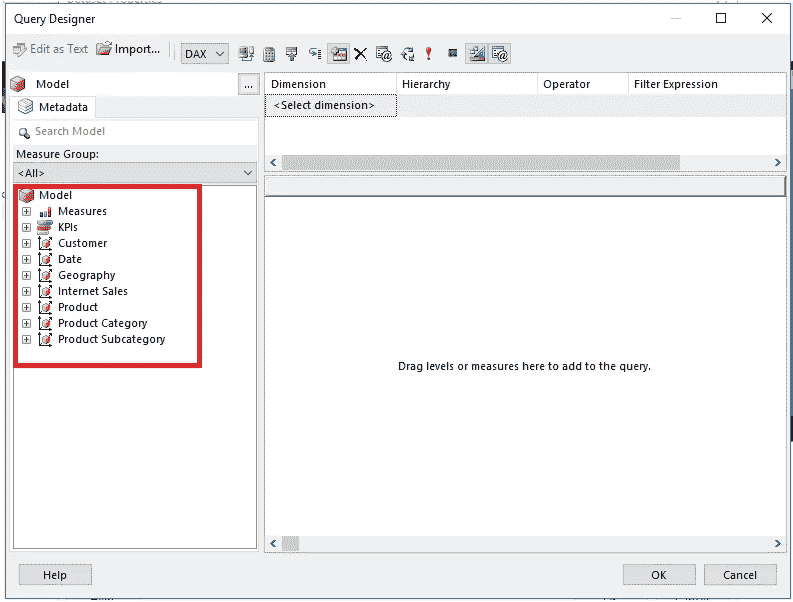

对于此示例，我使用 Adventurework 表格模型中的客户 internet 销售详细信息数据创建了一个示例数据集。

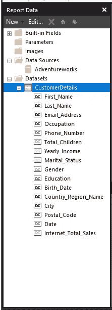

现在数据源和数据集都准备好了，是时候设计报表了。但是在开始设计之前，我们先了解一下设计器的不同部分。

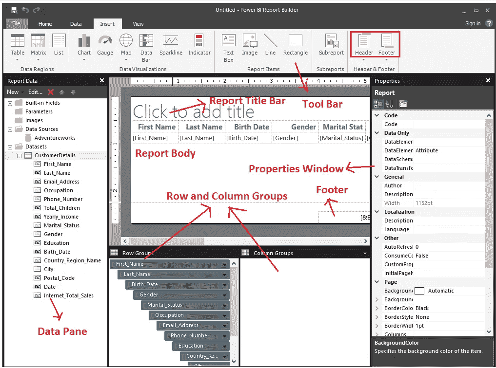

从工具栏中，单击“Table”并选择“Table Wizard ”,根据要求将字段拖放到相应的组中，然后单击“Next”并选择报告的布局。

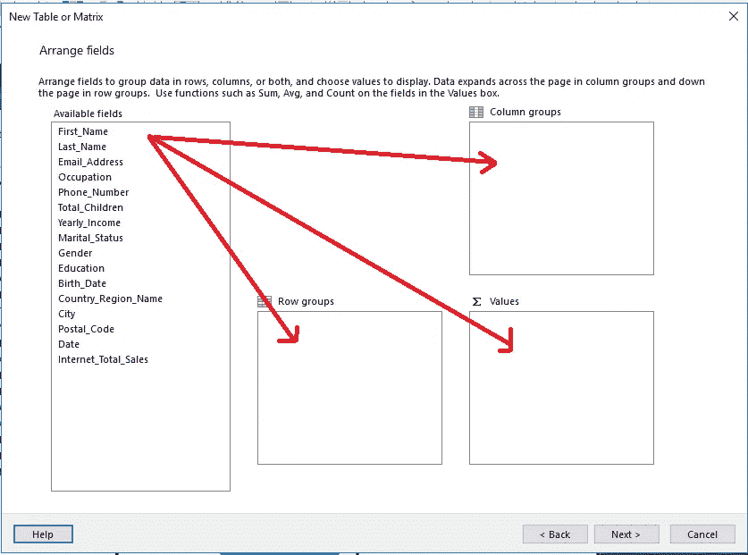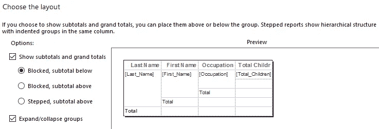

准备好报告布局后，单击确定并保存报告。在我们发布报告之前，请预览它，并通过单击主页→运行，然后发布来确保报告按预期工作

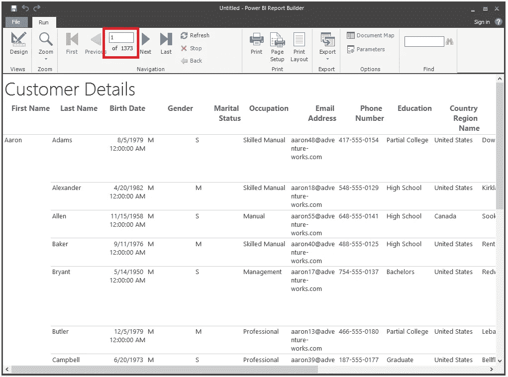

报告预览

如果您注意到上面的截图，该报告有大约 1373 页的数据(这是巨大的)。想象一下在 Power BI 桌面上有同样的报告(您最终会得到一个数据限制错误)

## 将分页报告发布到 Power BI Services

现在是发布分页报告的时候了。要增强 BI 服务，单击工具栏上的 Publish 按钮，并选择您想要发布分页报告的工作区

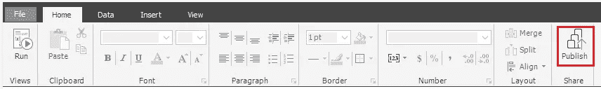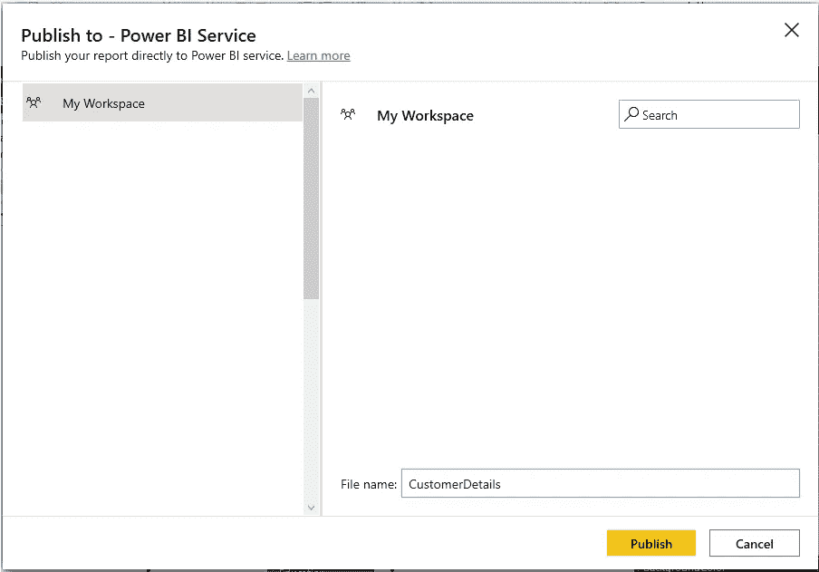

在发布之前，请确保您选择的工作区具有高级容量(我们需要一个 Power BI 高级容量(P1、P2、P3 用于第一代和 EM1-EM3，P1-P3、A1-A6 用于第二代)或嵌入式(A4-A6 SKU 或测试/开发)以将分页报告托管到 Power BI 服务上)或 Premium per user，它基于高级第二代。
另外，在管理门户→容量设置→工作负载→分页报告下检查分页报告选项是否启用并打开。并指定为要在 Power BI 服务上使用的分页报告提供的最大内存。

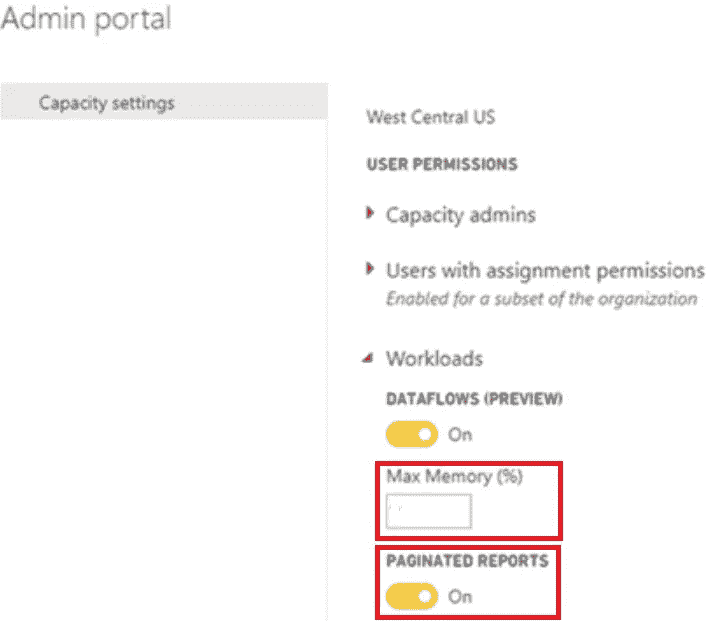

点击发布，并确保你看到下面的窗口一旦发布

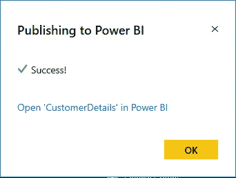

酷！！分页报告发布到 Power BI services，并准备好供您的团队打印或导出为各种格式，如下图所示。

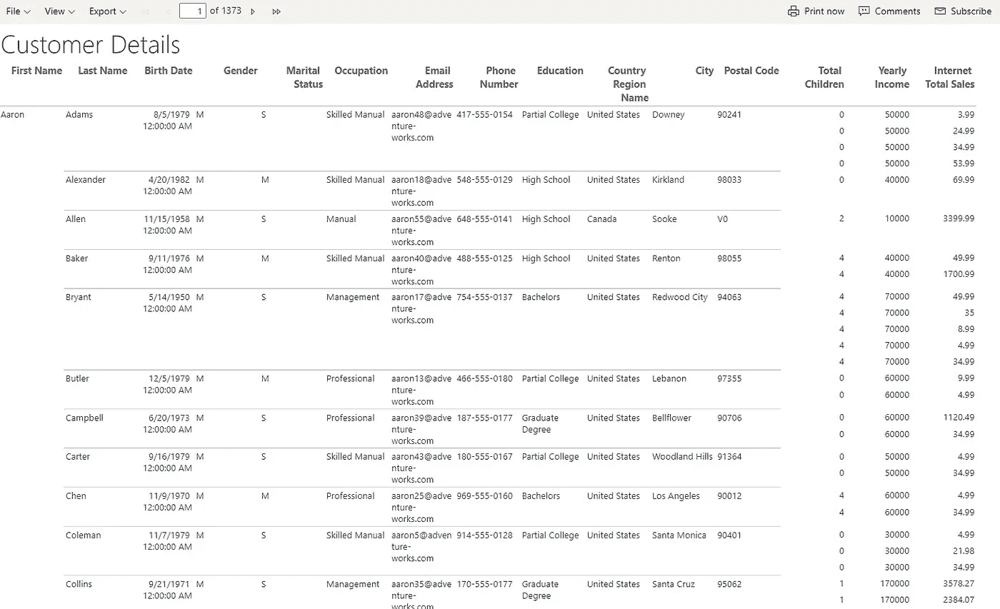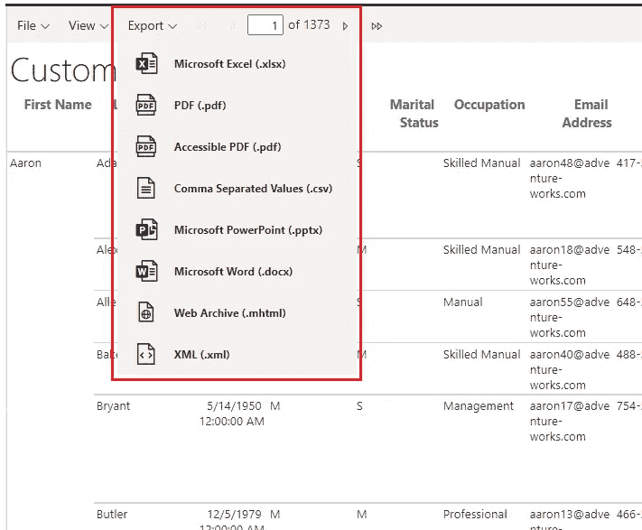

## 将分页报告嵌入到 Power BI 报告中

要嵌入分页的报表，我们需要启用预览功能，因为该功能在此移动时处于预览状态。打开 Power BI Desktop →转到选项→单击预览功能→选中分页报告复选框。

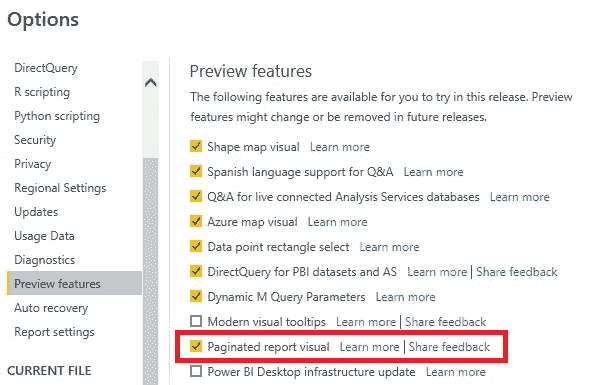

然后点击分页的报告视觉，然后点击连接到报告

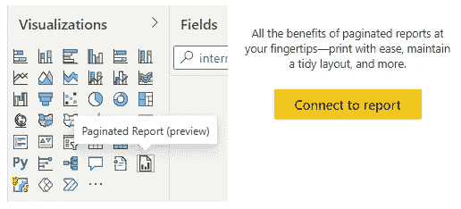

该页面显示了发布到 Power BI 服务的所有可用分页报告。选择要嵌入的报表，然后单击设置参数

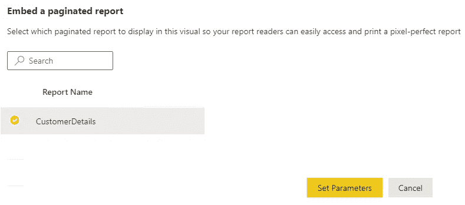

因为我们没有为客户详细信息报告设置任何参数，所以我跳过了这一步，现在我可以在 Power BI 桌面上看到分页的报告。

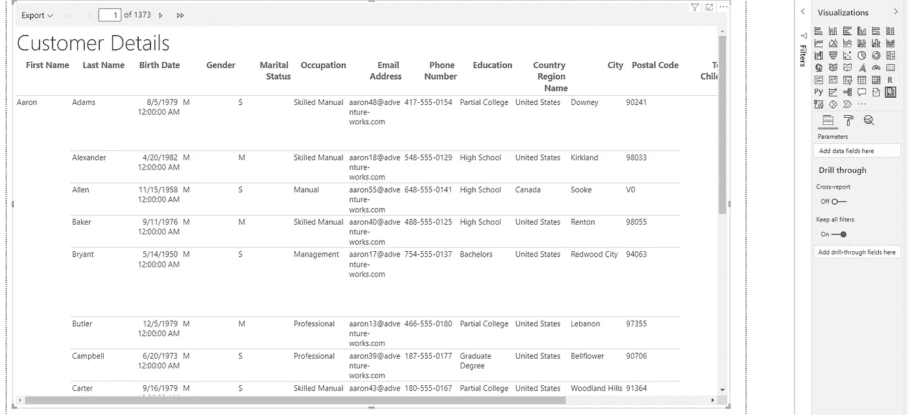

现在，我们可以将该报告用作一个页面的钻取，或者以任何您想要的方式使用。

我希望你喜欢读这篇文章，我会在我的下一篇文章中看到你，直到那时保持安全，享受冬天。

[参考](https://www.quotespedia.org/authors/f/frank-ocean/work-hard-in-silence-let-success-make-the-noise-frank-ocean/)