# Power BI:使用计算组降低演示数据的敏感度

> 原文：<https://medium.com/analytics-vidhya/power-bi-using-calculation-groups-to-desensitise-your-data-for-presentations-7066e32bc4ee?source=collection_archive---------9----------------------->

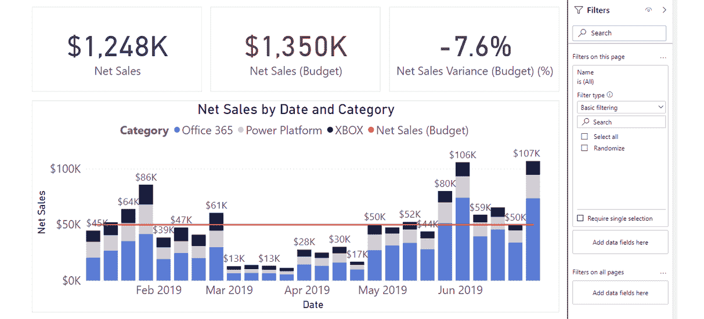

您是否曾经整理过一个具有非常酷的功能的报告，并且/或者您只是喜欢它的美观，而您想要做的只是在内部向您的同事展示它…但是它包含机密的客户信息？

我知道我有！现在谁有时间创建一个可以插入的合成数据集？我当然不知道，所以你最终错过了分享知识的机会。

在下面的文章中，我将与你分享一个快速的方法来模糊报表中的数据，使它成为一个更快的过程，为内部展示做好准备。

*请注意！你* ***必须始终*** *先跑完这一关你的客户端！在很多情况下，你创建的 IP 只属于客户。*

对于这个例子，我使用的是微软提供的样本数据集

[](https://docs.microsoft.com/en-us/power-bi/create-reports/sample-datasets) [## 获取 Power BI - Power BI 的样品

### 假设您是 Power BI 的新手，想要尝试一下，但是没有任何数据。或者，您可能希望看到这样的报告…

docs.microsoft.com](https://docs.microsoft.com/en-us/power-bi/create-reports/sample-datasets) 

和**表格编辑器 2**

[](https://github.com/otykier/TabularEditor) [## GitHub-Tabular editor/Tabular editor:这是用于表格的代码库和问题跟踪器…

### 表格编辑器是一个工具，让您可以轻松地操纵和管理措施，计算列，显示文件夹…

github.com](https://github.com/otykier/TabularEditor) 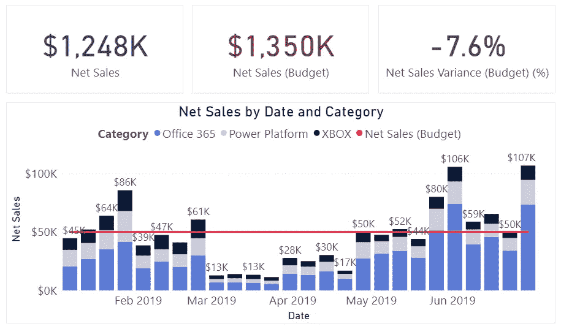

要创建以上内容，我们需要 3 个衡量标准:

净销售额——净销售额的基本衡量标准

```
Net Sales =
  CALCULATE(
    SUM(Sales[Amount])
    ,Sales[Status] = "Sold"
  )
```

净销售额(预算)——我为这个例子创建的人工预算

```
Net Sales (Budget) = 
  50000 * COUNTROWS('Calendar')
```

以及它们之间的%差异

```
Net Sales Variance (Budget) (%) = 
  DIVIDE(
     [Net Sales]
    ,[Net Sales (Budget)]
    ,0)-1
```

现在我们已经有了基础，我们需要应用计算组魔法！

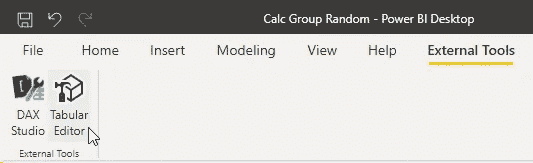

如果你已经安装了**表格编辑器 2** ，它应该出现在“外部工具”功能区中

## 发动它！

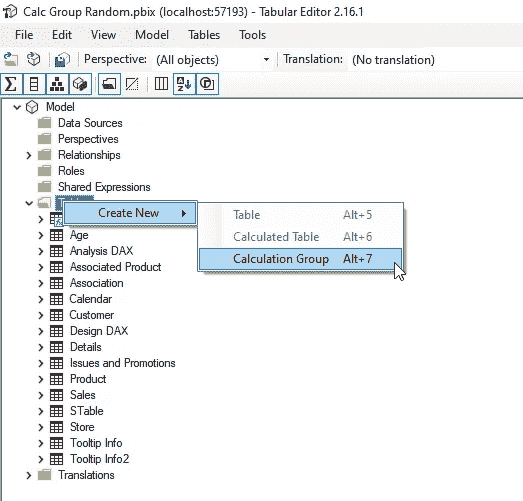

# 首先创建一个新的计算组

*   右键单击表格
*   创建新的
*   计算组
*   根据您的喜好重命名它(我总是喜欢在我的计算组前面加上“cg ”,以便更容易与常规表区分开来

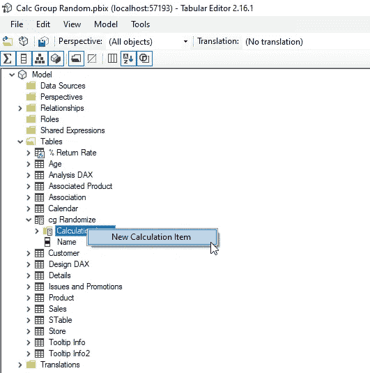

# 创建新的计算项目

*   展开新的计算组
*   右键单击并选择新建计算项目
*   重命名您的新项目

# 计算项目:

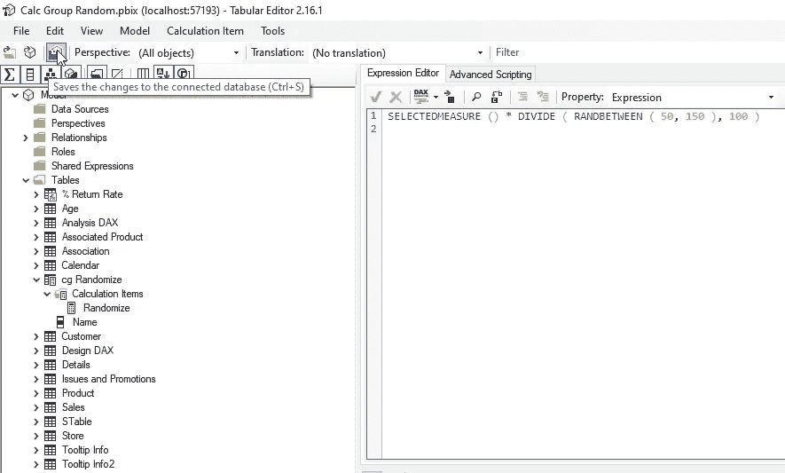

```
SELECTEDMEASURE () * DIVIDE ( RANDBETWEEN ( 50, 150 ), 100 )
```

*   selected measure()-获取页面上的任何度量或值，并将其传递给计算组
*   RANDBETWEEN ( 50，150)返回一个介于 50 和 150 之间的随机数
*   我们除以 100 得到%的差值
*   作为一个整体，我们现在得到了 50%到 150%之间的每个计算的变化，每个计算有不同的随机数

创建完成后，将其保存回模型，单击**“立即刷新”**这将填充报告中的计算组

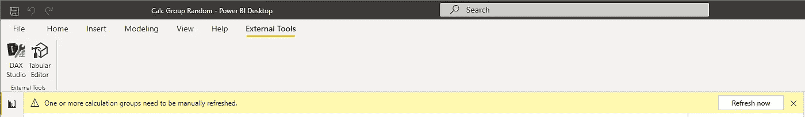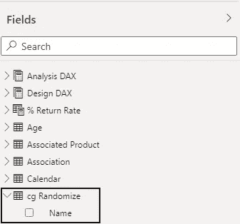

现在，您将在字段列表中看到计算组

(注意 cg 前缀)

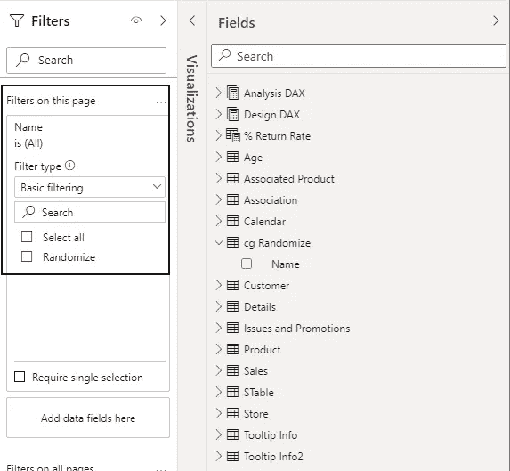

现在你可以把它拉进一个**过滤器**

(页面/报告/切片器/任何过滤器工作)

# 没有过滤器

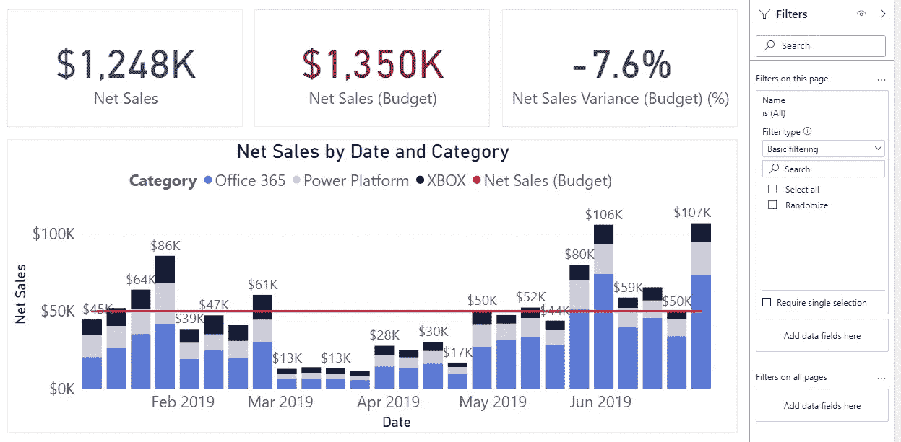

# 带过滤器

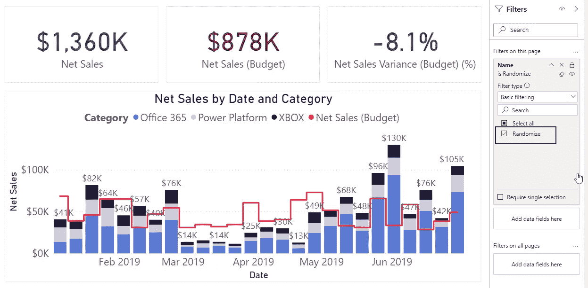

如你所见，所有的数字都变了！但是我们有一个问题，预算已经完全失控，记住这是因为每一个措施都被通过和计算

*(在使用具有平均值和计算百分比的计算组时，需要记住这一点)*

因此，我们返回到**表格编辑器**，我们将创建一个新的计算项目

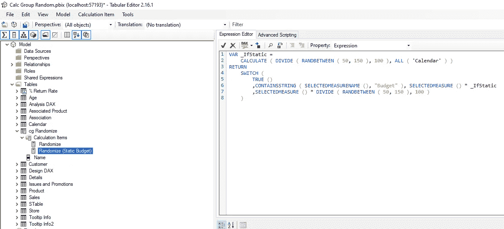

```
VAR _IfStatic =
  CALCULATE ( DIVIDE ( RANDBETWEEN ( 50, 150 ), 100 ), ALL ( 'Calendar' ) )
RETURN
  SWITCH (
    TRUE()
    ,CONTAINSSTRING ( SELECTEDMEASURENAME (), "Budget" )
    ,SELECTEDMEASURE () * _IfStatic
    ,SELECTEDMEASURE () * DIVIDE ( RANDBETWEEN ( 50, 150 ), 100 )
  )
```

*   我们创建了一个变量 _IfStatic，我们只想对所有计算进行一次求值(在本例中，我们是跨日期计算)
*   我们打开一个开关()—这允许我们评估所有类型的标准，并给我们很多机会应用自定义格式或计算
*   在本例中，我们只是使用 CONTAINSSTRING()和 SELECTEDMEASURENAME()在度量名称本身中搜索单词“Budget”
*   如果 SELECTEDMEASURENAME()不包含“预算”,请评估每个步骤

因此，当我们返回报告并刷新时，您可以看到预算现在表现良好

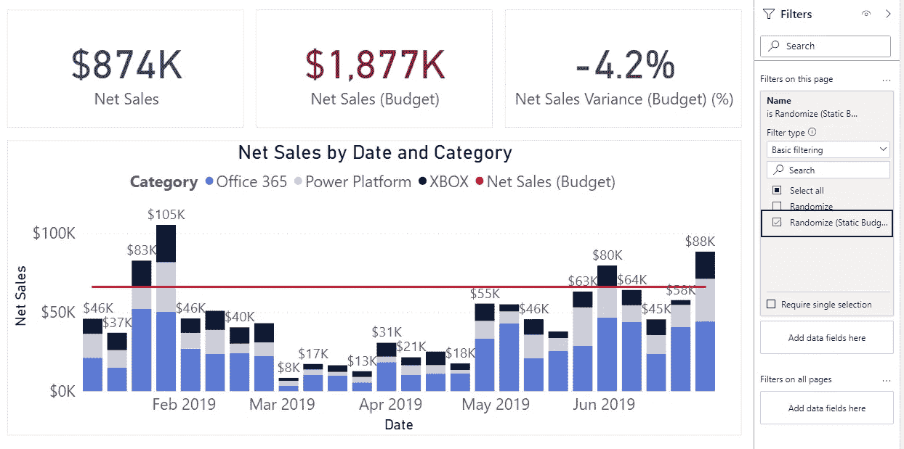

*请注意！此技术仅适用于模糊演示或屏幕截图的数据，如果您发送 PBIX，数据在后端根本没有更改，如果您在左侧功能区显示“数据”选项卡，所有数据都将是实际数据！*

我希望你对我的技巧感兴趣:)

如有任何问题，请联系我们！

如果你想进一步了解计算组是如何工作的，我推荐你阅读这些文章

[https://www.sqlbi.com/calculation-groups/](https://www.sqlbi.com/calculation-groups/)