# 蟒蛇熊猫的力量

> 原文：<https://medium.com/analytics-vidhya/power-of-python-pandas-3f3601590095?source=collection_archive---------5----------------------->

**美国商店销售数据的高级分析**


# **数据集**

本项目使用的数据可从[此处](https://raw.githubusercontent.com/rohanraj-9654/Store-Sales-Analysis-with-Pandas/main/train.csv)获取。该数据集包含一家全球超市 4 年的零售数据。

数据中使用的不同属性很容易从它们各自的列标题中理解。

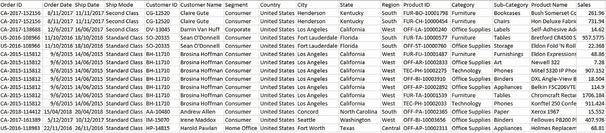

在开始分析之前，必须对数据进行一些清理，以删除空条目并将属性转换为正确的数据类型。

数据清理

输出:

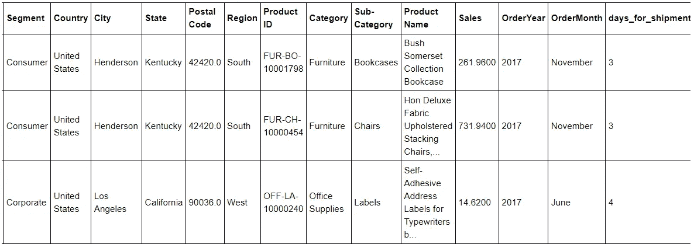

# 我们开始分析吧！！

***1。销售额最高的前 5 个州***
***2。每个类别销售额排名前三的子类别***

```
##Top 5 States
data.groupby('State').agg({'Sales' : sum}).sort_values(['Sales'], ascending = **False**).head(5)##Top 3 Sub-Categories
cat_sub = data.groupby(['Category', 'Sub-Category']).agg({'Sales':sum})
cat_sub.sort_values(['Sales'], ascending = **False**).groupby('Category').head(3).sort_index()
```

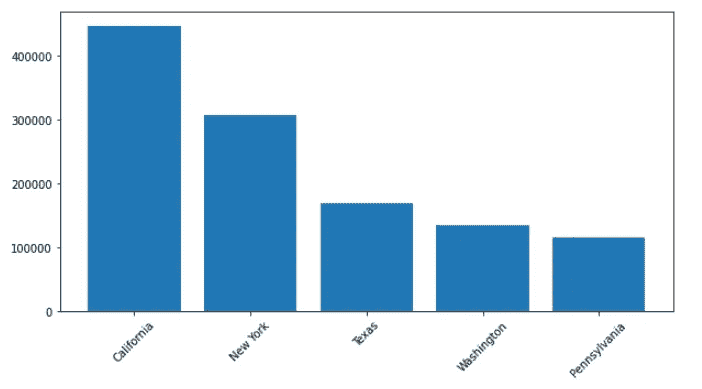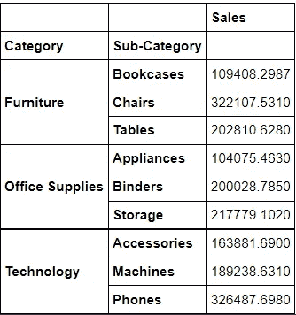

每个类别的前 3 个子类别

这些是为超市创造最大收入的每个产品类别的**前 3 个**子类别。

***3。“当天”交付次数最多的月份和城市***

输出:此处，(538–514)= 24 次当天交货在订购日期后 1 天发货。因此，为了计算每月的当天交货，我们将使用 0 天(最小)发货的数据，这是真正的当天交货。

同一天交货的最高数量发生在九月的 T21 和纽约。

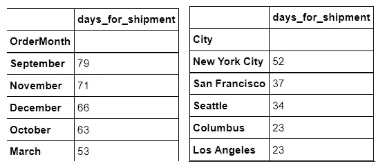

***4。哪些产品最常一起出售？***

这里的想法是将同一订单 ID 上的所有产品分组，形成一个集群。然后计算这些产品集群被一起订购的实例数量，以获得最受欢迎的产品。

要了解整个数据集中这些唯一对的计数，来自堆栈溢出的这个[链接](https://stackoverflow.com/questions/52195887/counting-unique-pairs-of-numbers-into-a-python-dictionary)非常有帮助。

输出:这对于**营销产品**非常有用，产品可以分成两组出售，因为它们在观众中最受欢迎。

```
[(('Newell 344',
   'Memorex Micro Travel Drive 16 GB',
   'Wirebound Four 2-3/4 x 5 Forms per Page 400 Sets per Book',
   'Elite 5" Scissors',
   'Staple-based wall hangings'),
  2),
 (('Newell 344',
   'Memorex Micro Travel Drive 16 GB',
   'Wirebound Four 2-3/4 x 5 Forms per Page 400 Sets per Book',
   'Elite 5" Scissors',
   'Eldon Image Series Desk Accessories Burgundy'),
  2),
 (('Newell 344',
   'Memorex Micro Travel Drive 16 GB',
   'Wirebound Four 2-3/4 x 5 Forms per Page 400 Sets per Book',
   'Elite 5" Scissors',
   'DAX Two-Tone Silver Metal Document Frame'),
  2)]
```

***5。成员产品对每个订单总销售额的贡献百分比***

在这里，我们可以尝试按订单 ID 分组，然后执行一个转换求和。这类似于在 SQL 中使用窗口函数并执行聚合求和。

```
data['Total Order Sales'] = data.groupby(['Order ID'])['Sales'].transform(sum)#Calculating percent of contribution for each member product
dataset = data[['Order ID', 'Product Name', 'Sales', 'Total Order Sales']]
dataset['Percent of Total'] = (dataset['Sales']/dataset['Total Order Sales'])*100
```

输出:这对于确定订单中的任何产品在该订单的总销售额中所占的比例最大非常有用。

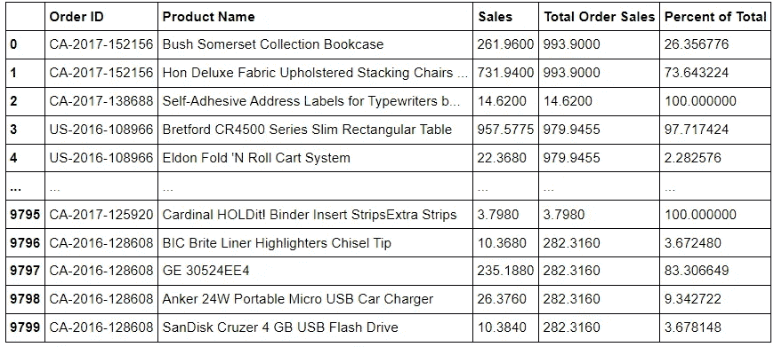

成员产品的百分比贡献

**6*。及时 vs 延迟订单分析***

将发货时间超过 5 天的订单视为“延迟”订单，其余订单视为“及时”订单。

```
data['is_delayed'] = np.where(data['days_for_shipment'] >= 5, 'True', 'False')plt.figure(figsize=(10,5))
data['is_delayed'].value_counts().plot(kind = 'bar',title = 'Timely vs Delayed',rot = 0)
```

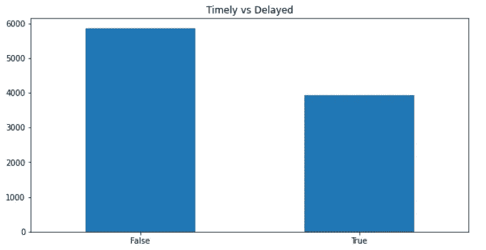

创建**数据透视表**以分析订单数量的数据

输出:显示**按区域&按模式延迟交付的订单**的比例

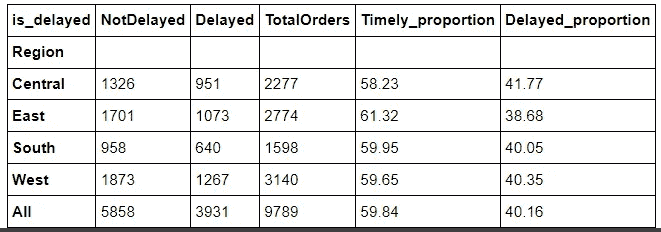

区域性分布

最大百分比的“延迟”订单来自'**中部**地区，而最小百分比的延迟订单来自'**东部**地区

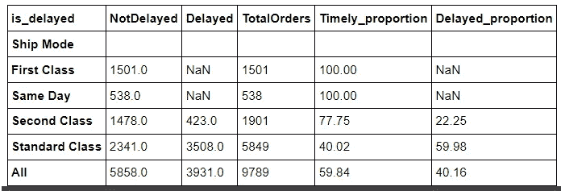

运输模式配送

对于'**第一类**'和'**当天**'运输方式的交付，没有一个订单被延迟。这可能是这些类型的运输方式的成本通常比其他方式更高的原因之一，因为为了获得更快的服务，人们往往同意支付更多的费用。

***7。客户层面分析***

首先，这里的意图是只获取每个客户的第一次购买和最后一次购买。

```
first_purchase = data.sort_values(by='Order Date').groupby('Customer ID').first()
last_purchase = data.sort_values(by='Order Date').groupby('Customer ID').last()##Merge the tables and fetch only important attributes:
customer = pd.merge(first_purchase, last_purchase, on='Customer ID')[['State_x','Order Date_x','Order Date_y']]
customer.rename({'State_x':'State', 'Order Date_x':'First_Purchase', 'Order Date_y':'Last_Purchase'}, axis=1, inplace=**True**)
```

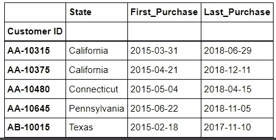

创建新的属性，如**保留天数** (b/w 第一次和最后一次购买)、**订单计数**、**订单频率**(以天为单位)和**平均收入**，这对于确定企业的**重要客户**非常有用。

输出:如果店主想用打折券奖励其 **3 个最忠实的顾客**，他可以通过这个方法找到他们。

根据给定的数据，这些是商店最忠诚的 **3 名顾客**，他们在过去的**3 年里(保持)**一直在商店购买，每月的“平均订单频率”约为**一次，并且**为商店创造了可观的单笔收入**。**

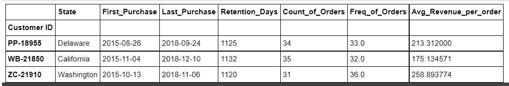

忠诚的顾客

输出:

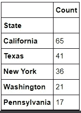

忠诚客户的州级分布

如果店主想在某些州将**的**超级连锁店**进一步扩展**，他如何找到那些重要的州？

考虑到忠诚顾客在商店至少停留 1 年(365 天)，购物频率为每 3 个月(90 天)，并且每份订单为商店带来至少 100 美元的收入，店主可以决定在这 5 个州扩大其商店的连锁店，其中“加利福尼亚”是最安全的赌注。

**注**:上述分析中用于确定客户忠诚度的参数纯粹基于一些直觉。这些可以根据店主如何评定他们的顾客为“忠诚”而改变。

这些只是整个项目的一部分。

要详细了解项目的输出和可视化，请查看 GitHub 库 [**。**](https://github.com/rohanraj-9654/Store-Sales-Analysis-with-Pandas/blob/main/Sales_EDA.ipynb)

如果你对这篇文章有反馈、建议或问题，欢迎在 GitHub 上发表评论或补充，或者通过 [**LinkedIn**](https://www.linkedin.com/in/rohan-raj-204848100/) 联系我。