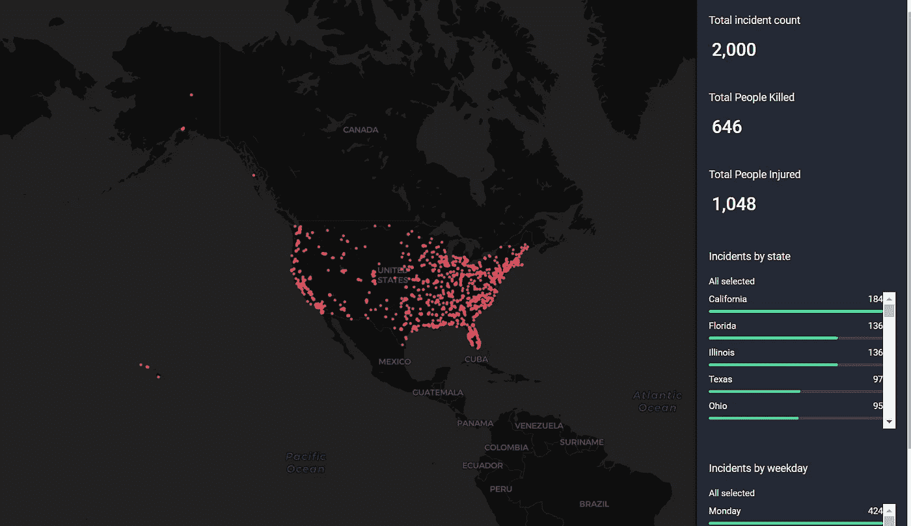
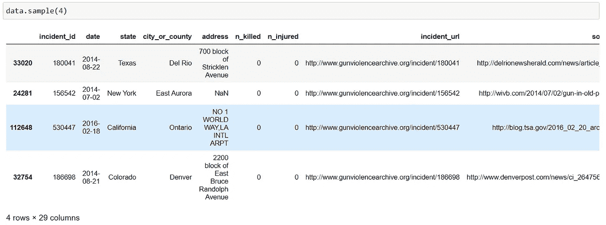

# 使用 CARTOframes 增强空间数据科学工作流程。

> 原文：<https://medium.com/analytics-vidhya/power-up-your-spatial-data-science-workflow-with-cartoframes-8fd1022127a9?source=collection_archive---------5----------------------->



在本教程中，我们将分析如何通过 python 使用 CARTOframes 来构建仪表盘，并与您的观众分享您的见解。

## 关于 CARTO 平台的一些信息，

[](https://docs.carto.com/get-started/#carto-in-a-nutshell) [## CARTO 入门

### Builder 是我们的拖放工具，用于设计、构建和发布包含您的位置数据的交互式 web 地图。地图可以是…

docs.carto.com](https://docs.carto.com/get-started/#carto-in-a-nutshell) 

**CARTO** 是**位置情报**领域的领导者之一。有利于解决包括
1 在内的许多行业的位置智能问题。电信
2。运输
3。物流，等等。

CARTO 平台的主要组件很少。

*   仪表盘
*   建设者
*   平台 API 和库
*   数据观测站
*   相框

在本文中，我们将通过构建一个交互式仪表板来探索 CARTOframes 的基本功能。为此，我们将使用来自 Kaggle 的[枪支暴力数据](https://www.kaggle.com/jameslko/gun-violence-data)。

## 帐户创建、安装和基本身份验证设置

1.  **账户创建**

**注意**:如果您将使用 CARTOframes 来可视化您的本地数据，这一步是可选的，但是如果您想与观众分享或需要使用一些高级功能，您肯定需要一个购物车帐户来进一步处理。

如果您是学生或教育工作者，您可以使用您的学术电子邮件获得一个使用 [Github Education Pack](https://education.github.com/pack) 的学生帐户。

创建帐户后，您可以从 CARTO 仪表板访问您的 API 密钥。现在，您已经准备好为本地应用程序设置身份验证了。您所需要做的就是获取您的 API 密钥和用户名，并将其保存为以下格式的 JSON 文件。将其命名为`creds.jon`并保存在当前工作目录中。


creds.json

2.**安装**

CARTOframes 要求系统中已经有 Shapely 和 Fiona 库。因此，使用以下命令来正确安装它，

```
pip install shapely
conda install -c conda-forge fiona
pip install cartoframes
```

3.**设置认证**

现在，您已经在机器中安装了 CARTOframes 并保存了您的凭据。然后，您可以使用下面几行代码设置身份验证。

```
from cartoframes.auth import set_default_credentials
set_default_credentials(‘creds.json’)
```

好吧！现在我们可以进入下一阶段了。

## **导入数据和预处理**

您可以使用[ka ggle 站点](https://www.kaggle.com/jameslko/gun-violence-data)查看数据描述。它包含 2013 年至 2018 年的 239，677 起事件。

数据集的示例。



样品

之后，我们只选择 2018 年发生的事件和少数几个栏目。

现在我们有了下面的数据帧，


现在，根据我们的用例，我们需要明确的参与者性别栏。我们将分别获得参与者的男性人数和女性人数。


清理的数据

## 形象化

要使用 CARTOframes 可视化和空间化数据框，源数据框几何的 CRS 必须是 [WGS 84](https://geopandas.org/docs/user_guide/projections.html#setting-a-projection) (EPSG:4326)。

最简单的方法是转换我们的熊猫。数据框到 geopandas.GeoDataFrame


现在我们可以可视化我们的数据。


CARTOframes 的另一个有用的组件是小部件、样式和弹出窗口。我们可以根据我们的用例选择合适的小部件。在这个可视化中，我们将使用，

1.  **点击并悬停弹出窗口**-显示一个由悬停事件触发的弹出窗口
2.  **直方图小部件**——创建一个小部件来表示直方图中的分类、数字和日期值
3.  **类别小部件**——创建一个小部件来表示类别值
4.  **公式小工具**-以数字形式显示计数、平均值、最大值、最小值或总和运算的结果
5.  **动画风格**-能够通过动画控件播放、暂停和更改动画可视化

让我们看看如何使用 python 实现它，

在此之前，我们需要创建一个名为`weekday`的新列

```
incidents_2018_gdf['weekday'] = (incidents_2018_gdf['date']
                                  .dt.day_name())
```


接下来，我们将为`date` 列创建另一个包含动画样式的层，

现在，我们的主仪表板可以使用了，此外，您可以使用以下方式发布它。*在此之前，您必须设置默认凭证。*

```
map_viz.publish('viz_name',password='letmein',if_exists='replace')
```


另外，不要忘记访问[文档](https://carto.com/developers/cartoframes/examples/#example-data-visualization)，以防遇到困难😉

谢谢！