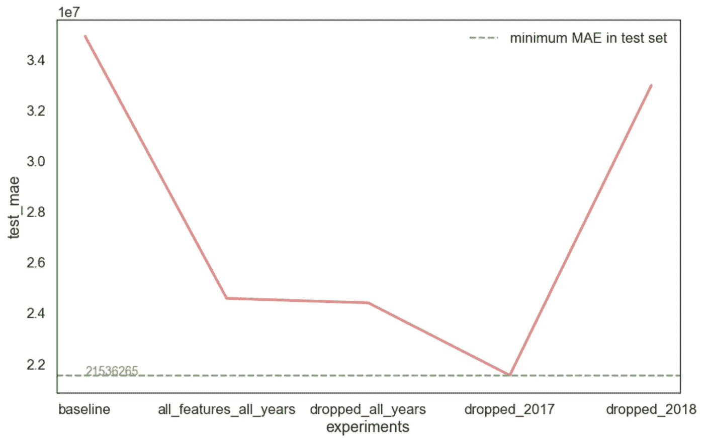

# 数据科学中的实际问题第 2 部分:分布转移(第 1 部分)

> 原文：<https://medium.com/analytics-vidhya/practical-issues-in-data-science-part-2-distribution-shift-part-1-416754c01905?source=collection_archive---------3----------------------->

众所周知，机器学习模型的性能在很大程度上依赖于自变量和目标变量之间的潜在关系。因此，如果底层数据分布存在偏移/漂移，它们的性能将会严重下降。这个实际问题通常被称为分配转移。

这篇文章作为这个主题的一个非常简短的介绍，主要集中在协变量转移和先验概率转移。

# **分配班次介绍**

**1.1*。导致数据分布偏移的一些原因有:***

*   客户习惯的改变。
*   技术突破。
*   政治或社会经济政策的变化。
*   样本选择偏差，其中训练数据不包括所有可能的数据分布(例如问卷和统计调查)。
*   当发现数据随着时间的流逝而变化时。例如:对抗性分类问题(如电子邮件过滤或网络入侵检测)。

***1.2。三种类型的分配班次:***

*   **协变量移位:**自变量的移位。
*   **先验概率偏移:**目标变量的偏移。
*   **观念转变:**

自变量和目标变量之间关系的变化。当独立变量和目标变量之间的未知或隐藏关系没有被模型包括或学习时，就会发生这种情况。

示例:客户购买行为随时间的变化可能会受到数据中未明确说明的全球经济的影响。概念转变在时间序列数据中更为常见。

# **协变量移位简介**

**2.1*。*检测道反变**

*   可视化每个独立变量在训练集和测试集之间的分布。
*   用单向 ANOVA 检验进行统计检验。
*   利用机器学习模型进行对抗性验证。

由于前两种方法非常简单，因此下面只解释第三种方法。

*2.1.1。利用机器学习模型进行对抗验证*

一般来说，我们可以构建一个分类器，尝试用每个独立变量来区分训练集和测试集。

**流程的伪代码有:**

步骤 1:创建一个名为“is_train”的新变量，其值在训练集中为 1，在测试 test 中为零。

第二步:将训练集和测试集结合起来，随机洗牌。

步骤 3:将数据分成新的训练测试集。

第四步:对于每个独立变量:

*   训练一个简单的机器学习模型(例如决策树)来预测“is_train”变量。
*   计算 AUC。
*   通过设定 AUC 阈值，判断自变量是否受到协变量偏移的影响。

***2.2。*应对方式反变**

一些方法是:

*   删除不重要的协变量移位自变量。
*   进行密度比估计，以估计训练数据中每个实例的相对重要性(即密度)。

# **先验概率转移简介**

***3.1。检测先验概率转移的方式***

*   可视化因变量在训练集和测试集之间的分布。
*   用 t 检验或单向 ANOVA 检验进行统计检验。

***额外:t 检验和单向方差分析检验的差异***

*相似性:两者都侧重于组间均值和方差的差异。*

*差异:t 检验可用于确定两个群体在统计上的差异；而 ANOVA 可用于确定三个或更多的群体在统计上是不同的。*

**3.2*。应对先验概率转移的方法***

*   收集更多最近的数据，假设最近的数据具有相似的分布。
*   只有相同分布数据的训练模型。

# 进行的实验简介

图 1 显示了为了测试去除协变量和先验概率变化的效果而进行的各种实验。这里的实验范围是用这个[数据集](https://www.kaggle.com/nishiodens/japan-real-estate-transaction-prices)估计日本房地产价格(一个回归问题)。

每个实验设置定义如下:

*   基线:取测试数据的平均值，并假定为预测值。
*   all_features_all_years:包括所有训练数据。
*   dropped_all_years:删除移位的自变量(即处理协变量移位)并用所有年份的数据进行训练。
*   dropped_2017:去除移位的自变量，只使用 2017 年的数据进行训练，因为它与测试数据具有相同的分布(即处理协变量和先验概率移位)。
*   dropped_2018:去掉移位的自变量，只用 2018 年的数据训练。这是要和 dropped_2017 对比的。

图 1: dropped_2017 是仅使用相同的分布来训练的模型，以测试数据以及移除偏移特征之后的特征。dropped_2017 最小 MAE。

正如我们从图 1 中看到的，解决协变量和先验概率转移的 MAE 最小。换句话说，重要的是部署的系统或程序能够检测到分布变化的存在，并采取行动进行反映。

关于完整的实现，请查看下面的 Github 链接获取源代码。

# 源代码示例:

[https://github.com/JaniceKhor/distribution-shifts.git](https://github.com/JaniceKhor/distribution-shifts.git)

***参考文献***

1.  [https://gsarantitis . WordPress . com/2020/04/16/data-shift-in-machine-learning-what-it-and-how-to-detect-it/](https://gsarantitis.wordpress.com/2020/04/16/data-shift-in-machine-learning-what-is-it-and-how-to-detect-it/)
2.  [https://www . section . io/engineering-education/correcting-data-shift/](https://www.section.io/engineering-education/correcting-data-shift/)
3.  [https://www . analyticsvidhya . com/blog/2017/07/co variate-shift-the-hidden-problem-of-real-world-data-science/](https://www.analyticsvidhya.com/blog/2017/07/covariate-shift-the-hidden-problem-of-real-world-data-science/)
4.  [https://medium . com/capital-one-tech/domain-adaptation-5955 EDF 0277 b](/capital-one-tech/domain-adaptation-5955edf0277b)