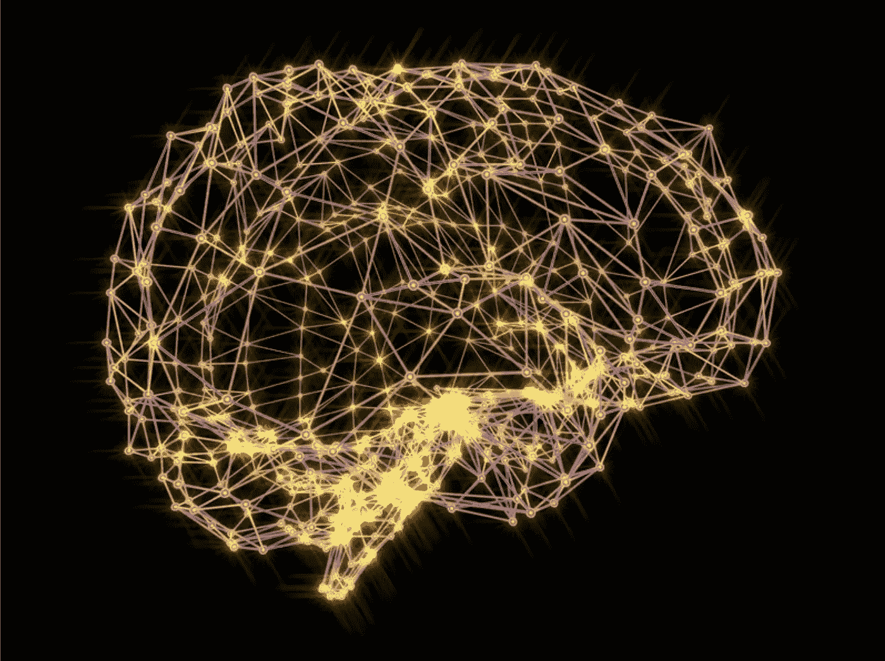
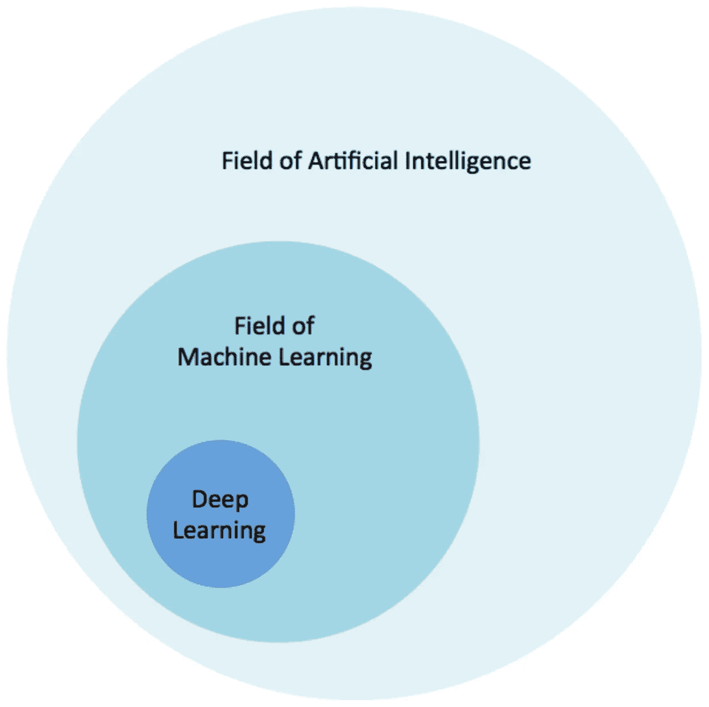
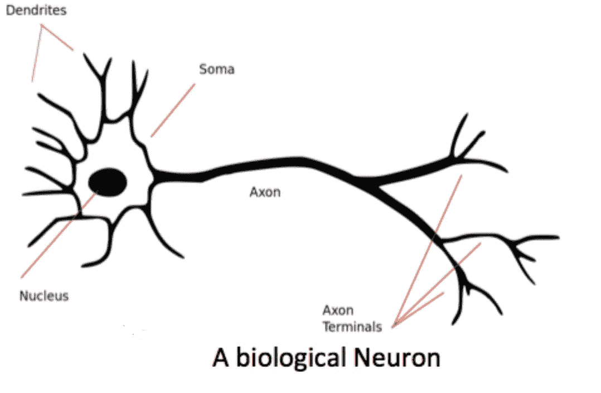
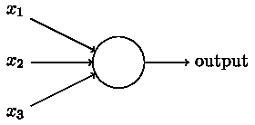
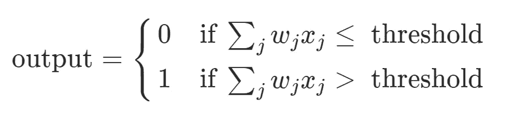
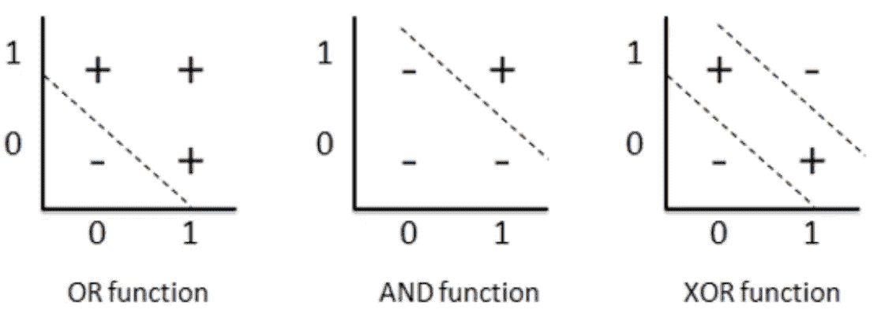
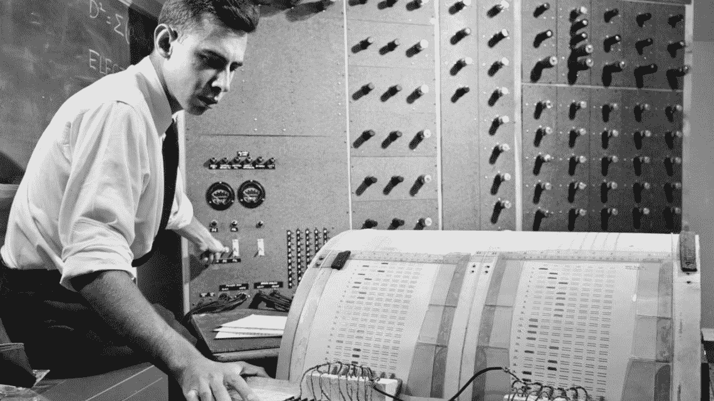

# 感知器——现代人工智能的基石

> 原文：<https://medium.com/analytics-vidhya/preceptron-the-foundation-stone-of-the-modern-ai-853e2ef7f8b5?source=collection_archive---------8----------------------->

关于机器学习、深度学习、人工智能和其他东西的大热门是什么？

为了理解这一点，我们稍微转移一下话题。

我们确实知道大多数人类的发明、发现或创新都是受大自然的启发，例如，飞行，发明家分析了鸟类的飞行，并希望像它们一样在高空飞翔。通过研究鲸鱼，科学家们想出了一个发明潜水艇的主意。声纳系统的发明受到蝙蝠和海豚的启发，它们利用回声定位来导航。

图一。人工智能、人工智能和深度学习的关系

同样，深度学习也是受人脑的启发。正如人类大脑如何通过试错来学习，即通过学习、体验、犯错或被教导来获得知识一样，深度学习处理算法，这些算法在没有显式编程的情况下帮助机器获得智能。

# 生物神经元

在深入感知机之前，让我们先了解一下生物神经元。

图二。生物神经元

*   **树突**负责从它所连接的其他神经元接收信息。树突通过一个称为**突触**的间隙与其他神经元连接，该突触为特定的输入分配权重。
*   **胞体**是神经元的细胞体，负责处理接收到的信息。
*   **轴突**就像一根电缆，神经元通过它将输出发送到**轴突末端**。这些轴突末梢通过突触与其他神经元的树突相连。

综上所述，神经元通过树突接受一些二进制输入，但并非所有输入都被同等对待，因为它们是加权的。如果这些输入的组合超过某个阈值，那么就会产生一个输出信号，即神经元“触发”但是，如果组合低于阈值，则神经元不会产生任何输出，即神经元“不会触发”。当神经元触发时，这种单一输出沿着轴突传播到其他神经元。

> 事实:人类大脑中的全部连接
> 
> 研究人员估计，人脑中的神经元之间有超过 500 万亿个连接。即使今天最大的人工神经网络也无法接近这个数字。

# 人工神经元——感知机

感知机是由科学家弗兰克·罗森布拉特在 20 世纪 50 年代和 60 年代开发的。感知器背后的动机是人类大脑中的生物神经元。

图 3。简单的感知器。

那么感知机是如何工作的呢？

感知器接受几个二进制输入，x1，x2，…并产生一个二进制输出，如图所示。然后罗森布拉特提出了一个计算产量的简单规则。他引入了*权重*，w1，w2，…实数，表示各个输入对输出的重要性。神经元的输出(0 或 1)取决于加权和是小于还是大于某个阈值。就像权重一样，阈值是一个实数，它是神经元的一个参数。用更精确的代数术语来说:

图 4。简单感知器的基本数学模型。

那么为什么我们真的需要重量呢？让我们举个例子，假设你正在决定是否申请一所大学。你会考虑哪些因素来做决定？

1.  这门课有吗？
2.  学费成本？
3.  有校内住宿吗？
4.  生活成本？如此等等。

所以在这些因素中，第一个因素是最重要的，如果你的课程不是学校提供的，你不会考虑申请，校内住宿因素也不是最重要的因素，因为你总是可以找到替代方案。比起食物和住宿，你会更重视课程的可用性。因此，任何决策过程都涉及权衡做出决策所需的投入。因此，我们可以说感知器是一种通过权衡输入做出决策的装置。通过改变权重和阈值，我们可以得到不同的决策模型。

显然，感知机并不是人类决策的完整模型！但是这个例子说明了感知器如何权衡不同种类的输入来做出决定。

感知器是一种迭代算法，它努力为数据样本的向量“w”确定最佳值集。当它达到最佳值时，它会通过简单地将数据样本的数值矩阵“x”乘以它刚刚获得的向量权重来决定该样本属于哪个类别，如果预测是错误的，它会调整自己，以便下次做出更明智的预测。经过数千次迭代，它变得更加精确。

感知器的缺点是，当数据是非线性可分的，即，如果您不能通过任何线或平面将数据划分为分布在两个或多个维度上的类别，感知器算法无法找到解决方案，它往往会不断更新其“w”无限次。然而，科学家们随后发现，即使单个感知机不能很好地处理线性不可分的类，两个神经元放在一起也能做到这一点。这是用简单的 XOR 运算尝试的。

图 5。使用两个神经元学习逻辑异或

使用 2 个不同的神经元学习“或”和“与”逻辑功能，然后组合用于“异或”功能。

核心神经网络组件是神经元(也称为单元)。许多排列成互连结构的神经元构成了神经网络，每个神经元都与其他神经元的输入和输出相连。因此，根据神经元在神经网络中的位置，神经元可以输入来自其他神经元的示例或结果的特征。

感知器为我们今天拥有的深度神经网络奠定了基础。当心理学家罗森布拉特构思感知机的概念时，他认为它是大脑神经元的简化数学版本。他说，“感知机是第一台能够产生原创想法的机器”。

> ”他想问问自己，大脑要完成它所做的令人惊奇的事情，在物理上最少需要多少东西。他揭开了面纱，使我们能够检查所有这些可能性，并看到这样的想法是人类可以理解的。”
> 
> —理查德·奥布里恩，康乃尔大学生物科学部前主任

图 6。弗兰克·罗森布拉特，50 岁，56 岁，博士，从事“感知机”的研究，他称之为第一台“能够有原创想法”的机器。

## *参考文献:*

1.  使用 Scikit-Learn、Keras 和 TensorFlow 进行机器学习
2.  《假人的深度学习》作者:约翰·保罗·穆勒，卢卡·马萨隆
3.  深度学习:一种实践者的方法
4.  科内尔编年史— [*教授们—感知器—铺路—ai—60 岁—太早了*](https://news.cornell.edu/stories/2019/09/professors-perceptron-paved-way-ai-60-years-too-soon)
5.  pythonmachinelearning.pro
6.  neuralnetworksanddeeplearning.com