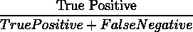
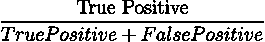
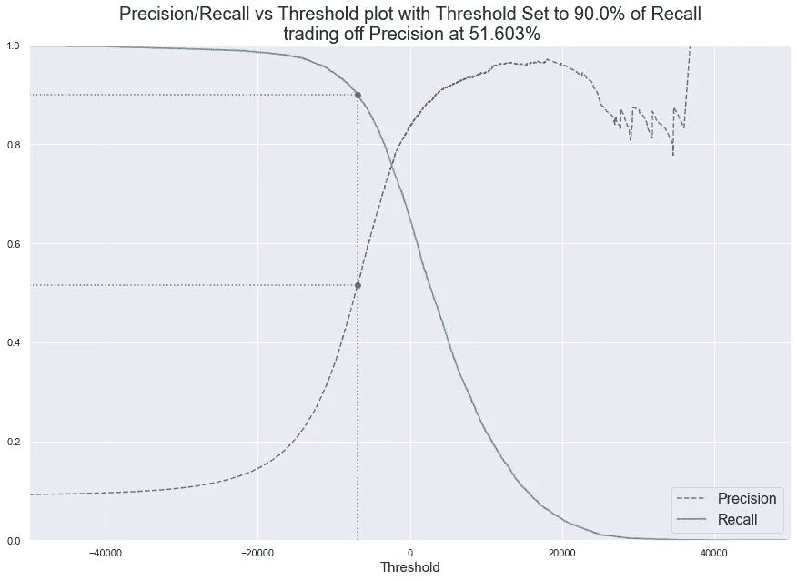
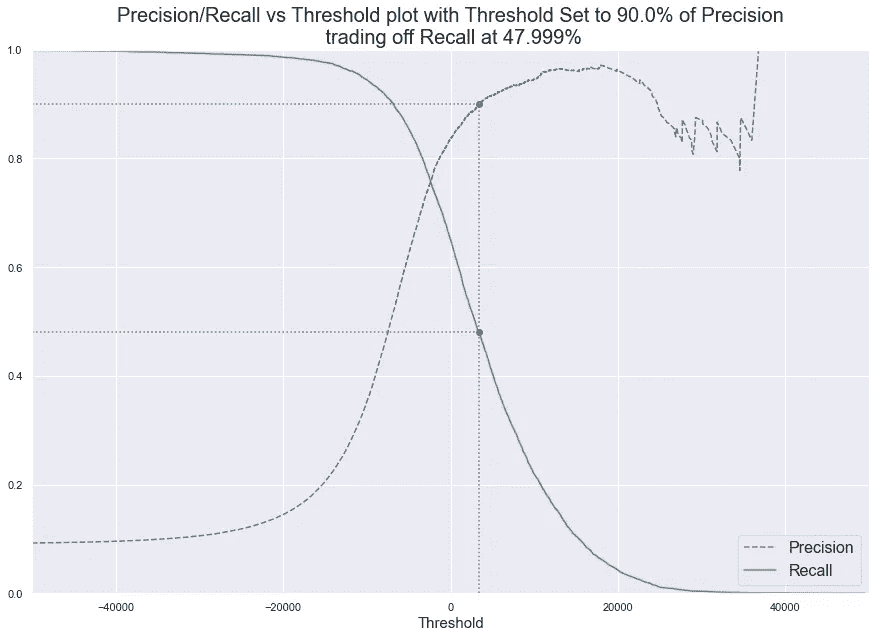
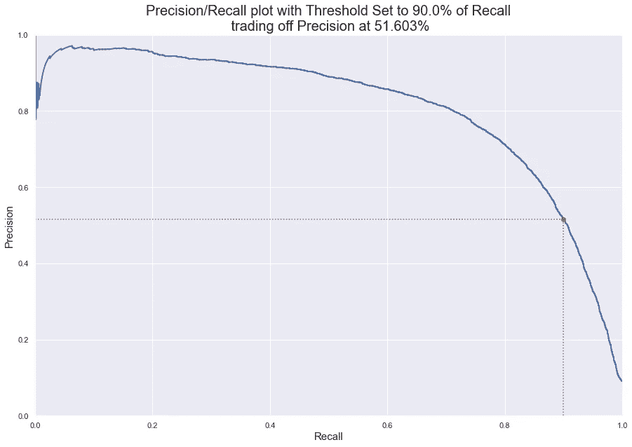
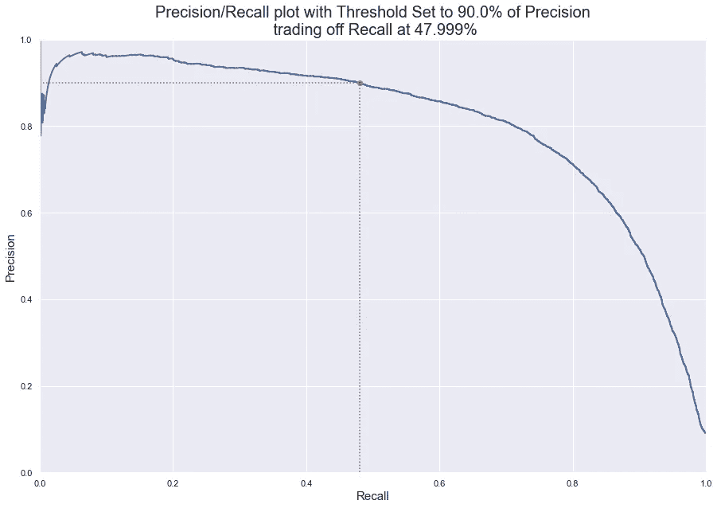

# 精准还是召回？

> 原文：<https://medium.com/analytics-vidhya/precision-or-recall-d06bbf7561b5?source=collection_archive---------13----------------------->

## 用简单的话描述一种为你的模型选择评价指标的实用方法。

照片由[布伦丹·丘奇](https://unsplash.com/@bdchu614?utm_source=unsplash&utm_medium=referral&utm_content=creditCopyText)在 [Unsplash](/s/photos/confusion?utm_source=unsplash&utm_medium=referral&utm_content=creditCopyText) 上拍摄

让我给你几个简单的问题。回答他们。

# 检测假阴性的后果是否非常严重？

如果答案是肯定的，选择**召回**。

如果没有再次询问，

# 检测到假阳性的后果是否非常严重？

如果这个答案的问题是肯定的，请选择**精度。**

好了，让我们通过举例来深入探讨一下。

## 预测病人是否有肿瘤。

在这个例子中，

*   检测假阴性据说发生在病人有肿瘤但模型没有检测到它的时候。这个案子的后果非常严重。因为我们没有发现肿瘤，医生不会进行必要的治疗。致命的。
*   但是假阳性并不是我们真正关心的。为什么？比方说，这个模型检测到了一个实际上并不存在的肿瘤。患者仍然是安全的，因为其他诊断可能揭示预测是不正确的，并且不需要更多的治疗。没问题。

这就是为什么去召回。

> **回忆/真阳性率/灵敏度/检测概率**
> 
> 分类器在所有阳性实例中正确识别为阳性的比例是多少。

## 给一份工作的优秀候选人分类

在这个例子中，

*   当模型将一个不太好的候选人归类为绝对适合该职位时，就会出现误报。这对招聘者有很大的影响，因为它增加了完成招聘过程的时间。
*   对于该职位来说足够优秀但被归类为不具备能力(即假阴性)的候选人可能无法参加面试。但是如果从招聘者的角度来看，这样会节省时间。

在这里，我们要精确。

> **精度**
> 
> 正面预测有多少是正确的。

在最后一个例子中，你可能会认为丢弃非常好的 cadidates 是不正确的。是的，你是对的。但是从招聘者的角度来看，时间对他/她来说是宝贵的，不值得去面试一个糟糕的候选人。

这就是我们到达**精度/召回权衡**的地方。通常，当最终结果要由最终用户或面向客户的应用程序使用时，我们更喜欢使用 precision(因为他们记得失败)。

# 精确度/召回率的权衡

如前所述，我们实际上需要高精度和高召回率。我们不想浪费时间去面试一个没有能力的候选人，但同时又放弃一个完全可以接受或者可能是完美的候选人。

不幸的是你不能两者兼得；提高精度会降低召回率，反之亦然。这就是所谓的精度/召回权衡。

根据阈值绘制查全率和查准率可以让您选择一个好的精度/查全率折衷阈值。

绘制精度/召回率与 90%召回率下的阈值图。

绘制精度/召回率与阈值图，精度为 90%。

如果你想知道我是如何绘制的，下面是代码:

现在你可以就这个门槛来给出你的预测，就像这样:

另一种选择良好精度/召回折衷的方法是直接针对召回绘制精度图。

绘图精度与召回率为 90%的召回图。

绘图精度与 90%精度的召回图。

同样，你可以像这样生成这个图表，

在我们获得阈值(从函数返回)后，预测就像上面代码块中显示的一样进行。

# 我是谁？

我是阿努拉格·达泽·✌.终身学习者，对机器学习充满热情。每天都在成长。

如果你喜欢这个帖子，请点击“鼓掌”按钮！关注我分享**我的旅程**，你也可以在**[**Twitter**](https://twitter.com/anuragdhadse)**|**[**LinkedIn**|](https://www.linkedin.com/in/anuragdhadse/)|[|**Github**](https://github.com/adhadse)**上联系我。****