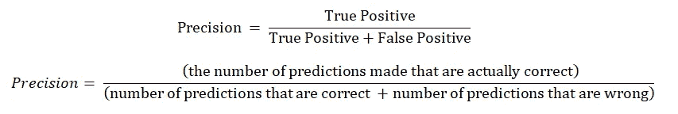
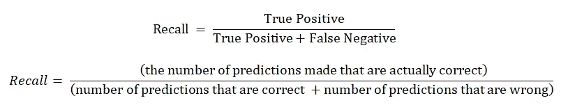
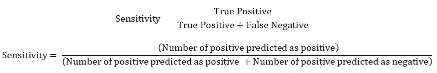
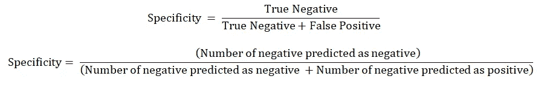

# 精确度、召回率、灵敏度、特异性——非常简单的解释

> 原文：<https://medium.com/analytics-vidhya/precision-recall-sensitivity-specificity-very-brief-explanation-747d698264ca?source=collection_archive---------2----------------------->

正如你在谷歌上看到的，关于这篇文章标题的四个字有很多解释。这些词很容易混淆在一起，阅读一篇长文章试图理解哪个是哪个实际上是令人厌倦的。对于那些难以理解精确性、回忆性、敏感性和特异性的人，我向你们展示我的作品。请读完这篇文章，以了解我是如何轻松地记住每个术语之间的区别的。

> 举例来说，假设我想预测“成功”和“失败”这两个类别

## 精确

因此，基本上，精确度是我们衡量我们的模型在所有预测中正确预测了多少预测的一种方法。

> 精度=所有预测中有多少正确的预测？

这就是为什么当我们想要测量一个类的精度时，我们要这样做

## 回忆

另一方面，回忆是我们测量在所有记录中我们正确预测了多少记录(或数据点，或行)的一种方法。

> 回忆=有多少实际记录被正确预测？

这就是为什么当我们想要测量一个类的召回时，我们这样做

> 你可能会说，“那假阴性和假阳性有什么区别呢？”

好吧，在你吼我之前，听我说完…
实际上，精确度和召回率只是在假阳性和假阴性上有所不同。这就是我之前提到的 2 类发挥作用的地方，呵呵..

假设我们想要预测“成功”类:
假阳性是实际上并不“成功”的“成功”类的数量。
假阴性是我们未能预测为“成功”的“成功”类的数量。
因此，假阳性和假阴性在某种程度上是“错误预测的数量”。

# 转向敏感性和特异性！

请记住，我们要预测两个类别。有“成功”阶层和“失败”阶层。当我们只有 2 个类别要预测(二元分类)时，灵敏度和特异性实际上是一种衡量模型性能的方法。

## 灵敏度

敏感度是指正确预测的正面记录的数量。

> 敏感度=有多少正面记录被正确预测？

这听起来很熟悉吧？没错。对于我们想要声明为 ***正*** 类的类，灵敏度与召回相同。

## 特征

特异性是指正确预测的负面记录的数量。

> 特异性=有多少负面记录被正确预测？

因此，通过特异性，我们可以测量我们的模型对我们想要声明为 ***负*** 类的类的预测有多好。在某种程度上，这与召回 ***负*** 类是一样的。

# 结论

当我们进行二元分类或多类分类时，精确度和召回率是我们可以用来衡量模型性能的一个指标，而敏感度和特异性是二元分类所独有的(据我所知)。如果这篇文章有任何错误，请务必告诉我。我希望这篇简短的文章能帮助你更好地理解精确度、召回率、灵敏度和特异性。如果是的话，别忘了给这篇文章留个掌声；)