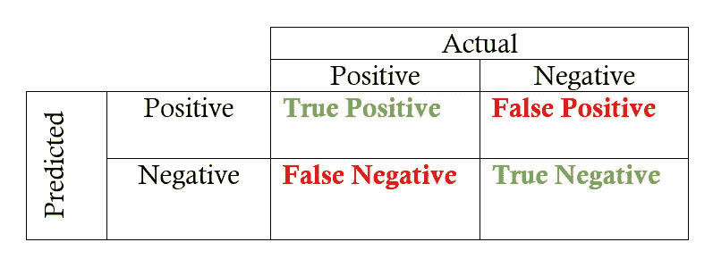
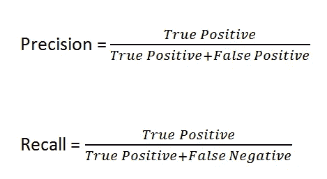

# 真实世界用例中的精度-召回权衡

> 原文：<https://medium.com/analytics-vidhya/precision-recall-tradeoff-for-real-world-use-cases-c6de4fabbcd0?source=collection_archive---------2----------------------->

通过快速了解哪些真实世界的用例需要更高的精确度，哪些需要更高的召回率，以及为什么，赢得您的 ML 面试？

# 为什么你应该读这篇文章？

所有的机器学习面试都希望你理解精确-召回权衡在现实世界用例中的实际应用，而不仅仅是定义和公式。

我试图通过定义一个🔑你可以利用它来赢得下一次 ML 面试，并通过提供清晰的理由给面试官留下深刻印象！

# 定义

💡**精确测量，在所有的*正面预测实例*中，有多少检测是正确的？**

💡**回忆措施在所有*实际正面案例*中，我们能够识别出多少？**

请确保您完全理解上述定义，因为我们所有的进一步讨论都将基于此。记住这两个定义就足以回答任何与精确和回忆相关的 ML 面试问题。是的，你可以，相信我！

你甚至也不需要去记忆那些(非常)令人困惑的公式，如精确度、召回率、真阳性率、假阳性率、特异性、灵敏度等等，这样的例子不胜枚举……
所以，让我们继续把上面的定义转换成数学公式。

重点放在两个定义的斜体部分: ***正预测例*** 和 ***实际正例。*** 这两个量分别构成了你的精度和召回率的分母。

▶️上表中哪些量构成了 ***正面预测的例子？***
查找“预测”标题下的“阳性”行。它包括真阳性(TP)和假阳性(FP)。所以精度的分母是 TP+FP。

▶️上表中哪些量构成了 ***的实际正例？*** 查找“实际”标题下的“正”栏。它包括真阳性(TP)和假阴性(FN)。所以你召回的分母数量是 TP+FN。

现在公式中唯一缺少的部分是分子。分子数量很容易记忆，因为它在两个公式中都是完全相同的*。由于我们主要感兴趣的是从我们的模型中找到正确的肯定预测*的数量，分子将等于真肯定(TP)。**

**因此，结果公式为:**

****

# **🔑秘密钥匙🔑**

**最后，让我们来看看这个秘密的关键，你可以很容易地理解它来区分那些应该优先考虑精度而不是召回的用例，以及那些应该优先考虑召回而不是精度的用例。**

> **当你不能承受任何错误的否定时，你优先考虑回忆。**
> 
> **当您不能承受任何误报时，您会优先考虑精确度。**

**换句话说，**当你不能错过任何检测时，你寻找高回忆**；**当你不能承受任何不正确的检测时，你会寻求高精度。****

**围绕这个概念经常被问到的一个流行的面试问题是:如果 FP 的成本比 FN 高，你更喜欢哪个——精准还是召回？
我希望你现在可以轻松地回答这个问题，甚至向面试官提供一个正当的理由(奖金！).**

# **精确回忆的 4 个场景**

**让我们离开通常用来解释精度召回的表格数据集例子。相反，我将使用一个非常简单而直观的对象检测模型的例子来帮助你理解精确回忆的不同场景。**

1.  ****高召回率但低精确度**暗示已经检测到大多数真实物体，但是大多数检测是不正确的(许多误报)。**
2.  ****高精度但低召回**意味着大多数预测的盒子是正确的，但是大多数地面真实物体没有被检测到(许多假阴性)。**
3.  ****高精度和高召回率**意味着一个理想的检测器，它已经正确地检测了所有地面实况对象。**
4.  ****低精度和低召回率**意味着一个不良的检测器，它不能检测大多数地面真实物体(许多假阴性)，并且大多数检测是不正确的(许多假阳性)。**

# **真实世界的用例(有正当理由)**

**如果你成功了，恭喜你！你现在了解了很多关于精度和召回的实际用法。**

**现实世界的问题通常对每种类型的错误都有不同的解释——假阳性对假阴性。在大多数情况下，一个比另一个更重要。**

**让我们直接进入我们一直在等待的东西——我们优先考虑一个指标的不同用例。**

****1。医学测试(如癌症检测)** : *回忆更重要*
🔖将健康人归类为患有癌症(假阳性)并进行更多医学测试是可以的，但错过识别癌症患者或将癌症患者归类为健康(假阴性)绝对是不可以的，因为此人的生命处于危险之中。**

****2。推荐系统:** *精度更重要*
🔖错过推荐某部特别著名的电影是可以的(回忆率低)，但总体推荐应该不错。如果向客户展示了很多不相关的结果(误报)，对用户来说将是非常糟糕的体验。**

****3。根据天气条件预测好的日子发射卫星:** *精度更重要*
🔖错过预测一个好天气是可以的(低回忆)，但是预测错误的天气(假阳性)来发射卫星可能是灾难性的。**

****4。刑事死刑:** *精准更重要*
🔖遗漏惩罚罪犯是可以的(低回忆)，但是牵连一个无辜的人(假阳性)是不可取的。**

****5。垃圾邮件检测:** *精度更重要*
🔖错过检测/分类垃圾邮件是可以的(低召回)，但没有合法或重要的电子邮件必须进入垃圾邮件文件夹(误报)。**

****6。不安全工作(NSFW)图片检测:** *回忆更重要* 🔖将有效图像归类为 NSFW(假阳性)是可以的，它总是可以通过稍后的手动数据质量检查来纠正。但是，将 NSFW 图像归类为安全图像(假阴性)并在您公司的网站上显示是绝对不行的，因为这将损害公司的声誉。**

**7。为银行贷款寻找好客户 : *精准更重要*
🔖错过识别/分类符合贷款条件的好客户是可以的(低回忆)，但是批准贷款给可能永远不会还款的坏客户(假阳性)是不可取的。**

**8。标记欺诈交易: *召回更重要* 🔖将合法交易归类为欺诈交易是可以的——它总是可以通过额外的检查来重新验证。但是将欺诈交易归类为合法交易(假阴性)是绝对不行的。**

# **摘要**

**我希望通过上面的例子可以清楚地看到，一种类型的错误分类(分类错误)比另一种更糟糕，这取决于用例。**

**如果您已经阅读了这么多，并且发现这篇文章很有用，那么请点击👏。这对我保持动力大有帮助，谢谢！**