# 预测谷歌股票价格的销售量

> 原文：<https://medium.com/analytics-vidhya/predict-the-sales-volume-of-the-google-stock-price-6d44da3ecb02?source=collection_archive---------20----------------------->


数据集:[点击](https://drive.google.com/file/d/1oAQFQu9PSk0DRhEocefULy_qhzb9KHmO/view?usp=sharing)

# 可重现结果的设置

要获得可重复的结果，您必须执行以下步骤，否则您将获得不同的结果:

1)将 PYTHONHASHSEED 环境变量设置为固定值

2)将 python 内置的伪随机生成器设置为固定值

3)将 numpy 伪随机发生器设置为固定值

4)将张量流伪随机生成器设置为固定值

5)配置新的全局张量流会话

```
# Seed value
# Apparently you may use different seed values at each stage
seed_value= 0# 1\. Set the `PYTHONHASHSEED` environment variable at a fixed value
import os
os.environ['PYTHONHASHSEED']=str(seed_value)# 2\. Set the `python` built-in pseudo-random generator at a fixed value
import random
random.seed(seed_value)# 3\. Set the `numpy` pseudo-random generator at a fixed value
import numpy as np
np.random.seed(seed_value)# 4\. Set the `tensorflow` pseudo-random generator at a fixed value
import tensorflow as tf
tf.random.set_seed(seed_value)# for latest versions:
# tf.compat.v1.set_random_seed(seed_value)
# 5\. Configure a new global `tensorflow` sessionfrom keras import backend as K
session_conf = tf.compat.v1.ConfigProto(intra_op_parallelism_threads=1, inter_op_parallelism_threads=1)
sess = tf.compat.v1.Session(graph=tf.compat.v1.get_default_graph(), config=session_conf)K.set_session(sess)
```

通过遵循上述代码，您可以获得可重复的结果

我们必须导入一些库。因为大多数 python 库都有一组有用的函数，可以简单地消除从头编写代码的需要。所以我导入了下面的库

```
import warnings
warnings.filterwarnings('ignore')
import os
import numpy as np
import pandas as pd
import scipy.stats as stats
from matplotlib import pyplot as plt
%matplotlib inlineimport sklearn
from sklearn.model_selection import train_test_split
from sklearn.metrics import accuracy_score
from sklearn import preprocessing
```

安装 Google Drive 并加载数据集

我已经添加了以下代码，用于将 google drive 帐户安装到 google colaboratory，以访问 drive 上可用的文件。当我们执行下面的代码时，我们必须转到生成的 URL，并获得授权代码才能进入这里。

```
from google.colab import drive
drive.mount('/content/drive')
```

输入授权码后。您将收到一条消息，显示“安装在[/内容/驱动器](https://colab.research.google.com/drive/1LPOegMGgG8ubnJmQ9oSG1AmXIYhSzPJd?authuser=1#)”。此后，通过下面的代码，您可以访问您连接的 google drive 上的文件。

```
import pandas as pddf = pd.read_csv('/content/drive/My Drive/Colab Notebooks/data/Google_Stock_Price.csv')
```

通过下面的代码，您可以看到该变量中存储的前 10 个数据行。Pandas libary 提供了一个名为 head()的方法，广泛用于返回数据帧或数据系列的前 n 行。默认情况下，该方法返回存储数据集的前 5 行。

```
df.head(10)
```

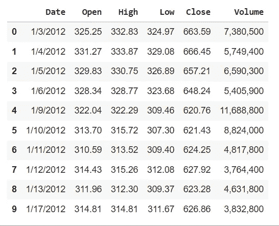

通过下面的代码，我们可以检查数据集上可用的记录数

```
len(df)
```

1258 是上述代码的输出。数据集上有 1258 条可用记录。

# 步骤 01 —数据预处理

数据预处理是一个主要步骤，因为从数据集中提取的有用信息直接影响到模型的质量，所以在将数据输入模型之前，至少对数据进行必要的预处理是非常重要的。

## 步骤 01 A-处理缺失值和异常值

> 步骤 01 A —处理缺失值

通过下面的代码，我们可以检查数据集中缺失的值。

```
df.isnull().any()
```

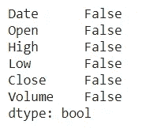

从上面的输出我们可以得出结论，我们在数据集中没有任何丢失的值。所以我们可以进行下一步。

> 步骤 01 B —处理重复值

通过下面的代码，我们可以检查数据集中的重复行。

```
print(df.duplicated().value_counts()) # To check duplicated values
```

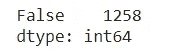

从上面的输出我们可以得出结论，数据集中没有重复的行

> 步骤 01c-处理异常值

a)检查列名“Open”上的异常值

开盘价是交易所当天开市时证券首次交易的价格。开盘价不同于前一天的收盘价。

```
plt.rcParams["figure.figsize"] = (24, 3)
temp_df = pd.DataFrame(df, columns=['Open'])temp_df.boxplot(vert=False)
```

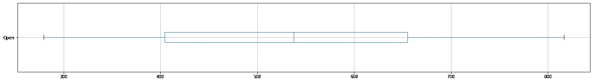

```
from matplotlib import pyplot
plt.rcParams["figure.figsize"] = (24, 8)
plt.plot(df['Open'])
plt.title("Google Stock Open Price Changes")
plt.xlabel("Time")
plt.ylabel("Open Price")
plt.show()
```

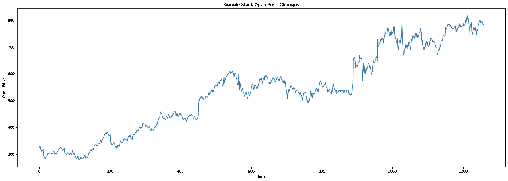

通过查看上面的输出，我们可以说在特性方面没有太大的问题，

b)检查列名“高”上的异常值

高点是一段时间内股票交易的最高价格。

```
plt.rcParams["figure.figsize"] = (24, 3)
temp_df = pd.DataFrame(df, columns=['High'])
temp_df.boxplot(vert=False)
```

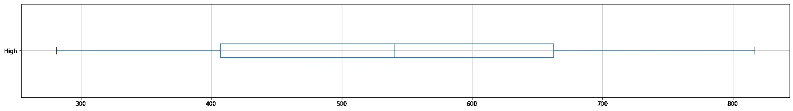

```
plt.rcParams["figure.figsize"] = (24, 8)
plt.plot(df['High'])
plt.title("Google Stock High Price Changes")
plt.xlabel("Time")
plt.ylabel("High Price")
plt.show()
```

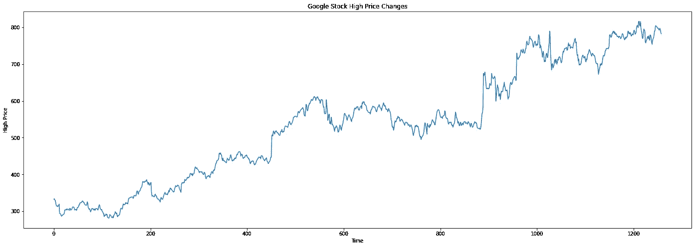

通过查看上面的输出，我们可以说在特性方面没有太大的问题，

c)检查列名“低”上的异常值

低点是这一时期的最低价。

```
plt.rcParams["figure.figsize"] = (24, 3)
temp_df = pd.DataFrame(df, columns=['Low'])
temp_df.boxplot(vert=False)
```

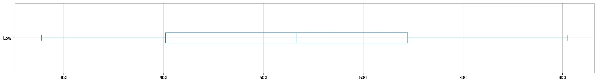

```
plt.rcParams["figure.figsize"] = (24, 8)
plt.plot(df['Low'])
plt.title("Google Stock Low Price Changes")
plt.xlabel("Time")
plt.ylabel("Low Price")
plt.show()
```

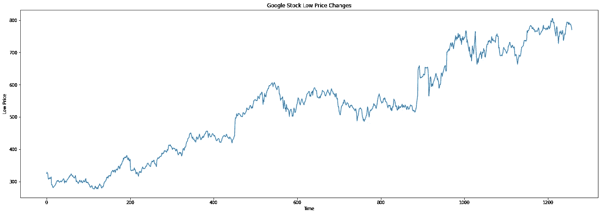

通过查看上面的输出，我们可以说在特性方面没有太大的问题，

d)检查列名“Close”上的异常值

收盘价是一种证券在正常交易日的最后交易价格。证券的收盘价是投资者用来跟踪其长期表现的标准基准。收盘价不会反映现金股利、股票股利或股票分割的影响。

```
df['Close'] = df['Close'].str.replace(',','')
df['Close'] = df['Close'].astype('float')
plt.rcParams["figure.figsize"] = (24, 3)
temp_df = pd.DataFrame(df, columns=['Close'])
temp_df.boxplot(vert=False)
```

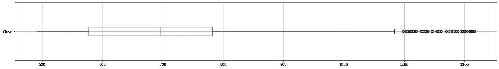

```
plt.rcParams["figure.figsize"] = (24, 8)
plt.title("Google Stock Close Price Changes")
plt.xlabel("Time")
plt.ylabel("Close Price")
plt.plot(df['Close'])
plt.show()
```

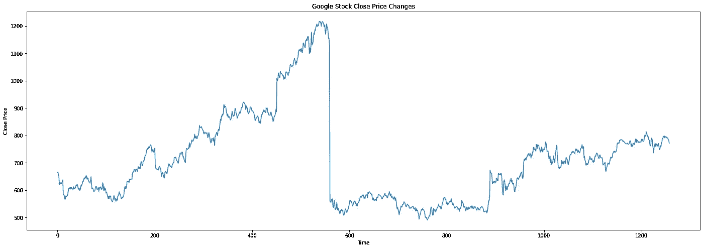

通过查看上面的输出，我们可以说在功能上有相当多的问题，

所以我检查了以下情况:

```
df[ df['High']< df['Close']]
```


我已经放弃了收盘价值，因为这些价值中的大多数都大于高价格价值，所以实际上不可能像那样。

```
df = df.drop(‘Close’, axis = 1)
```

e)检查列名“Volume”上的异常值

```
plt.rcParams["figure.figsize"] = (24, 3)
df['Volume'] = df['Volume'].str.replace(',','')
df['Volume'] = df['Volume'].astype('float')
temp_df = pd.DataFrame(df, columns=['Volume'])
temp_df.boxplot(vert=False)
```

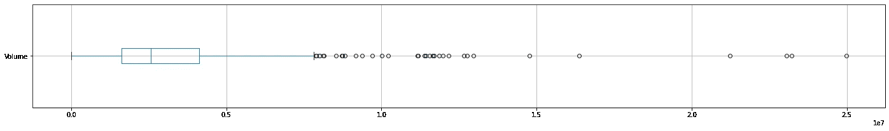

```
plt.rcParams["figure.figsize"] = (24, 8)
plt.title("Google Stock Volume Changes")
plt.xlabel("Time")
plt.ylabel("Volume")
plt.plot(df['Volume'])
plt.show()
```

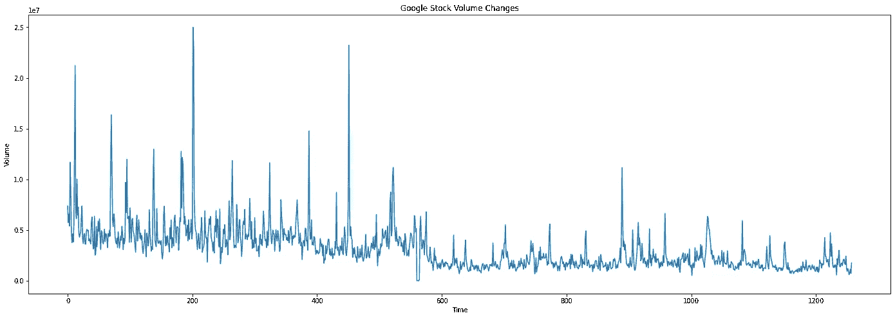

通过查看上面的输出，我们可以说在功能上没有太大的问题

# 步骤 02 —特征编码

人工神经网络模型要求所有的输入和输出值都应该是数值。因此，如果数据集包含分类数据，您必须在拟合和评估模型之前将其编码为数字。有几种方法可以完成这项任务，如一键编码、整数(标签)编码。这里我使用了一键编码

## 什么是周末效应？

周末效应是金融市场中的一种现象，在这种市场中，周一的股票回报率往往显著低于前一个周五的回报率。周末效应也被称为周一效应。

## 什么是月末效应？

“月末效应”一直是许多科学研究的主题。统计数据显示，股票价格，尤其是美国股票价格，往往会在这个月的最后几天和头几天上涨。

## 买股票最好的月份是哪个月？

在岁末年初以及夏季，市场往往会有强劲的回报。九月传统上是一个淡季。尽管 1929 年和 1987 年分别下跌了 19.7%和 21.5%，但 10 月份的平均回报率从历史上看是正的。

考虑到上面的实践，我增加了一个额外的列“日-周”来显示一周中的哪一天。余即吾得月，日也。

```
df['Date'] = pd.to_datetime(df['Date'])
df['Day_week'] = df['Date'].dt.day_name()#df['Year'] = pd.DatetimeIndex(df['Date']).year
df['Month'] = pd.DatetimeIndex(df['Date']).month
df['Day'] = pd.DatetimeIndex(df['Date']).day
df = df.drop('Date', axis = 1)
df.head(10)
```

在从数据中获得一些附加特征之后，

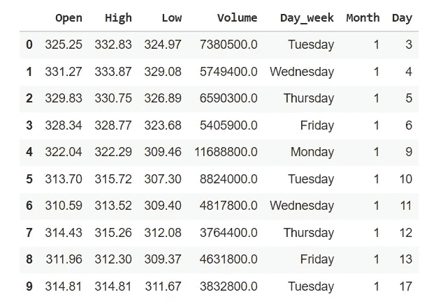

```
month_dummies = pd.get_dummies(df[‘Month’],prefix=’M’)
df=pd.concat([df, month_dummies], axis=1)day_dummies = pd.get_dummies(df['Day_week'],prefix='W')
df=pd.concat([df, day_dummies], axis=1)dayNum_dummies = pd.get_dummies(df['Day'],prefix='D')
df=pd.concat([df, dayNum_dummies], axis=1)df = df.drop('Month', axis = 1)
df = df.drop('Day_week', axis = 1)
df = df.drop('Day', axis = 1)df.head(10)
```

修改数据集，


# 步骤 03 数据转换

```
plt.rcParams["figure.figsize"] = (24, 12)
X[['High','Low','Open']].hist()
```

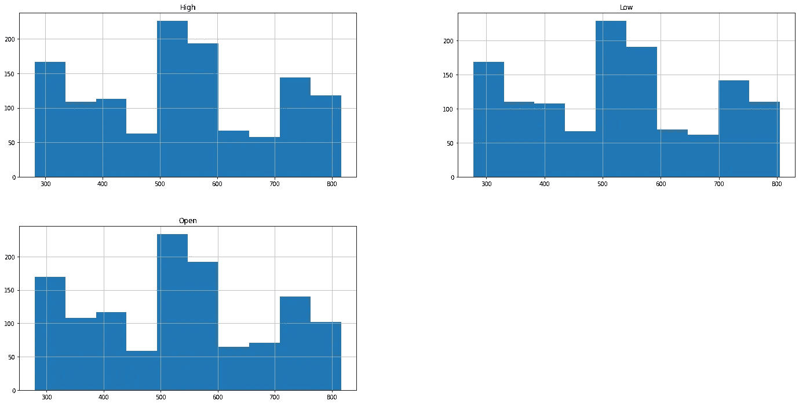

由于最终值，不需要体积列转换。

# 步骤 04-缩放和/或标准化特征

通过执行以下代码，我删除了数据集中分类列，以便进行缩放:

```
dummies = day_dummies.columns.tolist() + month_dummies.columns.tolist()+dayNum_dummies.columns.tolist()Remove_columns_values = dummiesX_without_Cat=X.drop(Remove_columns_values, axis = 1)
X_without_Cat.head(5)
```

删除分类列后，

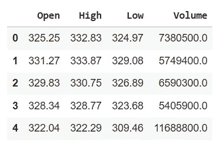

通过下面的代码，我使用 sklearn 的 minmax scaler 缩放了表中的连续值

```
from sklearn.preprocessing import MinMaxScaler
scaler = MinMaxScaler()data_training = scaler.fit_transform(X_without_Cat)
data_training
```

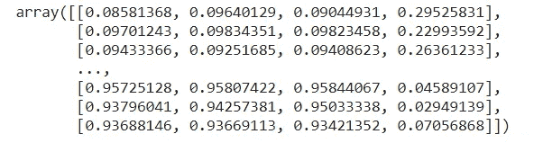

```
columns_value_new=X_without_Cat.columns
X_Scaled_Except = pd.DataFrame(data_training, columns=columns_value_new)plt.rcParams[“figure.figsize”] = (24, 12)
X_Scaled_Except.hist()
```

显示缩放/标准化效果，

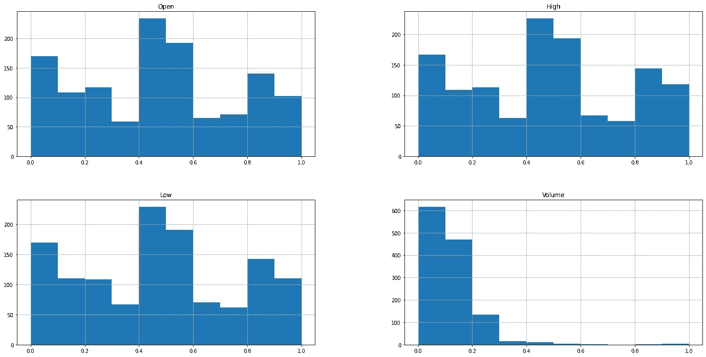

通过下面的代码，我已经分别缩放了体积列，用于模型输出的逆变换，

```
scalerVol= MinMaxScaler()
data_trainingVol= scalerVol.fit_transform(X_without_Cat.iloc[:,3:4])
data_trainingVol
```

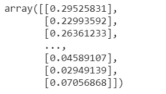

# 步骤 05 相关矩阵

```
import seaborn as sns
plt.rcParams["figure.figsize"] = (24, 8)
sns.heatmap(X_Scaled_Except.corr(),annot=True);
```

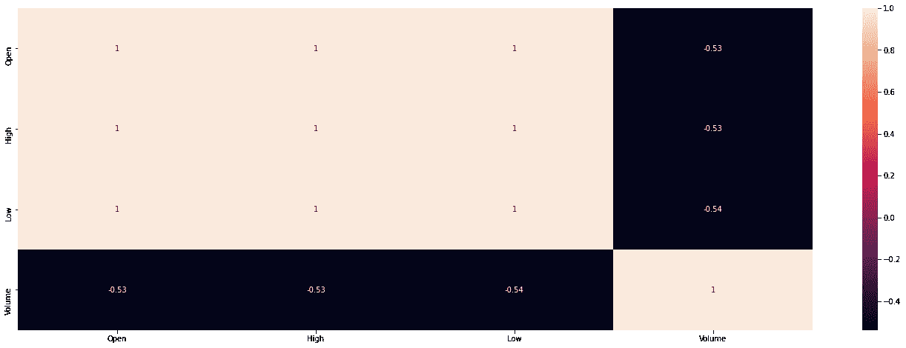

```
X_Scaled_Except.corr()
```

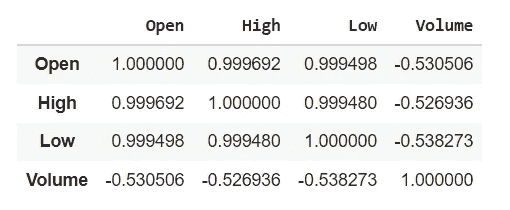

从上表和相关矩阵我们可以看出，低开高走之间有很高的相关性。所以我们只能选择一个 1 来平衡工作。由于价格之间的差异很小，我选择了平衡工作的所有功能

```
data_Final =X_Scaled_Except
for f in dummies:
    data_Final = data_Final.join(X[f])
```

# 步骤 06 递归神经网络

**将多元序列分割成样本，**

```
def split_series(series, n_past):
     X, y = list(), list()
     for window_start in range(len(series)):
          past_end = window_start + n_past
          if past_end >= len(series):
          break# slicing the past and future parts of the window
           past, future = series[window_start:past_end, 0:4]
                          ,series[past_end,3]
           X.append(past)
           y.append(future)
      return np.array(X), np.array(y)
```

我已经使用了上面的函数，按照下面的代码做了这个例子。

```
X, y = split_series(data_Final.to_numpy(), 6)
```

我考虑了过去 6 天的记录来预测第 7 天的交易量

```
import math
n_test = math.floor(len(y)*0.2)
X_train, X_test, y_train, y_test = X[:-n_test], X[-n_test:], y[:-n_test], y[-n_test:]
print(X_train.shape, X_test.shape, y_train.shape, y_test.shape)
```

我将数据集分成 20 %用于测试，80 %用于训练。我以适当的方式使用了上述代码。因为我们必须在不改变顺序的情况下拆分数据集。

**长短期记忆(LSTM)**

长短期记忆(LSTM)网络是一种能够在序列预测问题中学习顺序依赖性的递归神经网络。

通过下面的代码，你可以定义一个模型。

```
from tensorflow.keras import Sequential
from tensorflow.keras.layers import Dense, LSTM, Dropout
from tensorflow.keras.layers import RNNregressor = Sequential()
regressor.add(LSTM(units = 60, activation = 'relu', return_sequences = True, input_shape = (6, 4)))
regressor.add(Dropout(0.2))
regressor.add(LSTM(units = 60, activation = 'relu', return_sequences = True))
regressor.add(Dropout(0.2))
regressor.add(LSTM(units = 80, activation = 'relu', return_sequences = True))
regressor.add(Dropout(0.2))
regressor.add(LSTM(units = 120, activation = 'relu'))
regressor.add(Dropout(0.2))
regressor.add(Dense(units = 1))
regressor.summary()
```

## **模型的编制**

通过下面给定的代码来编译模型，我使用了一个优化器作为“亚当”和损失作为“均方误差”。在优化算法部分，我们必须计算模型当前状态的误差，并且要反复估计误差。因此，它可以用来估计训练模型的损失，从而可以更新训练模型的权重，以减少与下一阶段一样多的损失。

```
regressor.compile(optimizer=’adam’, loss = ‘mean_squared_error’)
```

## **拟合模型**

批量大小控制在模型的内部参数更新之前要处理的训练样本的数量。历元数控制训练数据集中的完整遍数。我给了 150 个纪元。因此，将会发生 150 次对训练数据集的完整遍历。

```
history=regressor.fit(X_train, y_train, epochs=150, batch_size=32, verbose=2,validation_data=(X_test, y_test) )
```

## 评估模型

通过下面的代码，我们可以得到均方差(MSE ),它告诉你一条回归线离一组点有多近。这是通过从点到回归线的距离并平方它们来实现的。均方根误差(RMSE)是以 MSE 的平方根表示的误差率。

```
from numpy import sqrt
mse = regressor.evaluate(X_test, y_test, verbose=0)
print('MSE: %.9f, RMSE: %.9f' % (mse, sqrt(mse)))
```

在这里，我已经收到了 MSE: 0.000936066，和 RMSE:0.0399536567

## 绘制学习曲线

通过下面的代码，我们可以绘制模型的学习曲线。我们可以使用学习曲线来诊断学习中的问题，例如训练期间模型的欠拟合或过拟合。

```
plt.figure(figsize=(14,5))
from matplotlib import pyplot
pyplot.title('Learning Curves')
pyplot.xlabel('Epoch')
pyplot.ylabel('Root Mean Squared Error')
pyplot.plot(history.history['loss'], label='train')
pyplot.plot(history.history['val_loss'], label='val')
pyplot.legend()
pyplot.show()
```

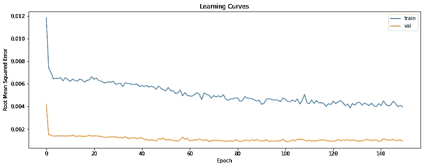

通过使用学习曲线，在过拟合和欠拟合模型条件之间存在良好的拟合。我们可以说良好拟合是指训练和验证损失都降低到一个稳定点，两个最终损失值之间的差距最小。

## 预言；预测；预告

通过下面的代码，我们可以预测给定输入的音量。然而最终出来的不是量。因为我们已经把它作为模型的输入。因此，我们必须重新调整输出值，以获得预测的体积。

```
y_pred = regressor.predict(X_test)
```

## 重新调整输出

我们可以通过下面的代码重新调整模型的输出来得到体积。我已经用逆变换函数做了相关的工作。

```
y_predVol = scalerVol.inverse_transform(y_pred)
y_test = y_test.reshape(y_test.shape[0], 1)
y_testVol = scalerVol.inverse_transform(y_test)volume_pred= []
for i in range(len(y_predVol)):
     volume_pred.append(y_predVol[i,0])volume_test= []
for i in range(len(y_testVol)):
     volume_test.append(y_testVol[i,0])
```

## 可视化结果

通过下面的代码，我们可以绘制出显示实际谷歌量与预测谷歌量的图表。我用红色线显示了真实的谷歌量，用蓝色线预测了谷歌量。

```
plt.figure(figsize=(14,5))
plt.plot(volume_test, color = 'red', label = 'Real Google Volume')
plt.plot(volume_pred, color = 'blue', label = 'Predicted Google Volume')plt.title('Google Stock Volume Prediction')
plt.xlabel('Time')
plt.ylabel('Google Stock Volume')
plt.legend()
plt.show()
```


## 使用𝑅^2 统计计算模型的准确性

通过下面的代码，我们可以得到模型的 r2 分数。对 r 平方最常见的解释是回归模型与观测数据的拟合程度。通常，较高的 r 平方表示模型更适合

```
from sklearn import metricsaccuracy = metrics.r2_score(volume_test,volume_pred)
print(" Accuracy:", accuracy)
```

精确度:0.38386868686