# 使用 Python 通过机器学习技术预测(至少尝试)资产回报

> 原文：<https://medium.com/analytics-vidhya/predicting-at-least-trying-asset-returns-with-machine-learning-techniques-using-python-1b0946100caf?source=collection_archive---------2----------------------->

## 试图通过强制 ML 模型来超越纯粹的机会，以及为什么我们没有这样做

统计学可以用来预测任何有预测因子的事物。然而，有效市场假说(EMH)指出，这不是资产回报的情况，因为市场价格将反映现有的信息，除了少数例外(法玛和马尔基尔，1970)。此外，鉴于只有少数选定的积极基金可以持续跑赢选定的基准指数(马尔基尔，2005)，有足够的理由相信，未来价格的可预测性几乎是不可能的，因为所有已知的和可用于预测价格和击败市场的东西都已经打折了。因此，我们回到了肤浅的预测，基于运气的胜利，并为此付费。

然而，还有另一种相反的方式来理解有效市场。这是一个事实，假设所有相关信息都已经被贴现，如果我们想要尝试任何类型的预测，价格就是我们所需要的。例如，网上有几篇论文表明，应用一组机器学习技术可以输出超过 80%准确度的方向预测(Patel，Shah，Thakkar，& Koetcha，2014)。这种精确度与其他策略(如凯利标准)相结合，可以产生相关的结果。

接下来，我将展示三种不同的机器学习技术的代码，即:逻辑回归和贝叶斯分类器、决策树和支持向量机。要预测的资产有:JP 摩根(JPM)、美国银行(BAC)和花旗银行(C)。可以通过拟合/预测 2008 年对这三家银行产生巨大影响的危机来进行进一步的研究，看看这些模型是否会发生什么酷的事情。至于我们的数据，我们将使用 Quandl 的随时间变化的股票价格数据库，我们将生成一个带有建议的制造指标的表格，即:收盘价、回报、回报符号、动量、10 天简单移动平均线和 10 天指数移动平均线。

**设置我们的数据**

在我们开始干预我们的机器学习模型之前，我将创建三个数据框，每个资产一个。首先，我将从 Quandl 库获取从 2014 年 1 月 1 日到 2018 年 1 月 1 日的收盘价(鉴于我在 Quandl 中的免费帐户，不能更接近当前日期)。然后，我将通过计算 D+0 和 D-1 的价格比率的对数来为我们的对数回报创建一个列。然后，我将为我们的滞后回报创建 5 列，小心地删除无效值，并将它们放入 D+0 线。动量柱是通过减去 D+0 和 D-1 的价格创建的，而简单和移动平均线是为过去 10 天创建的。最终数据框被截断，因此数据将符合公式所需的形状。代码如下所示。

```
import numpy as np
import pandas as pd
from numpy import inf
from pandas_datareader import data as web#Get close datadataJPM = pd.DataFrame(web.DataReader('AXP', data_source='quandl', start="2014-01-01", end="2018-01-01", access_key="Hvta3RUqWUHaHFkzfyEA")['Close'])
dataBAC = pd.DataFrame(web.DataReader('BAC', data_source='quandl', start="2014-01-01", end="2018-01-01", access_key="Hvta3RUqWUHaHFkzfyEA")['Close'])
dataC = pd.DataFrame(web.DataReader('C', data_source='quandl', start="2014-01-01", end="2018-01-01", access_key="Hvta3RUqWUHaHFkzfyEA")['Close'])#Create RETURN featuredataJPM["Returns"] = np.log(dataJPM.Close/dataJPM.Close.shift(-1))
dataBAC["Returns"] = np.log(dataBAC.Close/dataBAC.Close.shift(-1))
dataC["Returns"] = np.log(dataC.Close/dataC.Close.shift(-1))#Create 5 LAGGED DAILY RETURNSlags = 5
banks = [dataJPM, dataBAC, dataC]
col = []
for bank in banks:
    for lag in range(1,lags+1):
        col = 'ret_%d' % lag
        bank[col] = bank['Returns'].shift(-lag)#Remove NaNdataJPM.dropna(inplace=True)
dataBAC.dropna(inplace=True)
dataC.dropna(inplace=True)#Create MOMENTUM featuredataJPM["Momentum"] = dataJPM.Close - dataJPM.Close.shift(-1)
dataBAC["Momentum"] = dataBAC.Close - dataBAC.Close.shift(-1)
dataC["Momentum"] = dataC.Close - dataC.Close.shift(-1)#Create SIMPLE MOVING AVERAGE featuredataJPM["SMA10"] = (dataJPM.Close + dataJPM.Close.shift(-1) + dataJPM.Close.shift(-2) + dataJPM.Close.shift(-3) + dataJPM.Close.shift(-4) + dataJPM.Close.shift(-5) + dataJPM.Close.shift(-6) + dataJPM.Close.shift(-7) + dataJPM.Close.shift(-8) + dataJPM.Close.shift(-9))/10
dataBAC["SMA10"] = (dataBAC.Close + dataBAC.Close.shift(-1) + dataBAC.Close.shift(-2) + dataBAC.Close.shift(-3) + dataBAC.Close.shift(-4) + dataBAC.Close.shift(5) + dataBAC.Close.shift(-6) + dataBAC.Close.shift(-7) + dataBAC.Close.shift(-8) + dataBAC.Close.shift(-9))/10
dataC["SMA10"] = (dataC.Close + dataC.Close.shift(-1) + dataC.Close.shift(-2) + dataC.Close.shift(-3) + dataC.Close.shift(-4) + dataC.Close.shift(-5) + dataC.Close.shift(-6) + dataC.Close.shift(-7) + dataC.Close.shift(-8) + dataC.Close.shift(-9))/10#Create EXPONENTIAL MOVING AVERAGE featuredataJPM["EMA10"] = dataJPM["SMA10"]
dataBAC["EMA10"] = dataBAC["SMA10"]
dataC["EMA10"] = dataC["SMA10"]alpha = 0.5
dataJPM["EMA10"] = (dataJPM.Close-dataJPM.EMA10.shift(-1))*(alpha) + dataJPM.EMA10.shift(-1)
dataBAC["EMA10"] = (dataBAC.Close-dataBAC.EMA10.shift(-1))*(alpha) + dataBAC.EMA10.shift(-1)
dataC["EMA10"] = (dataC.Close-dataC.EMA10.shift(-1))*(alpha) + dataC.EMA10.shift(-1)dataJPMfinal = dataJPM.truncate(after="2014-01-27")
dataBACfinal = dataBAC.truncate(after="2014-01-27")
dataCfinal = dataC.truncate(after="2014-01-27")
```

为了给我们的模型编码，我们将利用 Scikit Learn 的库。此外，我们的数据将在需要时使用 Scikit 的标准定标器进行标准化，以避免分配不成比例的权重，这会严重影响我们模型的准确性。接下来，对于所有模型，我们将使用 Scikit 的 KFold 将我们的数据分成训练集和测试集，4/5 用于训练，1/5 用于测试。这种拆分将使我们能够更好地评估我们的模型在实时情况下会如何发展。

**关于 PNL 回测的说明**

为了测试我们的策略，我们将为每个模型和股票绘制三条曲线。第一条曲线将代表任何给定股票的完全多头被动头寸，这可以作为基准:我们得到比这条曲线更高的结果，我们的主动管理正在产生 alpha。我们将绘制的第二条线是对给定策略的完全投资头寸，即全押:我们将 100%的资本放在我们模型中给定的策略上，并纳入 100%的结果，无论它们是上涨还是下跌。这可以简单地通过累加所有回报的总和乘以我们的预测符号来实现:如果预测值为 1，回报为正，我们就获利；如果 predictor 是-1，回报是负的，我们也有收益；不同的结果增加了负回报。

我们的第三条曲线将考虑半凯利。凯利标准是赌注的大小，以百分比或总资本的形式给出，你应该在一系列的赌注中下注以最大化预期回报。这是通过假设我们的模型有一定的优势，即赢的概率 p 高于 50%来计算的；然后，假设第二天收益的分布是正态的，通过泰勒展开式及其导数等于零，我们得到了最优分配。在我们的例子中，考虑 1:1 (b=1)的偶数赌注，我们有:

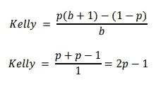

凯利准则

通常，凯利会解决策略中资本分配的最佳百分比。然而，这种策略往往给出非常高的标准差，这在主动管理型基金中可能会吓跑投资者。因此，经理们可能会选择使用半凯利，因为我们的泰勒展开是抛物线(不是真的，但对我们的解释来说足够接近)，如果我们只分配我们标准的一半，我们将 sigma 减少一半，但回报率仅减少 25%，这是一个很好的卖点，可以安慰我们的经理，而不会吓到投资者。因此，在对我们的策略进行回溯测试时，我们将考虑以下几点。

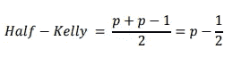

半凯利:心脏衰弱者

**贝叶斯分类器**

我们将通过朴素贝叶斯分类器进行预测回报的第一次尝试。这个分类器从一个简单的假设开始，即数据中的特征之间没有相关性，并使用贝叶斯定理进行分类。y 是 up (1)和 down (-1)的二进制状态，x1，…，xn 是我们的特征向量，我们得到如下。

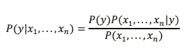

假设不考虑变量之间的依赖性，分母向量的每个特征的概率保持不变，并且我们想要二进制结果，我们的等式变成如下。

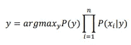

该等式是给定 y 的特征概率的所有概率与 y 的概率的乘积。一系列概率的乘积可能导致下溢，这促使我们在实践中使用对数概率之和的指数。由此产生的另一个问题是，如果任何𝑃(𝑥𝑖 |𝑦碰巧为零，我们的方程将总是返回零，因此我们的模型将通过使用平滑变量来平滑我们的概率，这将使任何零概率稍微超过零。

不同的贝叶斯分类器方法对特征的概率分布做出不同的假设。在我们的例子中，我们将使用高斯变量，假设正态分布的概率。代码如下所示。

```
from sklearn.naive_bayes import GaussianNB
from sklearn.preprocessing import StandardScaler
from sklearn.model_selection import KFold
gnb = GaussianNB()
cols = ['Momentum', 'SMA10', 'EMA10', 'ret_1', 'ret_2', 'ret_3', 'ret_4', 'ret_5']scaler = StandardScaler()
scaler.fit(dataBACfinal)dataBACfinalScaled = pd.DataFrame(scaler.transform(dataBACfinal))
dataBACfinalScaled.columns = ['Close', 'Returns', 'ret_1', 'ret_2', 'ret_3', 'ret_4', 'ret_5', 'Momentum', 'SMA10', 'EMA10']y = dataBACfinal["Returns"].values
X = dataBACfinalScaled[cols].shift(-1).fillna(0).values
kf = KFold(n_splits=5, shuffle=True)
kf.get_n_splits(X)for train_index, test_index in kf.split(X):
    X_train, X_test = X[train_index], X[test_index]
    y_train, y_test = y[train_index], y[test_index]gnb.fit(pd.DataFrame(X_train), np.sign(y_train))dfyGNB = pd.DataFrame(y_test)
dfyGNB.columns = ["Returns"]
dfyGNB['NB_pred'] = gnb.predict(pd.DataFrame(X_test))
dfyGNB['log_p1'] = pd.DataFrame(gnb.predict_proba(pd.DataFrame(X_test)))[0]
dfyGNB['log_p2'] = pd.DataFrame(gnb.predict_proba(pd.DataFrame(X_test)))[1]
dfyGNB['log_p3'] = pd.DataFrame(gnb.predict_proba(pd.DataFrame(X_test)))[2]
dfyGNB['p'] = dfyGNB[['log_p1', 'log_p2', 'log_p3']].max(axis=1)
```

**PNL 回溯测试**

然后，为了测试我们的模型的准确性，我们绘制了以下内容

```
dfyGNB['NB_returns'] = dfyGNB['Returns'] * dfyGNB['NB_pred']
dfyGNB["Kelly_NB_returns"] = dfyGNB['Returns'] * dfyGNB['NB_pred'] * (((2*(dfyGNB['p']))-1)/2)
dfyGNB[['Returns', 'NB_returns', 'Kelly_NB_returns']].cumsum().apply(np.exp).plot(figsize=(10, 6))
```

这就产生了下面这个不起眼的图形。

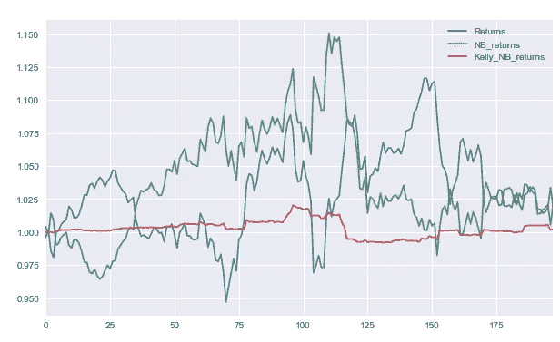

NB 退货— JPM

通过计算每一次我们添加一个正结果的次数，并除以播放次数，我们可以得到我们的模型在这次测试中的准确性。

```
sum(1 for x in dfyGNB['NB_returns'] if x > 0)/len(dfyGNB['NB_returns'])
```

48.48%的准确率，我们的模型基本上是在抛硬币。类似的结果适用于下面的 BAC 和 C。

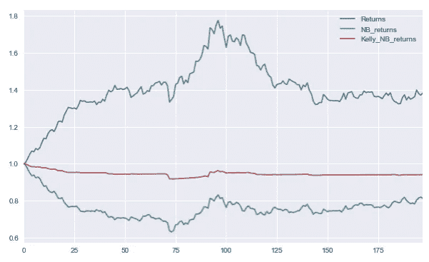

NB 退货— BAC

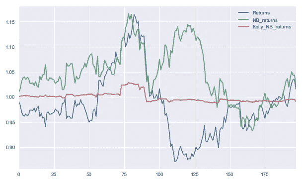

NB 返回— C

**逻辑回归**

逻辑回归不同于线性回归，因为我们用下面的函数来拟合模型。

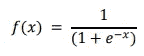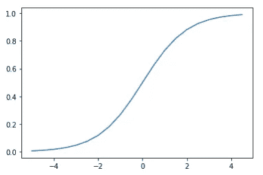

这使得值的上部为 0 或 1(在曲线的中间被切割)。在我们的模型中，我们还将应用 KFold 方法将数据分为训练和测试，调整我们的变量，并应用正则化。正则化是应用于拟合模型的惩罚，它具有通过减少由我们的回归给出的大系数来平衡过度拟合的效果。我们的模型使用 L2 范数来计算这些惩罚，这是平方和。

```
from sklearn import linear_model
from sklearn.model_selection import KFold
from sklearn.preprocessing import StandardScalerlm = linear_model.LogisticRegression(C = 1e5, dual=True, solver = 'liblinear', max_iter = 1000, multi_class = 'ovr')
cols = ['Momentum', 'SMA10', 'EMA10', 'ret_1', 'ret_2', 'ret_3', 'ret_4', 'ret_5']scaler = StandardScaler()
scaler.fit(dataBACfinal)dataBACfinalScaled = pd.DataFrame(scaler.transform(dataBACfinal))
dataBACfinalScaled.columns = ['Close', 'Returns', 'ret_1', 'ret_2', 'ret_3', 'ret_4', 'ret_5', 'Momentum', 'SMA10', 'EMA10']y = dataBACfinal["Returns"].values
X = dataBACfinalScaled[cols].shift(-1).fillna(0).values
kf = KFold(n_splits=5, shuffle=True)
kf.get_n_splits(X)for train_index, test_index in kf.split(X):
    X_train, X_test = X[train_index], X[test_index]
    y_train, y_test = y[train_index], y[test_index]lm.fit(pd.DataFrame(X_train), np.sign(y_train))
dfy = pd.DataFrame(y_test)
dfy.columns = ["Returns"]
dfy['SMA10'] = dataBACfinalScaled['SMA10']dfy['log_pred'] = lm.predict(pd.DataFrame(X_test))
dfy['log_p1'] = pd.DataFrame(lm.predict_proba(pd.DataFrame(X_test)))[0]
dfy['log_p2'] = pd.DataFrame(lm.predict_proba(pd.DataFrame(X_test)))[1]
dfy['log_p3'] = pd.DataFrame(lm.predict_proba(pd.DataFrame(X_test)))[2]
dfy['p'] = dfy[['log_p1', 'log_p2', 'log_p3']].max(axis=1)dfy['log_returns'] = dfy['Returns'] * dfy['log_pred']
dfy["Kelly_log_returns"] = dfy['Returns'] * dfy ['log_pred'] * (((2*(dfy['p']))-1)/2)
dfy[['Returns', 'log_returns', 'Kelly_log_returns']].cumsum().apply(np.exp).plot(figsize=(10, 6))sum(1 for x in dfy['log_returns'] if x > 0)/len(dfy['log_returns'])
```

**PNL 回测**

这些结果如下图所示。

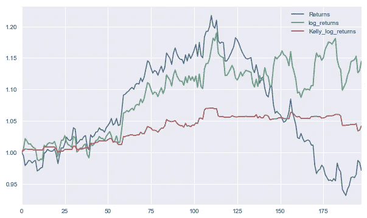

逻辑回归— JPM

该模型显示了 51.01%的准确性。然而，结果经常在 48%和 52%的准确度之间变化，因此它仍然是赌博，并且没有产生一致的 alpha。BAC 和 C 的类似结果如下。

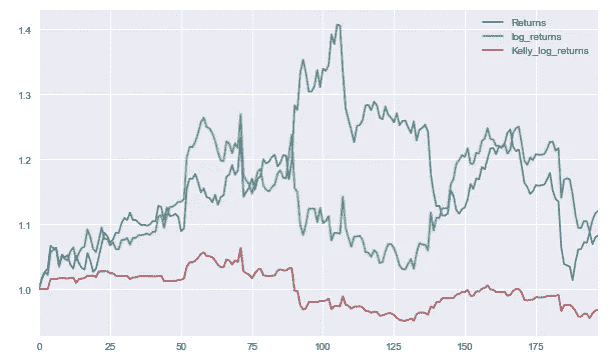

逻辑回归 BAC

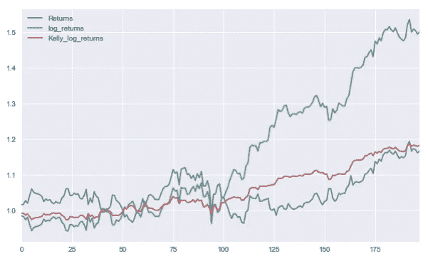

逻辑回归— C

**决策树**

决策树是容易理解模型。他们的分类过程很简单，并且不像我们的其他模型那样受到黑箱效应的影响。为了创建一个决策树，我们将使用熵的定义，它来自信息论的概念，如下所示。

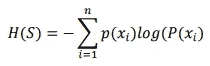

熵公式

该等式将用于将数据分割成碎片较少的子集。我们的模型将使用的算法如下:

1.  如果所有数据都有相同的标签，则创建一个叶子并停止；
2.  如果没有更多可用的特性分色，则创建一个具有最高可能值的叶子并停止；
3.  否则，为每个特征测试一个分区；
4.  选择熵最小的一个；
5.  基于上一次决策添加一个节点；
6.  对每个子集重复上述步骤。

如果数据是连续的，则设置拆分位置的标准基于最小化均方误差和平均绝对误差。使用 Scikit 学习库，我们编写了以下模型。同样，我们借用 KFold 方法来分割数据，这是一个很好的做法，因为这种方法倾向于严重过度拟合测试数据。这一次，没有理由缩放我们的数据，因为我们没有创建可能导致不平衡系数的单一回归。在这个模型中缩放只会阻碍我们对它的理解。

此外，我们并不试图进行回归，我们只是想预测向上或向下的运动。因此，我们创建了另一个带有回报符号的列，1 表示负回报，0 表示正好为零(发生了几次)，1 表示正回报。这个专栏将用于拟合和测试我们的模型。

```
from sklearn import tree
from sklearn.model_selection import KFold
from subprocess import call
dataBACfinal['Up_down'] = (np.sign(dataBACfinal['Returns']))
cols = ['Momentum', 'SMA10', 'EMA10', 'ret_1', 'ret_2', 'ret_3', 'ret_4', 'ret_5']kf = KFold(n_splits=5, shuffle=True)X = dataBACfinal[cols].fillna(0).values
y = dataBACfinal["Up_down"].shift(-1).fillna(0).valuesfor train_index, test_index in kf.split(X):
    X_train, X_test = X[train_index], X[test_index]
    y_train, y_test = y[train_index], y[test_index]clf = tree.DecisionTreeClassifier()clf.fit(X_train,y_train)CTreeResult = pd.DataFrame(dataBACfinal['Returns'].values[test_index])
CTreeResult.columns = ['Returns']
CTreeResult['tree_prediction'] = pd.DataFrame(clf.predict(X_test))
CTreeResult['log_p1'] = pd.DataFrame(clf.predict_proba(pd.DataFrame(X_test)))[0]
CTreeResult['log_p2'] = pd.DataFrame(clf.predict_proba(pd.DataFrame(X_test)))[1]
CTreeResult['log_p3'] = pd.DataFrame(clf.predict_proba(pd.DataFrame(X_test)))[2]
CTreeResult['p'] = CTreeResult[['log_p1', 'log_p2', 'log_p3']].max(axis=1)CTreeResult['tree_returns'] = CTreeResult['Returns'] * CTreeResult['tree_prediction']
CTreeResult["Kelly_tree_returns"] = CTreeResult['Returns'] * CTreeResult['tree_prediction'] * (((2*(CTreeResult['p']))-1)/2)CTreeResult[['Returns', 'tree_returns', 'Kelly_tree_returns']].cumsum().apply(np.exp).plot(figsize=(10, 6))sum(1 for x in CTreeResult['tree_returns'] if x > 0)/len(CTreeResult['tree_returns'])
```

**PNL 回溯测试**

这将产生以下结果。

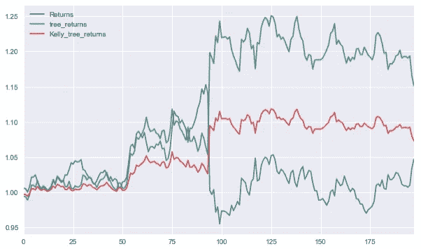

决策树— JPM

该模型的准确率为 46.50%。

通过使用 tree.export_graphviz(clf)命令，可以使用 Graphviz 可视化这个模型。这些树如下所示。

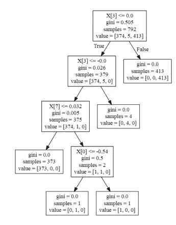

JPM 决策树可视化

BAC 和 C 的结果如下。

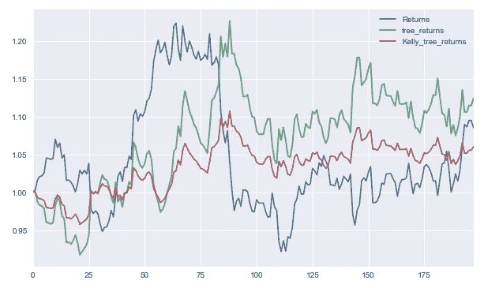

决策树— BAC


BAC 决策树可视化

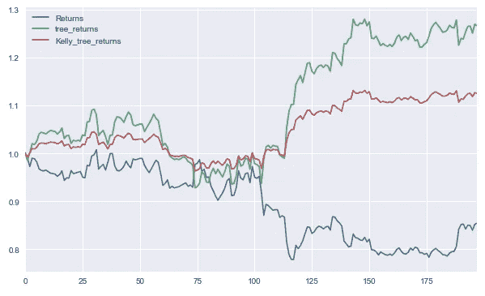

决策树— C

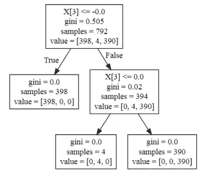

c 决策树可视化

**支持向量机**

支持向量机尝试使用向量来线性分离数据，这些向量在它尝试分类的数据集之间以最高的可能间隔绘制。鉴于它通常构建一个超平面来绘制这些向量，可视化可能会变得复杂。假设我们的矢量位置基于距离，我们将在拟合之前缩放矩阵，并使用 KFold 来分割数据。我们将使用 Scikit 学习库来计算我们的模型，如下所示。

```
from sklearn import svm
from sklearn.model_selection import KFold
from sklearn.preprocessing import StandardScalerdataBACfinal['Up_down'] = (np.sign(dataBACfinal['Returns']))
cols = ['Momentum', 'SMA10', 'EMA10', 'ret_1', 'ret_2', 'ret_3', 'ret_4', 'ret_5']scaler = StandardScaler()
scaler.fit(dataBACfinal)dataBACfinalScaled = pd.DataFrame(scaler.transform(dataBACfinal))
dataBACfinalScaled.columns = ['Close', 'Returns', 'ret_1', 'ret_2', 'ret_3', 'ret_4', 'ret_5', 'Momentum', 'SMA10', 'EMA10', 'Up_down']kf = KFold(n_splits=5, shuffle=True)X = dataBACfinalScaled[cols].fillna(0).values
y = dataBACfinal["Up_down"].shift(-1).fillna(0).valuesfor train_index, test_index in kf.split(X):
    X_train, X_test = X[train_index], X[test_index]
    y_train, y_test = y[train_index], y[test_index]svmm = svm.SVC(gamma=0.001, probability = True)
svmm.fit(X_train, y_train)CSVMResult = pd.DataFrame(dataBACfinal['Returns'].values[test_index])
CSVMResult.columns = ['Returns']
CSVMResult['log_p1'] = pd.DataFrame(svmm.predict_proba(pd.DataFrame(X_test)))[0]
CSVMResult['log_p2'] = pd.DataFrame(svmm.predict_proba(pd.DataFrame(X_test)))[1]
CSVMResult['log_p3'] = pd.DataFrame(svmm.predict_proba(pd.DataFrame(X_test)))[2]
CSVMResult['p'] = CSVMResult[['log_p1', 'log_p2', 'log_p3']].max(axis=1)
CSVMResult['SVM_prediction'] = pd.DataFrame(svmm.predict(X_test))
CSVMResult['SVM_returns'] = CSVMResult['Returns'] * CSVMResult['SVM_prediction']
CSVMResult["Kelly_SVM_returns"] = CSVMResult['Returns'] * CSVMResult['SVM_prediction'] * (((2*(CSVMResult['p']))-1)/2)
CSVMResult[['Returns', 'SVM_returns', 'Kelly_SVM_returns']].cumsum().apply(np.exp).plot(figsize=(10, 6))
```

**PNL 回测**

这为我们提供了以下结果，准确率为 47.97%

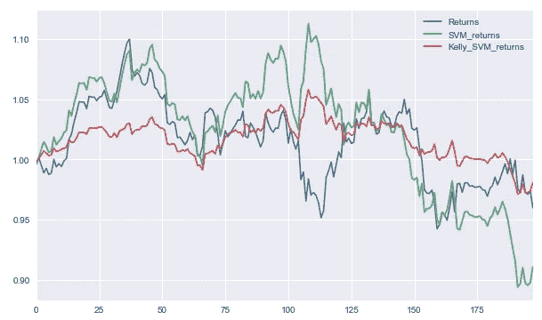

SVM — JPM

当我们试图在 2D 图形中可视化我们的矢量时，大多数方法得到的是一个没有等高线的分布。这是因为我们使用了很多特性，用图形表示它们变得非常复杂。例如，我们可以通过选择 SMA 和 EMA 作为我们表示的特征来绘制我们的图形，如下所示。

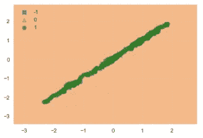

我们的数据在那里，但轮廓超出了界限。BAC 和 C 的结果相似，如下所示。

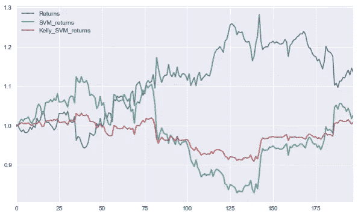

SVM — BAC

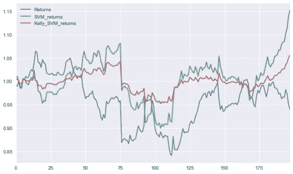

SVM——C

**总结**

我们有时可能会被诱惑去测试很酷的新 ML 模型来预测股票市场的未来回报，但是在这种情况下，我们才能真正感受到价格行为的随机性，以及这对有梦想的统计学家来说是多么不可逾越。用开箱即用的模型进行简单的预测很可能会让你一无所获(就像我在这里做的一样)，这太复杂了，大多数常客的方法甚至会在你有一个好的演示文稿向交易台的同事展示并要求开发预算之前崩溃。

自然，肯定会有赢家(上面的一些模型在回溯测试中显示了超过 10%的 alpha，但请记住，**回溯测试不是科学[重复 10 次]** )，但赢家自然会在随机环境中出现，幸存者偏差会在很大程度上说服即使是幸运的人，他们也只是那么好。

**最后，鉴于金融市场固有的随机性，对任何表现出过度确定性并声称拥有不合理实力的人都要持怀疑态度，即使那个人就是你自己。**