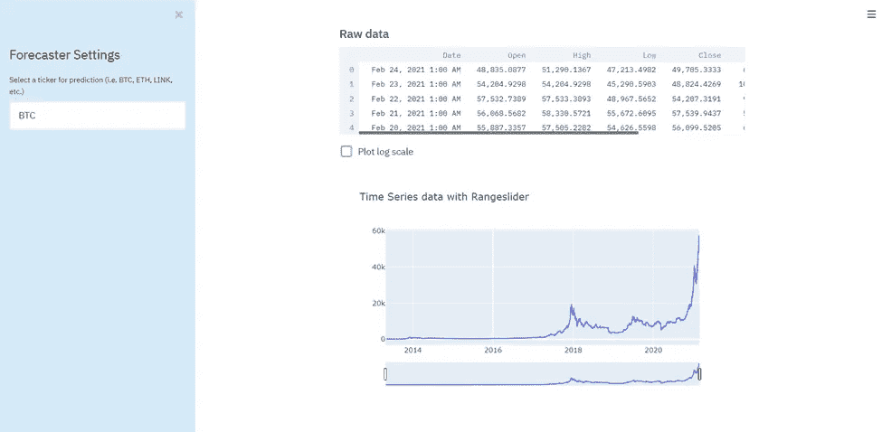
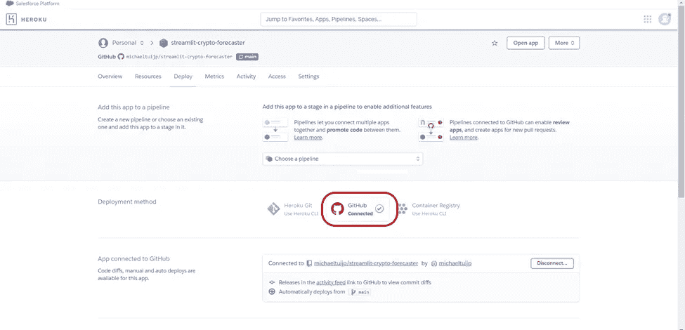
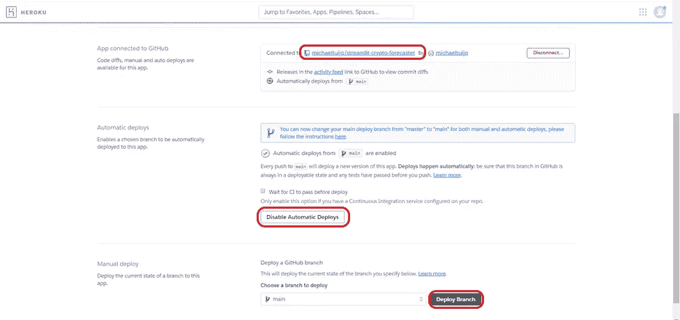
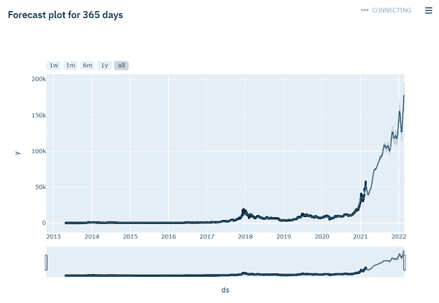

# 使用脸书预言家预测加密货币价格

> 原文：<https://medium.com/analytics-vidhya/predicting-cryptocurrency-prices-using-facebook-prophet-a1509415224f?source=collection_archive---------4----------------------->

## 或者如何使用 Python、Streamlit & Heroku 部署预测 Web 应用程序


尼克·崇在 [Unsplash](https://unsplash.com/s/photos/stock-market?utm_source=unsplash&utm_medium=referral&utm_content=creditCopyText) 上的照片

随着最近加密炒作和采用的复苏，许多人都在猜测空间，尤其是价格可能会去哪里。遇到了**脸书预言家**，广受欢迎的&易于使用的预测模块(针对 Python 和 R)，它似乎是一个预测未来的潜在有趣工具。

更有趣的是 **Streamlit** 模块，这是一个非常简单的包，它使任何具有基本 Python 编码技能的人都能创建一个看起来不错的 web 应用程序！在这种情况下，它是一个用于估计未来加密货币价格的实时预测工具，但是它可以针对任何类型的用例运行任何类型的应用程序！

因为我们急于知道价格在不久的将来是否会上涨，所以让我们使用 Fabebook Prophet & Streamlit 构建一个预测应用程序！如果我们想公开展示应用程序，它需要被部署(在云端)，这样任何人都可以从任何地方访问它。从我遇到的最流行的云服务和部署方法来看，使用 **Heroku** 似乎是创建简单应用部署的最简单平台。对于更专业的&生产级部署，Azure、AWS 和 Google Cloud 可能是你的最佳选择。

首先，让我们构建我们的应用程序！

# 构建 Streamlit 加密预测器

和往常一样，构建应用程序的第一步是导入所需的包。请注意，使用 Python 3.7 &安装 pystan 包是安装脸书先知包所必需的。总之，我们需要以下包:

```
$pip install pandas 
$pip install streamlit 
$pip install plotly 
$pip install cryptocmd 
$pip install pystan
$pip install fbprophet
```

运行 Streamlit 应用程序非常简单。只需使用命令提示符(使用命令“ *cd C:\your\folder* ”)转到保存 Python 文件的文件夹，并使用命令“*streamlit run your _ app _ name . py*”。这将在您的浏览器中打开一个本地 Streamlit 应用程序，从中您可以看到脚本的确切输出。最酷的是，您可以进行更改&保存脚本，这将使您的 Streamlit 应用程序自动重新运行更改！再往下一点，我会展示这是什么样子。

## 数据

要构建一个加密价格预测应用程序，我们首先需要最新的价格数据。我们可以构建自己的网络抓取工具，从 Coinmarketcap.com 这样的价格源中抓取价格数据。话虽如此，当我们可以站在巨人的肩膀上建设时，为什么要重新发明轮子呢？这样的刮价 Python 包毕竟早就有了，叫做 **cryptocmd** 。因此，让我们使用 scraper 生成的输入，使用下面的代码，通过选择一个 ticker，初始化 scraper &加载数据。

## 图表

现在我们有了数据，我们想创建一个交互式的图表来查看我们的加密货币的历史价格。使用下面的代码，我们创建了一个选项，以常规比例或对数比例(测量价格的百分比差异，而不是绝对价格)绘制所选股票的所有可用数据。

现在我们有了数据和图，让我们看看在 Streamlit 中是什么样子。



利用当前价格数据和时间序列图简化应用概述

## 脸书先知

厉害！现在我们有了一个显示我们选择的加密股票的数据和图表的应用程序，终于到了创建我们的脸书预言家预测模型的时候了。

好了，我们的细流加密预测器准备好了！在做了一些应用程序的翻译后，我添加和调整了一些参数和样式，使它更具可定制性和更好看。应用程序的完整代码可以在我的 [**Github**](https://github.com/michaeltuijp/streamlit-crypto-forecaster) 上找到。

# 在 Heroku 的部署

准备好应用程序后，您现在可以在本地使用它了。但是，如果您希望其他人访问您的应用程序，那么它需要被部署(在云或本地服务器上)。大多数生产级应用程序大多部署在三大云平台之一(AWS、Azure 和 Google Cloud)上，为此，我将在未来撰写一篇关于在这些平台上部署的文章。然而，对于快速简单的部署，Heroku 是一个很好的起点！

## 必需的文件

为了在 Heroku 上部署应用程序，我们需要一些额外的文件。首先，我们需要一个 **requirements.txt** 文件，其中包含运行应用程序所需的所有 Python 包&及其版本。接下来需要一个 **setup.sh** 文件，它指定了部署的基本设置要求，如下所示。

```
mkdir -p ~/.streamlit/echo “\
[server]\n\
port = $PORT\n\
enableCORS = false\n\
headless = true\n\
\n\
“ > ~/.streamlit/config.toml
```

最后，我们需要执行 setup & python 文件，为此需要一个 **Procfile** ，看起来像下面的命令。

```
web: sh setup.sh && streamlit run streamlit_crypto_forecaster.py
```

## 赫罗库

现在所有文件都准备好了，我们准备在 [**Heroku**](https://heroku.com/) 上部署应用程序。你确实需要一个 Github & Heroku 账号，这两个账号都可以免费创建。要开始在 Github 上创建资源库，请查看这篇 [**文章**](/swlh/a-beginners-guide-to-github-e4747a93765c) 。一旦你也有了 Heroku 的帐户，你可以选择*创建新应用程序，*给它一个唯一的名字&选择离你最近的地区。创建应用后，您将看到下面的部署概述。



Heroku 部署概述，使用 Github 连接作为部署方法

在这里，我们选择 Github 作为部署方法。之后，只需填写 Github 存储库的路径，(可选)*启用自动部署*(这会自动将您提交到 Github 存储库的任何更改部署到 Heroku 应用程序)，并通过单击*部署分支*完成。



连接您的 Github 存储库路径并部署您的应用程序！

恭喜你！您的 Heroku 应用程序现已部署完毕，您想与之分享的任何人都可以访问它！您现在可以随时随地探索 Streamlit 加密预测器 ！同样，如果你想看到或克隆完整应用程序的代码，请在我的 [**Github**](https://github.com/michaeltuijp/streamlit-crypto-forecaster) 上查看。在撰写本文时，该模型似乎对可预见的未来相当乐观！



使用脸书先知预测未来 365 天

## 最后一个音符

撰写本文是出于对加密领域的最新发展、最新的 Python 包和应用程序以及当今易于使用的云平台的兴奋。这些文章帮助我提出并构建了应用程序，所以也给他们读一读吧！[**(1)**](https://towardsdatascience.com/time-series-analysis-with-facebook-prophet-how-it-works-and-how-to-use-it-f15ecf2c0e3a)[**(2)**](https://towardsdatascience.com/time-series-modeling-of-bitcoin-prices-5133edfec30b)[**(3)**](https://towardsdatascience.com/deploying-a-prophet-forecasting-model-with-streamlit-to-heroku-caf1729bd917)

现在，创建您喜欢的任何类型的(数据科学)应用程序比以往任何时候都更容易&部署它非常快速和容易！我很高兴能在未来探索和从事类似的项目，让任何人都能构建自己的应用程序！

**P.S.** 任何价格预测或提及都不是财务建议；)