# 预测员工流失

> 原文：<https://medium.com/analytics-vidhya/predicting-employee-attrition-c06072042eec?source=collection_archive---------8----------------------->

照片由[莱昂](https://unsplash.com/@myleon?utm_source=medium&utm_medium=referral)在 [Unsplash](https://unsplash.com?utm_source=medium&utm_medium=referral) 上拍摄

在我之前的工作中，我为一家高等教育科技公司建立并管理销售团队。这是一个快速增长的业务，随着公司的扩张，我的团队的总人数和每个团队的人数都在增长。这个角色的很大一部分包括与人力资源部门合作，尽我们所能进行招聘，以规划管理我的团队人数的策略。招聘、入职和培训新员工的间接成本很高，随着人力资源分析的兴起，企业正在投入更多资源来管理员工背后的数据。有了这些新数据，公司能建立一个模型来预测员工流失，从而更好地分配资源吗？

## **问题:**给定一组员工数据，我能建立一个模型来预测员工流失吗？

## **数据源&清理**

数据来源于 [Kaggle](https://www.kaggle.com/pavansubhasht/ibm-hr-analytics-attrition-dataset) 。这是一个“虚构的”数据集，虽然我不知道是否有使用虚构数据集的共识，但对于这个项目来说，它非常适合我的目的。它是由 IBM Watson 团队为他们的 HR 分析功能创建的；除了基本的清洁之外，它不需要太多，我可以将更多的时间集中在开发模型上，这是这个项目的主要焦点。

如果你想跟着做，这里有一个资源库。

数据集没有缺失值，最初有 35 个要素，我将这个数字减少到了 28 个。一列是每个雇员的唯一标识符，所以我把它从数据集中删除了。三列在整个列中只有一个唯一值，所以我也删除了它们。最后，有四个与收入有关的栏目，其中三个缺乏明确的定义。我决定保留定义明确的列“MonthlyIncome ”,并删除其余的列。这给我留下了 28 个特征和 1470 个观察结果。

目标变量“流失”包含“是”和“否”值，我将其编码为“是”= 1 =“员工离开公司”和“否”= 0 =“员工留在公司”。加班同样编码为“是”= 1 和“否”= 0。

在这 28 个特征中，我有一个目标变量，五个分类特征和 22 个数字特征。查看笔记本上的完整阵容。

## 可视化数据

我想用这个项目来提高我的 EDA 和建模能力。为了可视化数据，我使用了 Rafa Castillo 创建的函数，并根据我的数据进行了修改。在笔记本上检查它们。以下是一些更有趣的观察结果:

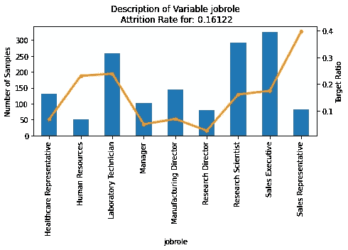

*销售代表拥有最高的流失率，但也是数据集中整体计数最低的代表之一。*

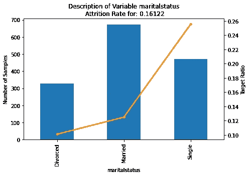

*单身员工的离职率比已婚或离婚员工高得多。*

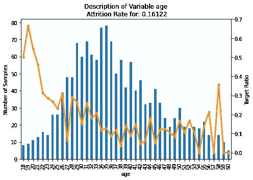

*30 岁以下的年轻员工比 30 岁以上的员工流失率更高。*

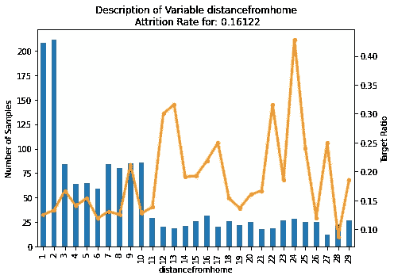

通勤时间较长的员工比通勤时间较短的员工流失率更高。

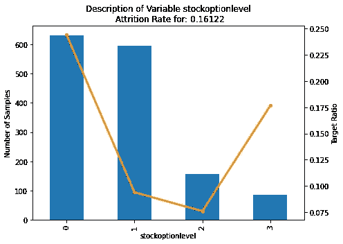

*薪酬中缺少股票期权计划的员工往往比那些有股票期权计划的员工流失率高得多。*

很大一部分功能被设计成看起来像调查回答，例如，在 1 到 4 的范围内对一个人的工作满意度进行评级。具有这种特征的特征具有可预测的损耗率分布，即“调查响应”越低，损耗率越高。

更多的可视化，请看笔记本。如果你发现了什么，告诉我！

最后，我用那个非常有用的关联图查看了特性关联:

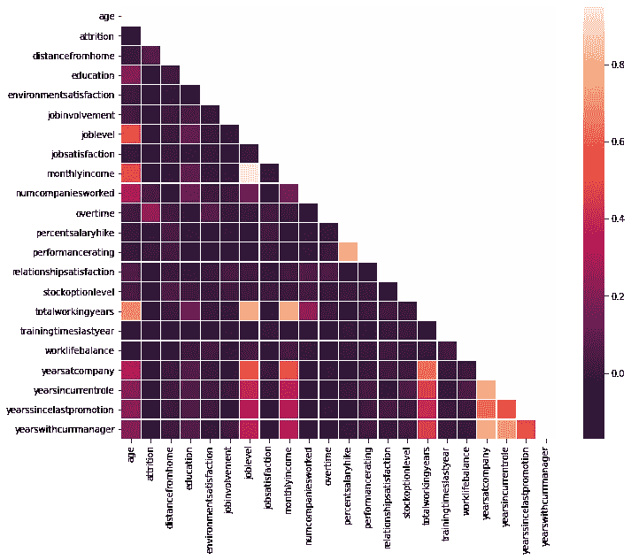

## 预处理和算法

这是我投入大量精力的项目的第二部分。我以前没有做过分类项目，我把重点放在为我的项目选择正确的算法和调整参数以提高我的分类分数上。

我使用 sklearn.preprocessing 的 LabelEncoder 对我的分类数据进行编码，然后将我的数据分成训练/测试集。我使用 MinMax 缩放器来缩放数据，然后构建一个函数来帮助我将数据拟合到以下算法:

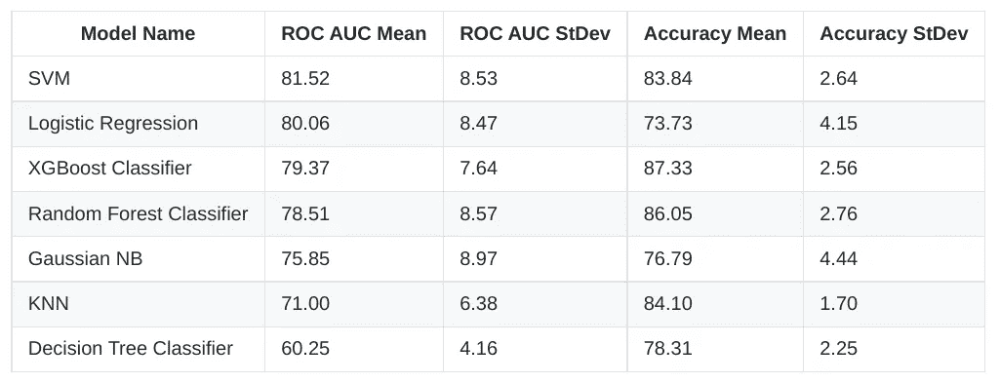

我使用 ROC AUC 平均分数来评估每个模型。ROC 曲线下的面积是二元分类的良好性能度量。在上表中，100 分是完美的预测模型，而接近 50 分意味着该模型与随机分类一样好。我使用三个最好的 AUC 平均分数进行下一阶段的建模:**支持向量分类器**、**逻辑回归**、&、 **XGBoost 分类器**。

**注:**在对员工流失和预测建模进行了一些研究后，我发现逻辑回归通常被认为是员工流失模型的错误算法。

## 调谐参数

我通过一个又一个教程来学习如何调整算法参数，我对这个项目的进展很满意！我用的代码在笔记本里，但下面是结果:

## 支持向量机分类器

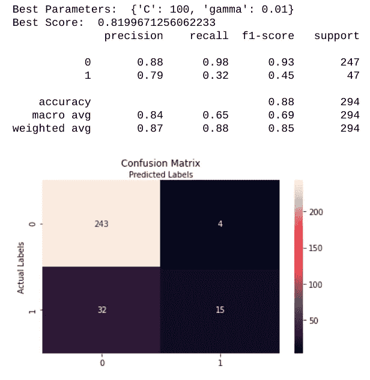

## 逻辑回归

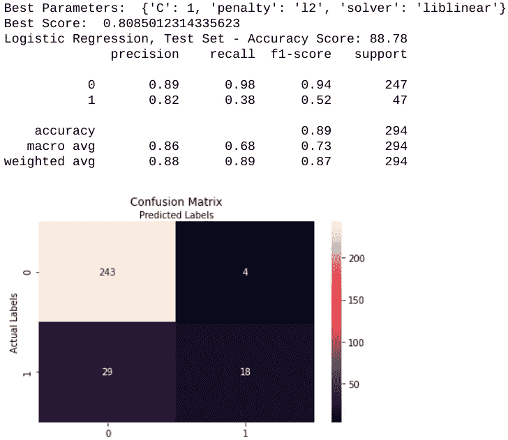

## XGBoost 分类器

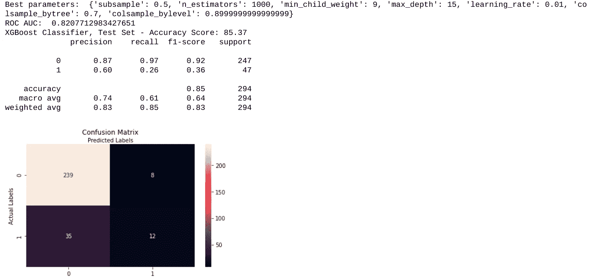

## 特征重要性

根据上面的结果，我选择 XGBoost 作为我的最佳算法。它不仅具有最高的 ROC AUC 平均得分，而且还显示出通过参数调整从基线到得分的最佳改善。探索具有 SHAP 价值观的特色！这里的很好地解释了 SHAP 值到底是什么，这里的是如何使用它们的好例子！超级有用的东西。如果你想学点东西，这里有 github 上的[文档。](https://github.com/slundberg/shap)

形状值

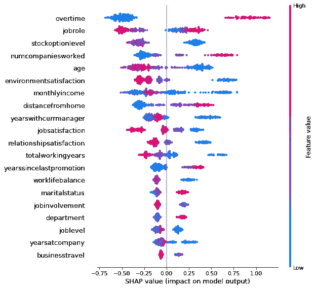

***较高或较低的特征值对模型输出的影响***

加班是这个数据集中一个非常重要的特征，也是我们拥有的所有特征中更能预测员工流失的特征之一。我使用 SHAP 值将加班时间分为两类，一类值等于或高于 0.5，另一类值低于 0.5。下图显示了加班值在这两个范围内的影响:

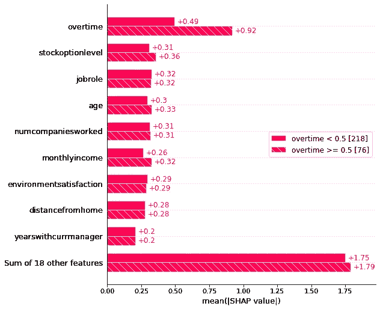

***加班对员工流失的预测性很高。***

## 结论和后续步骤

这是我第二个主要的机器学习项目，我对结果真的很满意！在这个问题上，我学到了很多；我做了大量的外部研究来构建笔记本中使用的一些函数，并使用 SHAP 值来解释可预测性。正如我上面提到的，我以前的角色涉及到在招聘和入职时最大限度地降低管理成本的策略，这个项目的结果会对我们有所帮助！

**一些要点、经验教训和未来步骤:**

*   基于这个数据集，加班是员工流失的高度预测。在该数据集中，员工要么**加班(1 ),要么**不加班(0)。在现实世界中，加班不太可能这么容易被分类。如果我重新考虑这个项目，我会检查具有更现实价值的数据，但在这种情况下，可以肯定地说，加班的员工比不加班的员工更有可能离开工作去寻找新的机会。****
*   该数据集中有七个特征的重要性彼此相差不大:工作角色、股票期权级别、工作过的公司数量、年龄、环境满意度、月收入和离家的距离。雇主应该意识到这些影响员工流失的因素，并管理公司和员工对这七个特征的期望值。例如，与其他员工相比，收入水平低、通勤时间长的年轻员工更有可能离开公司。这似乎是常识，但人事经理在管理员工和规划招聘策略时很难意识到这些因素。
*   SHAP 值是一个易于使用的工具来解释可预测性，我将继续扩展对如何将它们应用到项目中的理解。
*   通过确定项目中的一两个步骤，并建立帮助管理这些步骤的技能，我会学得更好。这并不意味着半途而废；它只是帮助我专注于我想提高的技能。
*   导师无疑是最有用的“技能”我和拉法·卡斯蒂略合作过两个项目，他的鼓励、建议和总体积极性帮助我在遇到问题时保持专注。给像我一样的新手一个建议:找一个导师。

我希望你喜欢这个项目简介；如果你有什么可以分享的建议，我很乐意接受！