# 预测乙醚价格&机器学习的模型选择

> 原文：<https://medium.com/analytics-vidhya/predicting-ether-prices-model-selection-for-machine-learning-8a50321f51a3?source=collection_archive---------15----------------------->

作者图片

## 我将查看以太网定价数据，并通过可视化、配对图和相关矩阵进行发现、探索、清理和总体分析，以便在进入模型选择之前对数据有所了解。

## 我选择这个数据集是因为我有以太网，并且我是以太坊和 Consensys 使之成为可能的去中心化信息和基础设施应用程序的忠实粉丝。

关于收集的数据:以太坊数据集是从以太扫描获得的

Etherscan 是以太坊的块浏览器和分析平台，以太坊是一个去中心化的智能合约平台。以太坊是一个开源的、公共的、基于区块链的分布式计算平台和操作系统，具有智能合约(脚本)功能。

它通过基于事务的状态转换支持 Nakamoto consensus 的修改版本。以太是一种加密货币，由以太坊平台生成，用于补偿挖掘节点执行的计算。每个以太坊账户都有一个以太余额，以太可以从一个账户转移到另一个账户。

原创内容可以在 Etherscan.io 这里找到:[https://etherscan.io/charts](https://etherscan.io/charts)

数据集可以在 Kaggle 上找到这里:[https://www . ka ggle . com/sudalairajkumar/cryptocurrencyprechistory](https://www.kaggle.com/sudalairajkumar/cryptocurrencypricehistory)

感兴趣的变量:

*我们的目标 Y:*

*eth_etherprice:未来 30 天的以太坊价格*

*我们的 9 个变量 X:这是我开始测试各种模型之前感兴趣的变量列表。*

*eth_tx:每天的交易数量*

*eth_address:累计地址增长*

*eth_marketcap:以美元计的市值*

*eth _ hashrate:GH/s 块中的 hashrate 通过引用前一个块的 hash 或指纹形成一个链。*

*eth _ difference:TH 的难度等级*

*eth_blocksize:以字节为单位的平均块大小(数据块-交易和智能合约)*

*eth_gaslimit:每天的气体限制*

*eth_gasused:每天总用气量*

*eth _ 叔伯:每天叔伯的数量*

**测试以下各种模型后的 5 个变量列表:**

*eth_tx:每天的交易数量*

*eth_address:累计地址增长*

*eth_hashrate:以 GH/s 为单位的哈希速率*

*eth _ difference:TH 的难度等级*

*eth_blocksize:以字节为单位的平均块大小*

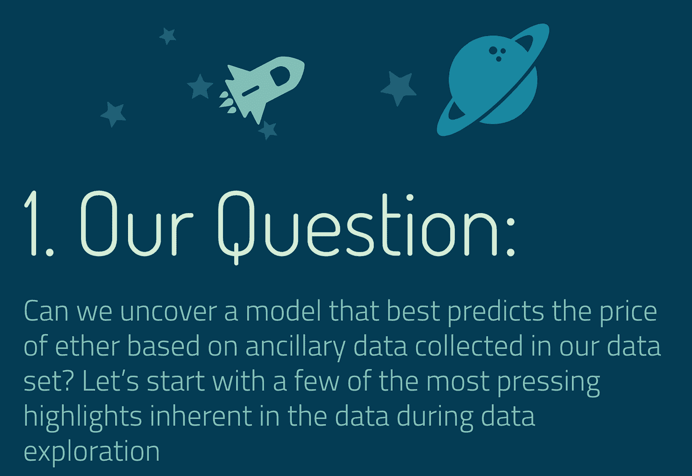

作者图片

对于这个以太坊数据集，我们将根据数据探索阶段发现的几个因素，设置 Y 变量来预测“eth_etherprice”(以太坊的价格)

本质上，我将创建一个预测器，我们可以用它来预测未来 30 天的价格。

在我们开始之前，有一些事情需要考虑:

*   找到一个能准确预测以太坊价格的模型
*   确保信息足以有效预测
*   在建立模型之前，确定我们的数据中是否有任何类型的模式
*   通过为我们的数据选择最佳性能模型来选择模型
*   查看我们的模型是否足以有效地进行预测！

作者图片

谁会对此最感兴趣？让我们为感兴趣的观众探索我们的模型的实际用途。

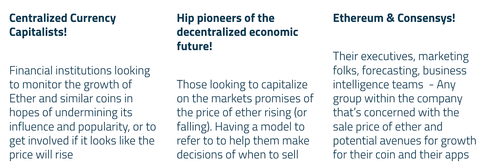

作者图片

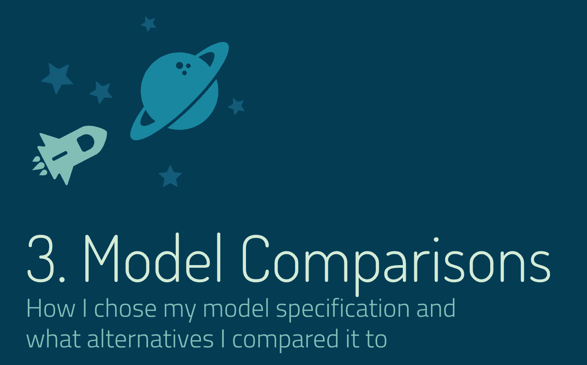

作者图片

现在有趣的部分是:模型比较！在这里，我将探索我是如何选择我的模型规范的，以及我将它与什么替代方案进行了比较。让我们从探索性数据分析和特性选择开始:

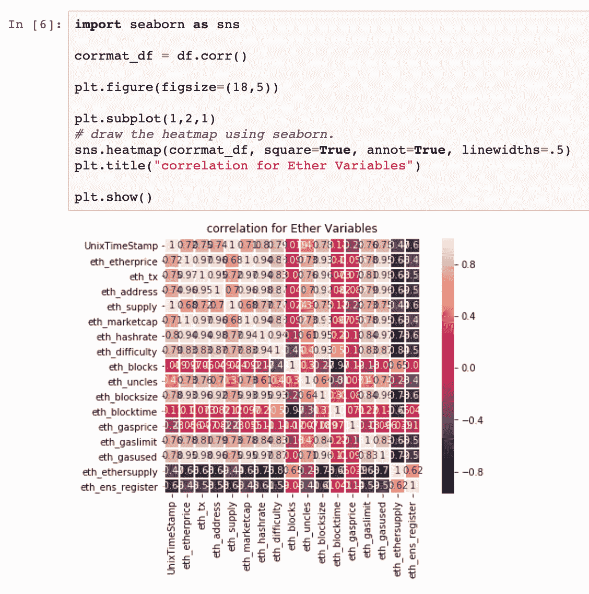

作者图片

接下来我们将了解一下分布情况:

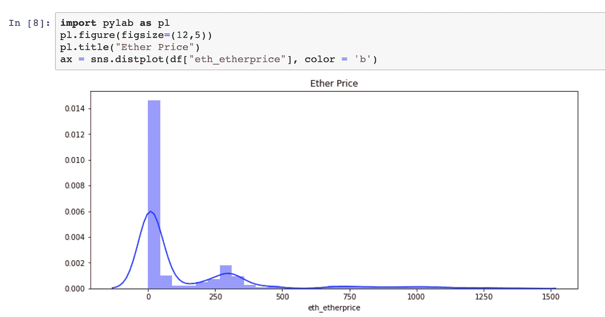

作者图片

以及我们所拥有的对以太价格影响最大的各种变量(数据列)之间的相关性:

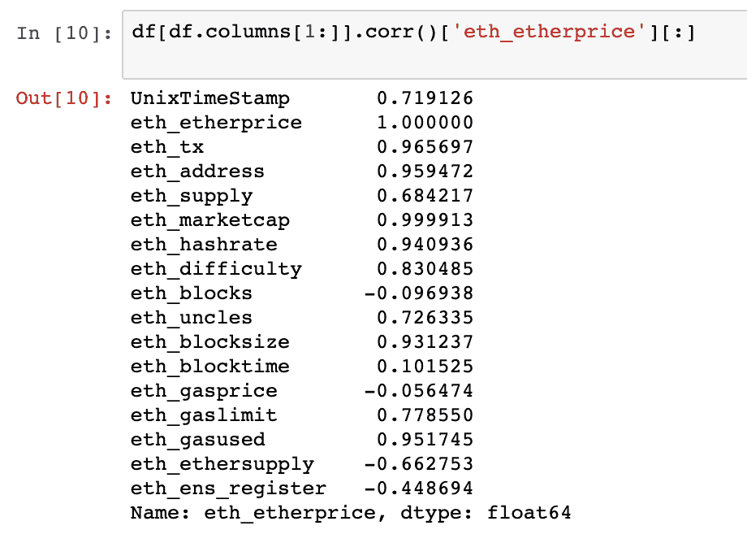

作者图片

这些是我发现对 eth_etherprice 影响最大的 9 个变量。corr 列表以及上面完成的其他数据浏览步骤:' eth_tx '，' eth_address '，' eth_marketcap '，' eth_hashrate '，' eth_blocksize '，' eth_gasused '，' eth_gaslimit '，' eth _ difference '，' eth _ 叔伯'

为此，我将在本次挑战中进一步准备模型时使用这些变量。我将在我的模型中使用这些变量，探索包含在我的模型中的变量的最佳组合。

## 考虑到 P 值和相关值，经过几次不同模型的迭代后，我最终保留了这些变量

' eth_address '

' eth_hashrate '

eth_tx '

' eth_blocksize '

' eth _ difference '

' eth_gasprice '

## 在我们开始之前，我将把我们的定价移动 30 天，这样我们的变量就与未来的日期相匹配。这将允许我们的模型使用现有的变量为未来 30 天定价，以便我们以后可以使用它进行预测。

这样做将确保我们的模型可以预测未来 30 天的乙醚价格，否则我们的模型不会告诉我们太多，因为我们收集的数据是实时发生的。下面我创建了一个名为 ether30 的新专栏。

作者图片

## 看起来我们已经为下一步做好了准备，现在我们已经考虑了空值，并创建了一个新的数据框架供我们处理。让我们开始模型探索吧！

# OLS:

## 首先，OLS 模型的 R 平方是 0.898，测试的 R 平方是 0.889

这可能是过度适应的表现，但我的测试和训练分数是相似的，所以看起来我可以相信结果。来看看其他模特表现如何！

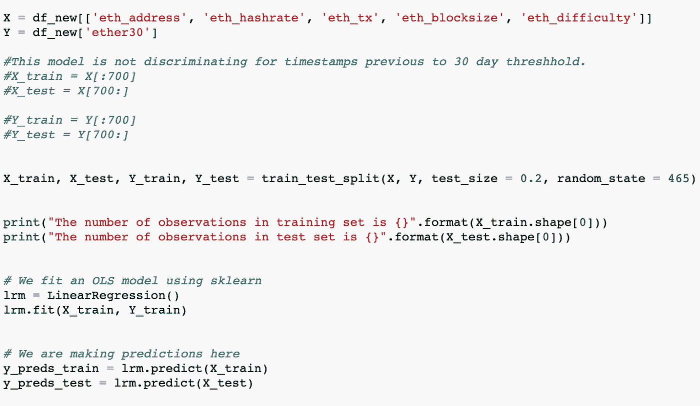

作者图片

关于型号选择:

我们希望了解每个模型的表现，最终这将影响我们最终选择进行预测的模型。下面是我们在选择模型时想要查看的 KPI 的可靠列表。我对平均绝对百分比误差和均方根误差以及 R 平方特别感兴趣。

您需要仔细考虑哪些指标与您和您的数据问题最相关，但这是一个很好的列表，可以帮助您开始自己排序和选择模型。以下列表适用于我的 OLS 模型。

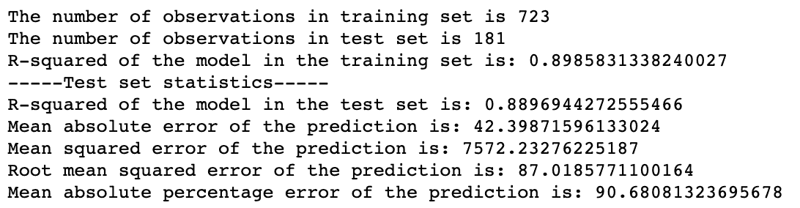

作者图片

# 接下来是岭回归模型:

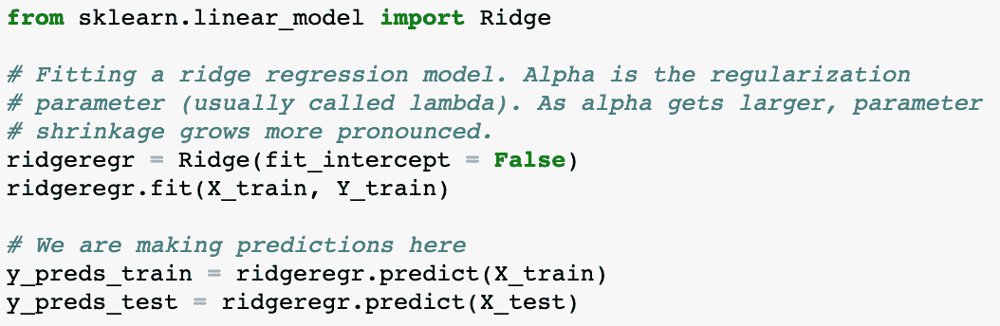

作者图片

太好了！让我们看看它与我们的 OLS 模型相比表现如何。

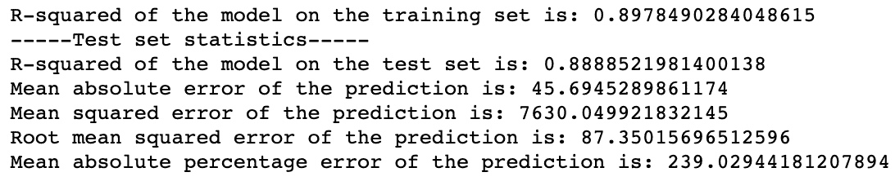

作者图片

## Ridge 为训练集生成了 0.897 的分数，为测试集生成了 0.888 的分数

接下来是 **Lasso，它在训练集和测试集上的得分分别为 0.898 和 0.889，与 OLS 差不多。**

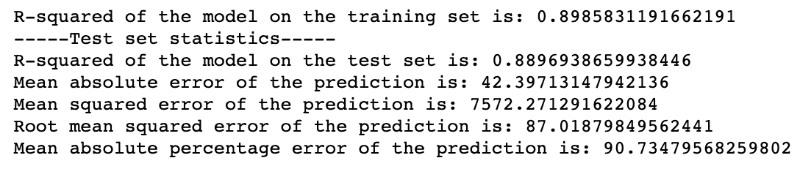

作者图片

# 与 OLS 和拉索一样，ElasticNet 在训练集和测试集上的得分分别为 0.898 和 0.889

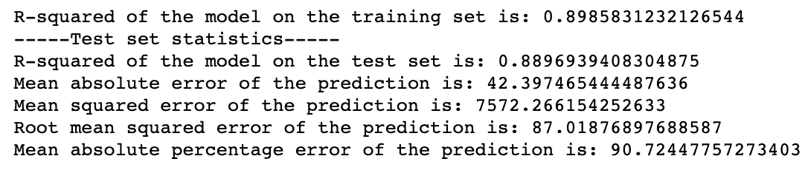

作者图片

# 线性回归在这里我们看到与 OLS、拉索和弹性网相同的分数:训练集的分数为 0.898，测试集的分数为 0.889

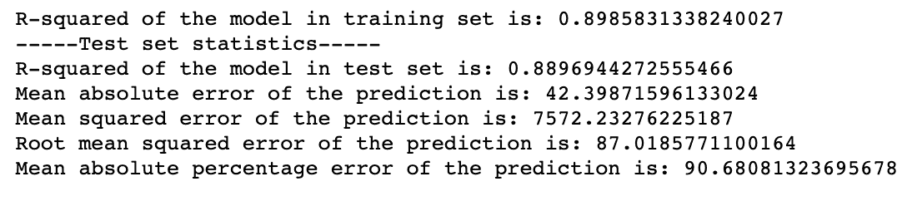

作者图片

# 随机森林:为了好玩，为什么不呢

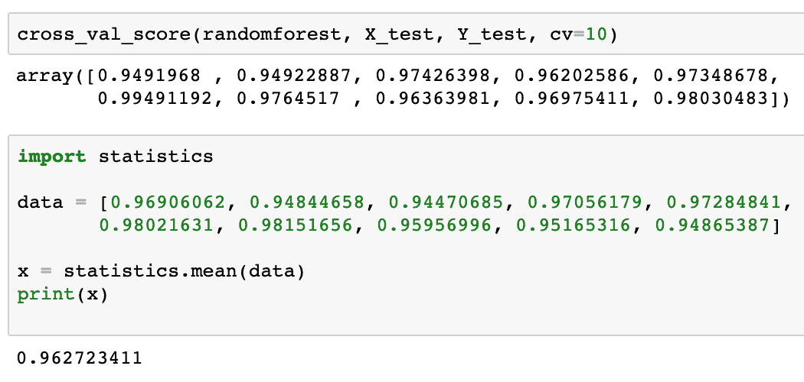

作者图片

这里必须使用交叉验证来得到一个公平的分数。

最后！KNN:

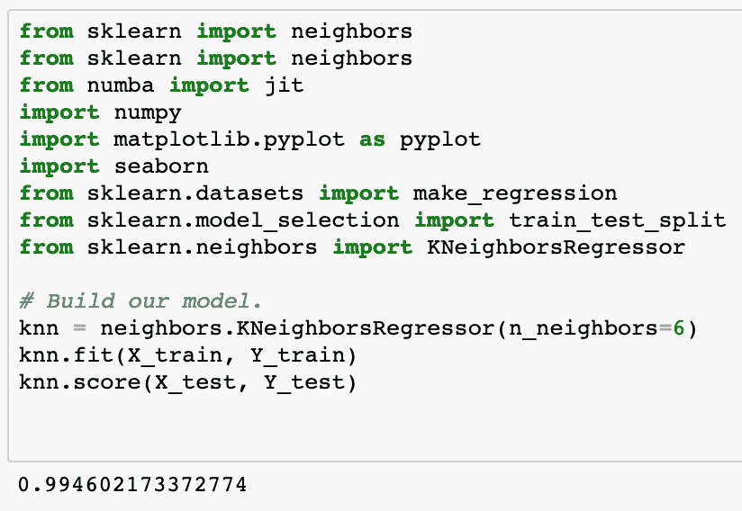

作者图片

. 994 的分数

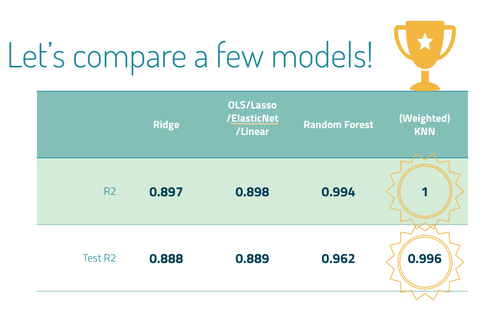

作者图片

还记得我们上面讨论的 R2 吗？这是它们真正出现的地方，我们可以鸟瞰它们。OLS、Lasso ElasticNet 和线性回归都有相同的分数，所以我把它们圈在一起。山脊略有变化。随机森林的表现优于所有线性回归，但目前表现最好的是加权 KNN。请随意看看火车，并在下面测试 R2。

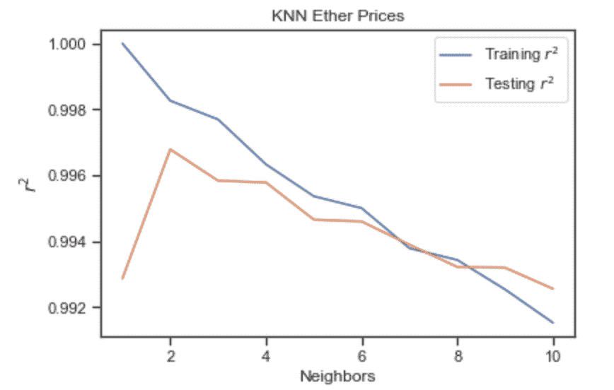

作者图片

现在为了这个项目的目的，我最终选择了 K 个最近的邻居，但是对于 KNN 有一些事情要记住:

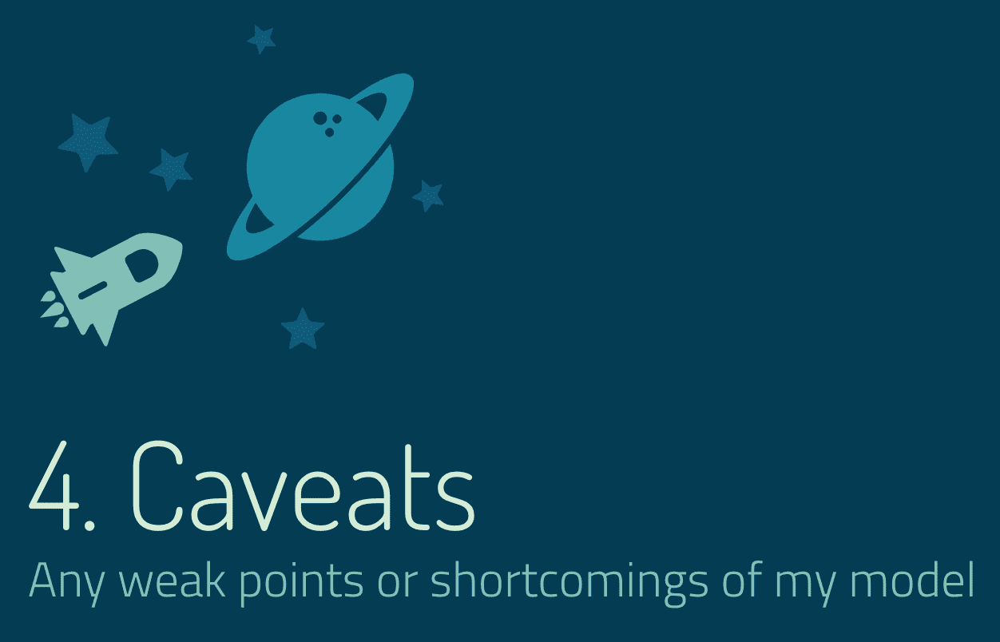

作者图片

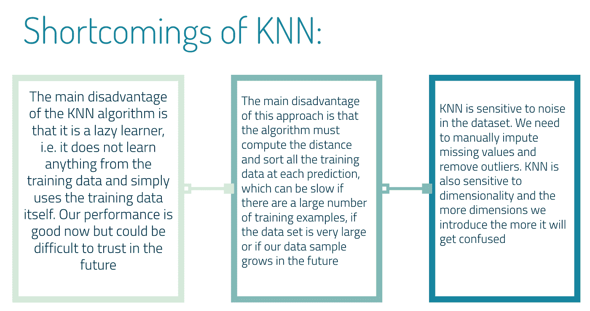

作者图片

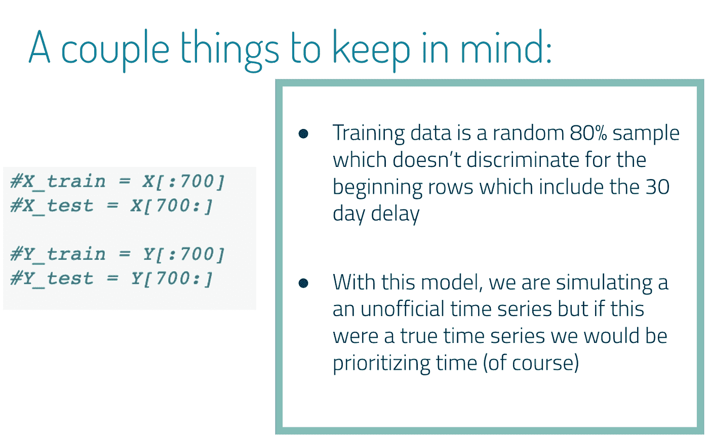

作者图片

我希望您喜欢这个使用机器学习进行预测的模型选择过程。这里的图片来自我的 jupyter 笔记本和我制作的幻灯片。