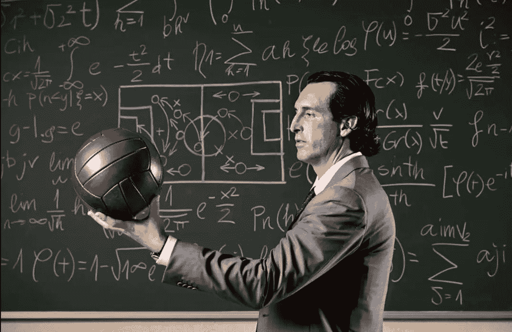
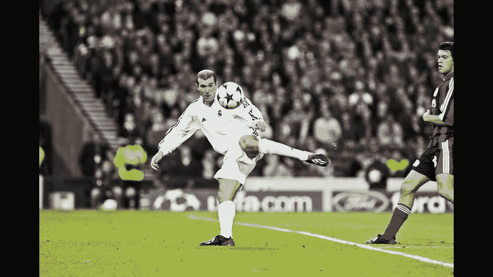
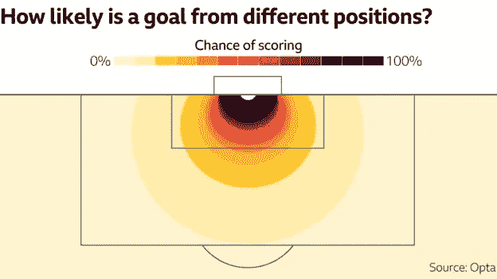
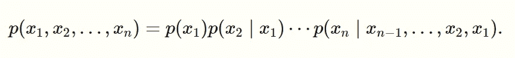
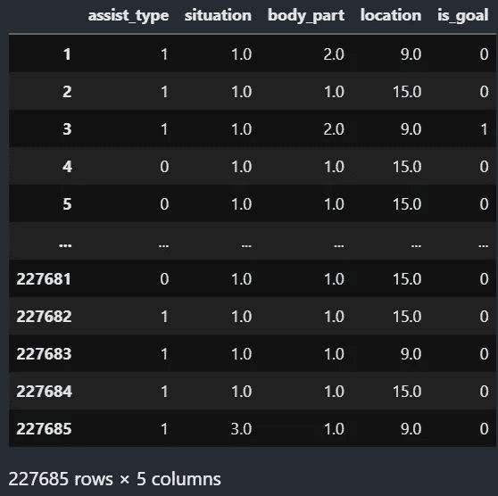
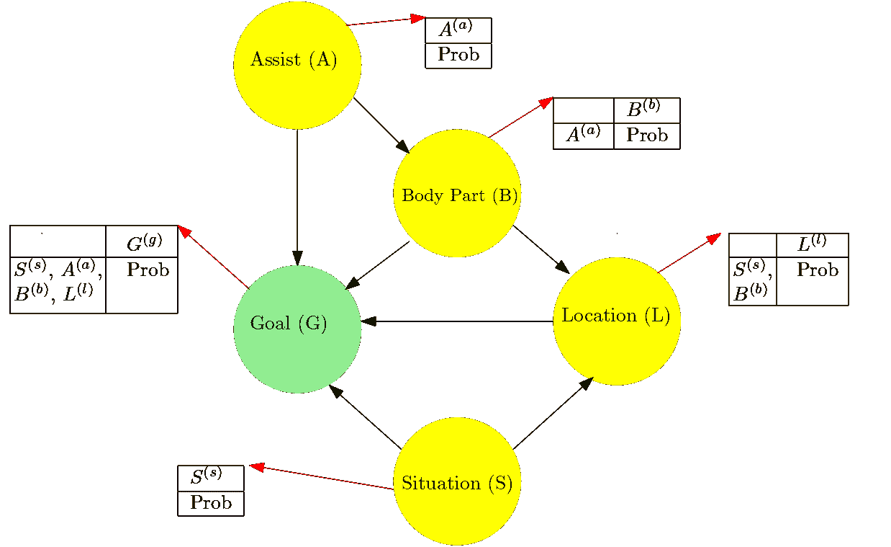
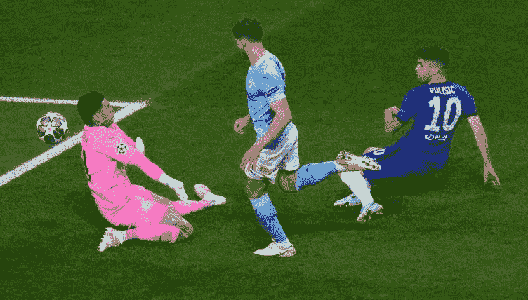
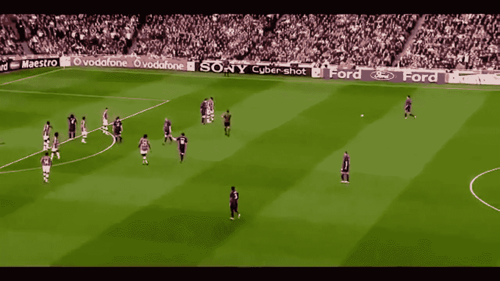

# 使用概率图形模型预测预期目标

> 原文：<https://medium.com/analytics-vidhya/predicting-expected-goals-using-probabilistic-graphical-models-5ea93e07f980?source=collection_archive---------8----------------------->



来源:[https://Twitter . com/RiZzyUTD/status/1299502980031492097/photo/1](https://twitter.com/RiZzyUTD/status/1299502980031492097/photo/1)

# **简介:足球分析和 PGMs**

足球是全球最受欢迎的运动，拥有数百万热情的球迷。这是一项充满活力的运动，利润丰厚，变数很多。这项运动最重要的方面是进球，有许多因素影响进球的结果。作为球迷，我们都经历过不可能进球的喜悦和错失良机的恐惧。在这篇文章中，我们将使用所谓的预期目标来讨论容易的机会或艰难的机会到底意味着什么。这项运动的动态性使得很难在早期正确地分析它的复杂性，因此预期的目标和它的建模相对较新。但是什么是预期目标呢？在这篇博客中，我将解释概率图形模型背后的理论以及它们在 Python 中的实现，以预测预期目标。



齐达内让它看起来很容易(在冠军联赛决赛中，同样如此)，但像这样的凌空抽射需要最大的技巧和精确度。来源:[https://www . cricket soccer . com/2020/05/15/zidane-magic-at-Glasgow/](https://www.cricketsoccer.com/2020/05/15/zidane-magic-at-glasgow/)

## 预期目标

预期进球(xG)是一个衡量射门质量的指标，它基于各种相关因素，如射门用哪只脚，球门有多远等。因此，在给定各种外部因素的情况下，它被用作表示射门得分的概率的度量。在形式上，xG 只是一个镜头的条件期望(即伯努利随机变量)。例如，考虑到其他因素(如与球门的角度和用于击球的脚)保持相似，从球门附近射门的球员比从远处射门的球员具有更好的 xG。

> 因此， *xG = P(Goal = 1| Features)*

其中 Goal = 1 表示射门进入球门的事件。



该图描绘了 xG 如何随球场上的位置而变化。

现在，我的目标是实现一个概率图形模型(PGMs)来预测预期目标，并随后将其与更实用的基本模型进行比较。但是 PGM 是什么呢？

## 概率图形模型

概率图形模型(PGM)，或简称为图形模型，可以被视为一种概率模型，其中随机变量之间的条件依赖结构由图形表示。例如，贝叶斯网模型是 PGM，其中用于表示变量集及其条件依赖的图是有向非循环图(DAG)。图形模型结合了图论和概率论，并提供了一个灵活的框架来模拟大量具有复杂交互作用的随机变量。我将使用贝叶斯网络模型，因为它更好地表现了拍摄中涉及的不同变量(因素)之间的因果关系。

## 贝叶斯网络

贝叶斯网络是一种 PGM，它利用有向无环图(Dag)来表示一组变量及其条件依赖性。贝叶斯网络是一族概率分布，它允许使用有向图自然描述的紧凑参数化。根据链式法则我们知道，



来源:[https://ermongroup . github . io/cs 228-notes/representation/directed/](https://ermongroup.github.io/cs228-notes/representation/directed/)

一个紧凑的贝叶斯网络是这样一种分布，其中右边的每个因素只取决于少数祖先变量 *xAi* :


来源:[https://ermongroup . github . io/cs 228-notes/representation/directed/](https://ermongroup.github.io/cs228-notes/representation/directed/)

换句话说，联合分布因子是条件分布的乘积。

# 一个直觉，为什么是 PGMs？

标准的 xG 模型通常使用简单的模型，如逻辑回归或梯度推进来预测概率。这是假设影响射击结果的大量因素是独立的。我们的目标是看看我们是否可以通过贝叶斯网络利用镜头中涉及的各种变量之间的相互依赖性来预测预期目标，并将其与同一数据集上的梯度推进分类器进行比较。贝叶斯网络也经常胜过回归，特别是在确定变量的影响方面。

使用贝叶斯网络的另一个优点是，它提供了推断边际推理的能力，这是一个很好的工具，可以准确地了解哪些因素以什么方式影响我们的拍摄。

我将在这里实现两个模型。第一个，梯度推进分类器，将是我的基本模型。然后，贝叶斯网络模型。接下来，我将使用一个简单的有向无环图来表示我的贝叶斯网络，预处理数据，学习参数并推断结果。最后，在建模过程之后，我将在真实的足球比赛中测试这些模型。

# 数据探索和预处理

我使用了 Kaggle 上可用的优秀数据集——“足球赛事”，[https://www.kaggle.com/secareanualin/football-events,](https://www.kaggle.com/secareanualin/football-events)，它总结了 2011-12 赛季和 2016-17 赛季之间欧洲五大联赛(EPL、西甲、意甲、德甲和法甲)的所有比赛。该数据集总共包含 9，41009 个事件，其中 22 个特征详细描述了每个事件。在这些比赛中，我只参加了那些被认为是试图进球的比赛。因此，我们得到了总拍摄次数，结果为 2，27685 次拍摄。其中，不到 25000 个是进球。此外，在 22 个特征中，我考虑了 5 个重要的变量来构建 DAG，以表示我们的贝叶斯网络。它们是:“位置”、“身体部位”、“辅助方法”、“情况”和“目标”。

位置:这个特征捕捉了射门时到目标的距离和角度。球场的进攻半场分为以下 19 个区域:

1 —进攻半场
2 —防守半场
3 —禁区中央
4 —左翼
5 —右翼
6 —难角远射
7 —左侧难角
8 —右侧难角
9 —禁区左侧
10 —六码禁区左侧
11 —禁区右侧
12 —六码禁区右侧
13 —非常近距离
14 —点球点
15 —禁区外
16 —远距离
17 —超过 35 码
18 —超过 40 码
19 —未记录

其中 5 个被丢弃，即“进攻半场”，因为这个区域已经被其他区域完全覆盖，“防守半场”，因为这种投篮在一个赛季中只有一次。在计算中，我们可以安全地忽略它们，“左翼”、“右翼”，因为没有一个记录的镜头是从侧翼拍摄的，并且“没有记录”，这些包括没有记录位置的镜头，因此我们忽略它们。

身体部位:这个特性告诉我们球员用来击球的身体部位。

1 —右脚
2 —左脚
3 —头部

辅助方法:该功能捕捉导致拍摄的事件。

0 —无
1 —传球
2 —交叉
3 —头球传球
4 —传球

情境:情境是指游戏过程中的下列情况之一:

1 —空位
2 —定位球
3 —角球
4 —任意球

IS_GOAL:这是一个简单的伯努利变量，告诉我们击球的最终结果:

0 —不是目标
1 —目标

因此，我们的最终数据表如下所示:



# 梯度推进分类器

我们将首先实现一个简单的梯度推进(GB)分类器模型作为我们的基础模型。

梯度推进是一种用于增强机器学习模型性能的技术。在我们的例子中，我们在决策树分类器上使用它。在这个过程中，首先我们选择一个适当的可微损失函数。然后，我们取一个常数作为整个数据集的预测，以使损失函数最小化。此外，我们在伪残差(损失函数的梯度)上迭代地训练模型。每次迭代后，我们进行预测，并使用这些预测计算下一组伪残差。

最后，该模型被附加到我们先前的模型，并且对伪残差的预测被乘以学习率，并且被添加到天真的预测(被添加到在该迭代之前做出的预测)。较小的学习率可以确保我们避免过度适应。

当我们在数据集上实现分类器时，我们得到了以下结果。

```
==============================
GradientBoostingClassifier
****Results****
Validation Accuracy: 90.8572%
Test Accuracy: 91.1986%
==============================
```

正如我们所看到的，我们得到了很高的准确率(> 90%)。这部分是由于我们的数据非常不平衡，目标与失误的比率约为 0.1。混淆矩阵如下所示。

```
array([[182526,   1672],
       [ 17044,   3674]])
```

我们现在还不能下很多结论，因为 xG 并不完全是进球得分。因此，让我们先建立我们的主要模型，然后再将它们与世界和彼此进行比较。

## 我们的有向无环图(DAG)

DAG 用于表示贝叶斯网络。我是一个狂热的足球迷，主要使用领域知识来构建我的 DAG。

分布表以简洁的格式显示。这些将在下一部分学习。



我的贝叶斯网的 DAG

在上图中:

a 在{0，1，2，3，4}
s 在{1，2，3，4}
l 在{3，6，7，8，9，10，11，12，13，14，15，16，17，18}
b 在{1，2，3}
g 在{0，1}

因此，在我们的情况下，联合概率分布将是:

*P(A，S，L，B，G) = P(A)。P(S)。P(B|S)。P(L|B，S)。P(G|A，S，B，L)*

## 学习参数

我们使用贝叶斯参数估计来学习变量(图中的节点)的条件概率分布表(CPD)。贝叶斯参数估计从已经存在的先验 CPD 开始，表达我们在观察数据之前对变量的信念。然后，使用来自观测数据的状态计数来更新这些“先验”。因此，最初，我认为所有状态都是等概率的，然后使用提供的数据进行更新。

# 测试和结果

现在我们已经准备好了两个模型，我们准备在现实生活中测试它们。我们将从场地的不同位置随机拍摄 3 张照片，并完成 1 场比赛。我通过观看 YouTube 视频记录了这些镜头的变量，并从[*fbref.com*](http://fbref.com)*获得了这些镜头的现有 xG。*然后，我们可以比较和分析结果，进而比较和分析模型。

但是，在此之前，让我们通过检查 xG 的一些简单位置来对这两个模型进行一次健全性检查。在这里，贝叶斯网络给了我们很高的灵活性，因为我们不必把所有的变量。

对于 GB 型号:

*非常近射程，右脚，空当，无助攻:0.6
35 码外，左脚，空当，传球:0.01
右脚点球:0.76*

因此，我们得到了大致预期的结果。

对于国阵:

*非常近的射程，右脚:0.59
35 码以上传出:0.06
点球:0.77
头球从高难度角度传中:0.02*

结果看起来足够可靠，可以继续进行。

这里的一个分析是关于近距离射击的 xG。有人可能会认为，近距离射击一定有很高的 xG。但是，事实是，更多的时候，这样的投篮暗示着可能也有防守球员阻挡投篮。在我们的数据集中，来自框内和框周围的大量被阻挡镜头意味着我们的模型倾向于对此类镜头给出较低的 xG，即使实际镜头可能没有被阻挡。

现在，我们开始着手在一些真实的镜头上测试我们的模型！

## 镜头 1:恩戈洛·坎特在冠军联赛决赛中的头球 2020–21:

***xG(fbref)= 0.1
GB 型号= 0.1069
BN 型号= 0.1174***

梯度推进方法在这里表现得非常好，我们的 BN 模型也做得非常好。所以这是一个好的开始！

## 镜头二:欧冠决赛克里斯蒂安·普利西奇失手 2020–21:

***xG(fbref) = 0.3
GB 型号= 0.41
BN 型号= 0.38***



普利西克在今年的 CL 决赛中差一点就达到了目标。来源:[https://www . planet football . com/videos/watch-Christian-pulisic-miss-massive-chance-double-chelseas-lead-in-champions-lead-league-final/](https://www.planetfootball.com/videos/watch-christian-pulisic-misses-massive-chance-to-double-chelseas-lead-in-champions-league-final/)

两个模型预测的 xG 都比实际的高。BN 模型稍微好一点。这种较高预测的原因可能在于我们的模型没有考虑球员如何击球。是凌空抽射，还是杂技式射门，球员是否失去平衡(就像在这种情况下)，等等。这些因素也使击球更具挑战性，从而降低 xG。

## 镜头 3:克里斯蒂亚诺·罗纳尔多在 2008-09 欧冠半决赛对阵阿森纳的 40 码任意球:

***xG(fbref) = ~0
GB 型号= 0.002
BN 型号= 0.0001***



这个任意球最终进了球门！来源:[https://Twitter . com/TeamCRonaldo/status/992716656907517957/photo/1](https://twitter.com/TeamCRonaldo/status/992716656907517957/photo/1)

正如你可能已经猜到的，这样一个 40 码左右的任意球的实际 xG 几乎可以忽略不计。但是，相对而言，我们的 BN 模型在这种情况下表现得更好。这可能是因为在 BN 模型的情况下，位置和位置之间的相互依赖性(在这种情况下，任意球)给出了非常小的 xG。

现在，让我们在比赛中测试我们的模型。我们来看看 2016 年 4 月 2 日皇家马德里队 2:1 击败巴塞罗那队的联赛。我为皇马的 15 次射门预测了 xG，总结了一下。我拿了 understat.com 的数据

***xG(understat)为 RM = 1.55***

***由 GB 模型预测的 xG = 1.67***

***BN 模型预测的 xG = 1.62***

注意:正如我们前面看到的，使用贝叶斯网络的一个重要优势是边际推理的可能性。因此，我们将通过找出在特定类型的辅助下使用特定身体部位的概率来检验这一理论。因此，我们将以十字架为例。凭直觉，我们知道在十字架的情况下，最有可能用到的身体部位是头部。让我们看看我们的模型预测了什么。

***P(头|横)= 0.6849***

因此，结果是意料之中的。

# 一些结论

在对模型进行测试之后，我们可以有把握地说，我们假设使用贝叶斯网络来利用尝试中涉及的不同变量之间的因果关系，这确实证明是预测 xG 的一个好模型。此外，我们用一个基础模型(在这种情况下，梯度推进分类器通常比简单的逻辑回归模型更好)对它进行了测试，结果证明我们确实是在正确的轨道上。然而，我在测试过程中确实遇到了一些缺点，这意味着有明显的改进和完善的余地。

## 缺点

一个重要的缺点是，我们的数据集非常倾斜，也就是说，我们的数据集中最终成为目标的射门数量几乎比没有成为目标的射门数量少 10 倍。对所述问题的一种可能的解决方案是使用自适应增强技术。解决这个问题的另一种方法是考虑到阶层不平衡，实施加权逻辑回归。

我们拥有的数据(约 23 万次射门)肯定不足以涵盖足球的许多错综复杂之处。因此，一个明显需要改进的地方是用更多不同季节的数据进行训练。

另一个明显的缺点是忽略了很多影响击球的变量，但这些变量在数据中是不存在的。这些因素包括球员尝试射门的类型、球员和球门之间的球员数量、球员击球前的方向、球员的素质等。这些都是影响拍摄的重要特征，考虑这些会导致更精细和更好的结果。

我们模型的一个主要缺点是从盒子中心拍摄的情况。该模型通常给出比预期低得多的 xG。这可能是因为我们的模型没有一个参数来告诉它在球员面前有多少防守者可以阻挡投篮。然而，该数据包含许多被阻挡的镜头，因此，我们的模型，一般来说，对于来自盒子中心的镜头给出小得多的 xG，因为来自该位置的镜头往往被阻挡..

# 未来计划

我很喜欢做这个项目，我期待着进一步的工作。结果表明，我们走在正确的道路上，我会继续努力！

向前迈出的重要一步应该是解决数据失真的问题，并随后使用各种算法来解决这个问题。

请通过下面的 GitHub 链接找到上述项目的所有代码。

[https://github.com/DakshS07/xG_Football](https://github.com/DakshS07/xG_Football)