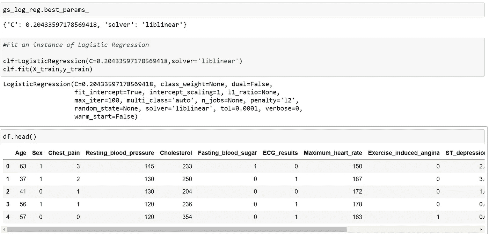
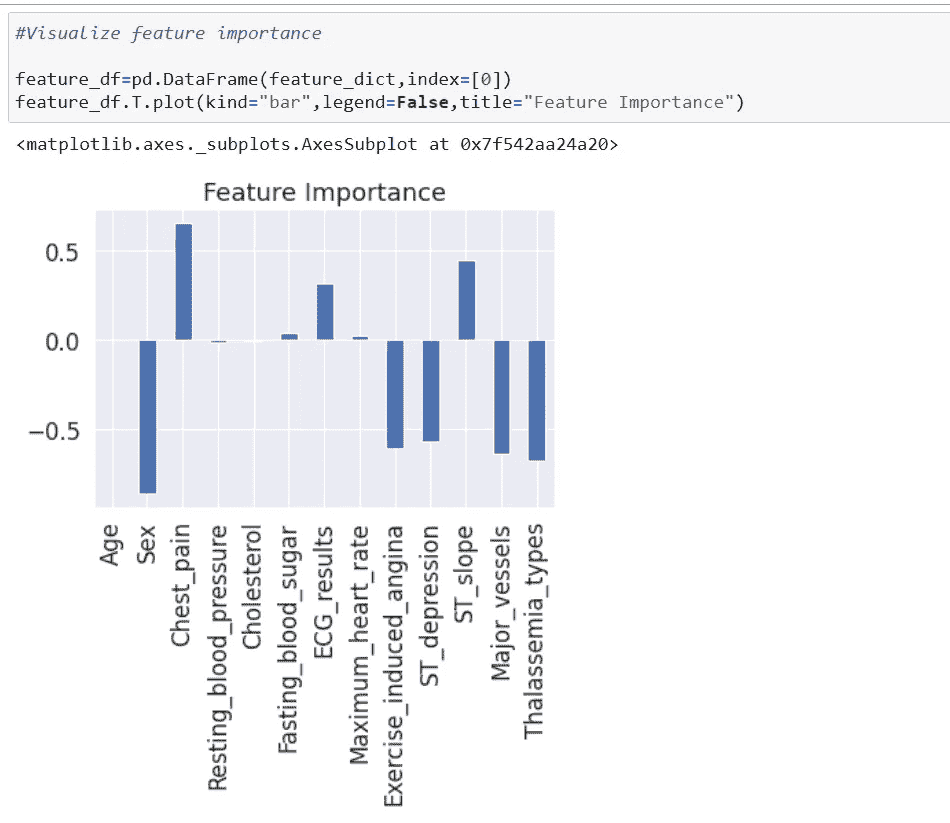

# 使用机器学习预测心脏病

> 原文：<https://medium.com/analytics-vidhya/predicting-heart-disease-using-machine-learning-ce10cfce41a6?source=collection_archive---------3----------------------->

本文讨论了各种基于 Python 的 ML 和数据科学库，以构建一个能够根据医疗属性预测某人是否患有心脏病的机器学习模型。

## 我们将采取以下方法:

## 1.问题定义

## 2.检索数据

## 3.了解功能

## 4.数据准备及其工具

## 5.探索性数据分析

## 6.系统模型化

## 7.模型评估

# 1.**问题定义**

给定病人的临床参数，我们能预测病人是否有心脏病吗？

我们的目标是达到 85%以上的模型精度。如果模型得分高于 85%，我们将选择该模型。

# 2.**检索数据**

原始数据来自 UCI 机器学习知识库中的 Cleveland 数据，以及 Kaggle 上的一个版本。

 [## 心脏病 UCI

### https://archive.ics.uci.edu/ml/datasets/Heart+Disease

www.kaggle.com](https://www.kaggle.com/ronitf/heart-disease-uci?select=heart.csv) 

# 3.**了解特性**

1.**年龄:**显示个人的年龄。

2.**性别:**使用以下格式显示个人的性别:

1 =男性

0 =女性

3. **cp(胸痛类型):**使用以下格式显示个人经历的胸痛类型:

0 =典型心绞痛

1 =非典型心绞痛

2=非心绞痛性疼痛

3 =渐近

4. **trestbps(静息血压):**显示个人的静息血压值，单位为 mmHg(单位)

5. **chol(血清胆固醇):**显示血清胆固醇，单位为毫克/分升(单位)

6. **fbs(空腹血糖):**将个人的空腹血糖值与 120mg/dl 进行比较。

如果空腹血糖> 120mg/dl，则:1(真),否则:0(假)

7. **restecg(静息心电图):**显示静息心电图结果 0 =正常

1 =波异常

2 =左心室机能亢进

8. **thalach(达到的最大心率):**显示个人达到的最大心率。

9. **exang(运动诱发的心绞痛):**

1 =是

0 =否

10. **oldpeak(运动相对于静息诱发的 ST 段压低):**显示整数或浮点数的值。

11.**斜率(峰值运动 ST 段):**

0 =上升

1 =平坦

2 =下坡

12. **ca(透视着色的主要血管数(0-3):**显示整数或浮点数。

13.**地中海贫血:**显示地中海贫血(一种遗传性血液疾病，导致您的身体血红蛋白低于正常水平) :

0 =正常

1 =固定缺陷

2 =可逆缺陷

14.**目标(心脏病诊断):**显示个人是否患有心脏病:

0 =缺席

1 =存在

# 4.**数据准备及其工具**

**熊猫& Numpy** 进行数据分析和处理

用于数据可视化的 Matplotlib 和 Seaborn

**sci kit-了解**建模和评估

# 5.探索性数据分析

# 6.系统模型化

我们必须对模型进行实验，尝试 3 种不同的模型，获得结果，并在以后进行比较。

现在我们已经将数据分为训练集和测试集，是时候建立一个机器学习模型了。

我们将在训练集上训练它(找到模式)，并在测试集上测试它(使用模式)。

**我们将尝试 3 种不同的机器学习模型:**

**1。逻辑回归**

**2。k-最近邻分类器**

**3。随机森林分类器**

现在我们有了一个基线模型…而且我们知道模型的第一次预测并不总是最终的。

我们下一步应该做些什么？

让我们看看下面的内容:

*   超参数调谐
*   特征重要性
*   混淆矩阵
*   交叉验证
*   精确
*   回忆
*   f1-分数
*   分类报告
*   受试者工作特征曲线
*   曲线下面积

**我们获得了大约 89%的准确率。因此，我们将选择模型。**

# 评估我们经过调整的机器学习模型分类器，超越准确性

*   ROC 曲线和 AUC 评分
*   混淆矩阵
*   分类报告
*   精确
*   召回
*   f1-分数

还有交叉验证

为了进行比较和评估我们的训练模型，首先，我们需要进行预测。

1.  **ROC 曲线和 AUC 评分**

2.**混淆矩阵**

3.**分类报告**

4.**交叉验证**

*   准确(性)

*   精确

*   f1-分数

交叉验证分类指标的比较

## 特征重要性

特性重要性是另一种提问方式，“哪些特性对模型的结果贡献最大，它们是如何贡献的？”

# 结论

心脏病是当今社会的主要问题之一。很难根据风险因素人工确定患心脏病的几率。然而，使用机器学习，我们将很快预测这个人是否患有心脏病。由于心脏病分类的快速和准确，医生将为患者提供适当的治疗并挽救他们的生命。

快乐学习:)

Github 链接:-[https://github . com/pulkitkhandelwal 29/Heart-Disease-class ification](https://github.com/pulkitkhandelwal29/Heart-Disease-Classification)