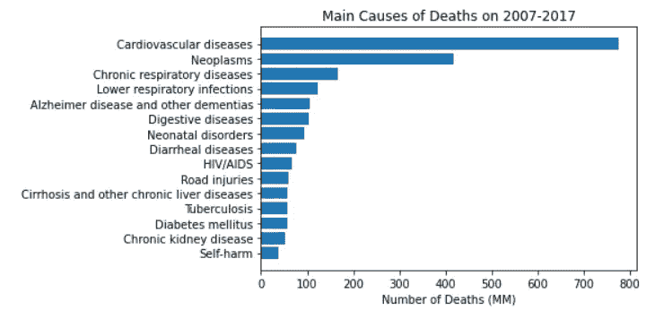
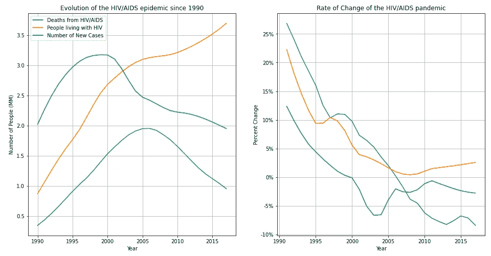
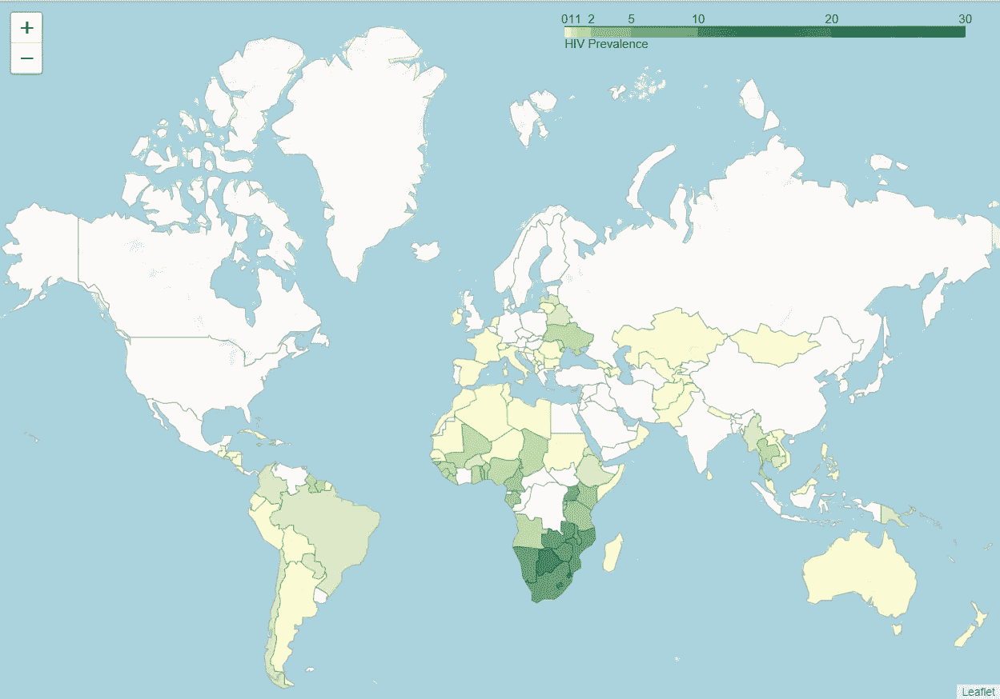
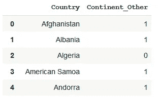
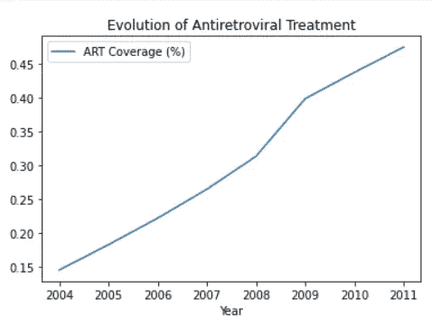
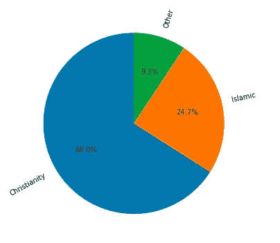
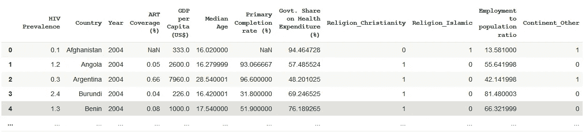
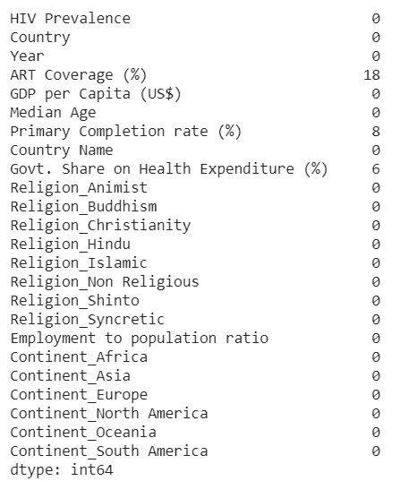
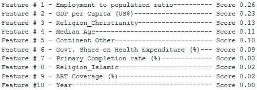
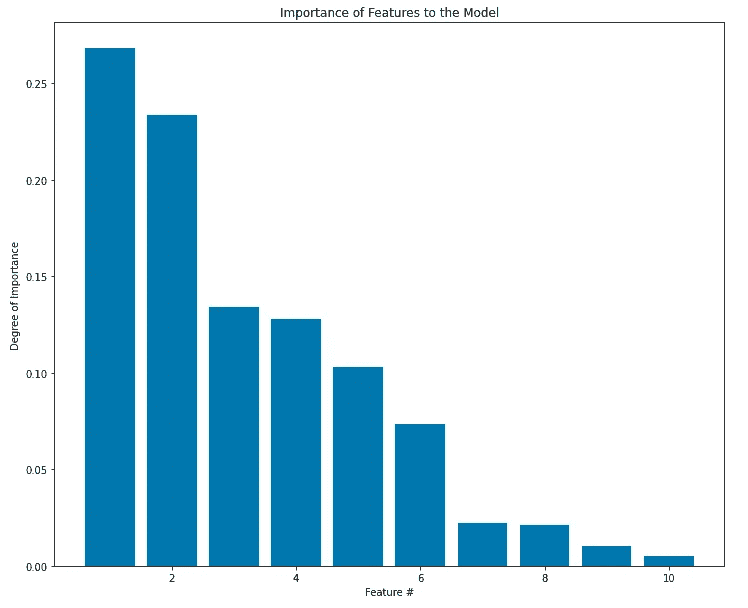

# 预测 HIV 流行及其影响因素:有目的地使用 ML

> 原文：<https://medium.com/analytics-vidhya/predicting-hiv-prevalence-and-its-factors-using-ml-with-purpose-86e58dd242e0?source=collection_archive---------17----------------------->


来源:https://medicinasa.com.br/hiv-aids-2020/

## 介绍

作为 [Python for Data Science](https://learning.edx.org/course/course-v1:UCSanDiegoX+DSE200x+2T2020/home) 课程(UCSanDiegoX on Edx)的一部分，学生们被要求开发并展示一个机器学习项目作为最终任务。

经过深思熟虑，并受到毁灭性的疫情(不，是另一个)的影响，我决定**分析并尝试预测各国的艾滋病流行情况，目的是帮助政府更准确地了解其状况，并制定更好的公共卫生政策来抗击艾滋病毒/艾滋病疫情。**

## 理解问题

感染了人类免疫缺陷病毒(HIV)的人会发展成获得性免疫缺陷综合征(AIDS)。当艾滋病发生时，人体免疫系统可能会受到严重冲击，从而导致其逐渐衰退，最终衰竭。出于这个原因，人体会暴露于其他感染或机会性癌症——这通常不会给免疫系统健康的人带来严重问题。



正如我们所看到的，在 2007 年至 2017 年的十年间，艾滋病毒/艾滋病在主要死亡原因中排名第九，导致大约 6800 万人丧生。

```
hiv_df_year = hiv_df[hiv_df["Year"]>=1990].groupby(by ="Year").sum()fig, ax = plt.subplots(1,2, figsize=(16,8))ax[0].plot(hiv_df_year.index,hiv_df_year["Deaths"]/1e6)
ax[0].plot(hiv_df_year.index,hiv_df_year["People living with HIV"]/1e7)
ax[0].plot(hiv_df_year.index,hiv_df_year["New Cases"]/1e6
ax[0].set_title("Evolution of the HIV/AIDS epidemic since 1990")
ax[0].set_xlabel("Year")
ax[0].set_ylabel("Number of People (MM)")
ax[0].legend(["Deaths from HIV/AIDS", "People living with HIV", "Number of New Cases"])
ax[0].grid()hiv_df_year_pct = hiv_df_year.pct_change()ax[1].plot(hiv_df_year_pct)
ax[1].set_title("Rate of Change of the HIV/AIDS pandemic")
ax[1].set_xlabel("Year")plt.grid()
plt.show()
```



过去 30 年疫情艾滋病毒/艾滋病的演变

上图中，我们可以通过过去三十年的死亡人数和病例数来观察这种流行病的行为。在 90 年代，病例和死亡人数急剧上升，呈现出一种几乎无法控制的局面。

到上一个千年结束时，新病例的趋势发生逆转，六年后，死亡人数随之下降。这可能是由于更高的认识、抗逆转录病毒疗法的发展或防腐剂的使用。

另一方面，感染艾滋病毒的人数从未停止增加，这表明疫情还没有接近尾声，应该相应地加以解决。

目前，有 3800 万报告病例，没有治愈方法。由于它可能对我们的免疫系统造成损害，艾滋病毒/艾滋病是世界上主要的死亡原因之一，特别是在撒哈拉以南非洲地区。

```
geo = r"archive/custom.geo.json"
geo_json = json.load(open(geo))mapa = f.Map(
width=1000, height=700,
zoom_start=3
)f.Choropleth(
geo_data=geo_json,
name='choropleth',
data=HIV_Prevalence[HIV_Prevalence["Year"]==2019],
bins=[0,0.5, 1, 2, 5, 10, 20, 30],
columns=['Country', "HIV Prevalence"],
key_on = "feature.properties.name",
fill_color="YlGn",
nan_fill_color = "white",
fill_opacity=0.7,
line_opacity=0.2,
legend_name='HIV Prevalence').add_to(mapa)mapa
```



UNAIDS 提供了全球艾滋病流行的年度估计，我们可以看到，撒哈拉以南非洲地区的艾滋病流行尤为严重。覆盖了埃斯瓦蒂尼(前斯威士兰)28%以上的人口！

由于疫情在非洲特别活跃，我对大陆列进行了编码，以表明该国是否属于这个大陆。

```
country_df = pd.read_csv(r"archive/continents.csv")
country_df.rename(columns={"Code":"StateAbb"}, inplace = True)
country_df = country_df.query('Continent != "Antarctica"')
other =
country_df[~country_df["Continent"].isin({"Africa"})].loc[:,"Continent"].unique()
country_df.replace(to_replace=other, value="Other", inplace = True)
country_df = pd.get_dummies(country_df, columns = ["Continent"], drop_first= True)
country_df.drop(columns = ["StateAbb"], inplace = True)
```



## 探索可能影响疫情的因素

为了探索新病例数量下降的原因，我寻找了感染艾滋病毒和接受抗逆转录病毒治疗的人口比例，以便将这两个变量联系起来。



此外，宗教对人们的性生活行为起着重要的作用。所以我想，宗教偏好是否也是计算艾滋病流行率的一个重要特征。



2/3 的国家主要是基督教，1/4 的国家是伊斯兰教，其次是佛教和其他宗教，主要分布在东南亚。

我再次使用热编码将宗教信息转换成数字，小心地删除其中一列以避免多重共线性。

接下来，我添加了我认为与确定艾滋病毒流行率相关的其他特征:

*   人均 GDP:一个富裕的国家应该有更多的资源来争夺疫情。
*   小学毕业率:受教育程度较高的人群可能接受过某种形式的性教育，这会让他们更加关注自己的健康状况。
*   女性就业率:经济上和社会上更独立的女性人口可能也更了解自己的健康状况，更不容易做出危险的行为。

现在我们已经有了构建模型所需的所有数据，让我们将它们全部合并起来。

```
df = pd.merge(art_coverage, GDP_per_capita, on=["Country", "Year"])
df = pd.merge(df, median_age, on=["Country", "Year"])
df = pd.merge(df, primary_completion_rate_total_percent_of_relevant_age_group, on = ["Country","Year"])
df = pd.merge(df, gov_share_health, left_on = ["Country", "Year"], right_on = ["Country Name", "Year"])
df = pd.merge(df, religion_preference, on = "Country")
df = pd.merge(df, woman_employed, on = ["Country","Year"])
df = pd.merge(df, country_df, on = "Country")
df = pd.merge(HIV_Prevalence[["HIV Prevalence", "Country", "Year"]], df,on=["Country", "Year"])
```



回归模型的最终数据框，有 593 行和 12 列。

接下来，检查是否有丢失的值(正如您在上面看到的，答案是肯定的)并处理它们是很重要的。

```
df.isna().sum()
```



因为只有几行有空值(4.5%)，所以删除它们是可以接受的，并且不会导致太多的数据丢失。

## 预测艾滋病毒流行率

是时候建立我们的模型并预测艾滋病毒的流行，以帮助(也许？)政府更好地解决这个问题。

在进行任何拟合之前，选择一个指标来评估我的回归模型的性能并计算基线误差，也就是说，一个天真的预测会给出的误差，这很重要。

```
y, X = df.iloc[:, 0], df.iloc[:,2:]X_train, X_test, y_train, y_test = train_test_split(X, y, test_size=0.3, random_state = 42)baseline_MAE = mean_absolute_error(y_true = y_test, y_pred = [y_test.mean()]*len(y_test))print(f"Baseline Mean Absolute Error (MAE): {baseline_MAE:.2f}")
```

基线平均绝对误差(MAE): 3.85

由于在训练和测试数据之间没有太多的数据要分割，我使用 cross_val_score 结合 shuffle split permutation 来计算决策树回归模型的平均 MAE 分数。我选择这种类型的模型是因为它的简单性和可解释性，但我确实打算以后使用其他模型。

```
treeregressor = DecisionTreeRegressor(criterion = "mae")cv = ShuffleSplit(n_splits=6, random_state=42)scores = cross_val_score(treeregressor, X, y,scoring = "neg_mean_absolute_error", cv=cv)print(f"Mean MAE using CV: {-scores.mean():.2f} with standard deviation of {scores.std():.2}")
```

使用 CV 为 0.33，标准偏差为 0.11，得到的结果是**平均 MAE。**由于最终误差约为基线的 10%,我对此很满意。与误差的平均值相比，标准差很高，但与**艾滋病毒流行率的平均值(2.75%)相比，标准差却很高。**

## 包装它

最后，我探索了哪些特征是决策树分支分裂的最大决定因素。

```
treeregressor.feature_importances_
```



预测艾滋病流行的重要特征



我惊讶地发现，女性就业与总人口的比率是最关键的因素(0.26)，比人均国内生产总值(0.23)、抗逆转录病毒疗法覆盖率(0.02)和小学毕业率(0.01)更重要。

那都是乡亲们！这是我的第一个项目，也是一个非常具有挑战性的项目，因为我必须找到所有的数据，然后将它们缝合在一起。你可以仔细看看用于这个项目的 [Colab 笔记本](https://drive.google.com/file/d/1LXjaqfxOnQIO2EdyexZp-v-5us0soLDN/view?usp=sharing)，并通过 [LinkedIn](https://www.linkedin.com/in/pedro-figueiredo-77377872/) 与我联系。

编辑: [Nicofrancosaa](https://medium.com/u/969a98a2d325?source=post_page-----86e58dd242e0--------------------------------) 很好地向我询问了所收集数据的来源。由于我无法找到这个项目所需的数据集，我不得不构建它，因此数据来自不同的来源:

*   艾滋病毒流行率、妇女就业与人口比率、人均国内生产总值和小学毕业率— [世界银行](https://databank.worldbank.org/source/world-development-indicators)
*   按死因分列的死亡人数— [数据中的世界](https://ourworldindata.org/hiv-aids)
*   抗逆转录病毒疗法覆盖率、中位年龄和政府卫生支出占卫生总支出的百分比——世卫组织
*   宗教偏好— [ARDA](https://www.thearda.com/Archive/Files/Downloads/WRPGLOBL_DL2.asp)