# 预测酒店预订取消

> 原文：<https://medium.com/analytics-vidhya/predicting-hotel-booking-cancellations-3fe40d4522f8?source=collection_archive---------0----------------------->

在这篇博文中，我展示了我的项目的结果，该项目通过 Python 处理酒店预订需求、预测取消预订以及寻找影响变量。

葡萄牙河畔度假村

该项目的数据可以在这里找到[。](https://www.kaggle.com/jessemostipak/hotel-booking-demand)

**数据快速介绍:**数据集由清洗前的 119，390 次观察组成，包含 2015–2017 年葡萄牙一家城市酒店和一家度假酒店的预订信息。它包括 34 个变量，如预订和到达(年、月、日)、停留时间、取消与否、成人、儿童和/或婴儿的数量、可用停车位的数量、特殊请求的总量、预订的代理和/或公司等。

**清理数据后:**剩余 117864 个观测值。有 44，031 条取消预订和 73，833 条未取消预订。

这个项目的主要想法是找到预测预订取消的最佳分类模型，并找到客户取消的最佳解释变量。

这个项目的**动机**是描绘一幅更清晰的酒店预订需求图。作为一个消费者，在选择酒店时会考虑很多方面。预测取消不仅对度假者有用，对酒店也有用。

***研究问题:***

1.  预测酒店预订取消。
2.  哪些因素可以解释客户取消订单？

在我开始描述用来回答这些问题的方法之前，这里有一些简单的问题，通过一些描述性的统计来回答。

**描述性统计:**

*每个酒店哪个月最忙？*

正如人们可能会怀疑的那样，这两种酒店的拥挤时间尤其是夏季的七月和八月。

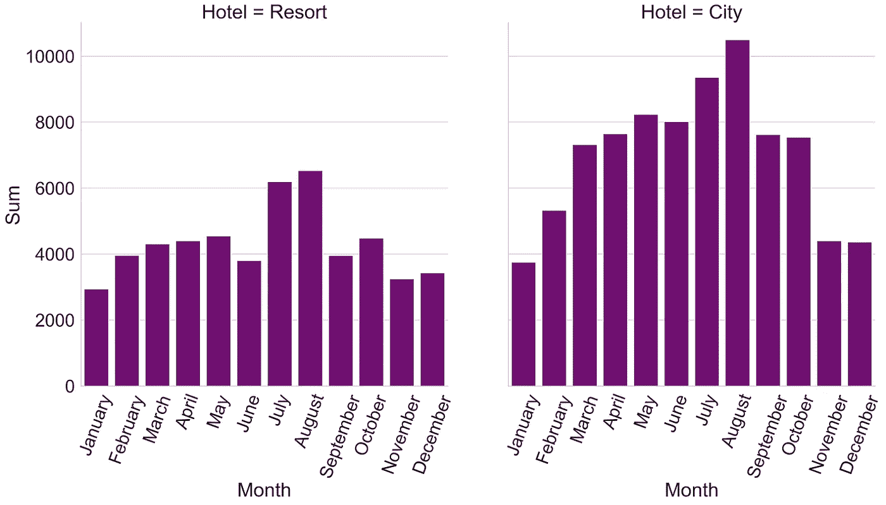

酒店内未取消的假期(按月)

*注:*数据来自所有未取消的预订。

人们在每家酒店住多长时间？

城市酒店有更多的短期度假者(1-5 晚)，而度假酒店更受欢迎的长期住宿(6 晚以上)。

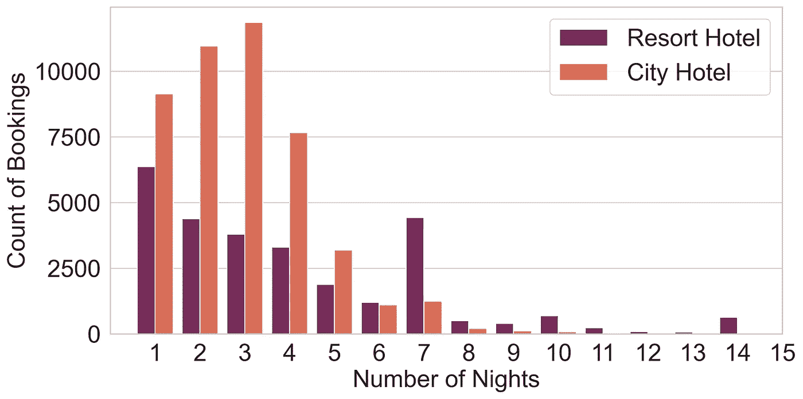

按酒店类型内的住宿天数统计的预订数

*注:*数据来自所有未取消的预订。

酒店取消预订的比例是多少？

我们可以看到，在度假酒店中，顾客取消预订的情况更少。

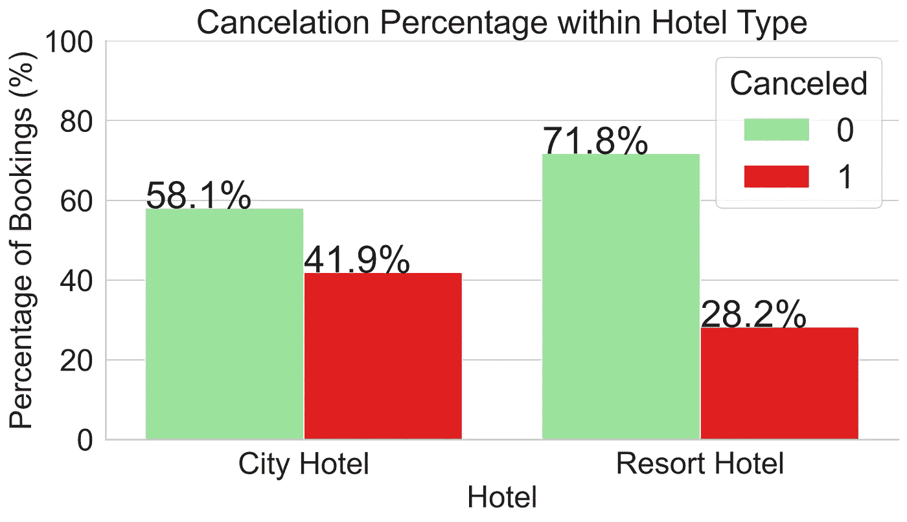

*不同客户类型之间按状态取消的比例是多少？*

家庭的定义是:一个房间里至少有一个成人和一个婴儿/儿童。

在所有取消的预订中，73.5%是夫妻预订的。酒店的客人大多是情侣。单个客户和家庭客户有相似的取消百分比。

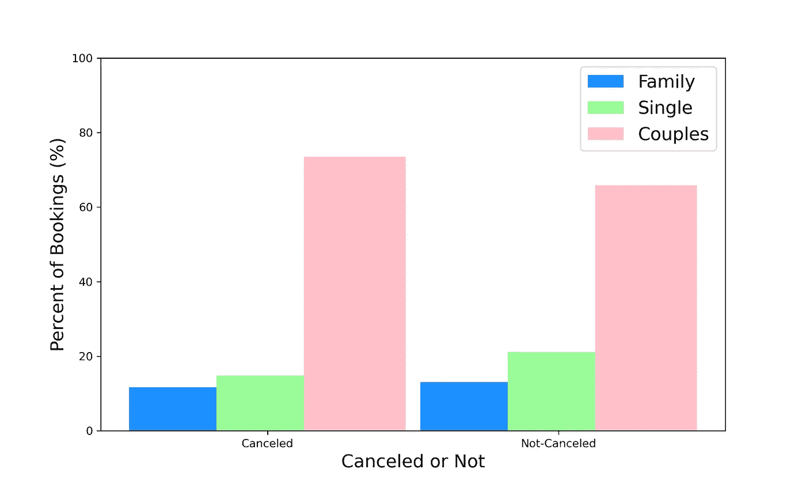

客户群内的取消百分比

我们预订假期到实际到达日期的时间和客户取消之间有联系吗？

*交付周期*被定义为从预订到实际到达日期之间的天数。

随着交付周期的增加，取消率相当高。

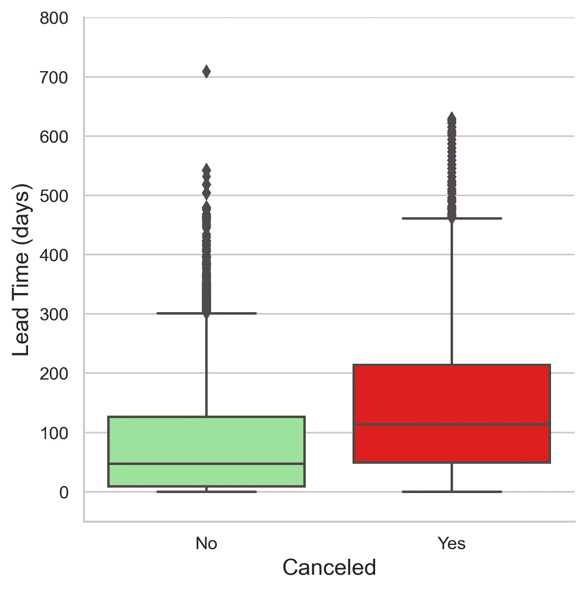

*以前的取消会影响将来的取消吗？*

在所有先前取消(*先前取消*大于或等于 1)的预订中，*先前取消* =1 的约占 93%。在这 93%中，有 94.7%的预订被取消。我们可以看到，随着取消数量的增加，取消率从大约 95%下降到 33%,直到*之前的取消数*大于或等于 13，取消率返回到大约 90 %, 14 之后，当前预订的取消率为 100%。

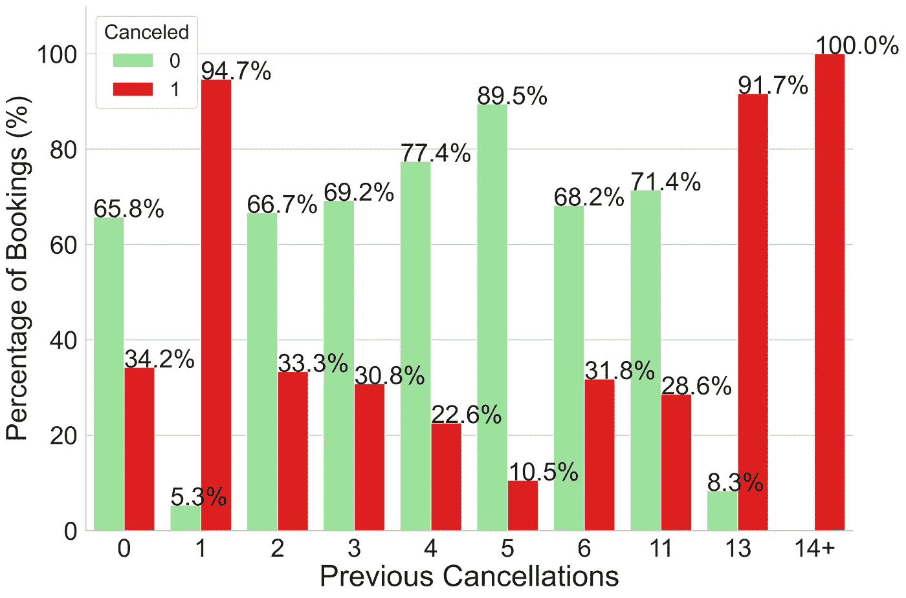

以前取消的取消百分比

有这么多不同的组合和发现，但我最喜欢的是下面的:

如你所见，顾客对酒店的特殊要求越多，他取消旅行的可能性就越小！

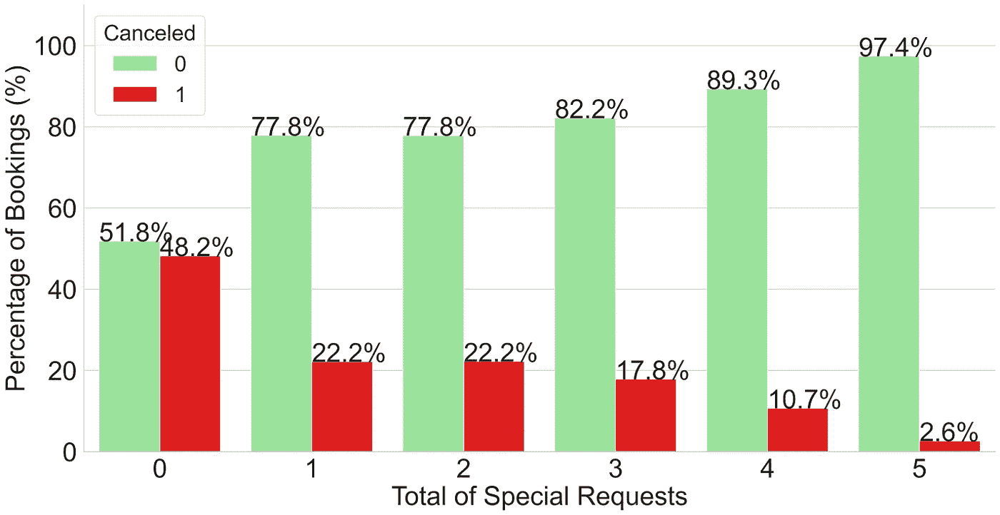

按特殊请求总数计算的取消百分比

现在，让我们深入到统计数据中…

首先，对我来说重要的是，这个项目是我从头开始使用 Python 的第一个项目。也就是说，学习如何用 Python 来使用、编码、运行和解释模型，是我遇到的主要困难之一。

我用来回答这些问题的方法是(按编号研究问题排序):

1.  用于分类的模型:

*   XG boost-XG boosting 算法在彼此之上构建多个树，以纠正前一个树的预测错误。XGBoost 是一种集成树方法，它应用了使用梯度下降架构来提升弱学习者的原理。
*   随机森林-该算法从训练数据中随机选择观察值(引导样本)和要素子集，并为每个样本构建决策树。从每个决策树中，它将获得预测结果，并根据预测的多数票，对结果进行平均，以预测最终输出。由于随机森林非常灵活，我们期望获得高精度。
*   线性 SVM-该算法通过检查能够区分两个不同类别的最合适的超平面，对它们进行线性分类。
*   逻辑回归-这是一种推理和分类模型，用于通过返回概率值将观察值分配给一组二元类。

2.用于推断的模型:逻辑回归，如上所述。

最初，我将数据分为测试数据集和训练数据集，分别占 30%和 70%。

然后，对于每个模型，我使用 Python 中的 GridSearchCV 包，使用 10 重交叉验证来找到模型的最佳超参数。

我遇到的下一个困难是每个模型的网格搜索需要很长时间，尤其是 SVM。实际上，我开始将数据分成 20%、80%的测试和训练，但由于运行时间长，我将它更改为 30%、70%。这个动作对我帮助很大，尤其是在随机森林模型中。

接下来，我评估了测试数据的准确性，并比较了所有 4 个模型。结果如下所示。

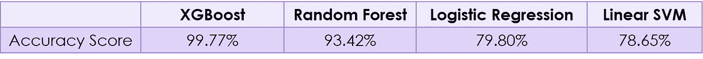

准确性分类测试得分结果

显然，XGBoost 模型具有最高的准确性分数——几乎完美！在我看来，两个最低分是由线性 SVM 和逻辑回归得到的，因为它们是线性的。

让我们看看最佳模型的混淆矩阵:

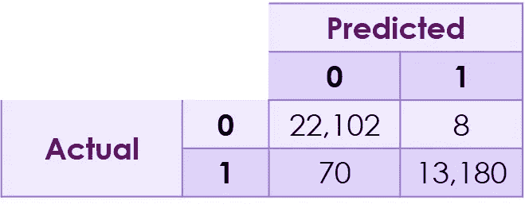

XGBoost 最优模型的混淆矩阵

有 70 个观察结果被分类为未取消，而它们被取消了，只有 8 个观察结果被分类为已取消，而实际上它们没有被取消。

之后，有趣的是通过最佳模型来检查特性的重要性，如下所示。我们可以看到对模型有重要影响的变量；*押金类型、所需停车位、之前的取消、特殊请求总数*等。

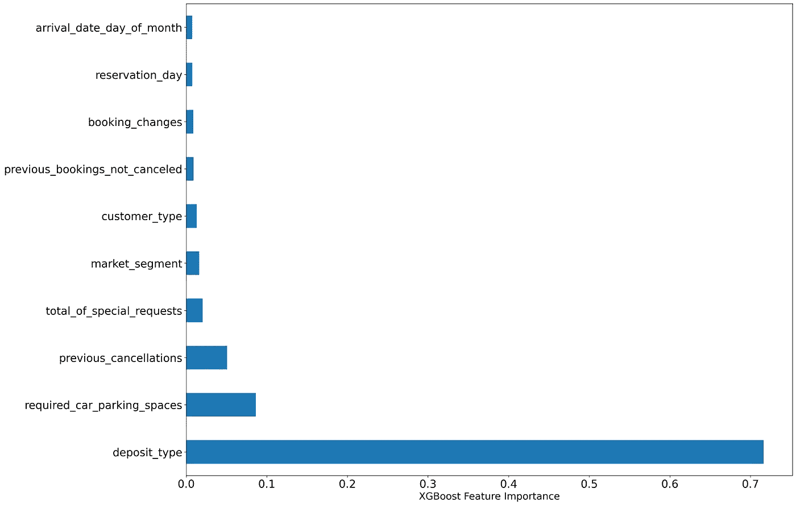

XGBoost 功能重要性

*所需停车位*这一变量非常有趣，我发现它如此重要，所以我查看了酒店所需每个停车位的取消率:

我们可以看到，由于有 1 个以上的所需停车位，客户根本没有取消。

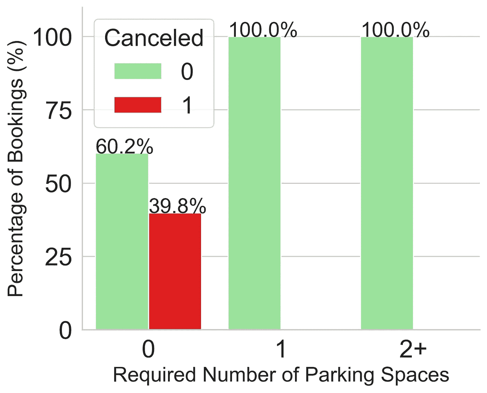

所需停车位的取消百分比

接下来，我检查了最佳模型的 SHAP 值(使用 shap 包)。颜色代表从蓝色(低)到粉红色(高)的特性值。特征的顺序是根据它们的重要性。下面的 SHAP 汇总图向我们展示了*所需停车位*的情况，例如，所需停车位越多，取消的停车位就越少。正如我们在上面看到的。

对特殊请求总数和*的*的相同观察停留在周夜*。此外，我们可以看到，粉红色的*先前取消、交付周期*和*存款类型*的金额越高，随着 SHAP 值超过 0，客户取消的金额也越高。*

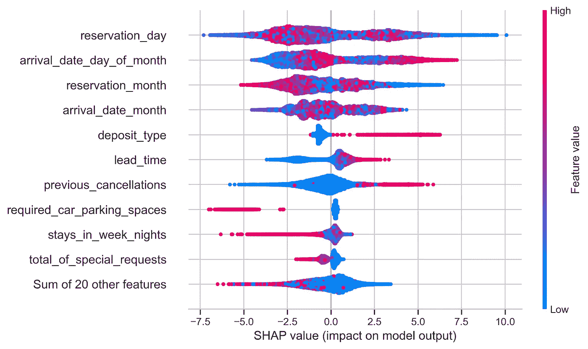

SHAP 值特征和 sklearn 包的特征重要性之间的这些差异是由于特征重要性通过使用该特征的所有分割的平均增益来产生值。增益表示每个特征对模型的相对贡献，通过对模型中的每棵树取其贡献来计算。要素按其值排序，值越高，生成预测的重要性越高。而 SHAP 值通过计算每个特征对预测的贡献来解释对消除的预测。

第一个研究问题的答案到此结束。

对于第二个研究问题，运行逻辑回归模型的准备工作包括像以前一样(70%，30%)分裂训练和测试，但也缩放非分类参数。接下来，通过调整正则化强度的 C 超参数来运行具有 L1 惩罚的逻辑回归。选择的 C 是留给我们 10 个变量的那个，这些变量没有收缩到 0。

一些没有缩减到 0 的影响变量是:*特殊客户请求总数、押金类型、分配的房间类型*和*交付时间。*继续采用所有未缩减至 0 的变量的不同组合(没有惩罚)并运行逻辑回归。通过检查每个模型的麦克法登伪 R 平方以选择最佳模型，我得到了以下变量:

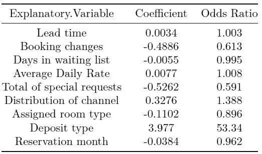

逻辑回归系数和优势比

麦克法登的伪 R 平方定义如下:

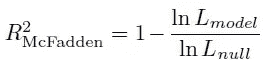

麦克法登的伪 R 平方定义

其中 L(模型)是拟合模型的可能性，L(零)表示只有截距的模型的相应值(麦克法登，1977)。

因此，通过检查模型中麦克法登的 R 平方，我决定用上面显示的变量建立一个麦克法登的 R 平方= 0.252 的模型。我们可以从系数表中看到，当我们将交付周期扩大 1 天时，取消的几率增加 1.003(几率比)。此外，有趣的是

**结论:**总之，这些发现非常合理，因为随着度假者在假期中投入更多，他们往往会取消更少。例如，投资一词指的是酒店提出更多的要求，像我们在度假酒店看到的那样住更多的晚上，甚至需要更多的停车位。提前计划假期的顾客往往也有更多的偏好。