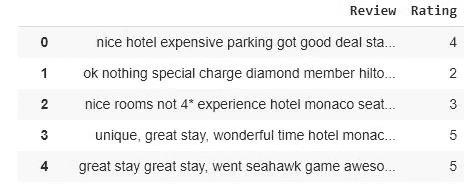
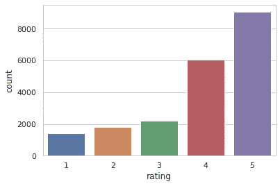
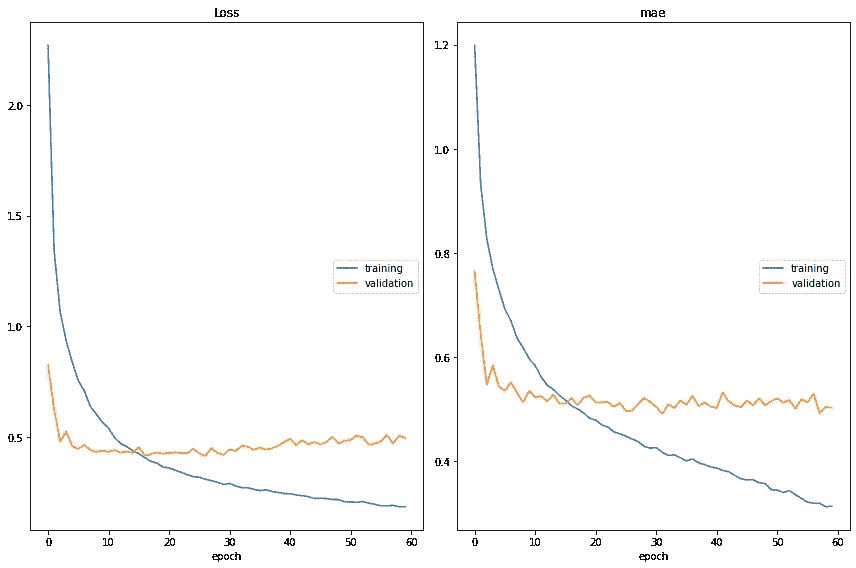
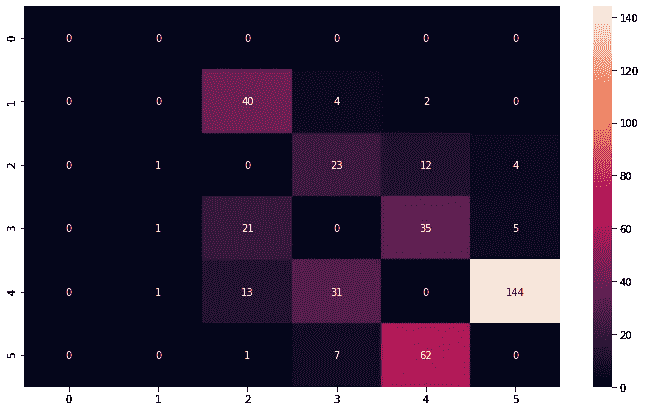

# 用 Tensorflow 预测酒店点评评分

> 原文：<https://medium.com/analytics-vidhya/predicting-hotel-reviews-ratings-with-tensorflow-3175e950c5b7?source=collection_archive---------14----------------------->


你好，欢迎来到另一篇人工智能文章。在花了几天时间在 Kaggle 上玩猫途鹰酒店评论数据集(你可以在这里找到)之后，我将与你分享通过对文本进行情感分析来预测评论评级的完整分析。

旅行者点评可能是这样的:


让我们看看如何建立一个深度学习模型，帮助我们预测评论者的情绪率，它应该是排名[1-5]中的整数。

你可以在[这个笔记本](https://github.com/fnandocontreras/tripadvisor-reviews/blob/main/tripadvisor_reviews.ipynb)中找到原始代码，你可以在谷歌实验室运行它。

# 导入库

如果您还没有 Kaggle api，请安装它:

如果你在 Google Colab 中运行，你需要在使用它之前设置你的 kaggle API 证书。您需要将 **kaggle.json** 文件上传到您的 Colab 运行时存储中。如果你没有 Kaggle API 密匙，请遵循这里的文档:[https://www.kaggle.com/docs/api](https://www.kaggle.com/docs/api)

您可以使用以下小部件上传 json 文件:

这允许您从本地 PC 上传文件，然后您需要运行以下单元:

现在，您应该能够使用 kaggle CLI 了，所以让我们使用以下命令下载必要的数据:

然后您应该会看到一些日志，如下所示:

这里我们下载了两个数据集。**trip-advisor-hotel-reviews . zip**包含猫途鹰评论和 **glovetwitter100d.zip** 包含预训练单词嵌入向量的数据集。

# 什么是单词嵌入？

简而言之，单词嵌入是 NLP 任务中使用的单词的表示，它将单词编码到向量空间中，其中相似的单词由具有高余弦相似性(彼此接近)的向量表示。它们很好地代表了文本语义和词义。

# 迁移学习

神经网络可以学习单词嵌入，这对于 **Tensorflow** 和 **Keras** 来说非常简单，但是它可能需要很长时间来训练，并且你可能需要一个非常大的数据集来这样做，以便你可以捕获丰富的语言语义。幸运的是，许多其他人已经用非常大的文本语料库训练了**单词向量**，我们可以很容易地加载它们，并在此基础上建立一个神经网络。今天我们将进行迁移学习，我们将使用通过 twitter 文本训练的单词向量。



# 评级计数

让我们看看每个评分值有多少评论



如您所见，数据集非常不平衡，这可能会对预测准确性产生负面影响，但让我们继续探索，看看我们能得到什么。

# 探索评论

```
"nice rooms not 4* experience hotel monaco seattle good hotel n't 4* level.positives large bathroom mediterranean suite comfortable bed pillowsattentive housekeeping staffnegatives ac unit malfunctioned stay desk disorganized,..."
```

# 从文本语料库中移除数字

数字对情感分析的语义构建没有太大帮助，所以让我们去掉它们

# 删除停用词

# 在训练/测试中分割数据集

# 标记和填充序列

让我们准备我们的神经网络输入。我们必须对文本语料库进行标记，这相当于将每个唯一的单词分配给一个整数，从而将文本转换成整数序列。由于可能有不同长度的序列，我们需要通过在末尾添加零来填充序列，以填充 **max_sequence_len** 的大小。

让我们加载之前下载的单词向量。在这种情况下，我从 twitter 文本语料库中提取 100 维的词向量。

我们这里要计算的是**嵌入矩阵**，这在构建神经网络时会有帮助。我们还设置了一个词汇表，我们称之为 **oov_words** 。因为评论是由现实世界中的人写的，你可能会发现很多拼写错误的单词，这对构建句子语义可能很重要。为了避免这些单词被认为不在词汇表中，让我们尝试自动更正它们。
这里我们考虑一个 **oov 单词**，这个单词不包含在**glove . Twitter . 27b . 100d . txt**word vectors 文件中。这个文件包含 270 亿个独特的单词，这是非常大的，所以我们假设这里没有包含的单词是拼写错误的单词，我们试图自动更正它们，但是并不总是一个 **oov 单词**是拼写错误的单词。

# 自动更正拼错的单词

**get_autocorrections** 函数使用**拼写检查器**库来获得对 **oov 单词**的自动更正，然而这很耗时，所以我编写了一个函数:**load _ auto corrections _ from _ json**，它从一个 JSON 文件加载预先计算好的更正作为字典。

如果要计算自动更正，请运行此单元格:

或者您可以从 [Github](https://github.com/fnandocontreras/tripadvisor-reviews/blob/main/oov_words.json) 获取 **oov_words.json** 文件，并使用以下单元格将其直接上传到您的 Colab 会话:

现在让我们为 **oov 单词**添加单词向量

# 建筑模型架构

既然我们已经对数据进行了预处理，并且已经计算了单词向量，那么是时候构建我们的神经网络架构了

我们的神经网络的第一层是使用我们预训练的单词向量的单词嵌入层，不需要重新训练，这就是为什么我们将**可训练**参数设置为**假**，并且我们直接从**嵌入 _ 矩阵**加载其权重。我们正在添加一个具有 64 个双向 LSTM 单元的层，随后是两个具有 dropout 的密集层和一个没有激活的最终层，这将使用户评级倒退。

我把这个问题作为回归问题来处理。我们有代表用户评级的用户评论和标签，可以取 1 到 5 的整数值。

在一些实验和尝试不同的模型架构之后，我注意到很多时候，甚至对于一个人来说，可能很难预测一个评论评级是 4 还是 5，或者是 3 还是 4 等等。这取决于评论者的情绪，评论文本可能无法很好地表达这种情绪。因此，假设等级[4…5]中的预测是一个好的预测，如果真实标签是 4 或 5，让我们建立一个深度神经网络来回归评级值。预测的标签可以在以后通过舍入模型输出来计算。

对于这个模型，am 使用 Adam 优化器和**均方误差** (MSE)作为损失函数。**均方误差**将惩罚具有大误差的预测。然而，我将平均绝对误差(MAE)添加到指标中，因为这给了我们一个关于模型表现好坏的概念。

*   低于 0.5 的 MAE 表明模型运行得相当好。由于我们对预测进行舍入以计算与评论评级标签相对应的整数值，因此所有误差低于 0.5 的预测都将以正确的评级标签结束。
*   误差在 0.5 和 1.0 之间的预测不会精确到正确的标签，但至少给我们一个近似的等级。例如:给定真实标签为 4，预测为 3.2，我们可以知道目标评分在 3 到 4 之间。

看到参数总数为**5065013**，而可训练参数总数为:**109313**。这是因为我们冻结了单词嵌入层的参数，所以我们不需要重新训练它们。

# 训练模型

让我们继续模型训练，但首先让我们安装一个库，在模型训练时实时绘制学习曲线。这有助于了解我们的模型在训练上是否表现良好，并实时检测过度拟合。

现在我们可以在回调数组中传递一个 **PlotLossesKeras** 的实例。



该模型的表现并不太差，我们可以看到有一点过度拟合，因为我们的训练误差不断减少，而验证误差在 0.5 左右波动。在 60 个训练时期之后，我们在训练集中达到了 0.312 的 MAE，在验证集中达到了 0.491 的 MAE，这还不错。让我们看看它在测试集中的表现如何:

```
total predictions 1025 
total errors 379 
accuracy score 0.6302439024390244
```

请注意，准确度分数相当低，让我们通过构建混淆矩阵来分析错误，看看我们有什么。



最高的混淆发生在等级 4 和 5 之间，分别有 144 和 62 个分类错误。我们可以看到等级 3 和 4 之间的混淆，分别有 35 和 31 个错误，等级 1 和 2 之间的混淆有 40 个错误。这可能是我们之前谈到的不平衡数据集的直接后果。然而，评审者的分数可能会围绕一个固定值变化，我们可能能够预测这个目标值，误差很小，但由于评审者的情绪，我们无法从文本中捕捉到，因此总是会有难以预测的随机变化。

让我们定义这个度量:**人的水平误差**为如果我们要求一个人对评论数据集进行分类，他将会具有的误差率。例如，尝试将自己归类为神经网络给出错误预测的条目之一:

*“酒店像家庭旅游一样对待住了几天，旅游计划了几天，酒店工作人员友好乐于助人，有针对性地安排了一天的行程比萨徒步旅行乡下，说佛罗伦萨博物馆想不到能提前几周预订时间，来告诉大卫 accademia 开业:安排了旅游乌菲齐，任何时候都需要帮助建议吃饭方向的地方，来酒店问候大大微笑的名字。他们说家庭治疗，旅游精彩的奖金， 旅行一周回到佛罗伦萨酒店欧罗巴迎接像久违的亲人，绝对美妙的感觉，酒店位于多摩附近容易找到多摩步行/街区酒店，喜爱的位置多摩窗口，巨大的房间喜爱的时间，体验家的感觉酒店，太棒了，*

你可能会给这篇评论打 5 分，就像我自己一样，但是它的目标分数是 4 分。假设人类可能在对这个数据集进行分类时犯错误，包括先前混淆矩阵中最常见的错误，我们可以说该模型并不真的很差，因为它达到了人类水平的错误，这是评估机器学习模型的一个很好的衡量标准。

我认为可能会有更多的改进来达到更低的 MAE，但由于这只是一个有趣的项目，我在这里停止分析。我邀请你继续这个实验，或者尝试一种完全不同的方法，如果你想分享你的结果，请联系我。

我希望你喜欢并关注更多的机器学习和编码。

*最初发表于*[*【https://www.nandocontreras.net】*](https://www.nandocontreras.net/articles/predicting-tripadvisor-hotel-review-ratings)*。*