# 用随机森林回归方程预测房价

> 原文：<https://medium.com/analytics-vidhya/predicting-house-price-with-random-forest-regressor-6e9a7c7f75dd?source=collection_archive---------2----------------------->


预测房价

在机器学习中，有分类和回归模型。两者的区别在于分类预测输出(或 y)为是或否，1 或 0，或其他一些类别。然而，在回归中，我们想要的输出是价值，比如房子的价格。

在这次房价预测中，回归模型是一个很好的实践。因为在输出中我们需要预测一个连续的值。

# 数据概述

我们已经从 [kaggle](https://www.kaggle.com/dansbecker/melbourne-housing-snapshot) 获取了数据。我们将在模型中使用这些数据。完整的数据集包含具有 21 个属性的 423，857 行数据。让我们来看看。

> #导入所需的包。
> import numpy as NP
> import pandas as PD
> import matplotlib . py plot as PLT
> import seaborn as SNS
> from scipy . stats import spearman r
> 
> df = pd.read_csv("../input/dataset/melb_data.csv ")
> 
> df.dtypes

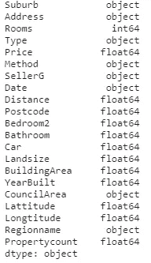

要素的数据类型

# 数据准备

数据清理

> df.isna()。总和()

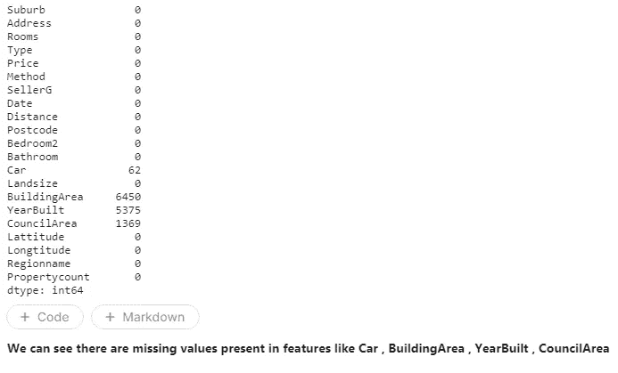

数据中存在缺失值，因此我们需要填充它们

首先，我们将看看具有缺失价值的特征与房价的关系。

**看专题车**

> sns.scatterplot(x = df["汽车"]，y = df["价格"])

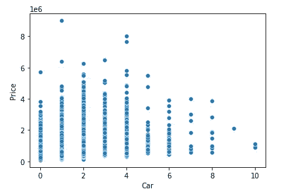

> df[“车”]。值计数()

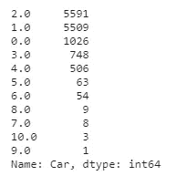

**查看特征构建区域**

> sns.scatterplot(x = df["建筑面积"]，y = df["价格"])


> df["BuildingArea"]。值计数()

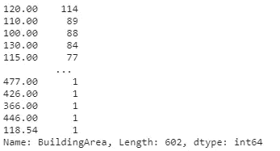

为一年建成

> SNS . box plot(data = df[" year build "])

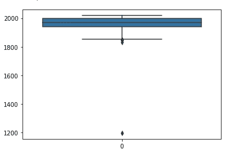

**用于议员区**

> df["议会区"]。值计数()

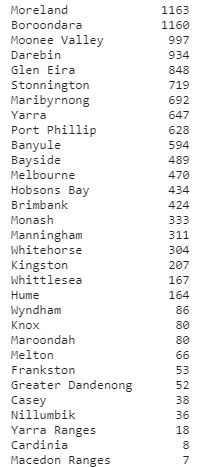

**通过查看图表，我们可以用前向值或后向值填充缺失值，因为它们是连续递增或递减的。**

> df = df.fillna(method='ffill ')。fillna(method='bfill ')

**功能选择:**

> sns.regplot(x = df["纬度"]，y = df["价格"])

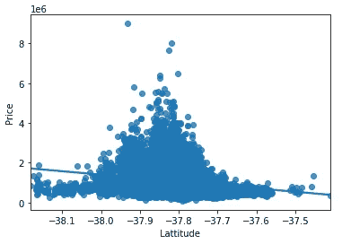

corr，_ = spearmanr(df["Lattitude"]，df[" Price "])
print(' spearman 相关性:%.3f' % corr

```
Spearmans correlation: -0.260
```

**因为我们看到纬度特征与目标特征负相关，所以我们将其移除。**

> sns.regplot(x = df["Longtitude"]，y = df["Price"])

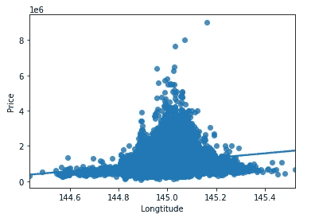

> corr，_ = spearmanr(df["Longtitude"]，df[" Price "])
> print(' spearman 相关性:%.3f' % corr)

```
Spearmans correlation: 0.262
```

**我们可以看到日期与房价无关，所以我们可以删除它。**

> del df["纬度"]
> del df["经度"]
> del df["日期"]

df[df.columns[:]]。corr()['价格'][:]

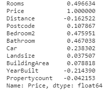

# 模型比较和评估

大部分工作已经完成了。现在，我们可以对数据运行 RandomForestRegression 模型。

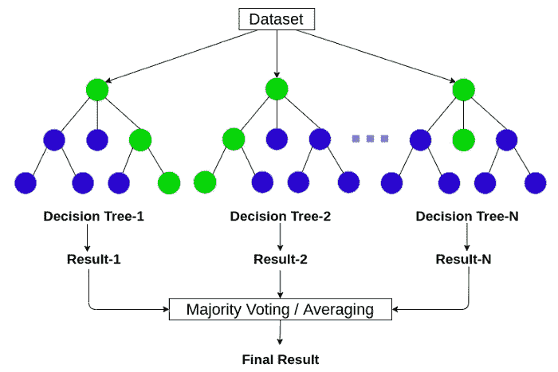

> 从 sklearn.linear_model 导入 LinearRegression
> 从 sklearn.model_selection 导入 train_test_split
> 从 sklearn.tree 导入决策树 Regressor
> 从 sklearn.ensemble 导入 RandomForestRegressor
> 从 sklearn.model_selection 导入 cross_val_score

**选择目标变量**

> y = df["价格"]
> del df["价格"]

**对分类特征进行一次热编码。**

> df[" suburban "]= PD . get _ dummies(df[" suburban "])
> df[" Address "]= PD . get _ dummies(df[" Address "])
> df[" Method "]= PD . get _ dummies(df[" Method "])
> df[" sell erg "]= PD . get _ dummies(df[" sell erg "])
> df[" region name "]= PD . get _ dummies(df[" region name "])【df[" region name】)

**选择预测目标变量的特征**

> x = df

**将我们的数据分为训练和测试数据，这样我们可以用训练数据训练我们的模型，用测试数据测试我们的模型**

> x_train，x_test，y_train，y_test = train_test_split(x，y，test_size = 0.2)

**使用 RandomForestRegressor，我们使用它是因为我们预测的是一个连续值，所以我们正在应用它。**

> model = RandomForestRegressor(max _ depth = 13，random _ state = 0)
> model . fit(x _ train，y_train)

**使用模型预测数据**

> y_pred =模型.预测(x _ 测试)

**使用性能指标评估模型。**

```
print(metrics.r2_score(y_test,y_pred))
0.798251224006463
```

# 结论

有了这个，我们涵盖了很多东西，从可视化数据，清理数据，评估模型，并做预测。模型的精确度可能不是很高，但是我们可以看到实现回归预测的过程。为了改进预测或模型训练，我们可以只为我们的模型选择最相关的属性。

**你可以在这里** 找到我们的 kaggle 笔记本[](https://www.kaggle.com/geraabhishek/level4new)