# 使用 ML 预测笔记本电脑价格

> 原文：<https://medium.com/analytics-vidhya/predicting-laptop-prices-using-ml-e60a0315b45a?source=collection_archive---------2----------------------->

构建一个预测笔记本电脑价格的端到端 web 应用程序。


照片由 [XPS](https://unsplash.com/@xps?utm_source=unsplash&utm_medium=referral&utm_content=creditCopyText) 在 [Unsplash](https://unsplash.com/?utm_source=unsplash&utm_medium=referral&utm_content=creditCopyText) 上拍摄

# **最初动机**

作为机器学习/数据科学的绝对初学者，我想利用我的技能，更深入地钻研机器学习领域。在无数次尝试观看 YouTube 视频和参加 Coursera 的课程后，我决定通过构建一个预测笔记本电脑价格的 [**web 应用程序**](https://laptoppredictionml-api.herokuapp.com/?) 来展示我所学到的东西。话虽如此，我还是把我的项目分成了 8 个不同的部分，因为这也让初学者(像我一样)可以跟进。请随意浏览我的 [Github repo](https://github.com/AndyFooGuoZhen/Laptop-Price-ML-Project-Deploy-) 中的项目文件。

**本文将讨论:**

1.获取笔记本电脑价格数据集

2.基础数据探索

3.特征工程

4.解释性数据分析(EDA)

5.数据预处理

6.系统模型化

7.构建 web 界面

8.部署 web 应用程序

# **获取笔记本电脑价格数据集**

对于这个项目，我已经从 Kaggle 获得了我的数据集(由 [Ionas Kelepouris](https://www.kaggle.com/ionaskel/laptop-prices) )。该数据集包含 1300 行数据和 12 列(特征),我们可以集中精力来构建预测模型。

# **基础数据探索**

通过 Pandas 加载数据集后，我们可以看到笔记本电脑列表以及与每台笔记本电脑相关的规格。

```
df=pd.read_csv('laptops.csv',encoding='ISO-8859–1')
df
```

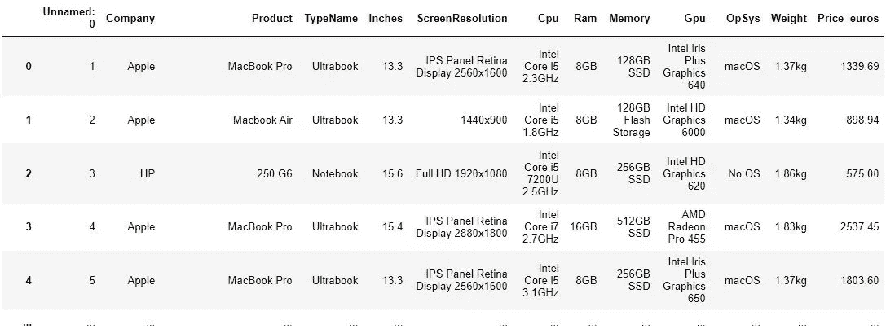

查看数据集，我们可以看到一些列(如 ScreenResolution 和 Cpu)包含字母数字数据，而其他功能则由纯数字或字母值组成。这些数据需要在以后进行过滤和设计。

为了避免任何复杂性和容易出错的预测，将从数据集中移除无用的特征，如“未修改:0”、“公司”和“产品”。(拥有一台装有 windows 操作系统的苹果笔记本电脑似乎对价格预测没有任何意义。)

然后，我们将检查数据集中是否存在任何缺失的值。我们不希望在以后的分析或建模中出现任何错误。

```
df.isnull().sum() 
```

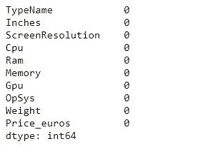

该图显示所有列都没有空值。

# **特色工程**

我们现在将提取并重新组织我们的数据，以更好地理解影响笔记本电脑价格的潜在因素。

如果我们看一下屏幕分辨率一栏，似乎有带触摸屏功能的笔记本电脑。众所周知，触摸屏笔记本电脑比没有触摸屏的笔记本电脑更贵，因此将增加一个触摸屏功能来标记具有这种功能的笔记本电脑。

```
df.loc[df['ScreenResolution'].str.contains('Touchscreen'),
'TouchScreen']="Yes"
df.tail(10)
```

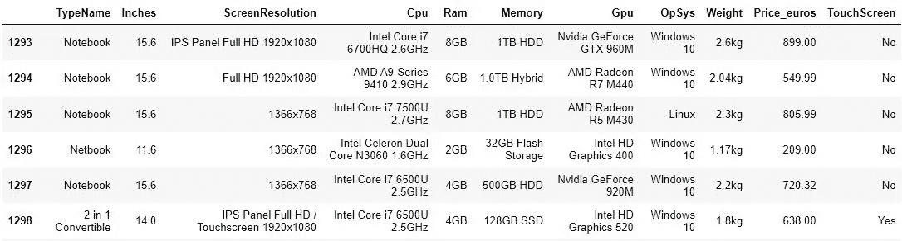

然后，我们将使用正则表达式提取屏幕分辨率列，并用它们各自的像素数替换它。我发现正则表达式在提取/过滤字母数字值时非常有用。

```
df['ScreenResolution']=df['ScreenResolution'].str.
extract('(\d\d\d\d?x\d\d\d\d?)',expand=True)
df.tail(10)
```

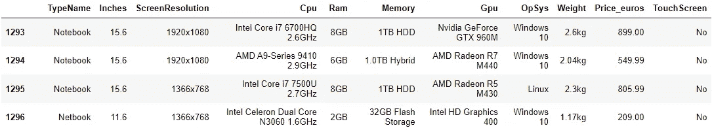

然后，我们将应用相同的过程来设计 Cpu、Ram 和重量特性。我们的目标是最小化或删除任何对以后的分析不重要的单元和单词。

现在到了特征工程最累人的部分，处理记忆特征。仔细观察，内存列包含各种类型的内存(SSD、HDD、SSHD 和闪存)。我们需要创建 4 个额外的列来表示不同的内存类型，并分别提取它们的内存容量。(对于使用相同内存类型的双内存配置的笔记本电脑，需要进行额外的处理。(例如:256GB 固态硬盘+ 512GB 固态硬盘)。这可以使用上面所示的类似过程来完成。

```
df['HDD']=df['Memory'].str.extract('(\d\d\d?GB\sHDD|\dTB\sHDD|\d\.0TB\sHDD)',expand=True)df['HDD']=df['HDD'].str.extract('(\d\d\d?|\dTB|\d\.0TB)',expand=True)df['HDD']=df['HDD'].str.replace('(TB|\.0TB)','000',regex=True)
df['HDD'].fillna(0,inplace=True)df.head(30)
```

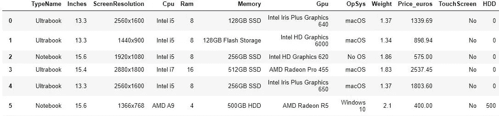

第 5 行反映了 HDD 存储器的工程结果。

处理完这些内存配置后，我决定完全删除 GPU 列，因为它包含了大量的 GPU。英特尔 GPU 是集成 GPU，Nvidia GPUs 是独立的，而 AMD GPUs 是集成或独立的。对每一个进行标记和分类将花费大量的精力和时间，这可能有助于也可能没有助于以后的建模过程。

我们的全功能工程数据集如下所示:

```
df
```

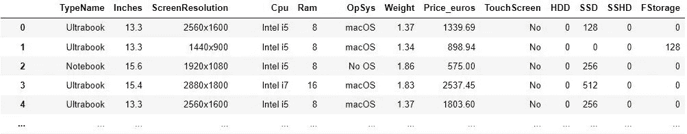

然后，我们将数据集保存到新的。csv 文件并为解释性数据分析过程做准备。

# **解释性数据分析(EDA)**

使用我们的功能设计数据集，我们现在可以绘制图表和计算表格，以可视化每个功能与笔记本电脑价格可变性的关系。

通过使用。从 Matplotlib 导入的 barplot 方法，我们可以测试和验证我们关于某些功能将如何影响笔记本电脑定价的假设或初步意见。以下是绘制特征类型名称(笔记本电脑类型)条形图的图示:

```
plt.subplots(figsize=(10,5))
sns.barplot(x='TypeName',y='Price',data=df)
```

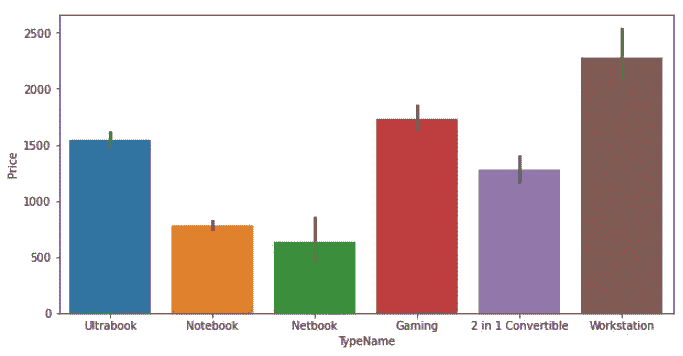

从上面的柱状图中，我们可以纠正并得出结论，平均而言，工作站和游戏笔记本电脑的价格高于其他类型的笔记本电脑。这是意料之中的，因为这些类型的笔记本电脑通常具有更好的规格配置(更好的 CPU、更大的内存等)，以满足专业工作空间中客户端的需求。笔记本和上网本由于低功耗配置，价格较低。

更高的 Ram 容量也反映了笔记本电脑更高的价格:

```
plt.subplots(figsize=(20,10))
sns.barplot(x='Ram',y='Price',data=df)
```

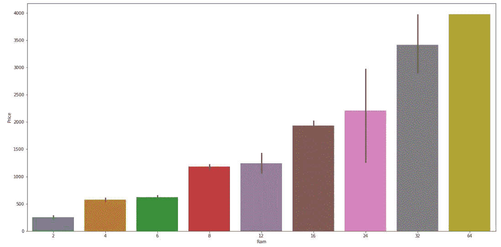

屏幕尺寸条形图显示不一致的价格:

```
plt.subplots(figsize=(10,10))
sns.barplot(x='Inches',y='Price',data=df)
```

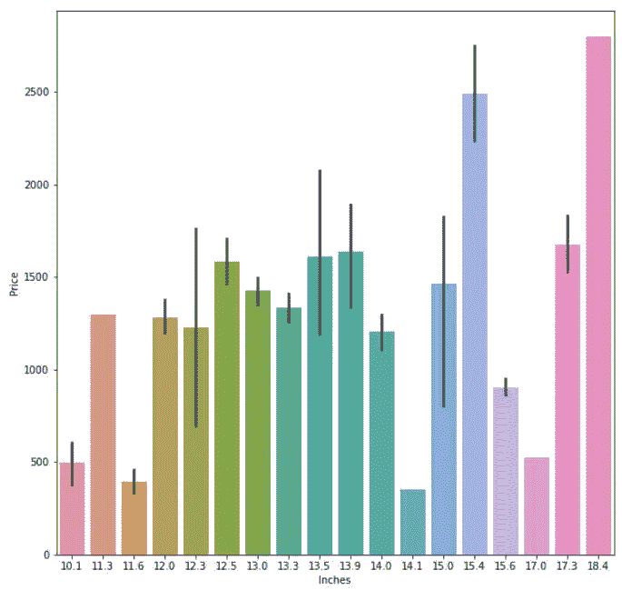

绘制 Cpu 特性的条形图显示了一些有趣的结果。一般来说，高性能处理器的价格应该高于低性能处理器。英特尔处理器的价格通常遵循这一模式(至强> i7>i5>i3)，同样的原则也适用于 AMD CPUs(锐龙> AMD A 系列> E 系列)。从数据集获得的柱状图显示的情况与此不同。

```
plt.subplots(figsize=(20,10))
sns.barplot(x='Cpu',y='Price',data=df)
```

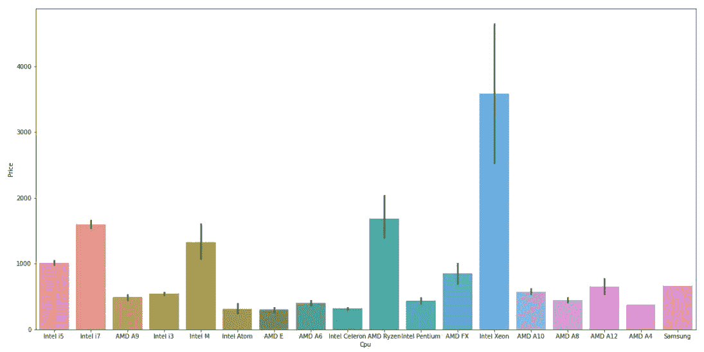

该图显示英特尔 M 系列笔记本电脑的平均价格高于 i3 和 i5 笔记本电脑。出于这个原因，需要对这种情况进行进一步的检查，以便更好地理解这种现象的发生。

利用熊猫。grouby()方法，我们可以计算与 i5 和英特尔 M 笔记本电脑相关的平均特性。

```
standby_df = df.loc[df['Cpu'].str.contains('Intel M |Intel i5')]
standby_df.groupby(['Cpu']).mean()
```

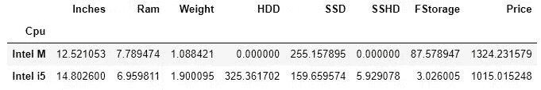

与 i5 笔记本电脑相比，英特尔 M 笔记本电脑的 RAM 容量更大，重量更轻，SSD 内存容量更大。这些特性导致英特尔 M 系列笔记本电脑的价格较高。

# **数据预处理**

在本节中，我们将重新标记分类特征，并将其转换为数字特征。这对于训练我们的 ML 模型是必不可少的，因为 ML 模型只接受数值作为输入。

首先，我们识别非数字特征(对象类型)并计算它们的基数(每个特征中存在的类别)。

```
#Prints all columns that are of type objectfor i in df.columns:
     if df[i].dtype=='object':
             print("%-10s\n%-200s\n%-10d\n"%(i,df[i].unique(),df[i].nunique()))
```

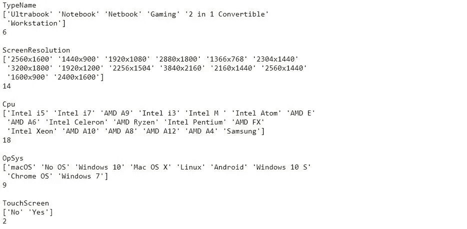

知道触摸屏功能只有 2 个类别，我们可以使用标签编码来编码这个功能。(也可以使用一键编码)使用 Scikit-learn 的标签编码功能，触摸屏上的变量(“否”、“是”)将被编码为 0 和 1。

```
from sklearn.preprocessing import LabelEncoderle=LabelEncoder()
print(df['TouchScreen'].unique())
print(le.fit_transform(df['TouchScreen'].unique())) 
# to check what encoded values would be
```

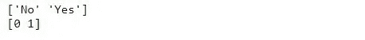

标注编码还处理基数较高的要素。将标签编码应用于 Cpu 特性，标签编码值(与其预编码变量相关联)被记录下来，以便以后进行预测。

其他基数稍低的特性是通过 one-hot-encoding 方法编码的。通过熊猫的使用。getdummies()方法，将创建一个新列来指示每个分类变量的存在。

下面的例子说明了一次热编码对 TypeName 特性的影响:

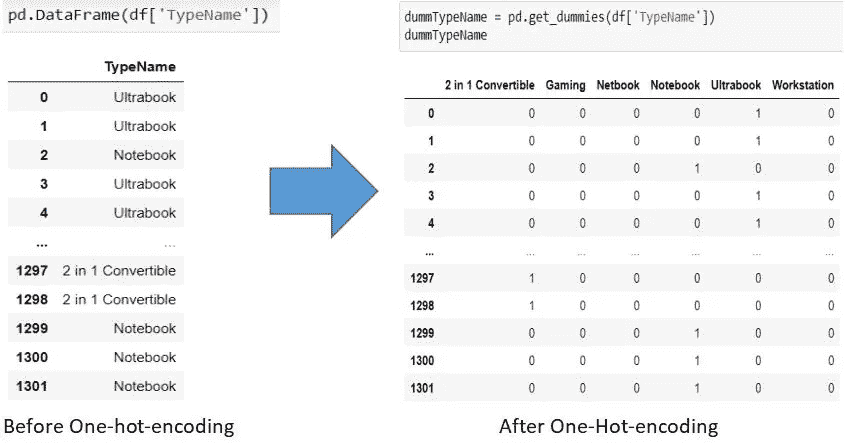

在对 TypeName 和 OpSys 特性应用 One-hot-encoding 之后，如果我们知道变量的顺序，我们将使用手动编码来处理具有高基数的特性。

我们可以使用 python 的字典和映射方法，根据它们的大小/顺序来指定和编码每个类别。下面显示的代码片段根据像素数对屏幕分辨率特性进行了编码。

```
Screen_Res_dict={'1366x768' : 1, '1440x900' : 2 , '1600x900': 3, '1920x1080': 4, '1920x1200': 5, '2160x1440': 6, 
                 '2304x1440': 7, '2256x1504': 8, '2560x1440': 9, '2400x1600':10, '2560x1600':11, '2880x1800':12, 
                  '3200x1800': 13, '3840x2160':14}OH_df['ScreenResolution']=
OH_df.ScreenResolution.map(Screen_Res_dict)
```

经历了所有必要的数据处理步骤后，我们现在可以将新数据集保存到一个. csv 文件中，以便稍后进行建模。

# **造型**

加载预处理后。csv 数据集，我们确定因变量(价格)并为目标变量分配单独的数据框。

然后，我们可以拆分数据集，用于训练和验证我们稍后要应用的模型的性能。大约 30%的数据将用于测试我们的 ML 模型。

```
from sklearn.model_selection import train_test_splitX_train, X_test, y_train, y_test = train_test_split(df, target, test_size=0.33, random_state=0)
```

接下来，我们开始训练和验证不同模型的性能。用于评估我们模型性能的两个主要指标是 R 平方得分和平均绝对误差(MAE)。总的来说，我们希望通过我们的模型获得更高的 R 平方分数和更低的 MAE 分数。

不同节点数的 RandomForestRegressor:

```
from sklearn.ensemble import RandomForestRegressor
from sklearn.metrics import mean_absolute_error
from sklearn.metrics import r2_scoredef get_mae_random(max_leaf_nodes,X_train,X_test, y_train, y_test ):
    model1 = RandomForestRegressor(max_leaf_nodes = max_leaf_nodes, random_state=0)
    model1.fit(X_train,y_train)
    model1_preds = model1.predict(X_test)
    print("R2 score: %.2f"%(r2_score(y_test,model1_preds)))
    mae = mean_absolute_error(y_test, model1_preds)
    return (mae)for max_leaf_nodes in [5,10,20,50,100,200,300, 500]:
    mae=get_mae_random(max_leaf_nodes,X_train,X_test,y_train,y_test)
    print("Max leaf nodes: %d \t\t MAE: %d\n"%(max_leaf_nodes, mae))
```

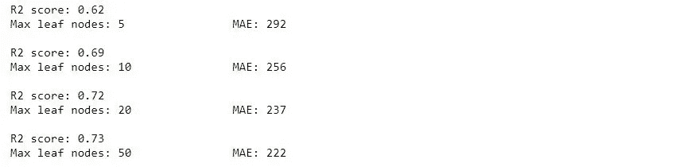

使用决策树回归器进行培训:

```
from sklearn.tree import DecisionTreeRegressordef get_mae_decision(max_leaf_nodes,X_train,X_test,y_train, y_test):
    model1 = DecisionTreeRegressor(max_leaf_nodes = max_leaf_nodes, random_state=0)
    model1.fit(X_train,y_train)
    model1_preds = model1.predict(X_test)
    print("R2 score: %.2f"%(r2_score(y_test,model1_preds)))
    mae = mean_absolute_error(y_test, model1_preds)
    return (mae)for max_leaf_nodes in [5,10,20,50,100,200,300, 500]:
    mae = get_mae_decision(max_leaf_nodes,X_train,X_test,y_train,y_test)
    print("Max leaf nodes: %d \t\t MAE: %d\n"%(max_leaf_nodes, mae))
```

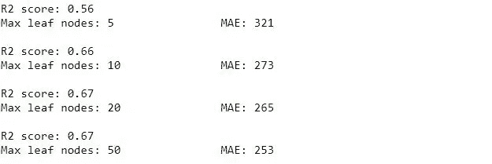

线性回归模型:

```
from sklearn.linear_model import LinearRegressionmodel2=LinearRegression()
model2.fit(X_train,y_train)
preds=model2.predict(X_test)
r2score=r2_score(y_test,preds)
MAE = mean_absolute_error(y_test, preds)print("R2 score: %.2f"%(r2score))
print("MAE: %d"%(MAE))
```

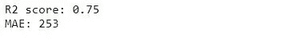

XGBoost 型号:

```
from xgboost import XGBRegressormodel3 = XGBRegressor()
model3.fit(X_train,y_train)
preds3=model3.predict(X_test)
r2score=r2_score(y_test, preds3)
MAE = mean_absolute_error(y_test, preds3)print("R2 score: %.2f"%(r2score))
print("MAE: %d"%(MAE))
```

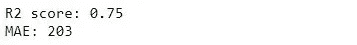

XGBoost 模型在所有模型中具有最高的 R 平方得分和最低的 MAE 得分，将被选为我们的最终 ML 模型。我们可以使用 joblib 保存训练好的模型。

# **Web 应用部署**

由于对 HTML 和 CSS 毫无经验，我不得不依靠 freeCodeCamp 的初学者友好视频来构建我的 web 应用程序。经过几个小时的调试定位错误和与 HTML 和 CSS 的斗争，我终于得到了自己的功能 web 界面。

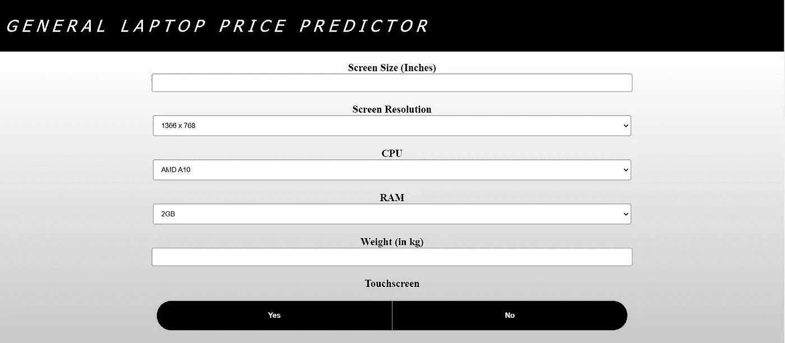

这样一来，可以使用 flask 和 python 来处理 web 应用程序的后端。通过使用 GET/POST 方法从 Flask 中检索 HTML 表单数据并将数据存储到一个数组中，我们可以加载之前训练过的 XGBoost 模型，并开始预测笔记本电脑的价格。

```
model = joblib.load('XGB_model')#predict price of laptop given the above dataset
def predict(self, list):
     arrToPredict = np.array([list])
     self.totalPredicted = model.predict(arrToPredict)
```

在确保所有测试和 web 应用程序都按预期工作后，我们可以将项目文件保存到 Github repo 中，并使用 Heroku 部署 web 应用程序。这里有一篇由 [Naivedh Shah](/coding-blocks/deploy-machine-learning-model-on-heroku-dc799ef8ec86) 写的很棒的文章，解释了在 Heroku 上部署 ML web 应用的来龙去脉。

# **结论**

我希望您对创建和部署 ML web 应用程序的基础有了一些有用的了解。如果第一次尝试不成功，不要给自己压力，这个项目花了我 3 个多月才完成:)

也就是说，我永远感谢[克里斯·纳伊克](https://www.youtube.com/user/krishnaik06)和[自由代码营](https://www.freecodecamp.org/)为我完成这个项目提供了必要的知识。从你们身上学到新东西一直是(并将继续是)一件非常愉快的事情。

如果你喜欢这篇文章，别忘了喜欢它:)让我们继续吧

领英:[linkedin.com/in/andy-foo-guo-zhen-791a58174](https://www.linkedin.com/in/andy-foo-guo-zhen-791a58174)

github:[https://github.com/AndyFooGuoZhen](https://github.com/AndyFooGuoZhen)