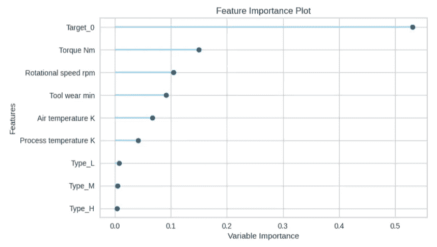

# 使用机器学习预测机器维护

> 原文：<https://medium.com/analytics-vidhya/predicting-machine-maintenance-using-machine-learning-ee694c7fa0f0?source=collection_archive---------1----------------------->

这篇文章是关于分析数据集使用机器学习容易初学者。

照片由 Mykola Makhlai 在 Unsplash 上拍摄

我们知道机器学习对于初学者来说是非常复杂的。我们不知道应该使用什么类型的模型来分析数据。

在本文中，我们将使用“机器预测性维护”数据集，并使用机器学习轻松地对其进行分析。我们将使用 Pycaret 来建立我们的预测模型。我们正在使用的数据集可以在 GitHub [这里](https://github.com/annsyj94/Machine-Predictive-Maintenance/blob/main/predictive_maintenance.csv)获得。

# **从我们的任务开始**

在我们开始之前，请在您的笔记本电脑环境中安装 Pycaret。

# **导入导入库**

接下来，我们必须导入库。完成后，我们读取将要分析的数据文件。文件在。csv 格式。

上述代码的输出是:

检查之后，我们使用 Matplotlib 为故障类型创建一个饼图。我们注意到 96.5%的人没有失败。

接下来，我们使用“Seaborn”库来创建空气和过程温度的条形图。

完成后，我们使用 jointplot 用二元和一元图绘制空气和工艺温度图。该库为 JointCrid 类提供了一个方便的接口，提供了几种固定的绘图类型。它们看起来像这样。

我们用 Seaborn 来画转矩速度的线图，因为我们想知道它的旋转速度。

此时，我们将使用唯一的库“PyCaret”。这是一个用 Python 编写的开源、低代码机器学习库，允许用户在他们选择的笔记本环境中，在几分钟内从准备数据到部署模型。

PyCaret

在使用 PyCaret 之前，我们需要删除数据集的 UDI 和产品 ID。

我们使用“pycaret.classification”来设置原始数据集、目标和 session_id。做完之后，我们比较所有的模型。我们注意到随机森林模型具有最高的准确性。那我们就用它吧。

设置

比较模型()

让我们用 rf(随机森林分类器)创建一个模型。还有，我们需要用 tune_model 对其进行改进。这是一个使用超参数自动调整模型的功能。

创建模型

调谐模型

完成后，让我们创建图表来分析模型。

我们快完成了！我们最终确定模型，并用原始数据集进行预测。让我们来看看最终的数据集。我们可以看到，它增加了标签和分数。

# 结论

在本文中，我们已经学习了如何使用机器学习轻松地分析数据集。如果你没有任何想法，你最好使用这个方法。

我的专业不是数据科学，但是我对使用 Python 来分析和开发一个平台很感兴趣。另外，我想分享一下我的知识。

我希望你喜欢这篇文章。