# 库存管理中的物料延期交货预测

> 原文：<https://medium.com/analytics-vidhya/predicting-material-backorders-in-inventory-management-90e4d0ece6ba?source=collection_archive---------7----------------------->

这是我的案例研究和我在 2017 年 IEEE 会议上发表的研究论文的方法的预演。这篇论文的作者考虑了 Kaggle 竞争对手的真实世界不平衡数据集*你能预测产品延期交货吗？。*

我们将深入探讨如何在库存管理过程中最大限度地减少材料延期交货。但在此之前，让我们从理论角度了解一下什么是延期交货以及如何处理它们。下面是原始研究论文的链接。

 [## (PDF)使用机器学习预测库存管理中的材料延期交货

### 物料延期交货是一个常见的供应链问题，影响库存系统的服务水平和效率…

www.researchgate.net](https://www.researchgate.net/publication/319553365_Predicting_Material_Backorders_in_Inventory_Management_using_Machine_Learning) 

# 什么是延期交货？

为供应商暂时缺货的产品下的订单。延期交货表示对特定产品或服务的需求大于供应。

不要将延期交货与“缺货”相混淆。在“缺货”的情况下，产品的供应或生产可能是不确定的。另一方面，延期交货是针对计划生产中的产品，这些产品由于多种因素遇到了延迟。

在本案例研究中，我们将详细探讨这些因素，并了解哪些因素是导致产品延期交货的最重要原因。

# 延期交货的一般原因是什么？

延期交货对公司来说本质上不是坏事。这真的取决于库存和订单管理。延期交货的一些一般原因如下。

*   订单未及时发出
*   仓库差异
*   人为误差
*   工厂短缺
*   不准确的订购点
*   异常需求
*   客户便利

# **这个项目的目标是什么？**

该项目的目标是通过在事件发生前识别有延期交货风险的物料，最大限度地减少延期交货。这给了企业管理层一个适当的时间来做出反应并做出适当的改变。

# 数据集和问题概述

这个问题的数据集有两个类，正类和负类。正类表示产品缺货，负类表示缺货。这使得该问题成为二元类分类问题。该数据是高度不平衡的，对于列车组，正类和负类的比率分别为 1:148。大多数类别为负，即大多数产品没有延期交货。数据集有 22 个要素和 1 个类标签。下面列出了所有功能及其说明:

*   sku:库存单位
*   national_inv:组件的当前库存水平
*   提前期:登记的运输时间
*   在途数量:在途数量
*   forecast_3_month:预测未来 3 个月的销售额
*   forecast_6_month:预测未来 6 个月的销售额
*   forecast_9_month:预测未来 9 个月的销售额
*   sales_1_month:前一个月的销售数量
*   sales_3_month:前 3 个月的销售数量
*   sales_6_month:前 6 个月的销售数量
*   sales_9_month:前 9 个月的销售数量
*   min_bank:库存的最小建议数量
*   potential_issue:指示变量，指出项目的潜在问题
*   pieces_past_due:来源中过期的零件
*   perf_6_month_avg:过去 6 个月的来源业绩
*   perf_12_month_avg:过去 12 个月的来源业绩
*   local_bo_qty:库存订单逾期金额
*   deck_risk:一般风险标志
*   oe_constraint:一般风险标志
*   ppap_risk:一般风险标志
*   stop_auto_buy:一般风险标志
*   rev_stop:一般风险标志
*   延期交货:产品延期交货

以下是数据集的链接:

 [## 主 Rodrigo santi 1/back order _ prediction 处的 back order _ prediction/dataset . rar

### 库存管理环境下的延期交货预测。-补充订单 _ 预测/数据集. rar 在主…

github.com](https://github.com/rodrigosantis1/backorder_prediction/blob/master/dataset.rar) 

# 现有解决方案

1.  *原始研究论文— (PDF)使用机器学习预测库存管理中的材料延期交货:*
    本文在拟合模型之前采用了各种欠采样、过采样技术来抑制不平衡数据集问题。我们看到，逻辑回归性能最低，而梯度推进决策树性能最高。在拟合模型之前使用的一些采样技术是随机欠采样(RUS)和合成少数过采样技术(SMOTE)。除了这些模型之外，集成学习的一个特例已经被采用，它是随机采样和集成模型的组合。这被称为 Blagging，并且该模型的性能非常接近梯度增强模型。
2.  *Srinivasa Raja 的延期交货预测| Analytics Vidhya:*
    作者遵循的方法与
    原始研究论文的方法非常相似。除了 RUS 或 SMOTE，博客还展示了
    其他采样技术，如自适应合成采样
    (ADASYN)、未遂欠采样、Tomek 链接等等。在拟合模型之前，一些
    特征工程技术，如对数变换和标准化
    已经应用于数据。除了
    AUC 之外，宏观 F1 分数也被考虑作为评估指标
    ，因为数据中存在类别不平衡。[https://medium . com/analytics-vid hya/back order-prediction-d4f1c 5362 f 18](/analytics-vidhya/backorder-prediction-d4f1c5362f18)
3.  *使用分布式随机森林和梯度推进机
    预测供应链中可能的缺货情况
    学习技术—大数据杂志:*
    他们使用了来自 H2O.ai 的分布式随机森林(DRF)和梯度推进机(GBM)算法
    。随机森林
    模型被选为基线模型，梯度推进是第二个模型
    。选择 AUC 和混淆矩阵作为模型的
    评估指标。在拟合 H2O 模型之前，应用 RUS 和
    SMOTE 等采样技术。[https://journalofbigdata . springer open . com/articles/10.1186/s 40537-020-00345-2](https://journalofbigdata.springeropen.com/articles/10.1186/s40537-020-00345-2)
4.  *使用深度神经网络对不平衡数据进行产品延期交货预测:*
    从现有的概述来看，现在很明显，我们可以使用神经网络，尤其是全连接网络，结合相同的采样技术，如 RUS 和 SMOTE，来预测延期交货。该博客指出，深度学习模型在标准评估指标方面优于一些著名的分类模型。[https://www . tandfonline . com/doi/full/10.1080/00207543 . 21 . 1901153？scroll = top&need access = true](https://www.tandfonline.com/doi/full/10.1080/00207543.2021.1901153?scroll=top&needAccess=true)

# 应该使用哪些性能指标？

在本案例研究中，我们将使用准确性。但是，我们知道，对于高度不平衡的数据集，精确度并不是一个好的衡量标准。因此，我们将采用额外的指标，如 AUC 曲线，它是专门为二元类分类设计的。为了更好地理解模型预测，我们还将使用混淆矩阵以及精度和召回。

# 探索性数据分析

我们得到了一个已经分成训练集和测试集的数据集。训练集由 1，687，860 个数据点组成，测试集由 242，075 个数据点组成。两个数据集都有 23 个要素，其中*是目标标注。*

特征 *sku* 是标识符，因此必须从数据集中删除。在其他 21 个特征中(不包括类别标签*去了缺货*，我们看到其中 15 个是数字的，6 个是分类的。所有的分类特征要么有*是*要么有*否*，这表明它们本质上是二元的。数字特征包括*国家库存、提前期、在途数量、预测 3 个月、预测 6 个月、预测 9 个月、销售 1 个月、销售 3 个月、销售 6 个月、销售 9 个月、最小银行、过期件数、绩效 6 个月平均、绩效 12 个月平均、本地业务数量*，分类特征包括*潜在问题、甲板风险、oe 约束、ppap*

此外，我们看到特性 *lead_time* 是唯一一个缺少值的特性。训练集中*提前期*特征的空值百分比为 5.98%。此外，每个要素的最后一行都有空值，因此可以删除，因为删除一行不会对整体造成任何影响。

从关于类别标签的每个特征的单变量分析中，我们看到大多数数字特征高度偏向积极的一面。

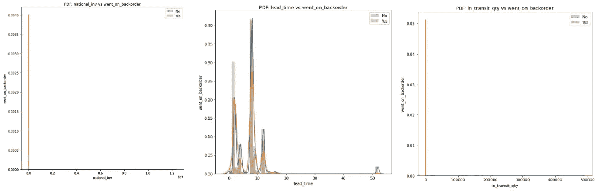

国家 _ 库存、提前期和在途 _ 数量的 pdf

从上面的图中我们看到*在途数量*的分布与*国家库存*有点类似。这两个特征都是正偏的。

我们知道*提前期*有缺失值，因此已经删除了它们并绘制了概率密度函数。我们看到*提前期*的 PDF 也显示正偏度。

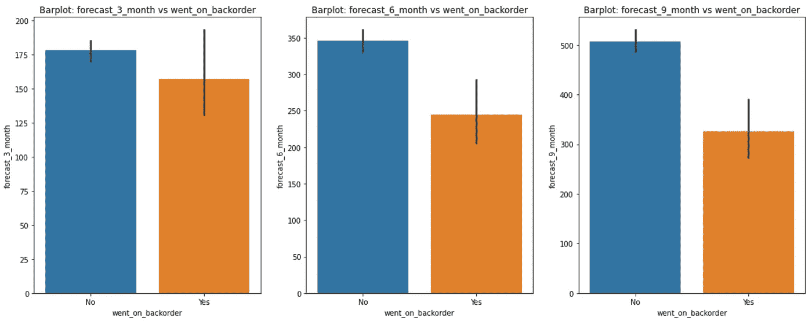

所有预测功能的条形图

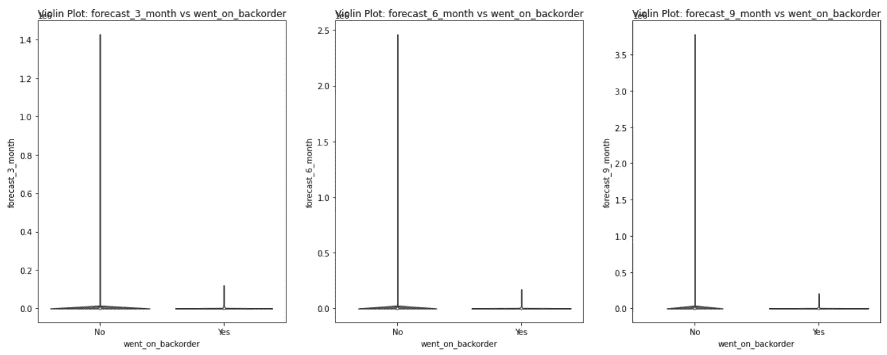

所有预测功能的小提琴图

柱状图代表集中趋势的估计值(在这种情况下为平均值)。因此，从这组柱状图来看，我们可以说，在 3、6 和 9 个月的时间跨度内，正类的平均预测销售额整体下降，而负类的平均预测销售额似乎保持不变。

为了理解分布和 iqr，我们绘制了箱线图和小提琴图*(小提琴图如上所示)*。我们看到 iqr 不是清晰可见的。而且有很多异常值，特别是对于所有 3 个特征的负类。异常值的预测范围似乎只会在未来几个月扩大。随着订单数量的增加，这是意料之中的。此外，我们看到所有三个特征的分布是相似的，所有特征都是非常正的偏斜。我们可以假设位于尾部的数据点实际上可能不是异常值。这种趋势在所有的数字特征中都可以观察到。

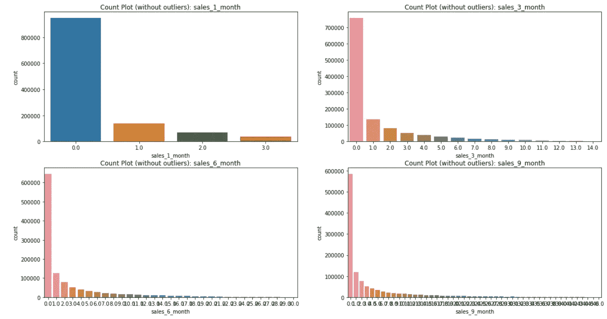

没有异常值的所有销售特征的计数图

当我们查看销售功能时，我们看到 pdf、箱线图和小提琴图与预测功能非常相似。为了更好地理解数据，我们删除了所有四个销售特征的整个第四季度，并分别绘制了计数图。我们很快发现，在之前的几个月中，有很多产品没有售出。对于特性 *sales_1_month* ，至少售出一个单位的数据点比至少售出三个单位的数据点多。对于所有其他销售特征来说，这是真实的扩展版本，即，至少售出一个单位的数据点比至少售出三个或更多单位的数据点更多。

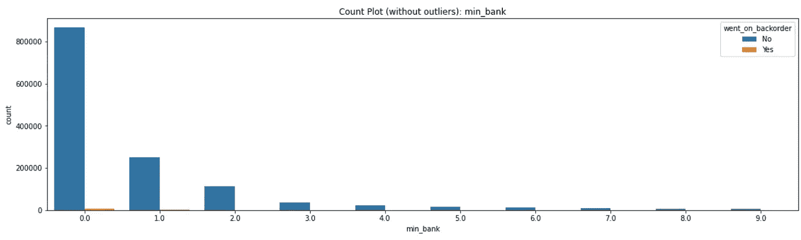

无异常值的 min_back 计数图

从 *min_back* 的计数图中，我们可以推断出大部分值趋向于零，只有极少数数据点的 *min_bank* 值为三或更大。

此外，功能 *pieces_past_due* 和 *local_bo_qty* 与 *national_inv 非常相似。*pdf 和箱形图显示，它们的分布也像早期特征一样是偏斜的。

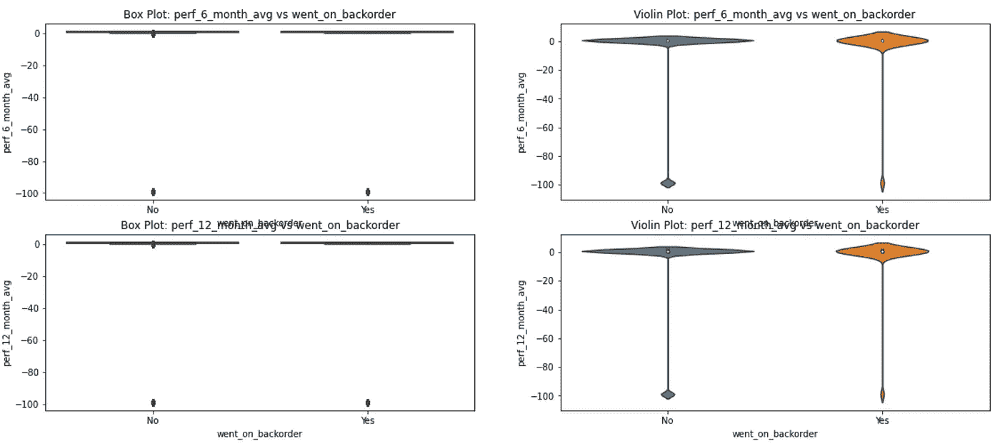

表现月平均特征的箱线图和小提琴图

从上图我们可以看到两个特征 *perf_6_month_avg* 和 *perf_12_month_avg* 的 pdf 非常相似。我们在标尺的第零点周围看到两个特征的类似高斯分布。然而，曲线极度向负轴延伸，表示负偏斜。从柱状图中，我们可以看到，对于延期交货的订单，6 个月和 12 个月的平均来源绩效约为-3，对于未延期交货的订单，平均来源绩效约为-6 至-7。箱线图和小提琴图也表明分布呈负偏态，两个类别都有一些异常值。 *perf_6_month_avg* 和 *perf_12_month_avg* 的中值分别为 0.82 和 0.81，对于这两个特性，90%的点小于 0.99。

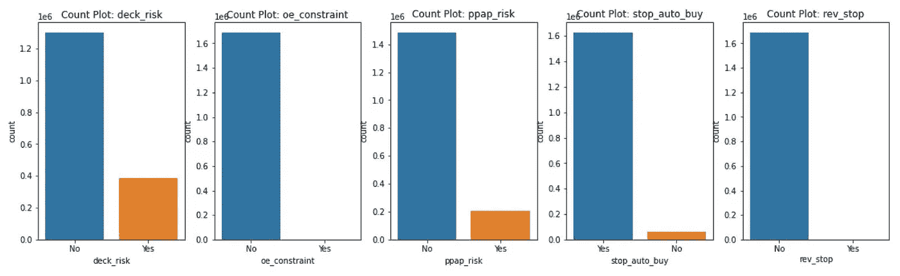

所有一般风险标志的计数图

从上面的计数图中，我们清楚地看到带有风险标志 *oe_constraint* 和 *rev_stop* 的数据点数量非常少。有相当数量的数据点的 *deck_risk* 为 *Yes* 并且有相当数量的数据点的 *ppap_risk* 和 *stop_auto_buy* 为 *Yes* 。大多数数据点在训练集中没有任何风险标志。

# 斯皮尔曼等级相关系数

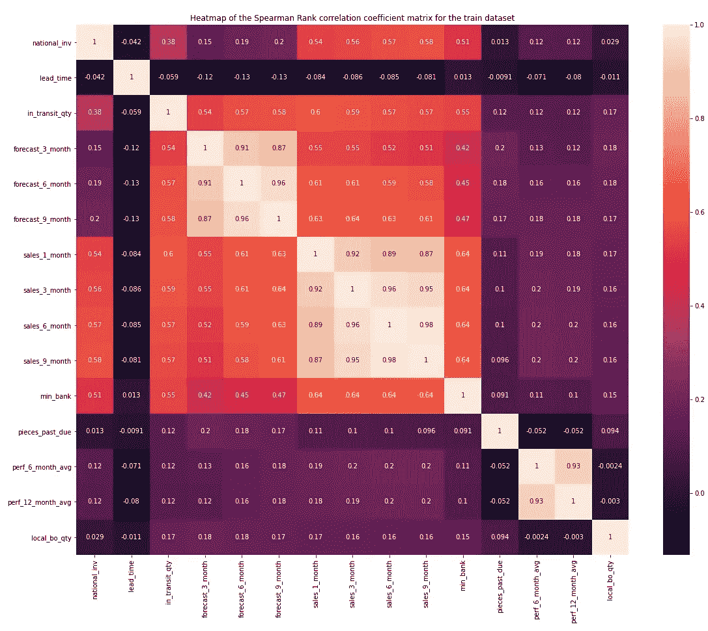

斯皮尔曼等级相关系数

从上面的热图中，我们看到*在途数量*、*预测 _ 3 _ 月*、*预测 _ 6 _ 月、预测 _ 9 _ 月、销售 _ 1 _ 月、销售 _ 3 _ 月、销售 _ 6 _ 月*、*销售 _ 9 _ 月*和 *min_bank* 的相关性很高。其中 *forecast_3_month、forecast_6_month* 和 *forecast_9_month* 三者之间的关联度比其余的更大。类似地，*销售 _ 1 _ 月*、*销售 _ 3 _ 月*、*销售 _ 6 _ 月*和*销售 _ 9 _ 月*比任何其他特征彼此更相关。我们还看到 *perf_6_month_avg* 和 *perf_12_month_avg* 彼此高度相关。

# 数值特征的 Kolmogorov-Smirnov 检验

我们使用 KS 测试来了解数字特征和目标标签之间的相关性。Kolmogorov–Smirnov 统计量量化了样本的经验分布函数和参考分布的累积分布函数之间的距离，或者两个样本的经验分布函数之间的距离。

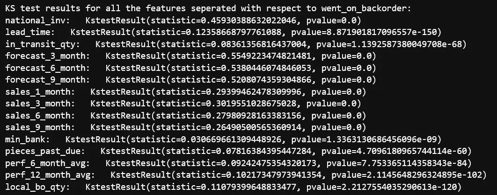

所有数字特征的 KS 测试结果

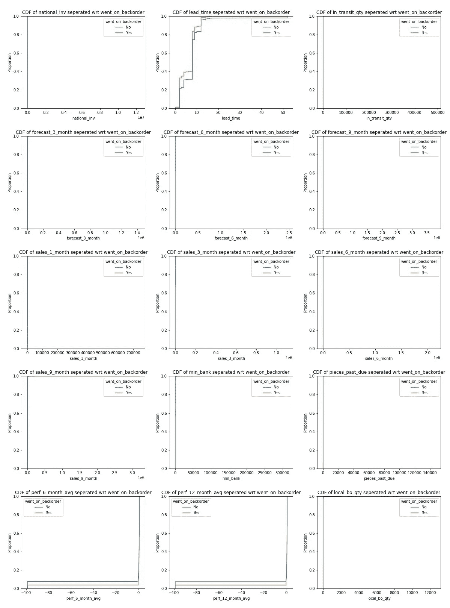

KS-数字特征测试

我们可以看到，大多数特征在 0 处具有非常高数量的数据点。从所有数值特征的 ks 检验中，我们可以说大多数特征没有很好的 p 值，因此我们必须拒绝零假设。因此，这些分布并不相似，也没有显示出与目标变量的相关性。然而，一些特征如*提前期*、*绩效 _ 6 _ 月 _ 平均*、*绩效 _ 12 _ 月 _ 平均*显示出与目标变量足够好的相关性。

# 分类特征的随机/概率矩阵

计算潜在问题的概率矩阵

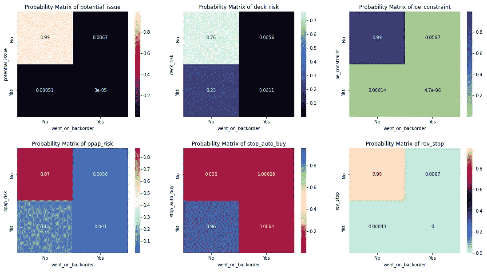

所有分类特征的概率矩阵

从上述所有分类特征的概率矩阵集合中，我们可以看到，当产品没有延期交货时，这些分类特征中的大多数都有很高的概率具有否定标志。因此，我们可以说，当一种产品没有进入延期交货时，大多数一般风险标志都是负的。

# 主成分分析

PCA 代码

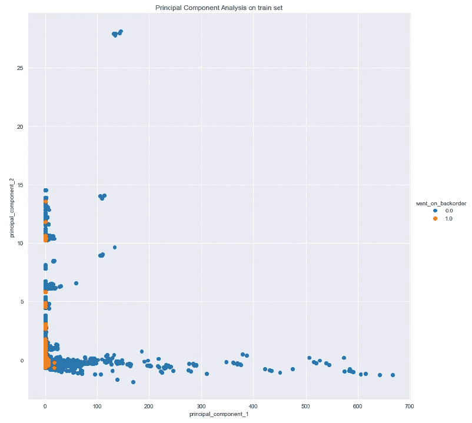

主成分图

我们使用了降维技术，在这种情况下，主成分分析捕捉数据的本质。从上面的图中，我们看到大多数数据点位于 0 旁边。这个推论是正确的，因为我们在 EDA 中已经看到了许多值大多为 0 的特性。数据中存在异常值，但这些数据点本身并不一定是异常值。

此外，与正面类别相比，这些潜在的异常值更多地属于负面类别。并且，对于正类，几乎所有的数据点都位于 0 旁边。

# 特征工程

由于特征*提前期*中有缺失值，我们进行了均值插补。此外，我们看到特征 pieces_past_due 和 local_bo_quantity 有超过 95%的值为 0。因此，作为一个特征工程过程，我们增加了额外的特征，显示两个特征中的每个数据点是零还是非零。

除了这些特征之外，我们已经用来自概率矩阵的概率估算了所有的分类特征。我们只考虑了零类概率，并估算了所有特征的值。

从概率矩阵中输入概率的代码

我们已经为训练和测试数据集执行了所有上述特征工程技术。最终数据的形状为:定型集 1687860 行× 24 列，测试集 242075 行× 24 列。

# 建立模型和评估

在这种方法中，我们不会使用我们在原始研究论文和一些现有解决方案中使用的任何采样技术。这背后的想法不是通过添加合成数据点来破坏数据，也不是减少模型数据集的大小。因此，为了抑制不平衡数据集的问题，我们使用类权重。

作为基线模型，我选择了使用 scikit-learn 的 GridSearchCV 进行超参数调整的逻辑回归。被调整的参数是*惩罚*和*学习率*。我已经建立了最好的逻辑回归模型，学习率为 0.001，L1 惩罚。在测试集上达到的准确度分数是 0.798，而在相同测试集上的 AUC 是 0.809。

在这个案例研究中，我尝试了四个机器学习模型，包括具有平衡类权重的基线逻辑回归模型。已经进行了超参数调整，以充分利用每个模型。像网格搜索和随机搜索这样的技术已经被用来执行调谐。

使用超参数调整构建随机森林模型的代码

我们观察到基于树的模型比线性模型表现得更好。请查看下面关于所有四种模型(即逻辑回归、决策树、随机森林和梯度推进决策树)的所有指标的摘要。

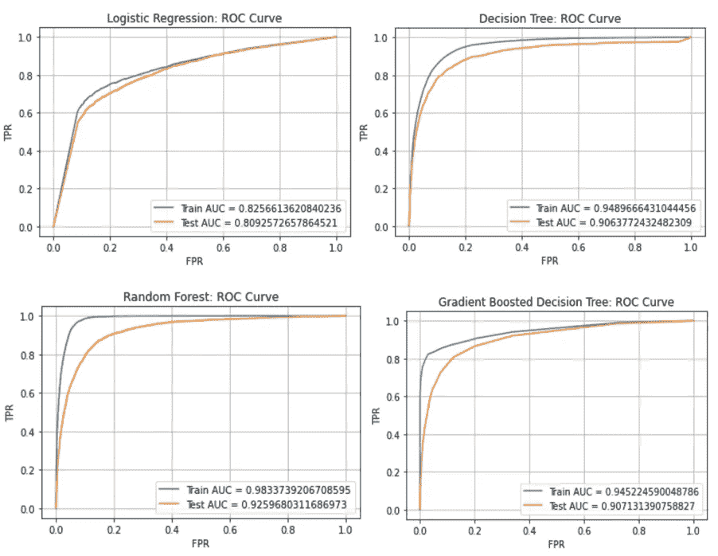

所有 4 个模型的训练和测试的 AUC

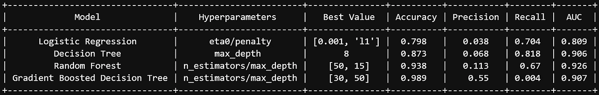

所有 4 种型号的总结

从上述 AUC 图和总结来看，Random Forest 是表现最好的模型，其 AUC 为 92.6，非常接近原始研究论文作者获得的 AUC (94.7)。我们能够在没有研究论文中使用的任何过采样或欠采样技术的情况下获得这一分数。相反，随机森林模型使用平衡子样本作为类别权重来抑制不平衡数据问题。

最佳模型的准确度分数是 93.8，这与逻辑回归和决策树相比是好的。然而，梯度增强决策树模型具有最高的准确性。我们没有使用这个模型，因为我们已经确定，当涉及到高度不平衡的数据时，准确性不是最好的衡量标准。

# 使用 Streamlit 在 AWS 上部署

app.py 的代码

最终确定模型后，我使用 Streamlit API 将它部署在 EC2 实例上。您可以点击下面的链接查看该应用程序。

## 链接到 streamlit 应用:[http://34.238.245.11:8501/](http://34.238.245.11:8501/)

# 未来的工作

我们总是可以采用抽样技术来提高模型的性能。像 SMOTE 和 ADASYN 这样的技术已经被证明可以有效地抑制不平衡数据集问题。未来的工作包括使用其他机器学习模型，如支持向量机，甚至使用神经网络结合上述采样技术。

## 与本案例研究相关的所有代码都存放在我的 GitHub 个人资料中。

 [## GitHub-prayushmohit/延期交货-预测

### 这是 2017 年 IEEE 大会上发表的一篇研究论文的案例研究…

github.com](https://github.com/pratyushmohit/backorder-prediction) 

## 通过我的 LinkedIn 个人资料联系我

 [## 印度特伦甘纳邦 prat yush Mohit-Hyderabad |职业简介| LinkedIn

### 一个数据科学和机器学习的专业人士，有能力处理和解决现实世界的行业问题…

www.linkedin.com](https://www.linkedin.com/in/pratyushmohit/) 

# 参考

1.  https://www.appliedaicourse.com/
2.  [https://www . researchgate . net/publication/319553365 _ Predicting _ Material _ Backorders _ in _ Inventory _ Management _ using _ Machine _ Learning](https://www.researchgate.net/publication/319553365_Predicting_Material_Backorders_in_Inventory_Management_using_Machine_Learning)
3.  [https://medium . com/analytics-vid hya/back order-prediction-d4f1c 5362 f 18](/analytics-vidhya/backorder-prediction-d4f1c5362f18)
4.  [https://journalofbigdata . springer open . com/articles/10.1186/s 40537-020-00345-2](https://journalofbigdata.springeropen.com/articles/10.1186/s40537-020-00345-2)
5.  [https://www . tandfonline . com/doi/full/10.1080/00207543 . 21 . 1901153？scroll = top&need access = true](https://www.tandfonline.com/doi/full/10.1080/00207543.2021.1901153?scroll=top&needAccess=true)