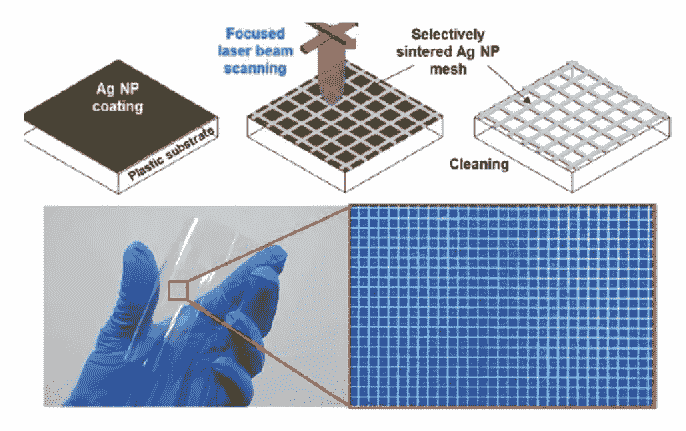
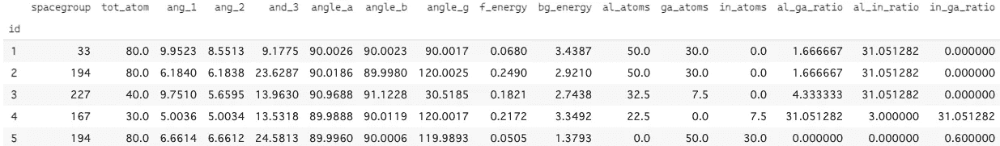
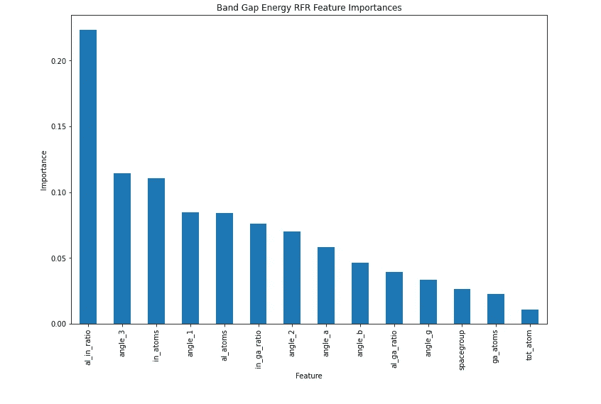

# 预测分子性质

> 原文：<https://medium.com/analytics-vidhya/predicting-molecular-properties-cc278b4927a9?source=collection_archive---------28----------------------->

机器学习可能是我们这一代最通用的技术工具。给定足够的数据和适当的算法，我们可以将 ML 应用于我们能想到的任何问题；二手车值多少钱？基于受教育年限的平均收入是多少？或者，如果我的狗是一只 7 岁的哈士奇，我应该遛狗多长时间？

这是我通过这个项目想要回答的问题；我们能根据一种材料的分子组成和几何形状来预测它的性质吗？更具体地说，我们追求的性质是带隙能和形成能。尽管深入研究它们的技术细节对于理解我的方法来说并不是必要的，但足以说明它们在确定材料的透明度、导电性、稳定性和制造成本时是重要的。

讨论中的化合物由 4 种元素(铝、镓、铟和氧)组成，遵循一个特定的化学式，但我们也不会深究。我应该指出的是，[数据集](https://www.kaggle.com/c/nomad2018-predict-transparent-conductors)不包括任何关于分子中氧的信息。不管怎样，我们为什么要在乎呢？嗯，这些分子结合在一起，创造出导体作为最终的材料，这就是现代社会的积木！

这些是我在这次探索中采取的主要步骤:

1.  数据“清理”
2.  定义培训数据和目标
3.  定义、训练和评分模型
4.  优化、重新训练和重新评分模型
5.  可视化结果

## 数据清理

与任何 ML 项目一样，第一步是将我的数据加载到 pandas 数据框架中。数据一开始是相当干净的，但是减少打字量总是在我的任务列表中，所以我重新命名了一切！关于特征工程，以下是实现的变化:

*   **增加了三种元素的{elem}_atoms** 和**减少了百分比 _atom_{elem}** 栏；分子中特定元素的百分比似乎不如该元素在分子中的原子总数有用。
*   **添加元素比率(Al:Ga，Al:In，In:Ga)** 并用给定列中的最大值替换其未定义的值；任何给定元素相对于整个分子的数量都很重要，但我想考虑元素之间的相互关系。

你可能会问自己，为什么我用最大值代替平均值或者使用简单估算？在这些情况下，比值没有多大意义，因为其中一种元素根本不存在于分子中。然而，我的未定义值实际上是 np.inf(无穷大)，这意味着我将*某个*数(**任何**实数)除以 0。尽可能从字面上理解，我想在不扭曲数据的情况下使这些值*变大*，因此我决定给定列的最大值将优于平均值。

train.head()

## 定义培训数据和目标

因为我的数据帧被清楚地标记并且容易理解，所以这一步非常简单。我将目标和数据定义如下:

*y1 = 'bg_energy'*

*y2 = 'f_energy'*

*X =其他一切*

作为最后一步，我使用总是很方便的 train_test_split 函数创建了最终的训练和验证集。

## 定义、训练和评分模型

目标都是连续值，训练集不包括任何分类特征/变量，即。都是很好的正数！我选择了这 4 个回归模型作为我的预测器:

[*线性回归*](https://scikit-learn.org/stable/modules/generated/sklearn.linear_model.LinearRegression.html)

[*山脊*](https://scikit-learn.org/stable/modules/generated/sklearn.linear_model.Ridge.html)

[*随机森林*](https://scikit-learn.org/stable/modules/generated/sklearn.ensemble.RandomForestRegressor.html)

[*XGB 回归器*](https://xgboost.readthedocs.io/en/latest/index.html)

在定义这些模型后，我用我的训练数据(基本上只是 X1，y1，y2 的子集)拟合它们，而不使用任何特定的参数来衡量模型开箱即用的表现有多好。我使用两个指标对它们进行了评估:

[平均绝对误差](https://scikit-learn.org/stable/modules/generated/sklearn.metrics.mean_absolute_error.html)

[R 分数](https://scikit-learn.org/stable/modules/generated/sklearn.metrics.r2_score.html)

## 优化、重新训练和重新评分模型

在任何分析中，调整模型参数都是最耗时的步骤之一，这也不例外。我使用了[randomsearccv](https://scikit-learn.org/stable/modules/generated/sklearn.metrics.model_selection.RandomizedSearchCV.html)函数来优化模型(对于线性和可能的脊形来说肯定是过度的)，之后我用 RSCV 给出的最佳参数重新训练了我的模型。

## 可视化结果

下面有不少图，但总比通读文字好！

地层能量分数(验证集)

地层能量分数(训练集)

带隙能量分数(验证集)

带隙能量分数(训练集)

铝铟比与带隙能量

铝镓比率和铟镓比率与带隙能量

铝铟比与地层能量

铝镓比和铟镓比与地层能量

带隙能量形状图

地层能量形状图

## 结束语

和科学数据探索一样，我不知道我会发现什么。然而，在使用了一些 ML 算法并将结果可视化后，我可以自信地说，在确定带隙和形成时，元素之间的比率比它们的绝对量更重要。也许更重要的是，似乎化合物的空间几何在决定其性质方面比其组成起着更大的作用。

我将继续寻找数据来阐述这些发现。

下次见！

*有问题吗？只是想聊聊天？留言评论！*

*或者这里联系我:*[*LinkedIn*](https://www.linkedin.com/in/ricardo-a-rodriguez-f/)*[*GitHub*](https://github.com/reesh19)*