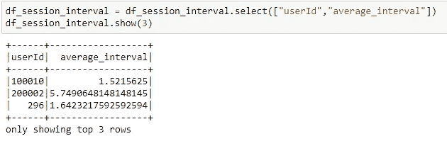
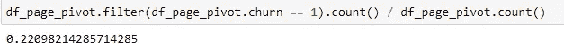

# 预测音乐应用程序搅动 89%的 F1 评分:Sparkify 项目

> 原文：<https://medium.com/analytics-vidhya/predicting-music-app-churns-with-machine-learning-sparkify-project-dfc2ac2c695c?source=collection_archive---------9----------------------->


左图:[https://airmore.com/best-music-apps-for-iphone.html](https://airmore.com/best-music-apps-for-iphone.html)右图:[https://www.customerbliss.com/popular-2016-posts/](https://www.customerbliss.com/popular-2016-posts/)

*在这个项目中，我将解释我的 Udacity 数据科学家跟踪毕业项目:音乐应用 Sparkify 的客户流失建模。你可以在我的 githı账户上找到这个项目的代码:*[https://github.com/semihnykv/MusicAppChurnPrediction](https://github.com/semihnykv/MusicAppChurnPrediction)

Sparkify 是 Udacity 为一些项目创建的一个虚构的手机和电脑数字音乐服务应用程序。Spotify 或其他音乐流媒体应用程序也是如此。它的数据类型与我们习惯的网站事件类型数据相同。当用户播放一首歌曲或打开应用程序时，所有这些操作都会记录到数据库中，并附带事件类型。有了这些数据，可以做很多实验。

在这个项目中，我试图用给定的数据创建一个流失模型。在特征工程部分创建新特征为模型增加了有价值的改进。我将在下面的章节中解释我的工作:

**大纲:**

**1。简介-项目范围**

**2。探索性数据分析**

**3。特征工程**

**4。建模**

**5。调查结果&结论**

# 1.导言-项目范围

在这个项目中，我们有小型、中型和完整的数据集。我在 IBM Cloud Pak 解决方案上使用了中等大小的数据集(237)。我用 Pyspark 进行分析和建模。用 Spark 搭配 Hadoop 是因为大数据。使用 PySpark，您可以在 Python 编程语言中使用 rdd，并在 Hadoop 系统上轻松使用 Spark。

我们将尝试通过使用机器学习来预测音乐应用 Sparkify 的流失用户。

首先，我们将发现数据并进行一些特征工程。然后我们会实现一些分类算法来预测流失用户。

由于流失用户是数据的一小部分(几乎 22%)，我们将使用 1 级流失的 F1 度量来比较算法。F1 指标是真实类别的精确度和召回率的调和平均值。

在决定算法后，我们将进行一些超参数搜索以获得更好的预测分数。

最终，我们将拥有一个可靠的机器学习模型，根据我们掌握的行为和使用数据预测哪些用户更有可能流失。

# 2.探索性数据分析

下面的数据集架构显示了数据集结构和可用的列。


我们将通过使用`Cancellation Confirmation`事件来定义我们的客户流失，从而创建一个客户流失标签。拥有此类事件数据行的用户将被标记为流失用户。

该数据集是基于事件的数据集，类似于 Google Analytics 网站数据。当用户登录或播放一首歌曲时，它会为该行/事件创建一个事件和其他功能。我们为用户提供会话，以及这些会话中的事件，如添加朋友、下一首歌或滚动广告。这些事件类型在页面功能中给出。

**我们来分析一下性别特征:**

```
df_gender = df.groupby(["gender","userId"]).agg({"churn":"mean"})
df_gender_churn_rate = df_gender.groupby("gender").agg({"avg(churn)":"mean"})
fig = plt.figure(figsize=(8, 4))
sns.barplot(x="gender", y="avg(avg(churn))", data=df_gender_churn_rate.toPandas())
```


在第一种方法中，我们获得用户的流失值，因为它在用户的所有行中都是相同的。然后我们通过性别分组再次取平均值，我们得到性别的流失率。性别似乎没有提供足够的信息来预测客户流失。

**我们来分析一下关卡特性:**

```
df_level_user = df.groupby(["userId","churn"]).agg({"level":"last"})
df_level_churn_rate = df_level_user.groupby("last(level)").agg({"churn":"mean"})
df_level_churn_rate.show(5)
```


首先，我们根据用户 id 和流失状态进行分组，并获得最新级别的用户，以便更好地进行评估。好像我们免费用户有 0.26 %的流失率。付费用户的流失率为 0.21，低于免费用户。这可能是预测客户流失的一个指标。

**我们来分析一下歌曲计数特征:**

```
df_count_song = df.filter(df.page == "NextSong").groupby(["userId","churn"]).agg(count("song"),countDistinct("song").alias("distinct_song"))
df_song_mean = df_count_song.groupby("churn").agg({"count(song)":"mean","distinct_song":"mean"})
df_song_mean.show(5)
```


我们可以看到，churn-1 用户播放的歌曲比非 churn 用户少。从歌曲数量和不同的歌曲数量来看，他们播放的歌曲较少。

**我们来分析一下页面/事件类型特征:**


我们分组并得到每种事件类型的页面数。它给了我们事件的计数，例如:对于第一个用户，他/她添加了 4 个朋友，得到了 1 个错误，他/她注销了 5 次，看到了 20 个滚动广告，只给了一次否定。它们可能是预测客户流失的指标。

如果我们按流失状态对这些数据进行分组并分析结果，我们会看到:

*   流失的人倾向于少加好友。
*   流失的人倾向于在播放列表中添加较少的歌曲。
*   流失的人不太可能点击降级页面。
*   流失的人不太可能出错
*   流失的人不太可能需要帮助
*   流失的人可能会得到更多的滚动广告
*   流失的人给予大拇指向上或向下的数字较低，似乎他们不喜欢与应用程序的互动。

我们将对每个用户进行标准化，因为每个用户的数量是不同的。它可能会误导算法。

加好友，提交降级升级都是实数。所以我们把这些排除在百分比公式之外。我们创建了一个总计数列，并将页面计数除以这个数字，以便对每个用户进行标准化。我们得到:


# 3.特征工程

我们将创建新的功能除了现成的功能后，EDA。

**a .平均会话持续时间**

我们将为用户获取每个会话的开始和结束时间。然后，我们可以通过计算这些日期的差异来添加“会话持续时间”列。

```
df_session_length = df_session_length.withColumn('session_duration',(col("max_time").cast("long") - col("min_time")\                                                                     .cast("long"))/60)
```

按用户分组基于此会话的数据，我们得到:


**b .每次会话的平均歌曲数**

我们按用户 id 和会话 id 对数据进行分组，计算该会话中播放的歌曲。则会话的平均歌曲计数作为新特征而产生。流失用户在他们的会话中播放较少的歌曲可能是一个事实:)

```
df_avgsong_allsession = df.groupby(["userId","sessionId"]).agg(count("song"))

df_avgsong_per_session = df_avgsong_allsession.groupby("userId").agg({"count(song)":"mean"})
df_avgsong_per_session.show(3)
```


**c .平均会话间隔持续天数**

一些用户可能很少使用 app，一些用户每天都会定期使用。为了理解这一点，我们将创建一个特征。我们将使用最小和最大日期以及会话计数来计算此功能。我们得到时间间隔，然后将这些时间间隔除以时间指标和会话计数，最后得到以天为单位的平均间隔持续时间。


然后我们得到:



**d .自登记日期起的任期特征**

我们在所有行上都有注册日期，这是用户的开始日期。如果我们得到最大会议日期，减去注册日期，我们达到任期功能的天。


**艺人范围 KPI**

一些用户倾向于听相同的歌手，这可能是一个很好的迹象，表明他们会使用应用程序更长时间，因为他们有些沉迷于听一些选定的音乐，我们可以说他们有特定的喜好。

为了计算该特征，我们将不同艺术家计数除以总艺术家计数。如果用户听同一个艺术家，这个数字将接近 0，否则接近 1。

```
df_page_pivot = df_page_pivot.withColumn("artist_range",  
                                    df_page_pivot["distinct_artist"] / df_page_pivot["count(artist)"] )
```

**f .时段趋势(过去 7 天对比上周)**

我们现在将创建一个需要更复杂计算的特征，我们将使用 pyspark 中的窗口函数来查找我们的特征。

首先，我们按用户 id 和会话 id 对数据进行分组，并以日期时间和时间戳格式找到会话的最大日期。然后，对于每一行，我们返回 7 天和 14 天，并计算会话数(行数)。我们通过按用户标识划分数据并使用窗口函数来实现。


在找到这个用户的基于会话的数据后，我们必须只取最新的会话，因为我们将使用它来比较 7 天与前一周。要做到这一点，我们需要给会话一个等级数，只取第一个。我们通过使用 pyspark.sql 函数库中的行号函数来实现这一点。

```
df_session_limited3 = df_session_limited2.withColumn("rn", F.row_number().over(Window.partitionBy("userId").orderBy(F.col("datetimeNew").desc())))
```

现在我们在表中有了名为“rn”列的秩数:


现在，我们只为所有用户选择排名第一的行，并检查用户的数据:


让我们创建一个趋势公式=(上周会话计数)/(过去 14 天会话计数+ 0.01)

如果过去 14 天没有会话，我们会添加 0.01。分母为零对我们来说可能是个问题。

如果新的 KPI 低于 0.5，我们可以说上周的会话数与上周相比有所减少。让我们应用这些并检查 userd33。

```
df_session_limited3 = df_session_limited3.withColumn("last_week_trend",df_session_limited3["sessions_in_7_days"] / (df_session_limited3["sessions_in_14_days"] + 0.01 ))
df_session_limited3.filter(df_session_limited3.userId == "33").show()
```


然后，我们为所有用户提供了新功能:


**g .删除高基数特性**

在我们的数据集中，我们有一些分类特征，如位置和用户代理。


对于位置功能，您可以从左边的条形图中看到，有如此多的选项。如果我们对我们的数据使用这个特征(我们的数据包括 448 个人)，将会有算法的误用，特别是基于树的算法。所以我不会用这个特性来得到一个健康的模型。


对于用户代理特性，我们可以很容易地说同样的事情。在我们的数据集中有 71 个不同的用户代理和 448 个用户。从这种糟糕的数据中学习，因为每个用户代理标签的数量非常少，这对我们的模型没有好处。

**h .将所有特征连接在一起**

我们通过使用 userı将主数据与新特性结合起来。

```
df_page_pivot = df_page_pivot.join(df_session_avg,["userId"])
df_page_pivot = df_page_pivot.join(df_avgsong_per_session,["userId"])
df_page_pivot = df_page_pivot.join(df_session_interval,["userId"])
df_page_pivot = df_page_pivot.join(df_user_tenure,["userId"])
df_page_pivot = df_page_pivot.join(df_session_trend,["userId"])
```

让我们在整个数据中再次检查流失率:



22%的用户已经退出了该应用程序。

**一、多重共线性测试**

首先，我们将创建一个热图来进行可视化分析:


一些特征似乎是相关的。

*   计数歌曲和计数艺术家几乎计数相同的播放行和高度相关，我会放弃计数艺术家。
*   艺术家范围和计数(不同艺术家)相关，我将删除计数(不同艺术家)，因为我们有艺术家范围 KPI。
*   由于艺术家范围衡量音乐使用的多样性，我们可以删除计数(独特的歌曲)功能。因为计数歌曲和计数(不同歌曲)也是高度相关的。
*   每个会话的平均歌曲数和平均会话持续时间高度相关，我将删除平均歌曲数。
*   数宋和 sum(length)高度相关，我就滴 sum(length)了。
*   加好友和数歌相关，我会掉加好友。

drop = "count(artist)"、" distinct artist "、" avg(count(song))"、" sum(length)"、" distinct song "、" Add Friend "

# 4.系统模型化

我们只有 22%的流失用户，所以我们应该为我们的模型测量 F1 分数。

如果按精度衡量，可以预测所有样本为 0 类，达到 78%的精度:)

F1 将是衡量客户流失的一个好方法。


贷方:【https://pmirla.github.io/2018/11/15/precison_recall.html 

我们将使用这些分类算法:

***逻辑回归***

实际上，逻辑回归基本上是一种回归算法。主要的区别是，这一次在将权重与特征值相乘后，我们使用这个总和，并将其传递给一个 sigmoid 函数，得到一个介于 0 和 1 之间的值。这给了我们一个概率和一个很好的分类器。它的目标也是最大化“最大似然性”，而不是最小化回归的“均方误差”。

***决策树分类器***

决策树是一种几乎基于规则的非参数算法，它使用 n 个特征在 n 轴输入空间上几何地划分零件。它从数据中学习如何以最佳信息增益分割特征空间。它随着特征添加规则而增长，最终形成一个几乎树状的基于规则的模型。它也可以用于回归。

***随机森林分类器***

决策树算法中的随机森林驱动。这一次算法不使用单棵树，使用这么多棵树。这些小树不是从所有数据中学习，而是从随机样本中学习。然后这些关于分类的小树决策进入投票系统并决定模型决策。可以说，与决策树和逻辑回归相比，它是一种更加黑箱化的算法。它也可以用作回归。

***梯度提升树分类器***

梯度推进算法是一种集成算法，它使用许多预测器，如随机森林。除此之外，该算法还具有 boosting 特性。这是通过每个模型关注其前任的错误来实现的。每个预测器都试图通过减少误差来改进其前身。这个逻辑使得这个算法很特别。

在使用算法之前，首先我们借助 pyspark.ml 库的 StringIndexer 函数将分类变量性别和级别转换为数字。

然后我们检查空值，发现没有空值:


然后，我们使用经典的训练-测试分割:)方法，测试规模为 0.2。

在 train-test split 之后，我们为 pyspark 创建了一个由交叉验证器组成的函数。它包括一个由向量汇编器、最小最大缩放器和分类器组成的流水线。我们为交叉验证器选择 3 号折叠。

为了评估，我们创建了另一个函数来测量训练和测试数据的准确性和 F1，这样我们就可以正确地测量我们的模型。

使用默认设置实现算法后:

## **最终对比:**


正如我们从最终表格中看到的，通过评估测试数据指标 F1 和准确性，逻辑回归是最成功的算法。

我们可以有把握地宣称，逻辑回归为我们的数据集创建了一个很好的模型。决策树和特别是 GradientBoost 似乎过度拟合数据，因为它们的训练指标非常高，而测试指标与逻辑回归不兼容。

我通过 GridSearchCV 使用一些参数搜索尝试了逻辑回归，但是没有得到任何更好的结果。所以我们可以在数据集中使用默认的 LR 模型。

**特征重要性:**


# 5.调查结果和结论

在这个项目中，我们为一个虚构的音乐应用程序创建了一个中小型的事件类型数据集。我们想建立一个退出使用应用程序的客户流失模型。如果我们能在这些客户离开之前预测他们，我们就能接触到他们，并推广一些活动或折扣，这样就不会失去客户。这将使公司更有利可图。

分析数据集和其中的特征显示了一些关于流失的指标。除了这些现成的表格格式的功能，我们还添加了一些测量用户行为、消费和属性的功能。添加这些额外的功能使我们的模型更加坚实和强大。

在最后一部分，我们尝试了 pyspark.ml 库中的一些现成模型，并选择了具有默认设置的逻辑回归算法。我们可以说，我们在数据集中的特征会或多或少地影响我们客户的流失概率。这些特征的权重是模型的参数，唯一的区别是这些总权重与特征值相乘得到一个 sigmoid 函数，并转化为搅动的概率值。

在这个项目中，我们使用 IBM Watson Studio 及其 spark & hadoop 特性来更轻松地分析数据。我们使用 pyspark python 模块在 spark 和 hadoop 系统中工作。

非常感谢 Udacity 和本项目的数据提供商。

我希望你喜欢它，并能给我的作品一个好的掌声:)

谢谢大家！

**资源:**

[](https://databricks.com/blog/2015/07/15/introducing-window-functions-in-spark-sql.html) [## Spark SQL 中的窗口函数介绍

### 在这篇博文中，我们介绍了 Apache Spark 中添加的新窗口函数特性。窗口功能允许…

databricks.com](https://databricks.com/blog/2015/07/15/introducing-window-functions-in-spark-sql.html) [](/analytics-vidhya/solving-complex-big-data-problems-using-combinations-of-window-functions-deep-dive-in-pyspark-b1830eb00b7d) [## 使用窗口函数的组合解决复杂的大数据问题。

### Spark2.4，Python3。

medium.com](/analytics-vidhya/solving-complex-big-data-problems-using-combinations-of-window-functions-deep-dive-in-pyspark-b1830eb00b7d) [](https://towardsdatascience.com/the-most-complete-guide-to-pyspark-dataframes-2702c343b2e8) [## pySpark 数据帧最完整的指南

### 包含您可能需要的所有数据框架功能的书签备忘单

towardsdatascience.com](https://towardsdatascience.com/the-most-complete-guide-to-pyspark-dataframes-2702c343b2e8)