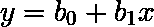
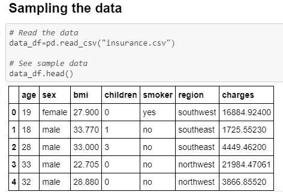
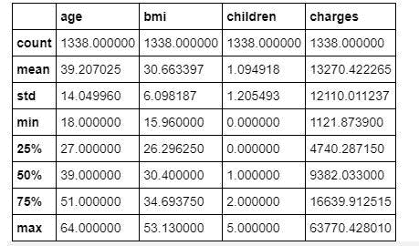
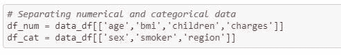
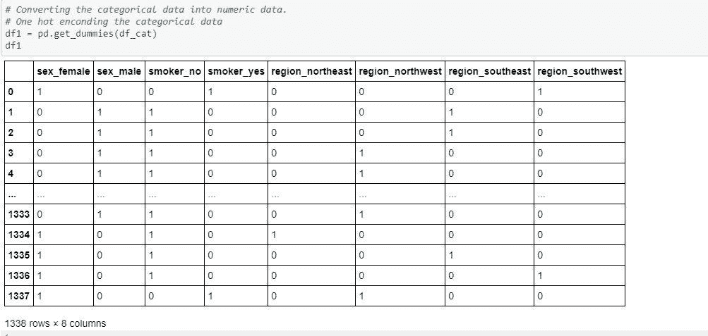
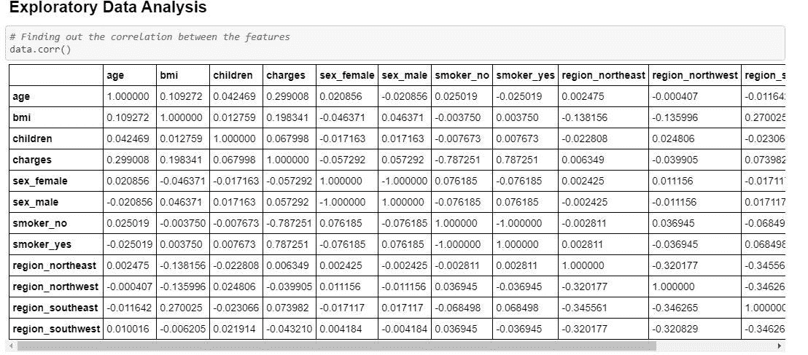
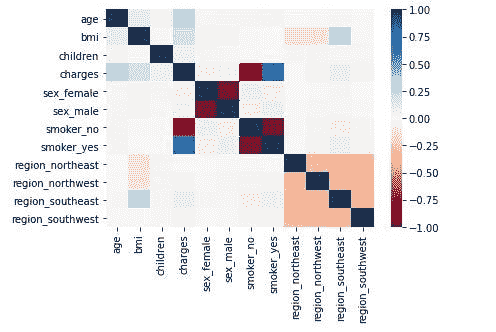
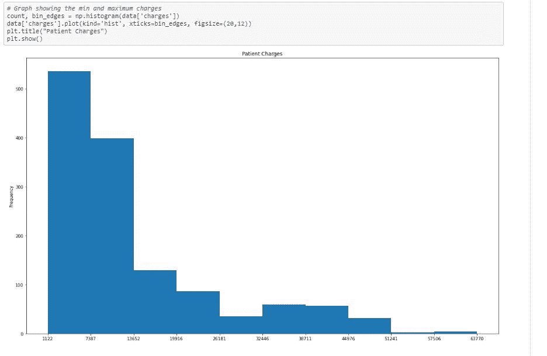
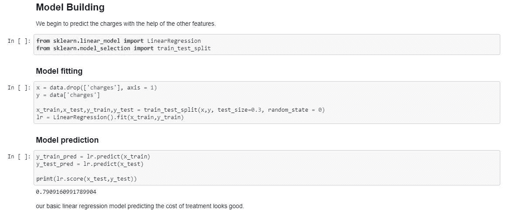
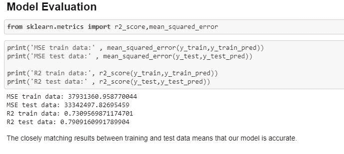

# 使用机器学习预测患者治疗成本。

> 原文：<https://medium.com/analytics-vidhya/predicting-patient-treatment-costs-using-machine-learning-1bfc3732ed13?source=collection_archive---------8----------------------->

## 对个人健康数据进行回归和 EDA 以确定有助于治疗的因素


由[肯德尔](https://unsplash.com/@hikendal?utm_source=medium&utm_medium=referral)在 [Unsplash](https://unsplash.com?utm_source=medium&utm_medium=referral) 上拍摄的照片

# 介绍

线性回归是机器学习中监督学习范畴内最重要的算法之一。它也是最简单和最常用的预测分析模型。利用这一点，我们探索个人健康数据集，并预测治疗和保险费用。

## 什么是线性回归？

用最简单的术语来说，当目标和一个或多个预测值之间的关系是线性的时，它是线性回归。



其中目标(y)被认为是因变量，而一个预测值(x)被认为是自变量。b0 和 b1 分别是截距和斜率。

## 为什么是线性回归？

1.  线性回归可用于确定预测变量对目标变量的影响强度。
2.  它帮助我们了解目标变量随着预测变量的变化而变化的程度。
3.  最重要的是，线性回归可以用来获得未来的估计值，并帮助准确预测趋势。

## 线性回归的类型

线性回归可以大致分为两类:

1.  **简单线性回归:**有一个因变量(目标变量)和一个自变量(预测变量)的方程。
2.  **多元线性回归:**有一个因变量(目标变量)和两个或两个以上自变量(预测变量)的方程。

在这个用例中，我们详细探索简单的线性回归。

# 数据描述


由 [Alexander Sinn](https://unsplash.com/@swimstaralex?utm_source=medium&utm_medium=referral) 在 [Unsplash](https://unsplash.com?utm_source=medium&utm_medium=referral) 上拍摄

为了预测医疗保险费用，我们利用 Kaggle 上的 Miri Choi 的医疗费用个人数据集。列描述如下所示:

*   *年龄*:第一受益人年龄
*   *性别*:保险合同人性别，女，男
*   *bmi* :身体质量指数，提供对身体的了解，体重相对于身高相对较高或较低。
*   *儿童*:健康保险覆盖的儿童人数/受抚养人人数
*   *吸烟者*:是/否
*   *地区*:受益人在美国的居住区域。
*   *费用*:由健康保险支付的个人医疗费用

现在，用数据弄脏我们的手

# 获取数据

一旦我们下载了 CSV 数据，我们就可以使用`read_csv`导入它。然后，我们使用`head()`对数据进行采样。



按作者查看样本数据|图像

# 准备数据

我们试图识别数字和分类数据。我们继续使用`describe()`收集基本的描述性统计数据。我们试图理解数据是什么样的，它试图告诉我们什么。

```
data.describe()
```



按作者查看数据|图像的描述性统计数据

> dataframe.info()也可以为我们提供它所保存的数据的简明摘要。


照片由[卡伦·艾姆斯利](https://unsplash.com/@kalenemsley?utm_source=medium&utm_medium=referral)在 [Unsplash](https://unsplash.com?utm_source=medium&utm_medium=referral) 上拍摄

# 探索性数据分析

EDA 是数据科学中的分析过程，其中通过调查和分析数据集来提取和总结主要特征。我们仔细看看所有涉及的步骤，如下所示:

# 特征工程


照片由[亚历山大·奈特](https://unsplash.com/@agk42?utm_source=medium&utm_medium=referral)在 [Unsplash](https://unsplash.com?utm_source=medium&utm_medium=referral) 上拍摄

*特征工程是利用领域知识提取原始数据以提高模型性能的过程。*

> *机器学习中的特征本质上是指列。*

从我们上一步的描述性分析中，我们可以看到数据由两种形式组成:*和 ***分类*** 。将特征相应地划分为数字和类别:*

**

*区分数字和类别特征|按作者分类的图片*

*用分类数据建立模型很难，但并非不可能。为了简单起见，我们继续将分类数据转换成数字数据。为此，我们使用了 ***一热编码*** 技术。*

*一种热门的编码技术是用二进制数字替换分类数据。分类列被拆分为与值数量相同的列。然后，相应的列被赋予对应于这些值的‘1’或‘0’。*

*我们通过使用`get_dummies()`来使用一键编码*

**

*分类数据上的一个热门编码|作者图片*

*准备好数据后，我们就可以开始下一步了。我们需要挑选对目标变量有影响的重要的'*特性*。最好的方法是尝试找到不同*特性*之间的相关性。这可以通过使用`data.corr()`来实现*

**

*探索特征之间的相互关系|作者图片*

*使用热图进行可视化，以更好地探索趋势。*

**

*热图显示了功能之间的相关性|按作者分类的图片*

*由此我们可以看到以下观察结果:*

1.  **指控*和*吸烟者 _ 是*之间的强相关性。*
2.  **费用*和*年龄*相关性弱。*
3.  **指控*和*身体质量指数*之间的弱相关性。*
4.  **身体质量指数*与*地区 _ 东南*相关性弱。*

*由于弱相关性的值小于 0.5，我们可以将其视为无关紧要，并将其丢弃。*

> *记住:相关性并不意味着因果关系*

*这里我们可以看到，目标变量(*电荷*)只有一个预测值。这是简单线性回归的一个很好的用例。*

*探索费用和吸烟者之间的相关性和趋势 _ 是:*

**

*显示患者治疗费用变化趋势的图表|作者图片*

*从图中可以看出，病人的治疗费用从大多数病人的最低 1122 英镑到少数病人的最高 63770 英镑不等。*

# *构建模型*

**

*训练线性回归模型|图片作者*

*我们开始使用其他特征来预测患者费用的值。我们在导入包`sklearn.linear_model`后建立一个简单的线性回归模型。我们将数据集分为训练集和测试集。一个好主意是使用`test_size=0.3`分割 30%的数据集进行测试。我们将不带电荷列的预测变量和目标变量作为电荷。我们继续使用`fit()`来拟合测试和训练集的线性回归模型。这个部分叫做*模型拟合*。我们使用`score()`检查训练集和测试集的预测分数。结果是 79%，我认为这是相当不错的。*

# *评估模型*

*为了评估我们的线性回归模型，我们使用 **R** (也称为*决定系数*)和 M **均方差**作为我们的度量。*

*r 是预测数据与回归线接近程度的统计度量。它用百分比表示，介于 0%和 100%之间。*一般来说，R 的百分比越高，模型越好。**

*均方差(MSE)是预测值和实际值之间的平均平方差。MSE 越低，模型拟合得越好。*

**

*模型评估结果|作者图片*

*从图中可以看出，MSE 更接近于 0，测试数据的 R 高达 79%！*

# *结论*

*我们对训练和测试数据的 R 和均方误差的评估指标非常匹配，并且与回归线非常吻合。这足以得出结论，我们的模型是适当的预测病人收费的基础上，他们的个人健康数据。*

*我希望我能够通过这个用例有效地解释线性回归以及 EDA、特征工程和选择、R 和均方误差的相关概念。个人健康数据是线性回归简单工作的一个很好的例子！感谢您的阅读！*

# *参考*

1.  *我的代码，[个人健康数据回归](https://github.com/Thomas-George-T/Regression-on-Personal-Health-Data) (2020)，GitHub*
2.  *Miri Choi，[医疗费用个人数据集](https://www.kaggle.com/mirichoi0218/insurance) (2013)，Kaggle*
3.  *统计解决方案，[什么是线性回归](https://www.statisticssolutions.com/what-is-linear-regression/?__cf_chl_jschl_tk__=778c40adeeeb9bf683ebc6f59d3fd6e925af2469-1616173220-0-AQgJM-siD_HFStc1RQO1KsxNMX4hzW3PfBJ3kX_QL-Ibjesk6l8qXHfYiyhJd96zPrDL2dacFyp4Kv7b32a2z9nXPH5CbkcFxSrLmeWD6u0n83XCWVI_QCOyePzH_VCgllquORtE3uul0BuuEWPIqfFQMKdyCVx6Q0dz638Qt2AxwRLZvWOThhKIiUhd30M0VNStU6yWw54ToVZMAAlbMGlyXRr-PDLfkbde2b0AtMMFRYRPXEhPtr76NGqQ7l8wiyPxlrAN51Mte1L8QsnBlLllWqtuuCfdYlnwBVzRhFjMIOhdwnVzWSozoSUqSonpra2GG-yhGj953MNDFyXGdft5-UB92qDm83M5BfXddBUf) (2013)*