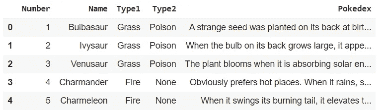
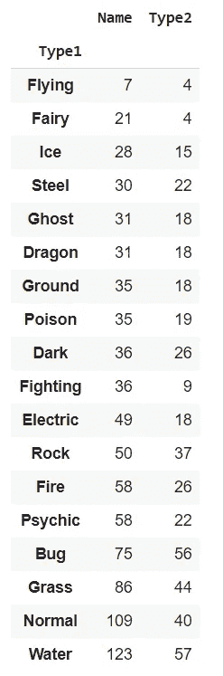
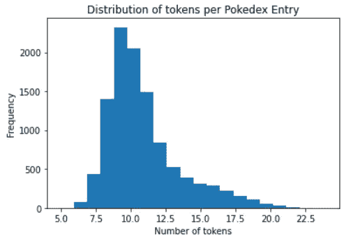
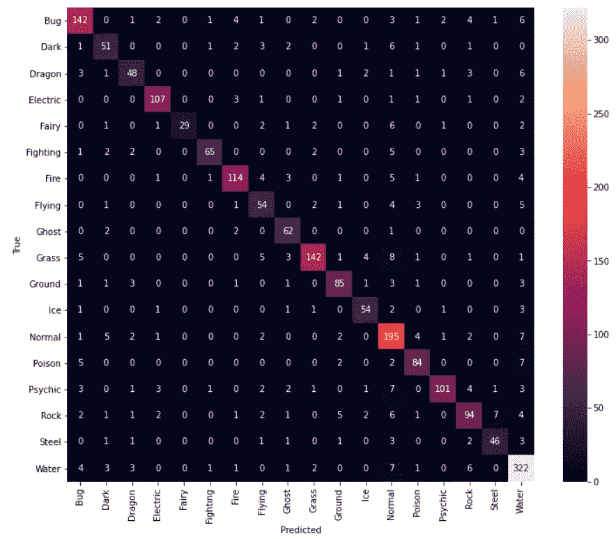
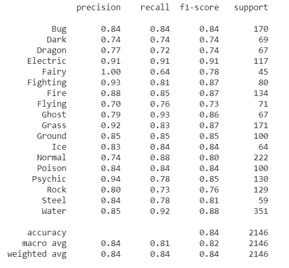
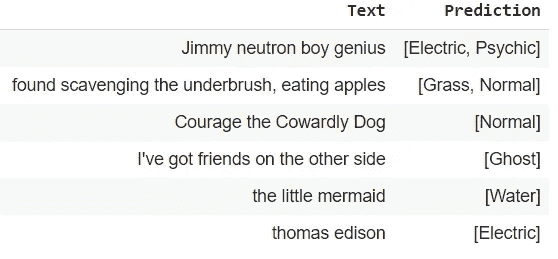

# 使用神奇宝贝索引条目预测神奇宝贝类型

> 原文：<https://medium.com/analytics-vidhya/predicting-pok%C3%A9mon-type-with-the-pok%C3%A9dex-7038754dc422?source=collection_archive---------11----------------------->

*注:您可以点击* [*这里*](https://github.com/rbelfer/pokedex_nlp) *访问 GitHub 上的完整代码。*


[杰](https://unsplash.com/@imjma?utm_source=medium&utm_medium=referral)在 [Unsplash](https://unsplash.com?utm_source=medium&utm_medium=referral) 上拍照

25 年来,《神奇宝贝》系列一直吸引着世界各地儿童(和成人)的心，成为一个具有惊人持久力的流行文化偶像。拥有近 900 种独特的神奇宝贝，涵盖漫画、电视、服装、视频和桌游、交易卡——神奇宝贝商品包罗万象。我的第一个电子游戏是《神奇宝贝红》;我不是很好，但我喜欢每次我捕捉到新东西时出现在 Pokédex 中的小广告。当我成为一名有经验的教练后，我开始对不同类型的组合感兴趣，并想象不同类型的组合会是什么样子。我确信我不是唯一一个被问到“如果你是一只神奇宝贝，你会是什么类型的？”就我个人而言，我一直认为自己是电或冰的类型，但我开始想，我可以根据自己的一点广告找到一种类型吗？有了自然语言处理(NLP)，我开始了自己通过文本预测神奇宝贝类型的旅程。

这篇文章将介绍 NLP 中使用的三种不同级别的技术:

1.  使用监督学习和神经网络示例对令牌进行简单的一键编码，以预测主要类型。
2.  使用全局向量(手套)嵌入来预测主要类型的神经网络。
3.  用于多标签序列分类的变压器。

我们的目标也是通过神奇宝贝的镜头激发人们对数据科学的兴趣，因为这是一个平易近人的热门话题。

# 获取数据

有许多很棒的网站记录着神奇宝贝的数据，包括 [Bulbapedia](https://bulbapedia.bulbagarden.net/wiki/Main_Page) 和 [Serebii](https://www.serebii.net/) 。为了方便使用，我们将从[神奇宝贝数据库](https://pokemondb.net/)中抓取；该设置允许我们获得 8 代的所有条目。唯一的缺点是，它将 Alola 和 Galar 区域变体与原始页面混在了一起，很难区分开来。因此，举例来说，我们将有几个条目为阿洛拉的火鬼马罗瓦克标记为地面。我们首先导入一些常用的包和库，并建立我们的 Pandas 数据框架(库将在它们应用到代码之前导入):

我们使用`BeautifulSoup`库从网站上抓取。文档可以在这里找到，但是要点是我们在 HTML 中寻找唯一的 ID 和类名。在 Chrome 中按 Ctrl+U 可以手动访问网页的 HTML 源代码。



我们来看看类型分布。也可以检查是否有任何类型缺失，但所有数据似乎都在。

```
df.groupby("Type1").count()[["Name", "Type2"]].sort_values("Name")
```



好像水型和正常型最常见，这是意料之中的。飞行型一般是二级类型，所以一级飞行型的神奇宝贝只有 7 个；如果我们不进行欠采样或过采样，这种不平衡和其他不平衡可能会造成问题。过采样是首选，因为数据点少于 1000 个。

我们可以将它保存为 CSV 文件，这样我们就不需要再刮擦了。

```
df.to_csv('pokedex_db.csv', index=False)
pokemon = pd.read_csv('pokedex_db.csv')
```

# 方法 1:一个热编码令牌

这种方法的目标是展示如何将文本转换成在 ML 模型中使用的正常特征。在这种情况下，所有内容都是二进制要素，这意味着值可以是 0 或 1。

现在我们有了数据，我们开始编码。对于许多监督学习方法，将类型保留为字符串是可以的，但是我们需要将它们编码为神经网络的标签。我们可以使用`sklearn`库中的`LabelEncoder`或`OrdinalEncoder`函数，这里我们使用前者。

再看飞行型，大部分玩家都会知道，一大堆鸟一样的神奇宝贝，其实首先是普通型，飞行型是次要型。事实上，大约四分之一的正常类型也在飞行！为了帮助类型平衡，防止普通条目大量引用鸟类联想，如“啄”、“翅膀”等。，我们对这些正常飞行类型进行了调整，将飞行作为主要类型。

接下来，我们将调整文本，为标记化做好准备。我们确保删除神奇宝贝的名字。我们删除的一个撇号实际上是出现在刮擦中的一个非键盘字符。

我们使用`nltk`包来准备一次性编码。我们删除了停用词，这是英语中常见的词，如“the”或“can ”,它们不会在不同类型之间添加任何分隔。`MultiLabelBinarizer`创建独热编码数组。

数据在训练和测试之间按 80:20 的比例分割，没有为这些示例设置验证。例如，它根据冰的类型进行分层，这样测试集就不会得到大多数冰的类型。

由于主要类型不平衡，我们希望进行过采样。如果没有，模型将会以更高的速度预测水和正常类型(预测任何事物的水比随机猜测更准确)，并且可能根本不会预测仙女或飞行类型。有几个采样选项，但鉴于我们有数千个非常稀疏的二值化要素，我们使用 SMOTE 进行注销，SMOTE 是一种通过给定与同一标注中的要素值接近的要素值来创建合成点的方法。我们可以使用随机过采样来复制少数类中的数据点，使用`imblearn`包。

下面是一个伯努利朴素贝叶斯模型的例子，它实际上优于神经网络。测试精度达到 0.48，当有 18 个可能的标签时，这已经不错了。代码块后半部分的神经网络在最后一层需要 18 个节点，每种类型一个节点。softmax 激活是一种使用类似逻辑的函数来归一化概率的方法(想象一个水平拉伸的“s ”,或者一个横向的三次函数)。18 个概率的总和为 1，但我们只关心其中的最高值。

# 方法 2:手套嵌入

这种方法的目标是表明文本的每个单词都可以表示为一个数字向量，可以很容易地输入到神经网络中。

单词可以在向量空间中表示，当单词非常相似时，向量空间中的距离最小。此外，如果是类比，成对单词之间的向量可能是相似的(“男人”和“国王”之间的向量可能类似于“女人”和“女王”之间的向量)。GloVe 为单词表示提供了各种大小的向量；这些向量也被称为“单词嵌入”。你可以在[手套网站](https://nlp.stanford.edu/projects/glove/)上阅读和下载更多嵌入内容。重要的是要注意手套不考虑上下文；只有单词本身是重要的，这意味着我们将执行与第一种方法非常相似的标记化步骤。

我们将为此使用 glove-6b-200d，但我们可以通过使用每个令牌更多的维度或 42B 数据(1.9M vs 400k vocab 单词)来获得更高的分数。

这次的设置略有不同，我们将根据每个神奇宝贝、每个游戏来分离条目。这意味着妙蛙种子将有几十行数据。这提供了更多的数据点来处理。



我们看看这个分布，然后决定我们需要多少填充/截止。

为了转换成嵌入，我们使用 GloVe 文件。由于绝大多数条目只有 20 个或更少的令牌，我们可以选择 20 作为数据长度。模型要求所有输入数据都是相同的形状，因此必须完成这一步。

我们再次过采样，尽管类型分布不完全相同，因为每个神奇宝贝在不同数量的游戏中。在平衡并获得训练和测试数据后，神经网络准备好输入。因为数据是矢量中的矢量，我们将不得不添加一个`Flatten()`层。

不幸的是，这个模型的精确度远不及第一个模型。

# 方法 3: BERT 变换器和多标签预测

最后一个方法的目标是展示如何使用变压器。如果你想更多地了解它们是如何工作的，有许多关于这个主题的文章，以及来自谷歌团队的[原始伯特论文](https://arxiv.org/abs/1810.04805)。变形金刚非常适合许多不同的任务，包括序列分类(尽管下一句预测甚至更好)。在[张量流毂](https://www.tensorflow.org/hub)和[抱合面](https://huggingface.co/transformers/model_doc/bert.html)中都可以找到变压器的代码；我们将使用来自拥抱脸的`transformers`库。别忘了做一条`!pip install transformers`线！

因为我们要进行多标签分类，所以我们将同时使用 Type1 和 Type2 列。我还做了一个单一类型的预测，这样我们可以在最后看到混淆矩阵，但是现在我只关注多标签的代码。

这个方法的初始 dataframe 和 regex 替换与 GloVe 中的相同。更好的是，我们不需要删除任何停用词，因为 BERT 处理的是句子上下文！我们也可以保留神奇宝贝的名字，因为 BERT 实际上会将单个单词分开，而不是将每个单词作为一个令牌。每个令牌都有一个 ID，像 GloVe 一样，BERT 创建嵌入向量，这次的维数是 768。句子上下文的意思是“going for a jog”中的“jog”这个词和“jog your memory”因为上下文和词性的关系，表达方式是不一样的。

与前两种方法不同，我们使用 PyTorch 来构建我们的神经网络。这在 GPU 上运行(可以使用 CPU，但不是首选)，并不是所有的计算机都有为此准备的 GPU。在这种情况下，我们使用 Google Colab，它将允许我们运行一个具有强大 GPU 的环境。

设置好 GPU 使用后，我们做记号化和多标签二值化。这些步骤为我们提供了数据和标签，以便我们稍后可以创建训练集和测试集。

接下来，我们必须准备我们的训练和测试数据。像以前一样，我们将希望过采样，但现在问题变得更加困难，因为一些数据点有 2 个标签！我们需要使用`sklearn-multilabel`库来获得正确的平衡。这将使我们的训练集规模扩大到超过 100，000 个数据点。这意味着更长的计算时间，但我们应该得到更好的精度。

BERT 需要注意屏蔽，用于根据周围的标记猜测屏蔽的标记；假设您希望模型能够根据句子预测“玛丽有一只小羊羔，它的羊毛像面具一样白”中的“雪”。在我们的例子中，掩码数组在要被掩码的位置上简单地为 1，0 表示没有掩码；我们屏蔽了所有的真实(非填充)记号，但是在训练时，在给定时间只有大约 15%的记号被屏蔽，而不是一次全部屏蔽。

批处理用于模型。在这里，我们将大小设置为 16，因此每批从数据中随机选择 16 个样本进行一次训练。该模型不能一次使用所有数据，因为它只能在内存中保存这么多数据和隐藏状态，小批量也有助于更频繁地更新梯度，使用简单的`loss.backwards()`行。另一个重要的超参数是学习率，它决定了梯度应该跳跃多远。一个过高的比率意味着本地最小值可能被跳过而错过。我们用 3E 五号作为这里的利率。**请查看。GitHub 上的 ipynb 文件，查看训练和评估模型的完整代码。**

因为一个神奇宝贝最多只能有两种类型，标签并不是真正相互独立的。这意味着这次计算测试精度，不能单纯用模型精度。如果我们这样做了，我们可以保证至少有 14 个标签匹配，或者最低准确率接近 80%。相反，我们只需要查看预测类型的准确性。

*   如果神奇宝贝有 1 种类型是真实的和预测的，则准确率为 0 或 100%。
*   如果神奇宝贝有两种类型为真，那么每种类型预测正确的准确率为 50%。
*   如果神奇宝贝有 1 种真实类型，2 种预测类型，那么最初的想法是，如果真实类型是这两种预测类型中的一种，则准确率为 89%(因为获得正确类型的概率为 2/18)。然而，这鼓励有两种类型，而许多人只有一种类型。因此，我们将其降低到 0.67，以尝试在类型数量上有更好的匹配。

此外，我们需要一个概率截止水平来决定是否包括第二种类型。我们在这里使用 0.01 的截止值，这听起来很低，但却产生了最高的精度。

我们检查了模型是否预测了正确的类型数量，看起来是正确的。计算的准确率在 82%左右，比前两种方法好很多！

## 仅初级分型的 BERT 结果

相比之下，BERT 预测初级分型的准确率约为 84%，我们可以从这个混淆矩阵中看出:



我们还可以查看分类报告，它向我们显示了每个类型的单个类型模型有多准确。看起来它最擅长正确预测电动类型！



# 结论

我希望这个使用神奇宝贝的不同 NLP 方法的演练能给人一些启发，让人们了解数据科学是多么有趣！最后，我还在代码中包含了一个运行新句子的函数。你可以用文字描述一些东西，看看它会预测什么类型。长度被限制为小片段，比如 140 个字符的推文。例如，我把游戏王的蓝眼睛白龙卡的描述放进去了！(去掉“龙”字)，而且它预测了一个龙型！

这里有几个其他的例子；我加入了一些其他的卡通参考。它们有意义吗？



你可以在 GitHub [这里](https://github.com/rbelfer/pokedex_nlp)访问代码。感谢您的阅读！