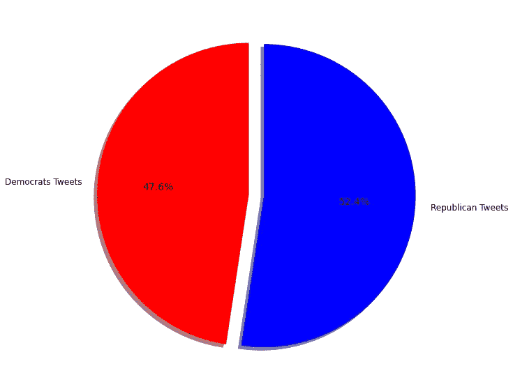
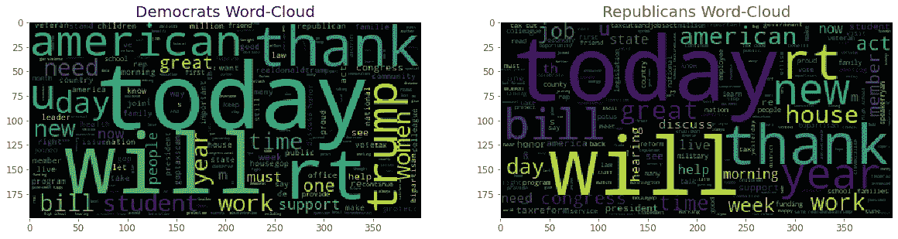
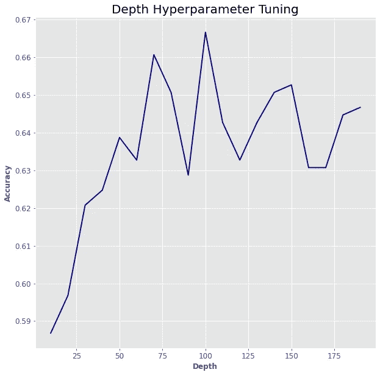
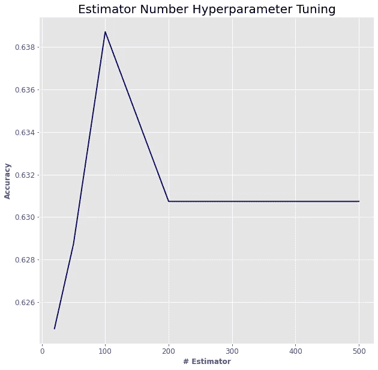
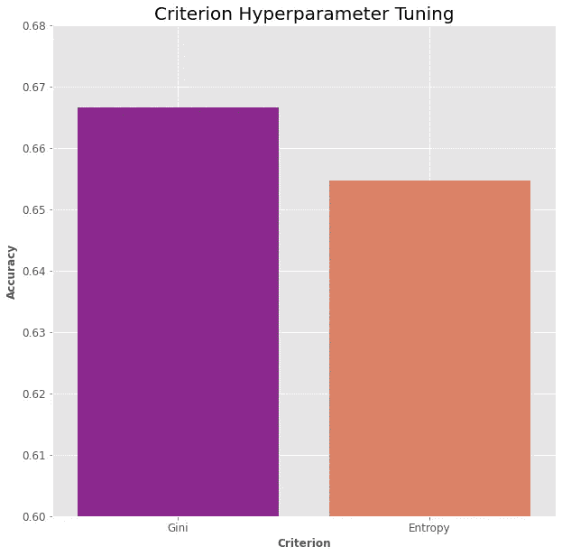
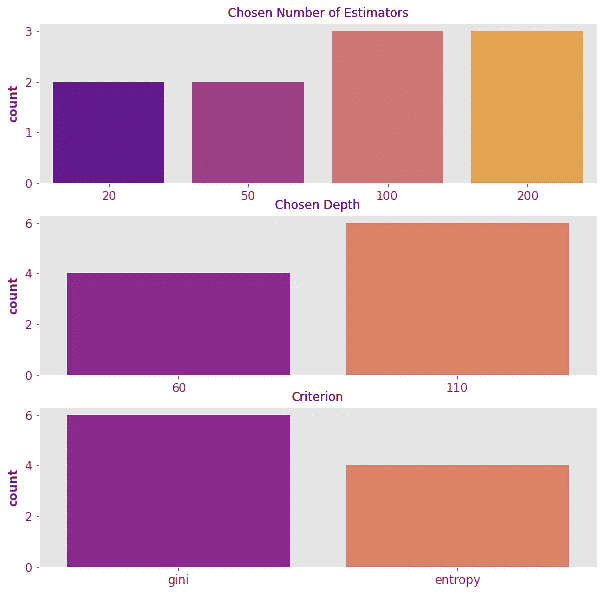
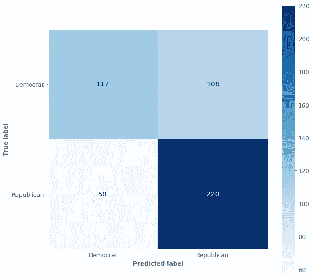
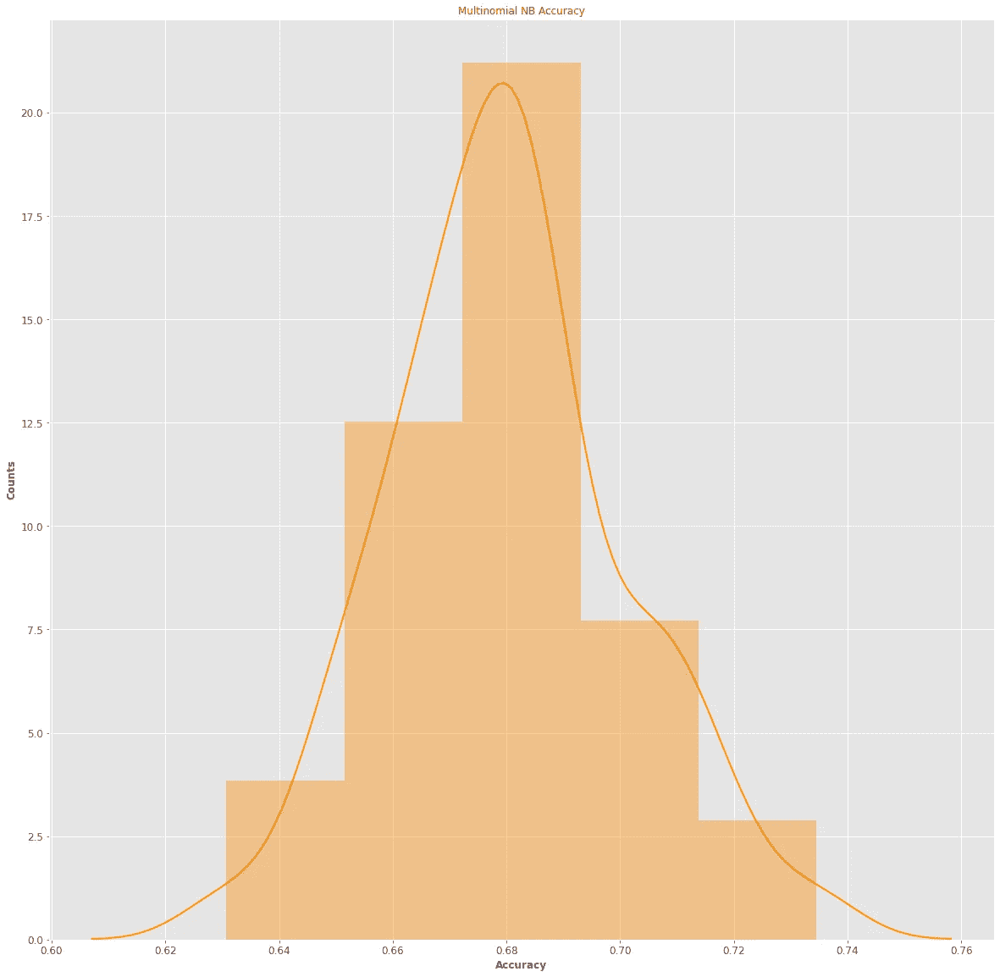
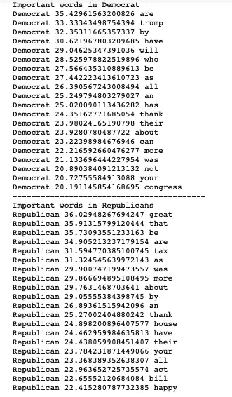
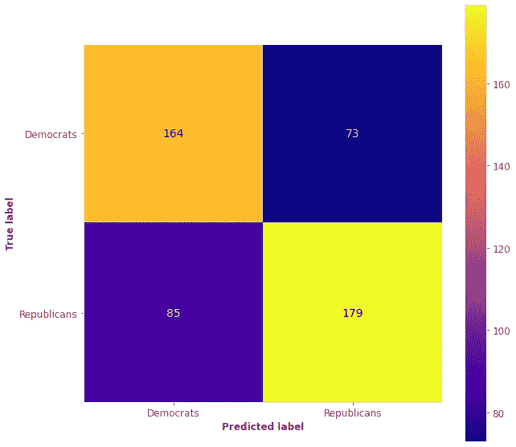

# 用机器学习预测政治取向

> 原文：<https://medium.com/analytics-vidhya/predicting-political-orientation-with-machine-learning-be65c950d366?source=collection_archive---------4----------------------->


由 [Unsplash](https://unsplash.com/s/photos/politics?utm_source=unsplash&utm_medium=referral&utm_content=creditCopyText) 上的 [Element5 数码](https://unsplash.com/@element5digital?utm_source=unsplash&utm_medium=referral&utm_content=creditCopyText)拍摄

## 预测推特用户政治倾向的机器学习技术

> 注意:这不是一个政治帖子，科学分析已经完成，没有任何偏见。

在最后一本[书中](https://en.wikipedia.org/wiki/A_Promised_Land)，美国第 44 任总统**巴拉克·欧巴马**展示了他当总统时正在探索的美国。他谈到了他所面临的困难时期，以及如何应对他所经历的充满挑战的时期。我不禁注意到**它的沟通策略与 2021 年的政治家**完全不同。

**当然，社交媒体正在改变政治家沟通的游戏规则**。此外，在“大数据”时代，理解政党的通信变得越来越困难，因为它们从其社交网络的个人资料中输出大量信息。**例如，如果你给我(作为一名意大利人)一条美国政客的政治推特，我不认为我会准确预测其政党。此外，即使我想看，也可能需要花几个小时看新闻或了解国家的政治形势。**

> 幸运的是，我们不仅仅处于**【大数据】****【社交网络】**的时代，我们也处于**【人工智能】****【机器学习】**的时代。:)

在这篇博客中，我们将使用(传统的)机器学习技术来预测 Twitter 用户的政治取向，使用 Python。

## 1.查找数据集

Twitter 用户的政治取向一般不会公开。很明显，当推特的用户是政客时，这件事就公开了。由于这个原因，我使用了政客的推特。[数据集](https://www.kaggle.com/kapastor/democratvsrepublicantweets)是开源的，可以在 Kaggle 上获得。

## 2.从 python 导入整个世界

您将需要来自**机器学习、NLP** 和**数据可视化的基本库。**

这是你需要的:

## 3.数据探索

使用 **pandas 导入数据集。正如可能看到的，它相当大。**

因为我用的是非常简单的笔记本电脑，所以处理这些数字是一种折磨。**出于这个原因，我决定降低数据集的维度，从原始数据中抽取 5000 条推文。**

> 注意:这款笔记本被认为是**快**，并且将在接近 **0 预算**的情况下实现。如果不是这种情况，你可以跳过一些步骤，比如上面的步骤。

所以我们在这里:

让我们来看看标签:



数据集相当平衡，因此意味着**精度**是一个合理的指标:

```
Accuracy_dem = (Number of Democrats Tweets predicted)/Number of democrats tweetsAccuracy_rep = (Number of Republicans Tweets predicted)/Number of republican tweetsAccuracy = (Accuracy_dem + Accuracy_rep)/2.
```

## 4.数据清理

Tweets 包含大量的**【垃圾字符】**比如“https”，或者像点或者斜线这样的特殊字符。使用 **re** 考虑这些生产线的基本清洁过程。

现在数据被清除了。我是一个物理学家，我不喜欢机器学习作为黑箱应用的时候。为了避免这种情况，可以使用神奇的 **wordcloud** 模块绘制一些单词云。



这里有些有趣的东西。

> **正如我说过的，这不是一篇政治文章，虽然我对使用“云”这个词可以探索的差异和相似之处有自己的看法，但我不想在这里讨论它们**。找到自己的意义。:)

## 5.…向量化…

为了执行机器学习分类算法，要做的一件至关重要的事情是将单词视为向量。
一个直接的方法是定义一个**词汇(V)** ，这是一个在一条 tweets 中至少出现一次的所有单词的列表，在一个 N 维向量中有一个特定的维度。

```
E.g. Tweet_1 = [‘i’, ‘love’, ‘trump’, ‘he’ ,’is’, ‘great’,'he', 'is ', 'amazing']E.g. Tweet_2 = [‘what’,’is’,’wrong’, ‘with’, ‘POTUS’]Vocaboulary = [‘I’, ‘love’ , ‘trump’, ‘he’, ‘is’, ‘great’, ‘what’ , ‘wrong’, ‘with’, ‘POTUS’,'amazing']Tweet_1_vector = [1,1,1,2,2,1,0,0,0,0,1] #Frequency vectorTweet_2_vector  = [0,0,0,0,0,0,1,1,1,1,0] #Frequency vector
```

这种方法非常简单直接，但是效率很低……原因有几个。例如，它导致特征数量爆炸，并且当用这个向量训练时，机器学习方法通常是低效的。
矢量化可以通过更复杂的机器学习技术来执行，通常涉及深度学习。在这篇博客中，我决定为了成本、资源和时间限制保持简单，并执行了 [**TF-IDF 矢量化**](https://en.wikipedia.org/wiki/Tf%E2%80%93idf) 。这允许考虑单词的频率，但是对像“是”、“the”、“I”这样的单词给予额外的惩罚。另外，有可能在 [sklearn](https://scikit-learn.org/stable/modules/generated/sklearn.feature_extraction.text.TfidfVectorizer.html) 中实现最大数量特性的版本，减少词汇量(max_features)和一堆其他超参数特性。

## 6.集成学习:随机森林

现在我们都准备好了。我们有 5000 个向量，因此我们只是在考虑一个基本的机器学习分类任务。一种简单快速的传统机器学习方法被称为**随机森林**。它使用多个决策树来执行分类。**每个决策树对数据集进行分割，试图获得最纯净的数据集，并在其特征上设置阈值系统。**

**关于这些小天才，可能有很多要谈的，但我不想跑题，所以我会在这个问题上讲得很快**。关键是它们相对来说比较快而且容易应用。由于我们谈论的是 86000+条推文中的 5000 条，所以对随机森林超参数(例如，最大深度、使用的最大特征、纯度标准)执行一些**超参数调整**是合理的。下面是一个 5000 条推文的小数据集的例子:



在该超参数调谐部分，以下过程已经重复了 10 次(CV=10):

**A)一组 5000 条推文已经被提取、预处理和矢量化**

**B)对于每个超参数，已经考虑了一个可能值池，并且已经存储了具有更高精度的值**

这是通过使用以下函数完成的:

这就是结果:



**已经提取了最多选择的值，并且在另一个小数据集上考虑了最优随机森林**

这些是最佳性能:



## 7.朴素贝叶斯分类器

[朴素贝叶斯分类器](https://en.wikipedia.org/wiki/Naive_Bayes_classifier)显然是基于贝叶斯定理的反演公式。它在机器学习中的应用非常快，因为它不需要任何适当的“学习”梯度下降算法。因此，评估精度的过程几乎可以在任何时间内重复 100 次。

精确度甚至比随机森林略好，但它不需要超参数调整(正如他们所说…保持简单！).这是精确度的分布:



**此外，使用以下函数可以检测分类算法使用的最重要的特征**:



> 还是那句话，有事情要考虑…但是你会去做:)

## **8。支持向量机分类器**

一种强大但缓慢的传统机器学习方法是支持向量机，它使用最大间隔优化来获得分类。这种方法非常慢，并且没有进行超参数调整，但是已经获得了有希望的精度。



# 结论

这些机器学习方法被认为是与你的小型笔记本电脑一起使用，也许是在 Google Colab 上，有少量的存储空间。深度学习方法或更明智的推文矢量化可能会带来更好的最终准确性。

如果你喜欢这篇文章，你想知道更多关于机器学习的知识，或者你只是想问我一些你可以问的问题:

A.在 [**Linkedin**](https://www.linkedin.com/in/pieropaialunga/) 上关注我，在那里我发布我所有的故事
B .订阅我的 [**简讯**](https://piero-paialunga.medium.com/subscribe) 。这会让你了解新的故事，并给你机会发短信给我，让我收到你所有的更正或疑问。
C .成为 [**推荐会员**](https://piero-paialunga.medium.com/membership) ，这样你就不会有任何“本月最大数量的故事”，你可以阅读我(以及成千上万其他机器学习和数据科学顶级作家)写的任何关于最新可用技术的文章。