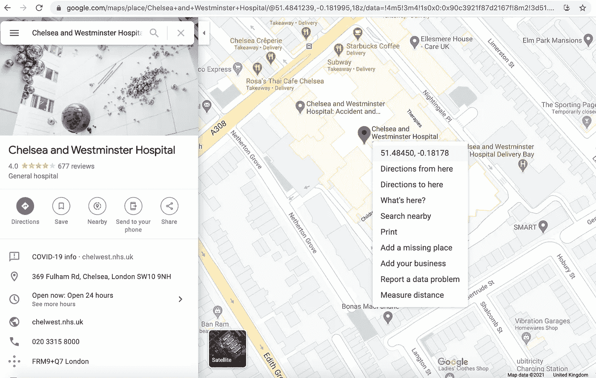
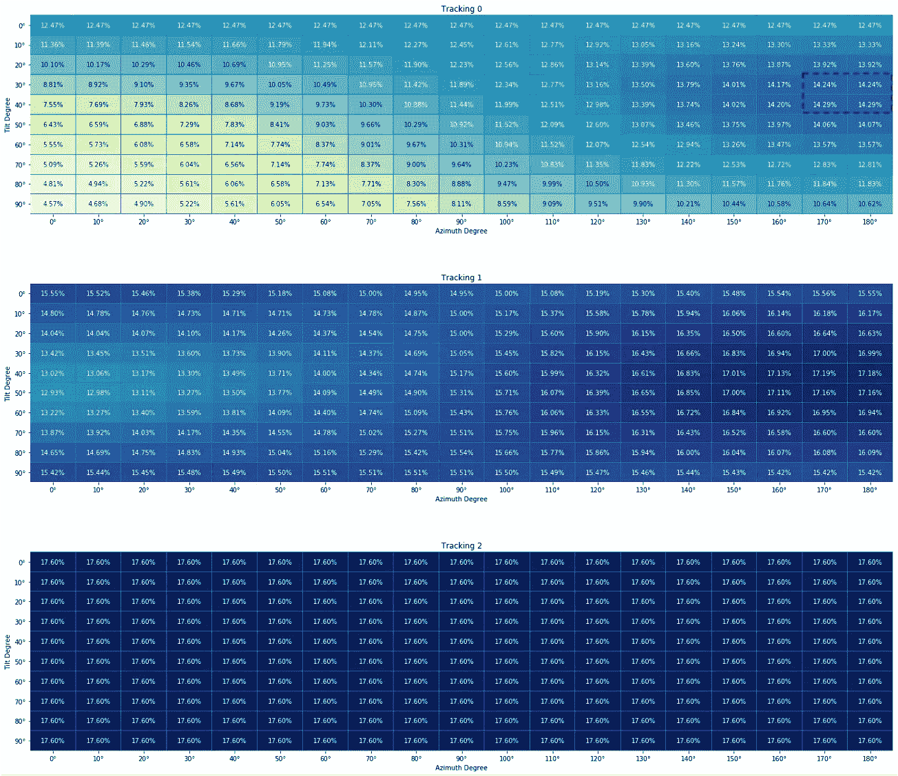
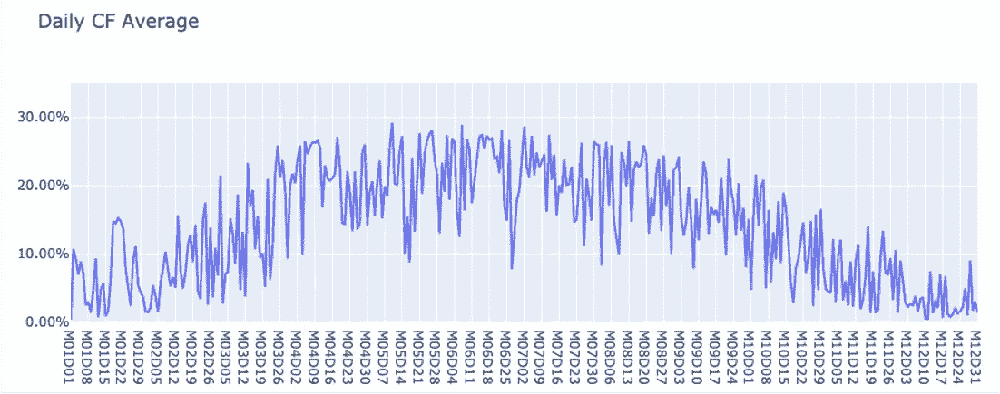
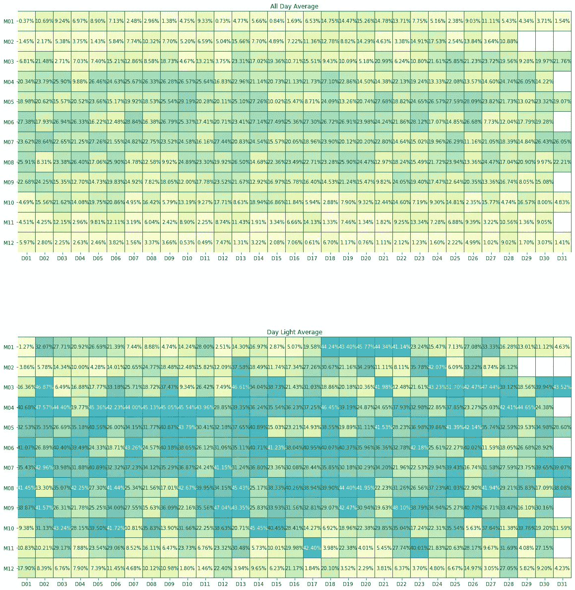

# 预测 NHS 医院的太阳能发电能力

> 原文：<https://medium.com/analytics-vidhya/predicting-solar-generation-capacity-for-an-nhs-hospital-682919444666?source=collection_archive---------26----------------------->

自新冠肺炎疫情开始影响全球人民的生活，伤害几乎所有主要经济体(除了中国)以来，一年多过去了。每个国家都见证了他们的医疗工作者是多么重要，并开始欣赏他们所做的令人惊叹的工作，尽管他们不得不在非常困难的身体、经济和最重要的心理条件下工作。作为一名数据科学家，我决定通过分享专注于英国国家医疗服务系统(NHS)数据和/或利益的数据科学帖子来表达我的谢意。希望，这将是一系列的第一个。

我将尝试回答的假设问题是:

***“通过太阳能发电，英国国家医疗服务系统医院能变得更环保吗？”***

一个地区、农场或建筑物的太阳能发电潜力取决于它接收的太阳辐照度。尽管英国可能有更多安装太阳能电池板的地方，但研究问题选择了伦敦的 ***【切尔西和威斯敏斯特医院】*** 。



本研究将遵循以下 4 个步骤:

1.  **数据收集自**[**renewables . ninja**](https://www.renewables.ninja/about)
    如其网站所述，*“renewables . ninja 允许你模拟位于世界任何地方的风力和太阳能发电厂的每小时输出功率！”*
    我们已经有了模拟的纬度和经度，如谷歌地图图片所示。
2.  **最高性能参数选择**
    将模拟不同的太阳能电池板角度组合，以优化太阳能发电容量系数
3.  **太阳能发电量波动分析**
    太阳能很大程度上取决于天气，它可能每小时都会波动，更不用说季节性了。将每小时/每天平均分析表现最佳的数据。
4.  **结果外推** 屋顶表面上用于安装太阳能电池板的可用平方米面积将用于外推平均产能系数(CF ),以得出每年的 MWh 可再生能源产量。

# 开始了。

但是首先，让我们导入我们需要的库！

```
import globfrom datetime import datetime, timedeltaimport json
import requestsimport pandas as pd
import numpy as npimport seaborn as sns
import matplotlib.pyplot as plt
```

1.**通过 API 调用** 从 [**renewables.ninja 收集数据**](https://www.renewables.ninja/documentation/api/python-example)

Ninja 允许在用户创建配置文件后使用免费令牌调用 API。由于还有 API 调用限制(每个令牌每分钟 6 次调用，每个令牌每小时 50 次调用)，如果需要发送大量请求，最好设计 python 函数来解决这个问题。一旦达到这个限制，让脚本休眠一段时间是一个有效的选择。然而，我创建了一个使用多个令牌的函数

```
LIST_OF_TOKENS = [
         'INSERT_YOUR_TOKEN_HERE_1',
         'INSERT_YOUR_TOKEN_HERE_2',
         ...,
         ...,
         'INSERT_YOUR_TOKEN_HERE_N'
         ]
```

和 while 循环来加速运行时间，如下所示:

既然我们定义了这个函数，现在我们需要为我们的太阳能电池板尝试不同的角度组合，以计算容量系数并选择最佳的一个。我决定以 10%的增量尝试每一个可能的角度。为了得到更精确的结果，可以用 1 的增量来改变列表(但这可能会延迟运行时间)。此外，我想设置系统损耗为 0%。

2.**最高性能参数选择**

在我们收集了数据并根据 570 种不同的组合将其保存为 CSV 文件后，

```
len(TRACKING_OPTIONS_LIST) * len(TILT_DEGREE_OPTIONS_LIST) * len(AZIMUTH_DEGREE_OPTIONS_LIST) = 570
```

我们需要阅读它们并比较它们的年平均容量系数。

*免责声明:我在 ninja.renewables 上找不到关于跟踪设置在 0、1 和 2 之间差异的足够解释。然而，由于跟踪 1 和 2 的 CF 在不同角度没有显著变化，我决定忽略它们，只在跟踪设置为 0 时向前移动(顶部的热图)。*

**优化结果**:切尔西和威斯敏斯特医院在 40°倾斜和 170–180°方位角时观察到最高 CF (14.29%)。



3.**太阳能发电容量因数波动分析**

正如帖子开头提到的，太阳能发电取决于太阳辐照度。根据定义，太阳能电池板可以在白天发电。尽管在春天和夏天的一些非常明亮、阳光充足的时间里，CF 达到 80%以上，但 24 小时的日平均水平充其量只能低于 30%。



下面的热图显示了基于 24 小时和白天光照时间的平均 CF。



这就是为什么我们全年的平均容量系数较低(14.29%)，尽管一天中有一些高峰时段，一年中有一些高峰日。

4.**结果外推**

a)根据 2017/18 年[地产回报信息收集(ERIC)](https://digital.nhs.uk/data-and-information/publications/statistical/estates-returns-information-collection/summary-page-and-dataset-for-eric-2017-18) 中包含的能源消耗数据，切尔西和威斯敏斯特医院一年消耗了 14，013 MWh 电力。

b)根据谷歌地图的测量距离功能，从鸟瞰角度看，医院的屋顶面积约为 155 米 x 90m 米= 13 950 米。

c)如下图所示，几乎 50%的表面区域(7000 平方米)由玻璃屋顶构成，以允许自然光进入医院，换句话说，不能用于安装太阳能电池板。


来源:[https://www . mclh . co . uk/our-projects/Chelsea-and-Westminster-hospital-NICU-and-ICU-expansion-London/](https://www.mclh.co.uk/our-projects/chelsea-and-westminster-hospital-nicu-and-icu-expansion-london/)

d) 2kW 太阳能电池板占地约 14m ( [150 平方英尺](https://www.renewableenergyhub.co.uk/main/solar-panels/how-to-calculate-solar-panel-size-needed/#:~:text=Solar%20Panel%20Size%20Per%20kWH&text=This%20means%20that%20is%20you,kwh%20of%20electricity%20per%20year.))。

**在一个没有约束和限制的假想世界里**，我们可以在这家医院的屋顶上安装 500 块 2kW 的太阳能电池板，总发电量为 1 MW。

1mw * 24 小时* 365 天* 14.29% CF = c .一年太阳能发电量 1,252 MWh。

这相当于医院用电量的 8.93%。

# **结论**

在这篇文章中，我想回答下面这个假设性的问题: ***“通过太阳能发电，一家 NHS 医院可以变得更加环保吗？”***

尽管在计算一个选定区域的太阳能发电能力时，人们可以想到无限数量的参数，但这些参数被尽量保持在最低水平，以避免过于关注细节。

引入了一个伟大的可再生能源数据提供商。运行了数百次模拟来获取最佳性能参数。研究了太阳能发电容量因子的波动。

年平均容量系数用于推断切尔西和威斯敏斯特医院年耗电量的 8.93%可以来自安装在其屋顶的太阳能发电板(一些粗略的假设适用)。

最后，这篇文章的出发点是向世界上的每一位卫生保健工作者表示感谢。他们永远值得更好的！