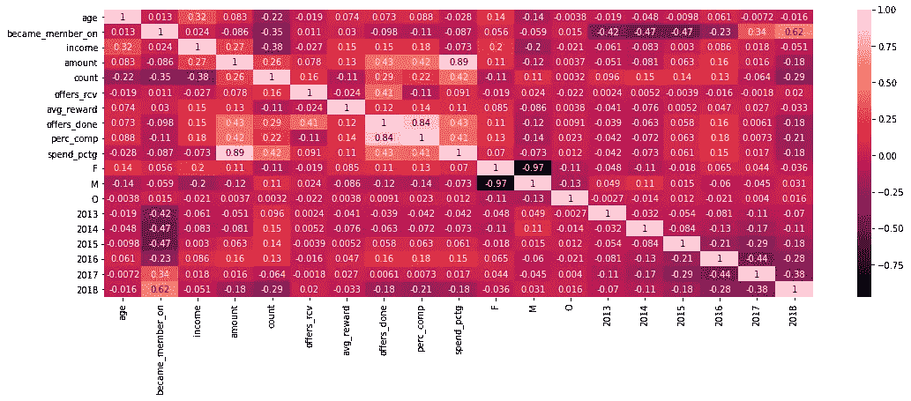

# 预测星巴克的用户行为

> 原文：<https://medium.com/analytics-vidhya/predicting-starbucks-user-behaviours-e68b18c31615?source=collection_archive---------8----------------------->

## 预测用户将如何回应他们收到的报价。

[全乐](https://unsplash.com/@quanle2819?utm_source=medium&utm_medium=referral)在 [Unsplash](https://unsplash.com?utm_source=medium&utm_medium=referral) 上拍照

> 本文是 Udacity 的数据科学家 Nanodegree 的顶点项目的一部分，数据是作为该项目的一部分提供的。我不拥有这些数据。本文面向技术受众，需要一些数据科学的背景知识。

# **商业案例**

用户/买家如何与公司的行为互动是企业界研究最多的领域。像星巴克这样的跨国巨头需要能够评估和预测他们的用户行为，从而为他们的股东创造最大价值。

在本文中，我们将根据用户数据、优惠数据以及与用户与优惠互动相关的数据，尝试预测用户行为。更具体地说，我们将试图预测用户通过购买更多商品对星巴克提供的服务的反应，并潜在地识别高消费群体。

# **数据介绍**

该数据集包含模拟星巴克奖励移动应用程序上的客户行为的模拟数据。每隔几天，星巴克就会向手机应用程序的用户发出一次报价。优惠可以仅仅是饮料的广告，也可以是实际的优惠，如折扣或 BOGO(买一送一)。

数据包含在 3 个不同的 JSON 文件中；

portfolio.json —包含报价 id 和关于每个报价的元数据(持续时间、类型等)。)

profile.json —每个客户的人口统计数据

transcript.json 记录交易、收到的报价、查看的报价和完成的报价

> 关于形成本文基础的数据的完整图式和完整笔记本可以在这里查阅:[https://github.com/zainfarrukh/starbucks-data-capstone](https://github.com/zainfarrukh/starbucks-data-capstone)

# 项目描述

我们使用各种可视化技术研究数据，然后使用:

1.  受监督的机器学习可以预测顾客在星巴克的消费金额，以便决策者可以确定优惠活动对哪些用户有效，并可以将精力集中在这些用户身上。
2.  受监督的机器学习，根据消费者的类型(“高”、“中”或“低”)对用户进行分类，并根据该分类提出报价

# ML 模型的评估矩阵

## 用于回归

由于数据很可能是非线性的，我将使用支持向量机，合适的评估矩阵将是拟合优度 R“R 平方”。

## 用于分类

我将使用随机福里斯特分类器或支持向量分类器，一个适当的评估矩阵将是准确性得分。我还会查看精确度、召回率和 F2 分数来检查过度拟合。

# 内容摘要

以下是我们将在文章中讨论的内容摘要:

1.  **清理数据—** *去除异常值和异常值*
2.  **合并数据** — *合并 3 个独立的 JSON 文件*
3.  **数据可视化** — *更好地理解数据*
4.  **提取和缩放特征** — *选择和创建特征并缩放它们*
5.  **使用回归和分类技术进行预测**—
6.  ***使用拟合优度和精确度评估模型**—*
7.  ****细化** — *超参数调谐***
8.  ****论证—** 解决的**
9.  *****结论** — *从练习中得出结论****
10.  ****下一步****

# ****清理数据****

**加载 JSON 文件后，我们可以看到三个不同数据帧的头部:**

****

**抄本标题**

****

**轮廓头**

****

**投资组合主管**

**副本数据帧具有由用户执行的所有报价和交易的概要。优惠 id 和交易金额存储在 value 列中，我们需要以更结构化的格式存储数据。**

**简档数据帧具有用户的特征，如年龄、性别、会员资格和收入。一些收入值是 NaN。我们假设这些用户没有任何收入，并将这些值替换为 0。**

**投资组合数据框架包含每个报价的特征。在这个数据框架中，我们感兴趣的是显示每个提议的金钱奖励的奖励栏，以及显示完成提议的难度等级的难度栏。**

**用户收入中有 14.6%的 NaN 值，我们将其替换为 we 0。除此之外，我们注意到大约有 750 名用户的年龄超过 110 岁。我们认为这是数据采集中的一个错误，我们将删除这些用户。**

****

**用户年龄直方图**

**有趣的是，我们还发现没有收入低于 25，000 的用户，这有点奇怪，需要进一步调查。**

****

**用户收入直方图**

**“成为成员”列是一个字符串，我们将该列转换为日期-时间，以便可以提取相关的特征。**

# ****结合数据****

**然后，我们继续使用 Pandas 合并功能来合并三个独立的数据帧。**

**除了组合数据之外，我们还必须为我们的分析创建以下额外的列:a)每个用户从迄今为止提供的优惠中获得的平均回报，b)每个用户的优惠完成百分比(完成的优惠/收到的优惠)，以及 c)用户是高消费还是低消费(任何人在星巴克花费其收入的 5%或更多将被归类为高消费)**

**请参考 Github repo 以查看包含所有分析的完整笔记本。**

# ****数据可视化****

**为了更好地了解我们用户的特征，我们需要直观地检查数据。首先，让我们来看看用户购买量相对于其收入的趋势模式。**

****

**支出金额与收入**

**从图表中可以看出，没有性别差异的消费模式。然而，有一些用户比其他用户花费更多的收入。**

> **那么哪些用户是高消费人群呢？**

**为了确定这一点，我们需要查看花费百分比的直方图，以便我们可以确定高花费者的阈值。**

****

**支出百分比直方图**

**正如你所看到的，大多数用户在星巴克上的花费是他们收入的 2.5%或更少，很少一部分用户花费了 5%或更多。这就是为什么我们试图给高消费人群贴上标签，就像上一节提到的，就是那些花费至少 5%收入的人。花费 2.5%或更低的用户被归类为低花费者，其余的是中等花费者。**

****

**高、中、低消费群体的消费模式**

**正如您稍后将看到的，我们将尝试使用监督 ML 模型根据用户的消费模式对用户进行分类，以便我们可以识别上图中的潜在绿点(即高消费群体)。**

**报价数据汇总如下:**

********

**没有 2018 年 7 月以后成为会员的用户。我们认为数据不是在那个日期之后捕获的。**

****

# ****提取和缩放特征****

**现在，我们将注意力转向提取可用数据的相关特征，以输入到我们的监督 ML 模型中。为了使用日期-时间数据，我们提取了用户成为成员的相关年份，我们将使用这一年作为分类变量。我们还需要处理分类数据，即用户的性别和会员年份。为此，我们将使用 pandas 的 get_dummies 函数创建虚拟变量。**

**首先，我们将相关矩阵，看看任何高度相关的特征**

****

**相关矩阵**

**这里有一个有趣的观察结果是，用户在星巴克的支出金额(“spend_pctg”)与完成的优惠数量(“offers_done”)和优惠完成率(“perc_comp”)呈相对强烈的正相关。我们将为我们的模型使用以下特征:**

1.  **用户的年龄**
2.  **他的收入**
3.  **到目前为止完成的出价详细信息(收到的出价、完成的出价和出价完成百分比)**
4.  **性别— *分类变量***
5.  **用户成为会员的年份— *分类变量***

**在相关特征被提取出来之后，我们将对它们进行缩放，使得没有一个单独的特征会被赋予不适当的权重。我们将使用 sk-learn 库中的 StandardScaler()函数，该函数根据平均值和标准偏差来缩放数据。**

**我们还将把数据分为测试数据和训练数据。我们将以 50:50 的比例分割它，因为我们有足够数量的数据点，并且我们需要更多的训练数据集来避免过度拟合我们的模型。我们将使用 sk-learn 库的 train_test_split 函数来拆分数据。**

# ****做预测****

**我们将使用以下有监督的 ML 模型，其参数如下所示:**

1.  **监督机器学习(特别是支持向量回归机' SVR '，因为数据最有可能是线性的)试图预测顾客在星巴克的消费金额，以便决策者可以确定优惠活动对哪些用户有效，并可以将他们的努力集中在这些用户上。**
2.  **监督机器学习模型，如 Random Forrest 和支持向量分类器，根据消费者的类型(“高”、“中”或“低”)对用户进行分类，并根据该分类提出报价**

> **回归模型的参数有:Pipeline(memory=None，steps=[('standardscaler '，StandardScaler(copy=True，with_mean=True，with_std=True))，(' svr '，SVR(C=5.0，cache_size=200，coef0=0.0，degree=3，epsilon=0.1，gamma='scale '，kernel='rbf '，max_iter=-1，shrinking=True，
> tol=0.001，verbose=False))]，verbose=False)**
> 
> **RF 分类器的参数有:Pipeline(memory=None，steps=[('standardscaler '，StandardScaler(copy=True，with_mean=True，with_std=True))，(' randomforestclassifier '，RandomForestClassifier(bootstrap = True，CCP _ 阿尔法=0.0，class_weight=None，criterion='gini '，max_depth=None，max_features='auto '，max_leaf_nodes=None，max_samples=None，min _ inxity _ decrease = 0.0，min_samples**
> 
> **svc 分类器的参数有:Pipeline(memory=None，steps=[('standardscaler '，StandardScaler(copy=True，with_mean=True，with_std=True))，(' SVC '，SVC(C=1.0，break_ties=False，cache_size=200，class_weight=None，coef0=0.0，decision_function_shape='ovr '，degree=3，gamma='scale '，kernel='rbf '，max_iter=-1，probability=False，random_state=None**

**为了评估我们的模型，我们将使用:1)适合度(R)来衡量我们的回归模型的性能，以及 2)准确度和 F1 分数来衡量我们的分类模型的性能。**

# ****训练模特****

**在训练数据之后，我们在回归和分类 ML 模型上计算我们的指定矩阵。测试数据的结果如下:**

**不幸的是，在我们的回归模型上，我们只获得了 0.22 R 的测试样本分数。这意味着，尽管我们的模型解释了用户总支出的 22%的变化，但仍有 78%的变化无法解释，这使得模型不可靠。这可能是因为可用特征不足以解释目标变量的总变化。**

**对于随机福里斯特分类器，在调整任何超参数之前，我们能够在测试样本上获得 73.4%的准确性。对于支持向量分类器，我们能够将准确率提高到 75.4%。RF 模型的重大改进。**

# **精炼**

**我们可以通过改变不同的参数来进一步改进我们的 RF 分类器。在这里，我们将尝试我们的 RF 分类器的不同树大小，看看我们是否可以提高精度。**

**调整模型中的树的数量，我们能够达到 74%的最大精确度。**

****

**基于不同树大小的模型精度**

**然而，查看这两种模式的分类报告，高消费群体的 F1 得分要么为 0，要么几乎为 0。这使得我们现有的模型不可靠。这可能是因为标签不平衡。高消费人群只占总数据的 4%,因此我们的模型给出的概率非常低。**

****

**SVC 的分类报告**

****

**消费者分布**

****解决阶层失衡****

**解决方法之一是对中低消费人群进行欠采样，使样本对所有三个阶层具有相同权重。我们将采用这种策略，并使用 pandas 样本函数，我们将选择低消费和中等消费的用户，以便每个类别在将输入模型的数据中具有相等的代表性。基于修正后的测试数据，Random Forrest 和 SVC 的准确率都降低到了 49%-51%。然而，高消费阶层的 F1 分数提高到了 0.41–0.43，这对我们来说是一个巨大的进步。**

# **评估和验证模型**

**我们在原始数据集上检查了我们的两个模型，以了解模型的准确性以及高消费阶层的 F1 分数是否有任何提高。结果如下所示:**

********

**随机森林分类器的最终结果**

********

**支持向量分类器的最终结果**

**我们可以看到，在最后一轮测试中，两种高消费车型的 F1 得分都有很大提高。这表明我们能够克服阶层失衡，并获得对高消费人群的预测，这正是我们所需要的，即识别高消费人群，以便星巴克可以将精力集中在这些用户上。**

****模型的稳健性****

**模型足够稳健，因为它们解释了当前的类别不平衡，并避免了普通 ML 模型的一些缺陷，普通 ML 模型在现有数据集上将偏向于具有更多数据点的类别(中低消费群体)。**

# **理由和裁决**

*****回归模型:*** 我们的 ML 模型未能得到足够的 R 分数，被认为是一个可靠的模型。原因是我们的特征彼此之间既没有线性关系，也没有足够数量的特征来解释目标数据中的充分差异。**

*****分类模型:*** 这些模型被训练成基于用户的特征来识别高消费人群。因此，这些模型可以作为营销策略的基础，其主要重点应该是瞄准高消费群体，因为这些用户将对星巴克未来的优惠做出更多反应。**

# ****结论****

**ML 回归模型也为我们提供了关于用户可能购买行为的关键见解。然而，目前的功能不提供我们可以准确依赖的预测，我们需要试验其他功能来预测每个用户的实际支出金额。**

**当前数据可以潜在地用于基于用户的消费行为对每个用户进行分类，并且我们可以使用该分类来针对每个用户提供的优惠的数量和类型。**

**使用 SVC 和随机森林分类器，我们能够获得大约 75%的准确率来预测用户是高消费还是低消费。虽然模型有很好的准确度分数，但是模型对于高消费人群的结果很差(不确定的 F1 分数)。SVC 模型甚至不能预测一个高消费人群。这是因为标签非常不平衡。**

**我们可以应对这种类别不平衡的方法之一是从频率较高的类别中对数据进行欠采样。我们从中低消费人群中随机选择样本，这样每个阶层的样本总数都是相同的，然后根据这些数据训练我们的模型，并根据训练好的模型预测整个数据集。虽然我们的准确率降低到 60.24%-61.26%，但我们在高消费阶层获得了更好的 F1 分数。**

**基于这些信息，我们可以决定向哪个用户提供优惠券。优惠券提供应该是每个用户的消费类型的函数，即，具有高消费行为的用户应该得到更多的优惠券提供，因为他们更有可能进行购买，以及每个优惠券的相对难度，即，应该以更大的难度给予高消费用户优惠券。**

# **后续步骤**

**要深入了解用户行为，还有很多工作要做。我们可以执行以下额外的活动来获得对数据的更多了解:**

**1)确定数据异常的原因，即为什么人们的年龄超过 110 岁**

**2)提高回归模型准确性的附加功能**

**3)获取更多样本，这样我们就有足够多的高消费群体**

**4)测试每种类型的优惠与各类用户之间的关系。**

**5)识别合适的用户群**

**6)使用网格搜索来检查是否有任何具有更好超参数的更好模型**

**7)使用更精细的搜索来查找更符合我们数据的其他模型**