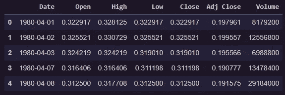
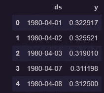
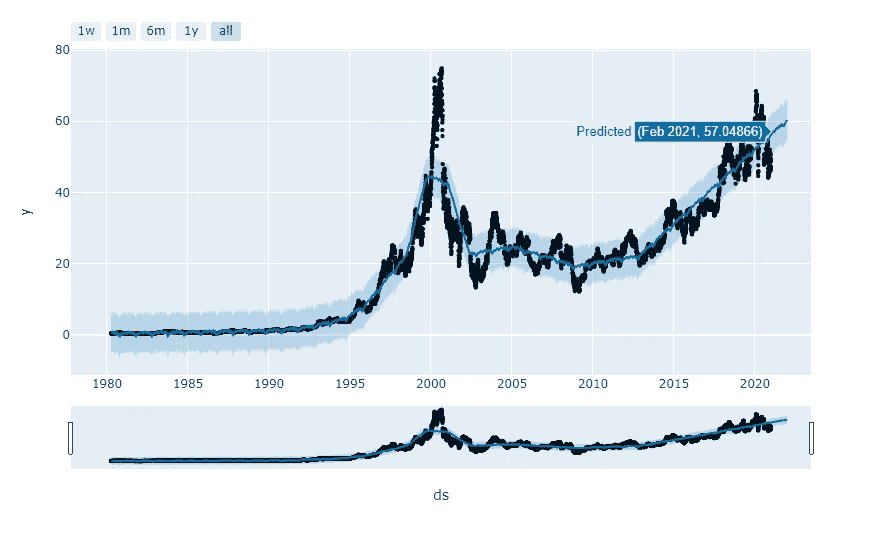
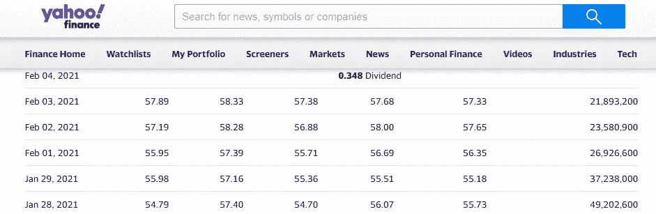

# 用脸书的先知模型预测股票价格

> 原文：<https://medium.com/analytics-vidhya/predicting-stock-prices-using-facebooks-prophet-model-b1716c733ea6?source=collection_archive---------1----------------------->

# 脸书的先知

Prophet 是一种基于加法模型预测时间序列数据的过程，在该模型中，非线性趋势与每年、每周和每天的季节性以及假日影响相适应。它最适用于具有强烈季节效应的时间序列和几个季节的历史数据。Prophet 对缺失数据和趋势变化非常稳健，通常能够很好地处理异常值。

最常用的预测模型是 [**自回归**](https://en.wikipedia.org/wiki/Autoregressive_model) 模型。简而言之，自回归模型规定输出变量线性依赖于它自己以前的值和一个随机项(一个不完全可预测的项)。

Prophet 模型背后的数学方程式定义为:

> *y(t) = g(t) + s(t) + h(t) + e(t)*

*   其中，g(t)代表趋势。Prophet 使用分段线性模型进行趋势预测。
*   s(t)代表周期性变化(每周、每月、每年)。
*   h(t)代表假期的影响(回想一下:假期影响业务)。
*   e(t)是误差项。

Prophet 模型拟合过程通常非常快(即使对于成千上万的观察)，并且不需要任何数据预处理。它还处理缺失数据和异常值。

Prophet 是由[脸书的核心数据科学团队](https://research.fb.com/category/data-science/)发布的[开源软件](https://code.facebook.com/projects/%3E)。

完整的文档和示例可在主页上找到:[https://facebook.github.io/prophet/](https://facebook.github.io/prophet/)

# 开始编码吧！

我们将使用 Python 来做这个例子。

# **加载数据**

我们将使用英特尔 1980 年至 2020 年的数据，预测 2021 年的数值。

数据头

# 选择特定数据

因为我们将预测“Close”值，所以我们将只选择“Date”和“Close”列。

新数据框架符合型号

Prophet 的输入总是一个包含两列的 data frame:`ds`和`y`。`ds`(日期戳)列应该是熊猫所期望的格式，理想情况下，日期应该是 YYYY-MM-DD，时间戳应该是 YYYY-MM-DD HH:MM:SS。`y`栏必须是数字，代表我们希望预测的测量值。

# 构建模型

Prophet 遵循`sklearn`模型 API。我们创建了一个`Prophet`类的实例，然后调用它的`fit`和`predict`方法。

# 预测时间

现在，对于最后一步，我们将要求模型预测未来值，然后将预测可视化。

**结论**:根据模型预测，2021 年 2 月，英特尔股价似乎在 57.04 左右。

# 验证时间

# 嗯，我们已经中头彩了！！让我们希望它对未来的预测也是正确的！

# 我想让你们试一下这个模型，然后让我知道预测结果如何。

**免责声明**已经有人尝试使用时间序列分析算法来预测股票价格，尽管它们仍然不能用于在真实市场中下注。这只是一篇教程文章，并不打算以任何方式“指导”人们购买股票。

# 也试试我的股票预测模型:

[LSTM 模式](/analytics-vidhya/time-series-forecasting-predicting-apple-stock-price-using-an-lstm-model-f1bb73bd8a80)

[ARIMA 模式](/analytics-vidhya/time-series-forecasting-predicting-microsoft-msft-stock-prices-using-arima-model-be1c45961739)

给我一个[关注](https://rohan09.medium.com/)如果你喜欢更多的技术博客！

再见了。