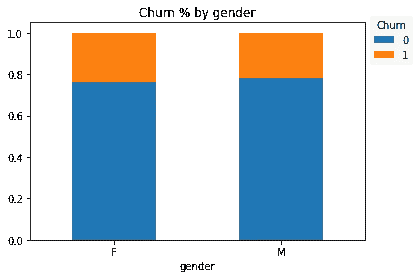
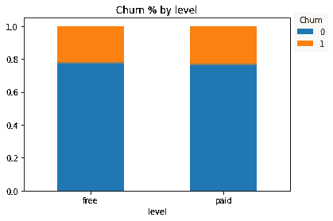
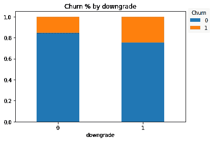
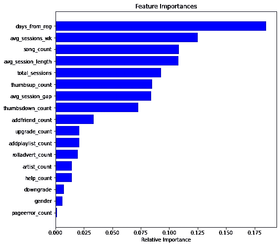
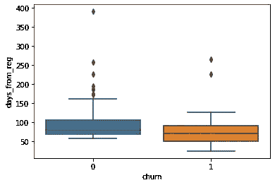

# 使用 PySpark ML 预测订阅流失

> 原文：<https://medium.com/analytics-vidhya/predicting-subscription-churn-using-pyspark-ml-b6e265c8d72f?source=collection_archive---------12----------------------->


照片来自[haulixdaily.com](https://haulixdaily.com/2019/03/streaming-music-subscribers-2019)

客户流失是企业面临的主要问题之一，最大限度地降低流失率对收入和底线具有重大影响。每个客户的流失往往会损害利润，这就是为什么公司竭尽全力让他们满意。

该分析显示了如何使用客户行为数据来帮助确定更有可能离开订阅服务的特定客户。拥有这样的“警报系统”可以帮助企业计划有针对性的干预措施，以最大限度地降低流失率，如忠诚度和奖励计划。

基于订阅的服务如何预测客户流失？哪些方法效率高？哪些变量和特性有潜在的帮助？这些是本分析试图解决的关键问题。

# 数据集

该数据集包含来自一个名为 **Sparkify** 的虚拟数字音乐流媒体服务的事件。事件表示客户在与服务交互时采取的动作，范围从播放和喜欢一首歌、登录和注销、降级、取消他们的订阅等。这些是 23MB 中型数据中包含的字段:

```
root
 |-- artist: string (nullable = true)
 |-- auth: string (nullable = true)
 |-- firstName: string (nullable = true)
 |-- gender: string (nullable = true)
 |-- itemInSession: long (nullable = true)
 |-- lastName: string (nullable = true)
 |-- length: double (nullable = true)
 |-- level: string (nullable = true)
 |-- location: string (nullable = true)
 |-- method: string (nullable = true)
 |-- page: string (nullable = true)
 |-- registration: long (nullable = true)
 |-- sessionId: long (nullable = true)
 |-- song: string (nullable = true)
 |-- status: long (nullable = true)
 |-- ts: long (nullable = true)
 |-- userAgent: string (nullable = true)
 |-- userId: string (nullable = true)
```

该数据包含来自 448 个不同用户的总共 4470 个事件。

该分析展示了 PySpark 与 IBM Cloud 协同工作的强大功能。虽然大多数分析可以通过 Pandas、Numpy 和 Scikit-Learn 等常见的 Python 库来完成，但 Spark 通过其分布式技术提供了一种有效的方式来处理数据并从更大的数据集训练模型。该模型使用 IBM Cloud Lite 进行部署，以获得更强的计算能力。

# 探索性数据分析

对于这种订阅服务，我们将客户流失定义为取消订阅的用户。在 448 个用户群中，有 99 个用户注销，流失率为 22%。

```
Count of Churned Users: 99
Churn Rate: 0.22098214285714285
```

除了取消，用户还可以降级他们的订阅。降级事件可能值得作为预测客户流失的一个特征。那些降级订阅的用户可能是离开服务的有力候选人，这将在分析中进一步探讨。

```
Count of Downgraded Users: 301
Downgrade Rate: 0.671875
```

查看用户的人口统计特征将是一个很好的起点，以了解哪些群体有很高的搅动可能性。



按性别划分的流失分布

从性别来看，女性(24%)比男性(22%)更容易流失，尽管差异并不明显。



按订阅级别/层级划分的客户流失分布

根据订阅层级，无论是付费还是免费类别，在客户流失率方面似乎都没有区别。



按降级状态划分的流失分布

正如所料，那些从付费级别降级到免费级别的人似乎比那些没有降级的人(16%)有更高的变动倾向(25%)。

# 特征工程

除了现成可用的字段之外，还衍生出了一些可能影响流失率的特征。以下是我考虑用于建模的一些特征:

*   **total_sessions:** 用户登录服务时会话的累计计数
*   **song_count:** 用户收听歌曲的累计次数
*   **artist_count:** 用户听过其歌曲的艺术家的累计计数
*   **avg_session_length:** 会话花费的平均时间(以分钟为单位)
*   **avg_session_gap:** 两次就诊之间的平均间隔(天数)
*   **days_from_reg:** 从注册日期算起的天数
*   **拇指支持计数:**竖起拇指的总计数
*   **拇指向下计数**:拇指向下的总计数
*   **addfriend_count:** 发送的好友请求数
*   **addplaylist_count:** “添加到播放列表”操作的数量
*   **rolladvert_count:** 看过的广告数量
*   **pageerror_count:** 用户遇到的错误数
*   **nextsong_count:** 用户跳到下一首歌曲的次数
*   **help_count:** 用户点击“帮助”的次数

他们会帮助我们提出一个有用的客户流失预测模型吗？我们将在下一节看到这一点。

# 预测建模

这种流失预测是一种二元分类任务。在数据中，“流失”是一个二元结果，如果客户已经离开，则取 1 作为值，如果他们仍然订阅该服务，则取 0。这是使用现成的工程特性进行预测的关键结果。

数据分为训练集(70%)和测试集(30%)，对训练集执行三重交叉验证，以便能够更好地了解样本外的准确性。

## 使用的方法和超参数

考虑了三种类型的模型:逻辑回归、随机森林和梯度推进树。这三个模型在 PySpark ML 中都可以作为 **LogisticRegression()** 、**RandomForestClassifier()**和 **GBTClassifier()** 对象使用。

默认超参数用于拟合所有三个模型，目的是选择最佳初始模型进行调整，如果需要的话。以下是默认模型中使用的关键超参数:

```
Logistic Regression: *maxIter=100, regParam=0.0, elasticNetParam=0, threshold=0.5*Random Forest: *maxDepth=5*, *maxBins=32, numTrees=20*Gradient Boosting Trees: *maxDepth=5*, *maxBins=32*, *maxIter=20*
```

## 考虑的评估指标

在[分类问题中可以考虑几个评价指标:](https://towardsdatascience.com/the-5-classification-evaluation-metrics-you-must-know-aa97784ff226)

1.  准确性:所有预测中正确预测的比例。
2.  精确度:回答了这个问题——所有被预测为搅动者中有百分之多少实际上是搅动者？
3.  回忆:回答问题——模型正确分类的真实搅拌器的百分比是多少？
4.  f1-得分:考虑精确度和召回率，基本上是精确度和召回率的调和平均值:

```
F1-score = 2 * (precision * recall) / (precision + recall)
```

如果结果是平衡的或者没有偏向某个类别，准确性是一个有效的度量标准。在这种情况下，我们知道数据是不平衡的，流失率为 22%。

有人可能会说，召回可能是一条出路——这是有道理的，因为我们希望我们的模型能够很好地捕捉搅动者，以避免潜在的业务损失。但是，如果公司在预算方面更加保守，并且当我们确信该成员即将离开时，希望通过支出来进行优化，该怎么办呢？在这种情况下，精度是一个更好的度量标准。

鉴于这种困境，我选择 F1-score，因为它在评估中同时考虑了精确度和召回率。在数据不平衡的情况下，这也是比准确性更好的选择。

## 结果呢

这些是我使用默认参数训练这三个模型后获得的结果:

f1-3 个模型的训练分数

梯度推进获得了迄今为止最高的 F1 分数，为 0.96。这已经是一个很好的准确度分数，我试图通过调整两个超参数来进一步提高:maxBins (32 和 50)和 maxIter (20 和 30)。F1 的分数并没有真正提高，实际上下降到 0.95。

由于原来的 F1-score 已经足够好了，所以我选择了原来的 GBTClassifier 模型( *maxDepth=5* ， *maxBins=32* ， *maxIter=20* )作为最终的流失预测模型。

# 特征重要性排序

现在我们有了一个很好的模型来确定客户流失，问题是:哪些关键变量对预测结果贡献最大？

真正了不起的是，我们的 PySpark 模型可以使用 **featureImportances** 方法对此提供答案。



GBTClassifier()模型中的特征重要性分数

由此，我们可以看到“注册后天数”成为预测客户流失的最重要变量。



按流失状态列出的从注册开始的天数

这告诉我们，搅动者通常是最近的订阅者，他们的订阅中值在 2 个月左右。这些信息可用于确定客户订购过程中的里程碑。例如，一旦用户订阅了两个月，Sparkify 应该考虑提供促销、激励和功能来吸引他们留下来。

其他有价值的特征是一周内的平均会话数、歌曲数和平均会话长度。

# 摘要

本文提供了以下获取客户流失信息的有用步骤:

*   初始数据检查和清理
*   数据探索和可视化来指导我们最初的假设
*   特征工程，以获得预测客户流失的重要变量(这一步引导我们找到了预测客户流失最重要的变量)
*   选择最佳评估指标来评估预测(在这种情况下，F1 分数是最有效的指标)
*   考虑用于基准测试目的的各种方法(我们选择梯度推进树，因为它具有最高的 F1 分数)
*   分析特征在预测流失中的相对重要性(这给了我们可操作的步骤来指导可能的干预)

# 结论

该分析表明，客户交易和日志数据可以揭示对企业直接可行的见解。当 Spark 和 IBM Cloud 等大数据技术得到利用时，我们在构建功能时的创造力可能会发挥到极致。

考虑到这些因素，可以用相同的数据做进一步的改进:

*   更多的数据探索和特征工程可能有助于丰富见解。例如，如果有更大的数据集，可以利用基于位置的模式。
*   除了二元分类之外，其他模型，如生存分析和时间序列分析，不仅可以帮助了解客户在其一生中流失的概率，还可以帮助了解在特定时间点流失的可能性(例如，一年后，客户仍然继续使用该服务的可能性有多大)。

*本次分析使用的所有代码可以在* [*Github*](https://github.com/noemistatcat/Sparkify-Capstone-Project) *上查看。请随意发表您对该项目的意见和问题！*