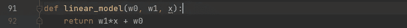
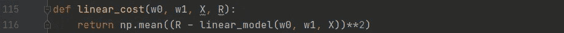
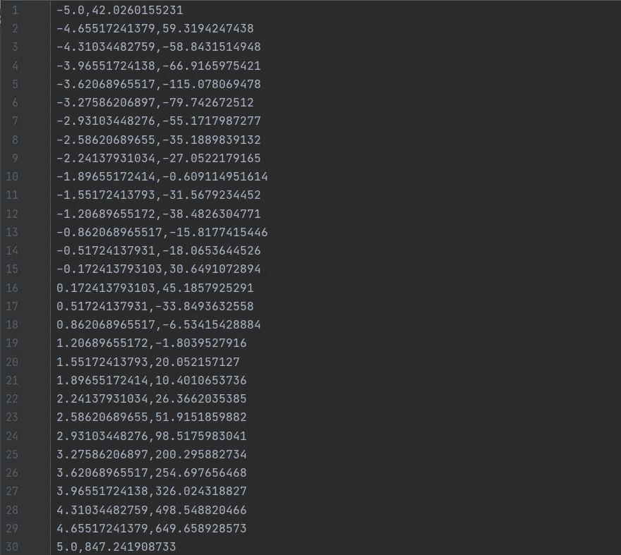
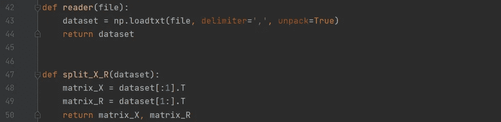
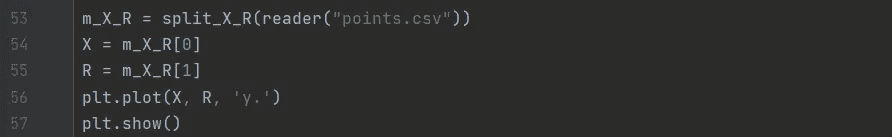
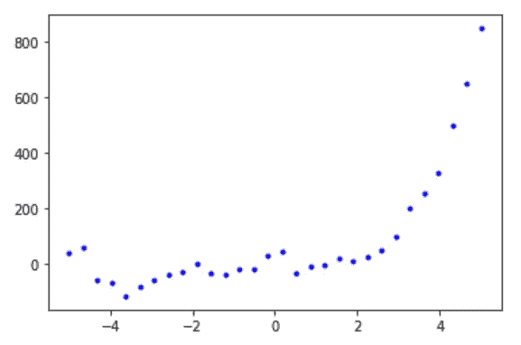
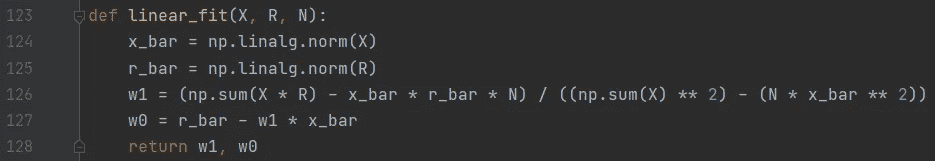
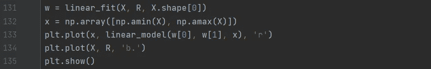
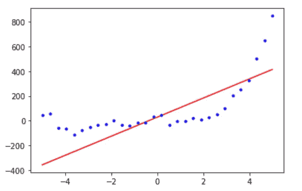

# 用机器学习预测未来第一部分

> 原文：<https://medium.com/analytics-vidhya/predicting-the-future-using-machine-learning-part-i-48da5d48a40f?source=collection_archive---------28----------------------->

## Python 中的线性模型+实现

马库斯·斯皮斯克在 [Unsplash](https://unsplash.com?utm_source=medium&utm_medium=referral) 上的照片

作为一名人工智能学生，我了解人工智能的许多不同领域，机器学习是真正引起我兴趣的领域之一。这个领域的神奇词汇是*数据*，让机器学习成为可能。数据廉价而丰富，但从中提取知识却昂贵且稀缺。但尽管几乎每个人都接触过机器学习，但想想你点击/购买某个产品后在网站上获得的所有建议。

计算机“学习”如何通过从给定数据中推导出一般模型来进行预测，优化模型直到它最适合数据。这样，做出正确预测的可能性很高。在这篇文章和接下来的文章中，我将讨论和展示不同的监督和非监督学习算法。

一般模型对数据的拟合程度可以用一个*成本函数*来描述，所以成本越低，拟合越好。*成本函数*可以根据模型的复杂程度以不同的方式最小化。

## 线性模型

最基本的模型是*线性模型*，其中*成本函数*通过使用导数被最小化，并且其中参数被立即计算。该模型用于线性回归，其形式为:

> g(x) = w1x + w0
> 
> 其中 *g(x)* =一般模型，w0 & w1 =权重，x =数据点

在 Python 中实现这个模型，您会得到:

现在这个模型的成本可以用*成本函数*来计算，我把它命名为 *linear_cost* :

接下来，模型可以拟合数据。我使用 csv 文件作为数据集，包含 30 个网格点:

为了使我们的模型适合这个数据集，必须读出 csv 文件，并在图形中绘制网格点。因此，x 和 y 坐标需要分开:

现在，可以使用 matplotlib 中的 pyplot 在图形中绘制网格点:

接下来，可以用一个名为 *linear_fit* 的函数将线性模型拟合到这个数据集:

最后，需要在图表中显示合身程度:

如上图所示，线性模型并不总是足以尽可能好地拟合数据。在这种情况下，例如，有很多离群值。然而，在下一篇文章中，我将讨论另一个模型，它是一个更好的替代模型，可以用较少的异常值来拟合这些数据。