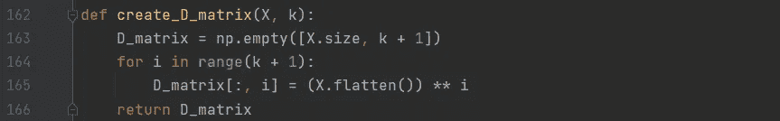
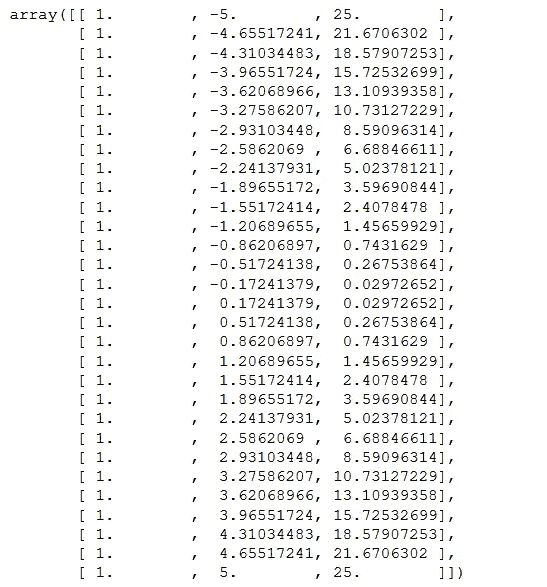
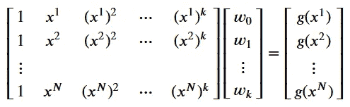
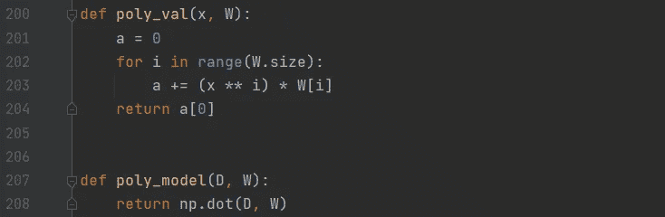
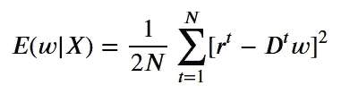
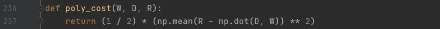
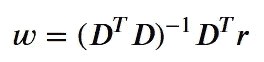
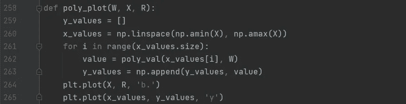
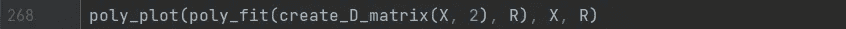

# 使用机器学习预测未来第二部分

> 原文：<https://medium.com/analytics-vidhya/predicting-the-future-using-machine-learning-part-ii-fb45806e5b71?source=collection_archive---------19----------------------->

## Python 中多项式模型+的实现

照片由 [Fotis Fotopoulos](https://unsplash.com/@ffstop?utm_source=medium&utm_medium=referral) 在 [Unsplash](https://unsplash.com?utm_source=medium&utm_medium=referral) 上拍摄

在“使用机器学习预测未来”系列的第二部分中，我将进一步阐述如何为我在[的前一部分](https://minasuntea.medium.com/predicting-the-future-using-machine-learning-part-i-48da5d48a40f)中使用的相同数据集找到一个更好的通用模型。

## 多项式模型

要形成多项式模型，需要多项式数据。这可以通过将我之前使用的线性数据集扩展为高阶多项式数据集来轻松检索，方法是将原始输入扩展为高阶多项式的幂，并为模型添加额外的权重。

我编写了一个函数，在给定数据点和指定顺序的情况下，以矩阵的形式创建一个多项式数据集，我称之为 *k.* 为了便于计算，我用一个 1 的向量扩展了数据集，它表示常数*权重 w0* :

我选择了 2 阶，因此我的多项式数据集如下所示:

使用 numpy 数组创建 D_matrix

单个输入的假设具有以下形式:

> g(x ) *=* ∑ᵢᵏ Dᵢ wᵢ
> 
> 其中 g(x ) =一般模型，i =迭代，beginvalue 为 0，k =多项式的阶，D = D_matrix，w =权重

这可以写成一个等式中所有输入的矩阵乘法:

我编写了两个函数来计算多项式模型，分别称为 *poly_val* 和 *poly_model，*将计算分为两步。 *poly_val* 函数使用上述矩阵乘法计算所有输入的值，而 *poly_model* 函数获取 D_matrix 和权重向量，并计算相应的假设向量:

下一步是用这个模型的*成本函数*计算成本。我调用了这个函数 *poly_cost* ，它使用以下等式返回总成本:

在 Python 中实现这一点给出了:

用矩阵运算可以很容易地解决每个重量的所有偏导数方程。原理和[线性模型](https://minasuntea.medium.com/predicting-the-future-using-machine-learning-part-i-48da5d48a40f)完全一样，这里我们也只是计算 *w0* 和 *w1* 。因此，权重向量的最终等式的形式为:

使用 numpy 内置的转置和求逆函数，这个等式可以很容易地在 Python 中实现，如下所示:

最后，我写了一个在图中绘制多项式的函数，叫做 *poly_plot* 。我用这个做了一个函数，因为 2 点不足以绘制拟合，因为它不是线性的。解决这个问题最简单的方法是生成大量的 x 值作为样本，并计算相应的 y 值并绘制它们。函数 linspace 可用于生成样本，样本越多，线越平滑。对这些样本应用 *poly_val* 函数将提供相应的 y 值:

现在唯一剩下的事情就是想象合身:

从上图可以看出，多项式拟合比[线性拟合](https://minasuntea.medium.com/predicting-the-future-using-machine-learning-part-i-48da5d48a40f)更适合这个数据集。多项式模型的缺点是容易过度拟合。在本系列的下一部分中，我将讨论一种可以应用的方法，该方法选择一种比多项式模型更不容易过度拟合的模型。