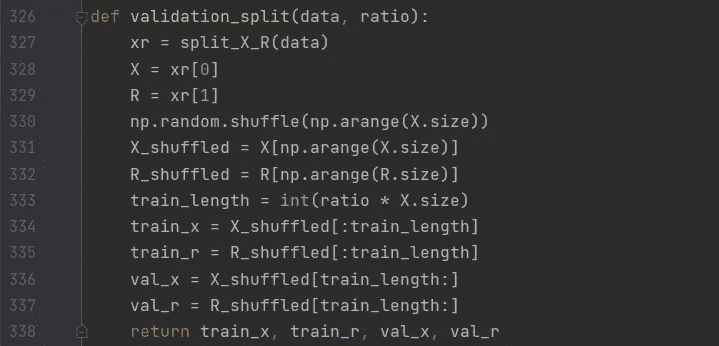
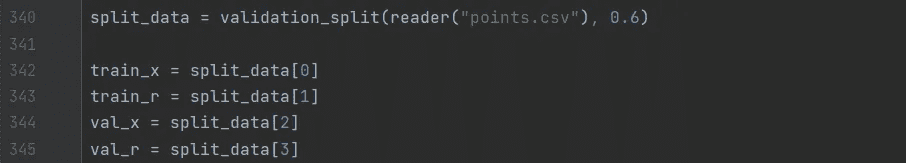
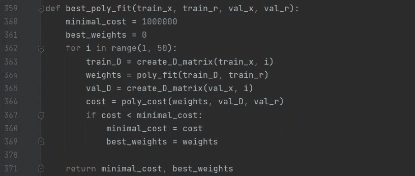
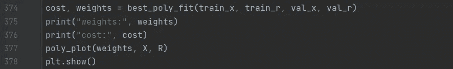
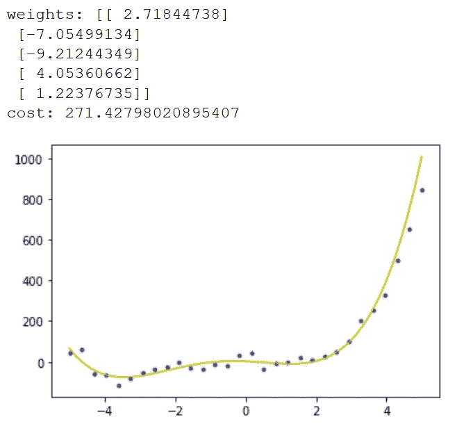

# 使用机器学习预测未来第三部分

> 原文：<https://medium.com/analytics-vidhya/predicting-the-future-using-machine-learning-part-iii-410e1a1742c7?source=collection_archive---------28----------------------->

## Pyhton 中的交叉验证+实现

詹姆斯·哈里逊在 [Unsplash](https://unsplash.com?utm_source=medium&utm_medium=referral) 上拍摄的照片

正如在本系列的前一部分中所承诺的，我将讨论一种可以应用的方法，以便选择一个比二阶的[多项式模型更不容易过度拟合的通用模型。这种方法被称为交叉验证。](https://minasuntea.medium.com/predicting-the-future-using-machine-learning-part-ii-fb45806e5b71)

## 交互效度分析

交叉验证方法是一种在给定比率的情况下，将数据拆分为训练集和验证集的方法。例如，比率为 0.6 时，60%的数据用作训练集来训练模型，40%的数据用作验证集来拟合模型。在 Python 中实现交叉验证方法给出了:

数据的 X 和 R 部分的训练和验证集

*validation_split* 函数返回数据集的 X 和 R 部分的训练和验证集。请注意，我们仍将使用我在本系列的[第一部分](https://minasuntea.medium.com/predicting-the-future-using-machine-learning-part-i-48da5d48a40f)和[第二部分](https://minasuntea.medium.com/predicting-the-future-using-machine-learning-part-ii-fb45806e5b71)中使用的数据集，结果是:

选择 0.6 的比率，这导致 60%的训练和 40%的验证。

使用这种新的数据分割方法，不同阶的多项式现在可以在训练集上重复拟合，同时查看哪一个在验证集上产生的成本最低。在验证集上产生最低成本的权重集概括了对新数据的最佳拟合，因此是对数据集的最佳总体拟合。

为了找到最佳拟合，我编写了一个名为 *best_poly_fit* 的函数，在这个函数中，我在很大范围内迭代，比如 1 到 50 个多项式阶。每次从训练样本计算 D_matrix，并用 *poly_fit* 函数拟合到相应的训练值，之后用函数 *poly_cost* 计算该拟合的成本。每个循环的成本都与最小成本进行比较，并根据成本值替换和返回相应的权重。所以我的 *best_poly_fit* 函数看起来像这样:

现在唯一要做的就是想象出最合适的衣服，以及最好的重量和最低的成本:

与线性拟合和二阶多项式拟合相比，这种拟合是迄今为止最好的。交叉验证方法的优势在于，在用数据集的一部分对模型进行训练之后，找到的模型不容易过拟合或欠拟合。通过这篇文章，我已经结束了监督学习算法的第一个主要类型，即回归。在我接下来的文章中，我将介绍另一种主要的监督学习算法，也称为分类算法。