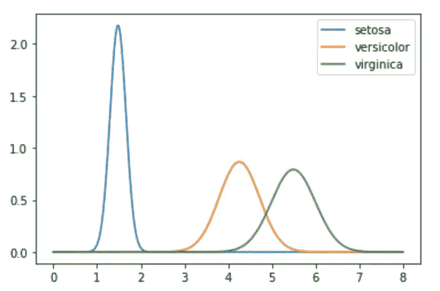

# 用机器学习预测未来第四部分

> 原文：<https://medium.com/analytics-vidhya/predicting-the-future-using-machine-learning-part-iv-8747b319be5c?source=collection_archive---------22----------------------->

## 使用正态高斯分布的贝叶斯分类器 Python 实现

布莱克·康纳利在 [Unsplash](https://unsplash.com?utm_source=medium&utm_medium=referral) 上的照片

在这篇文章中，我将介绍监督学习算法的另一个主要类型，即分类。具体来说，我将展示如何使用正态高斯分布构建贝叶斯分类器来估计连续变量的可能性。

用于此的数据集是经典的*费舍尔虹膜数据集*，它包含了 150 朵花的萼片和花瓣的长度和宽度的测量值。 *Fisher 的虹膜数据集*是一个非常经典的例子，它包含在机器学习库中，因此每个人都可以通过从 *scikit-learn* 库中导入数据集来检索它。

## 分离和绘制数据

第一步是检索数据集，这很容易导入，并将其命名为 *iris* :

*iris* 变量现在包含各种信息，但最重要的属性是*目标*和*数据*，它们包含 150 朵花的标签和数据点。所以我提取了这些属性，创建了一个包含数据*和目标*的矩阵 X 和一个向量 R。*通过使用向量 R，现在可以将矩阵 X 分成不同的类，如下所示:*

索引可以让你的生活更轻松…

为了了解数据集的相关性和可分性，我们应该绘制这些数据。使用 *seaborn* 库，可以可视化每个单一特征的分布，以及使用两个特征作为 *x* 和 *y* 轴的散点图:

对角线图是所有特征的分布，散点图是两个特征的不同配置

查看这些图，可以得出结论，刚毛藻物种比其他物种更容易分离。这确实表明，其他物种*云芝*和*海滨锦葵*的许多特征是相互关联的。

## 协方差

变量之间相关性的一个度量是协方差。两个联合分布的实值随机变量 **X** 和 **Y** 之间的协方差被定义为它们与各自期望值的偏差的期望乘积；

E[…]是期望值

当协方差为正时，则变量正相关:当一个变量的值增加时，另一个值可能也会增加。但当协方差为负时，变量会负相关:当一个变量增加时，另一个值可能会减少。最后，当协方差接近零时，变量之间没有相关性。

## 贝叶斯分类器

熟悉数据后，现在可以建立一个模型，根据其他变量预测给定数据点属于哪一类(在本例中为*鸢尾物种*)。为了确定模型与数据的拟合程度，我们将使用[交叉验证](/analytics-vidhya/predicting-the-future-using-machine-learning-part-iii-410e1a1742c7)方法。我使用了第三部分中的 *validation_split* 函数作为灵感，但是这个 *validation_split* 略有不同:

输出给定比率的分割数据集

对 3 个类别中的每一个使用此函数，每个类别的比率为 0.7，您将得到:

每个类的训练集和验证集

从上述散点图可以得出，基于花瓣数据(花瓣宽度和花瓣长度)比基于萼片数据更容易区分不同的类，因为在该图中更容易区分不同的簇。我决定进一步缩小范围，开始只关注一个变量，即花瓣长度。这个变量本身非常有用，已经大大简化了模型。

使用所有 3 个类的训练集，我开始计算每个类的花瓣长度属性的平均值和标准偏差。对于这些计算，用于平均值和标准差的内置 Numpy 函数将被认为是有用的:

现在，我们已经对 3 个类别的花瓣长度的平均值和标准偏差进行了估计，我们可以计算*概率密度函数(PDF)* :

其中 X 是均值为μ、方差为σ的高斯正态分布

Python 中的实现如下所示:

接下来，所有 3 类的概率密度函数可以使用 linspace 进行计算和可视化，就像在[第二部分](/analytics-vidhya/predicting-the-future-using-machine-learning-part-ii-fb45806e5b71)中一样，对于一系列 x 值，通过应用 *PDF 函数*计算相应的 y 值:

上图显示了 x 值的概率密度，前提是您知道特定类别的平均值和标准差的估计值。然而，对于分类，我们实际上需要的是给定数据的类别的后验概率。为了检索这个，可以使用*贝叶斯规则*:

这个等式可以通过分解出共同的先验来进一步简化:

现在可以用*后验函数*计算后验。为了简化代码，我做了向量 M 和 S，每类的所有均值和所有标准差。有了这些向量，一个参数就足以指定要计算后验概率的类别:

将后验可视化会导致:

构建分类器所需的所有工具现在都可以使用了！贝叶斯分类器定义为:

在 Python 中实现这一点，需要两个函数，即*分类*和*验证*。 *classify* *函数*将单个数据点 x 分类为 3 类中的一类，根据其所属的类返回 0、1 或 2。*验证函数*获取每个数据点的所有预测类的验证集，并返回正确预测的数量:

最后，我使用这些函数来报告每个类的正确预测百分比以及正确百分比的平均值，如下所示:

这导致了:

现在你知道了！请注意，这个分类器是使用单变量模型构建的，因为我们只使用了花瓣长度。但是我们可以做得更好，通过使用更多的变量，因此使用多变量模型。在我的下一篇文章中，我将讨论这些模型。