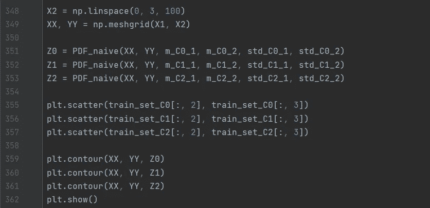

# 用机器学习预测未来第五部分

> 原文：<https://medium.com/analytics-vidhya/predicting-the-future-using-machine-learning-part-v-d8e9c54ef415?source=collection_archive---------24----------------------->

## 多元和全二元分布 Python 中的实现

照片由[德拉诺尔 S](https://unsplash.com/@dlanor_s?utm_source=medium&utm_medium=referral) 在 [Unsplash](https://unsplash.com?utm_source=medium&utm_medium=referral)

[本系列的第四部分](https://minasuntea.medium.com/predicting-the-future-using-machine-learning-part-iv-8747b319be5c)讨论了使用单变量模型的分类算法，但是在本文中，我们将更进一步，构建一个更好的分类算法。我将介绍多元分布，它适用于不止一个变量。因此，这些模型会产生更好的结果。

## 多元分布

我们仍将使用正态分布的概率密度函数，但现在我们需要多变量版本，如下所示:

其中 ***x*** *是用均值向量μ和协方差矩阵σ从正态分布中抽取的 d 维向量。*

现在可以使用来自 *Iris* 数据集的所有 4 个变量，并计算每个类的均值向量和协方差矩阵。然后，这些可用于使用上述等式计算每个类别的概率密度函数。有了这些，还可以计算每个类别的后验概率，最后可以再次使用[贝叶斯分类器](https://minasuntea.medium.com/predicting-the-future-using-machine-learning-part-iv-8747b319be5c)将数据点分类到最可能的类别中。

但是，如果变量太多，协方差矩阵的参数数量可能会变得太大，无法完全适应数据量。因此，通常会对数据进行简化假设，以降低数据的复杂性。

## **朴素二元分布**

一个众所周知的变体是*朴素贝叶斯*，其中假设所有变量都是独立的。这意味着只使用每个变量的方差，而不是协方差。这简化了协方差矩阵，使得它只在对角线上有元素。

首先，我将讨论双变量(2 个变量)分布，因为这将更容易绘制和推理。我使用花瓣数据(花瓣宽度和花瓣长度)作为 2 个变量，因为它们看起来会形成很好的簇。朴素贝叶斯模型的独立性假设大大简化了等式:

其中 p(x₁|Cᵢ)是使用第一个变量的μ₁和σ₁的单变量分布，p(x₂|Cᵢ)是使用第二个变量的μ₂和σ₂的相同方程

现在必须计算概率密度函数，就像我为[贝叶斯分类器](/analytics-vidhya/predicting-the-future-using-machine-learning-part-iv-8747b319be5c)所做的一样，为此我编写了 *PDF_naive* 函数。还需要检索花瓣宽度数据的平均值和标准偏差，如下所示:

检索完所有需要的数据后，是时候绘制概率密度函数了。现在我们使用 2 个变量，这将是一个三维图。有几种方法可以在 *matplotlib* 中制作 3d 图，但我选择了等高线图。首先，必须使用 linspace 为必须与 meshgrid 结合的每个维度创建 X 和 Y 值的网格。然后，可以计算每个类别的概率密度函数的 Z 值，这些值将成为等值线图:

现在剩下要做的就是计算后验概率、分类器和验证函数，以及生成花瓣宽度数据的平均值和标准偏差向量:

使用 *validate_naive* 函数，可以报告每个类别的正确预测百分比以及正确百分比的平均值:

这些会产生以下值:

后验概率也可以用与概率密度函数相同的方式显示在图形中。这样，决策区域就用等高线图来表示了:

## 完全二元分布

最后，我们将使用完整的协方差矩阵，将这个*简单的二元分布*与一个*完整的二元分布*进行比较。这可以通过使用 *SciPy* stats 模块的内置函数*多元正态分布*轻松完成。这些函数在给定平均向量和协方差矩阵的情况下创建分布。这些可以通过使用来自 *Numpy* 的*均值*和*协方差*函数来计算。

有了这个新函数，概率密度函数就可以像我们对*简单二元分布*所做的那样再次说明:

现在，用同样的方法，用*后验*、*分类*和*验证*功能，结果可以计算出来。对于这个模型，我构造了一些不同的函数，所以代码不会太多:

最后，结果可以计算和可视化:

这些会产生以下值:

从上面显示的结果可以清楚地看出，使用的变量越多，分类就越好。有了这些模型，我已经到了这篇文章的结尾，也是讨论监督机器学习算法的结尾。在我的下一篇文章中，我将展示一个无监督机器学习算法的例子。