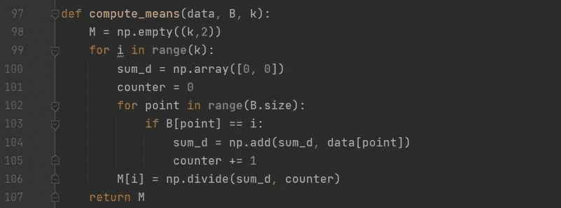

# 用机器学习预测未来第六部分

> 原文：<https://medium.com/analytics-vidhya/predicting-the-future-using-machine-learning-part-vi-ab2d1a4f9c3d?source=collection_archive---------21----------------------->

## K-means 和肘方法+在 Python 中的实现

奥斯卡·伊尔迪兹在 [Unsplash](https://unsplash.com?utm_source=medium&utm_medium=referral) 上拍摄的照片

在完成了监督机器学习算法的主要类型之后，是时候讨论一种无监督机器学习算法了。无监督学习的一个经典例子是 K-means 算法，我将在本系列的最后一篇文章中讨论它以及 Elbow 方法。

## k 均值

对于 K-means 算法，我们没有试图建模的目标输出，而是试图从整个数据集中提取一个模式。K-means 算法的目标是找到数据集中的 *k* 个聚类，这些聚类由它们的中心表示。这种聚类方法试图找到实例和组实例之间的相似性，与维数减少方法相反，维数减少方法试图找到特征和组特征之间的相关性([第四部分](/analytics-vidhya/predicting-the-future-using-machine-learning-part-iv-8747b319be5c)和[第五部分](https://minasuntea.medium.com/predicting-the-future-using-machine-learning-part-v-d8e9c54ef415))。

我通过创建 7 个函数来实现这个算法，为了说明和测试我的最终 K-means 算法，我使用了 *Iris* 数据集的最后 2 个变量，就像在[第五部分](/analytics-vidhya/predicting-the-future-using-machine-learning-part-v-d8e9c54ef415)中一样。

*init_clusters* :从数据中随机初始化均值

*距离*:计算两点之间的距离

*cluster_assignment* :根据当前平均值计算矩阵 **b，**，其中包含点对聚类的分配

*compute_means* :根据当前的聚类分配，计算包含计算出的平均向量的矩阵 **m**

*plot_clusters* :用不同的颜色绘制每个聚类的平均值及其指定点

*is_converged* :使用阈值确定算法是否已基于当前和新均值集合收敛(已达到最小误差值)

*k_means* :结合以上所有函数，创建 k-means 函数

用 *Iris* 数据集测试 *k_means* 算法；

在上面显示的图表中，我选择 k 的值为 1，并绘制了算法的 1 个步骤。其中前一步骤和后一步骤的手段被可视化。在这种情况下，这是手段趋同的最后一步。这样你可以看到均值在迭代时是如何移动的。当为 k_means 算法的 3ʳᵈ自变量选择更高的值时，可以看到更多的迭代。

## **肘法**

通过使用 *Iris* 数据集，我们拥有了预先知道有多少个集群的优势。但是，即使不知道数据集中的聚类数，仍然有办法解决聚类问题。一种可能的方法是肘法。

对于该方法，只需构建 2 个额外的函数，即最小化的合理的*成本*函数和*平均成本*函数，该函数计算 *k* 值 1 到确定数的平均成本，并将它们组合在一个图中:

计算 20 次成本以确定平均成本

现在唯一要做的事情是绘制每 k 值的平均成本:

看起来像个手肘！因此得名

通过这篇文章，我已经达到了这个系列的结尾！我已经展示并讨论了机器学习算法的主要类型，有监督的和无监督的。有了这些算法，你已经在尝试使用机器学习进行准确预测方面取得了很大进展。我希望你喜欢这个系列，并继续关注我的页面，寻找更多像这样的(即将到来的)系列！